# MODUL 4: DOUBLE & CIRCULAR LINKED LIST

---

**Mata Kuliah:** Struktur Data  
**Program Studi:** Sistem Informasi - Institut Teknologi Kalimantan  
**SKS:** 3 (2 Teori + 1 Praktikum)  
**Pertemuan:** 4 dari 16

---

## Estimasi Waktu Pembelajaran

Berdasarkan **Permendikbud No. 3 Tahun 2020** tentang SN-Dikti:

| Komponen | Kegiatan | Durasi |
|----------|----------|--------|
| **TEORI (2 SKS)** | | |
| Tatap Muka | Kuliah di kelas | 100 menit |
| Tugas Terstruktur | Pengembangan dari praktikum (dikumpulkan) | 120 menit |
| Belajar Mandiri | Belajar sendiri | 120 menit |
| **PRAKTIKUM (1 SKS)** | | |
| Kegiatan Lab | Praktikum di lab | 100 menit |
| Belajar Mandiri | Belajar sendiri | 70 menit |
| **TOTAL** | | **510 menit (~8.5 jam)** |

---

## Capaian Pembelajaran

### Sub-CPMK
Setelah menyelesaikan pertemuan ini, mahasiswa mampu:
1. Menjelaskan konsep Double Linked List dan perbedaannya dengan Single Linked List
2. Mengimplementasikan Double Linked List dan operasi dasarnya
3. Memahami konsep Circular Linked List (Single dan Double)
4. Menganalisis kompleksitas dan memilih jenis linked list yang tepat

### Indikator Pencapaian
- Mahasiswa dapat menjelaskan struktur node DLL (data + prev + next)
- Mahasiswa dapat mengimplementasikan operasi DLL dengan navigasi dua arah
- Mahasiswa dapat mengimplementasikan Circular Linked List
- Mahasiswa dapat membandingkan SLL, DLL, dan CLL

---

# BAGIAN A: TATAP MUKA (100 Menit)

## 1. Double Linked List (45 menit)

### 1.1 Apa itu Double Linked List?

**Double Linked List (DLL)** adalah linked list dimana setiap node memiliki **dua pointer**:
- **prev** - pointer ke node sebelumnya
- **next** - pointer ke node berikutnya


### 1.2 Struktur Node DLL

```python
class DNode:
    def __init__(self, data):
        self.data = data
        self.prev = None  # Pointer ke node sebelumnya
        self.next = None  # Pointer ke node berikutnya
```

### 1.3 Perbandingan SLL vs DLL

| Aspek | Single Linked List | Double Linked List |
|-------|-------------------|-------------------|
| **Pointer per node** | 1 (next) | 2 (prev + next) |
| **Navigasi** | Hanya maju | Maju dan mundur |
| **Delete node tertentu** | O(n) - perlu cari prev | O(1) - langsung akses prev |
| **Memory** | Lebih hemat | Lebih boros (extra pointer) |
| **Insert sebelum node** | O(n) | O(1) |
| **Traverse mundur** | Tidak bisa | Bisa |

### 1.4 Operasi DLL: INSERT DI AWAL

#### Flowchart Insert di Awal DLL


#### Visualisasi Insert di Awal DLL

**Sebelum:** Insert 5 di awal
```
NULL <-> [10] <-> [20] <-> [30] <-> NULL
          ↑                  ↑
        HEAD               TAIL
```

**Langkah 1:** Buat node baru, hubungkan next ke HEAD
```
[5] -> [10] <-> [20] <-> [30] <-> NULL
        ↑                  ↑
      HEAD               TAIL
```

**Langkah 2:** Hubungkan HEAD.prev ke new_node
```
[5] <-> [10] <-> [20] <-> [30] <-> NULL
         ↑                  ↑
       HEAD               TAIL
```

**Langkah 3:** Update HEAD
```
NULL <-> [5] <-> [10] <-> [20] <-> [30] <-> NULL
          ↑                          ↑
        HEAD                       TAIL
```

#### Kode Python

```python
def insert_at_beginning(self, data):
    """Insert di awal DLL - O(1)"""
    new_node = DNode(data)
    
    if self.head is None:
        self.head = new_node
        self.tail = new_node
    else:
        new_node.next = self.head
        self.head.prev = new_node
        self.head = new_node
```

---

### 1.5 Operasi DLL: INSERT DI AKHIR

#### Flowchart Insert di Akhir DLL


#### Kode Python

```python
def insert_at_end(self, data):
    """Insert di akhir DLL - O(1) karena ada TAIL"""
    new_node = DNode(data)
    
    if self.tail is None:
        self.head = new_node
        self.tail = new_node
    else:
        new_node.prev = self.tail
        self.tail.next = new_node
        self.tail = new_node
```

> 📝 **Keunggulan DLL:** Insert di akhir **O(1)** karena ada pointer TAIL, sedangkan di SLL butuh O(n)

---

### 1.6 Operasi DLL: DELETE DI AWAL

#### Flowchart Delete di Awal DLL

```mermaid
flowchart TD
    START([🟢 START]) --> CHECK1{HEAD == NULL?}
    CHECK1 -->|Ya| ERROR[/Output: Error<br/>List kosong/]
    CHECK1 -->|Tidak| SAVE[deleted = HEAD.data]
    SAVE --> CHECK2{HEAD == TAIL?<br/>Hanya 1 node?}
    CHECK2 -->|Ya| CLEAR[HEAD = NULL<br/>TAIL = NULL]
    CHECK2 -->|Tidak| UPDATE[HEAD = HEAD.next]
    UPDATE --> UNLINK[HEAD.prev = NULL]
    CLEAR --> OUTPUT[/Output: deleted/]
    UNLINK --> OUTPUT
    ERROR --> END([🔴 END])
    OUTPUT --> END
    
    style START fill:#70AD47,color:#fff
    style END fill:#C00000,color:#fff
    style CHECK1 fill:#FFC000
    style CHECK2 fill:#FFC000
    style ERROR fill:#FF6B6B
    style OUTPUT fill:#70AD47,color:#fff
```



#### Kode Python

```python
def delete_at_beginning(self):
    """Delete di awal DLL - O(1)"""
    if self.head is None:
        raise IndexError("List is empty")
    
    deleted_data = self.head.data
    
    if self.head == self.tail:  # Hanya 1 node
        self.head = None
        self.tail = None
    else:
        self.head = self.head.next
        self.head.prev = None
    
    return deleted_data
```

---

### 1.7 Operasi DLL: DELETE DI AKHIR

#### Flowchart Delete di Akhir DLL

```mermaid
flowchart TD
    START([🟢 START]) --> CHECK1{TAIL == NULL?}
    CHECK1 -->|Ya| ERROR[/Output: Error<br/>List kosong/]
    CHECK1 -->|Tidak| SAVE[deleted = TAIL.data]
    SAVE --> CHECK2{HEAD == TAIL?<br/>Hanya 1 node?}
    CHECK2 -->|Ya| CLEAR[HEAD = NULL<br/>TAIL = NULL]
    CHECK2 -->|Tidak| UPDATE[TAIL = TAIL.prev]
    UPDATE --> UNLINK[TAIL.next = NULL]
    CLEAR --> OUTPUT[/Output: deleted/]
    UNLINK --> OUTPUT
    ERROR --> END([🔴 END])
    OUTPUT --> END
    
    style START fill:#70AD47,color:#fff
    style END fill:#C00000,color:#fff
    style CHECK1 fill:#FFC000
    style CHECK2 fill:#FFC000
    style ERROR fill:#FF6B6B
    style OUTPUT fill:#70AD47,color:#fff
```



#### Kode Python

```python
def delete_at_end(self):
    """Delete di akhir DLL - O(1) karena ada TAIL"""
    if self.tail is None:
        raise IndexError("List is empty")
    
    deleted_data = self.tail.data
    
    if self.head == self.tail:  # Hanya 1 node
        self.head = None
        self.tail = None
    else:
        self.tail = self.tail.prev
        self.tail.next = None
    
    return deleted_data
```

> 📝 **Keunggulan DLL:** Delete di akhir **O(1)**, sedangkan di SLL butuh O(n)

---

### 1.8 Operasi DLL: TRAVERSE MUNDUR

#### Flowchart Traverse Mundur

```mermaid
flowchart TD
    START([🟢 START]) --> INIT[current = TAIL]
    INIT --> CHECK{current != NULL?}
    CHECK -->|Tidak| END([🔴 END])
    CHECK -->|Ya| PRINT[Cetak current.data]
    PRINT --> MOVE[current = current.prev]
    MOVE --> CHECK
    
    style START fill:#70AD47,color:#fff
    style END fill:#C00000,color:#fff
    style CHECK fill:#FFC000
    style PRINT fill:#DEEBF7
```



#### Kode Python

```python
def display_reverse(self):
    """Menampilkan dari belakang ke depan - O(n)"""
    elements = []
    current = self.tail
    
    while current is not None:
        elements.append(str(current.data))
        current = current.prev
    
    print("DLL (reverse): " + " <- ".join(elements))
```

---

## 2. Circular Linked List (35 menit)

### 2.1 Apa itu Circular Linked List?

**Circular Linked List (CLL)** adalah linked list dimana node terakhir menunjuk kembali ke node pertama, membentuk **lingkaran**.

#### Single Circular Linked List


#### Double Circular Linked List


### 2.2 Karakteristik Circular Linked List

| Aspek | Linear Linked List | Circular Linked List |
|-------|-------------------|---------------------|
| **Node terakhir** | Menunjuk ke NULL | Menunjuk ke HEAD |
| **Traversal** | Berhenti di NULL | Bisa terus berputar |
| **Akses dari mana saja** | Harus dari HEAD | Bisa dari node manapun |
| **Aplikasi** | List biasa | Round-robin, playlist loop |

### 2.3 Operasi CLL: INSERT DI AKHIR

#### Flowchart Insert di Akhir (Single CLL)

```mermaid
flowchart TD
    START([🟢 START]) --> INPUT[/Input: data/]
    INPUT --> CREATE[Buat new_node]
    CREATE --> CHECK{HEAD == NULL?}
    CHECK -->|Ya| SELF[new_node.next = new_node<br/>HEAD = new_node]
    CHECK -->|Tidak| FIND[current = HEAD]
    FIND --> TRAVERSE{current.next != HEAD?}
    TRAVERSE -->|Ya| MOVE[current = current.next]
    MOVE --> TRAVERSE
    TRAVERSE -->|Tidak| LINK1[current.next = new_node]
    LINK1 --> LINK2[new_node.next = HEAD]
    SELF --> END([🔴 END])
    LINK2 --> END
    
    style START fill:#70AD47,color:#fff
    style END fill:#C00000,color:#fff
    style CHECK fill:#FFC000
    style TRAVERSE fill:#FFC000
    style CREATE fill:#DEEBF7
```



#### Visualisasi Insert di CLL

**Sebelum:** Insert 40
```
    ┌──────────────────────┐
    ↓                      │
[10] → [20] → [30] ────────┘
  ↑
HEAD
```

**Sesudah:**
```
    ┌────────────────────────────┐
    ↓                            │
[10] → [20] → [30] → [40] ───────┘
  ↑
HEAD
```

#### Kode Python

```python
def insert_at_end(self, data):
    """Insert di akhir Single CLL - O(n)"""
    new_node = Node(data)
    
    if self.head is None:
        new_node.next = new_node  # Menunjuk ke diri sendiri
        self.head = new_node
    else:
        current = self.head
        while current.next != self.head:
            current = current.next
        current.next = new_node
        new_node.next = self.head
```

---

### 2.4 Operasi CLL: TRAVERSE

#### Flowchart Traverse CLL

```mermaid
flowchart TD
    START([🟢 START]) --> CHECK1{HEAD == NULL?}
    CHECK1 -->|Ya| END([🔴 END])
    CHECK1 -->|Tidak| INIT[current = HEAD]
    INIT --> PRINT[Cetak current.data]
    PRINT --> MOVE[current = current.next]
    MOVE --> CHECK2{current != HEAD?}
    CHECK2 -->|Ya| PRINT
    CHECK2 -->|Tidak| END
    
    style START fill:#70AD47,color:#fff
    style END fill:#C00000,color:#fff
    style CHECK1 fill:#FFC000
    style CHECK2 fill:#FFC000
    style PRINT fill:#DEEBF7
```



> ⚠️ **Penting:** Di CLL, kondisi berhenti bukan `current != NULL` tapi `current != HEAD`

#### Kode Python

```python
def display(self):
    """Menampilkan CLL - O(n)"""
    if self.head is None:
        print("CircularList: Empty")
        return
    
    elements = []
    current = self.head
    
    while True:
        elements.append(str(current.data))
        current = current.next
        if current == self.head:
            break
    
    print("CircularList: " + " -> ".join(elements) + " -> (back to head)")
```

---

### 2.5 Operasi CLL: DELETE

#### Flowchart Delete di Awal CLL

```mermaid
flowchart TD
    START([🟢 START]) --> CHECK1{HEAD == NULL?}
    CHECK1 -->|Ya| ERROR[/Output: Error/]
    CHECK1 -->|Tidak| SAVE[deleted = HEAD.data]
    SAVE --> CHECK2{HEAD.next == HEAD?<br/>Hanya 1 node?}
    CHECK2 -->|Ya| CLEAR[HEAD = NULL]
    CHECK2 -->|Tidak| FIND[Cari node terakhir<br/>yang menunjuk ke HEAD]
    FIND --> UPDATE1[last.next = HEAD.next]
    UPDATE1 --> UPDATE2[HEAD = HEAD.next]
    CLEAR --> OUTPUT[/Output: deleted/]
    UPDATE2 --> OUTPUT
    ERROR --> END([🔴 END])
    OUTPUT --> END
    
    style START fill:#70AD47,color:#fff
    style END fill:#C00000,color:#fff
    style CHECK1 fill:#FFC000
    style CHECK2 fill:#FFC000
    style ERROR fill:#FF6B6B
    style OUTPUT fill:#70AD47,color:#fff
```



---

## 3. Perbandingan Semua Jenis Linked List (10 menit)

```mermaid
flowchart TB
    subgraph SLL [Single Linked List]
        S1[1 pointer per node]
        S2[Navigasi: Maju saja]
        S3[Delete akhir: O n]
    end
    
    subgraph DLL [Double Linked List]
        D1[2 pointer per node]
        D2[Navigasi: Maju & Mundur]
        D3[Delete akhir: O 1]
    end
    
    subgraph CLL [Circular Linked List]
        C1[Last → First]
        C2[Tidak ada NULL]
        C3[Cocok untuk rotasi]
    end
    
    style SLL fill:#FFE6E6
    style DLL fill:#E6FFE6
    style CLL fill:#E6E6FF
```



### Tabel Perbandingan Kompleksitas

| Operasi | SLL | DLL | CLL (Single) |
|---------|-----|-----|--------------|
| Insert di awal | O(1) | O(1) | O(n)* |
| Insert di akhir | O(n) | O(1) | O(n) |
| Delete di awal | O(1) | O(1) | O(n)* |
| Delete di akhir | O(n) | O(1) | O(n) |
| Akses index ke-i | O(n) | O(n) | O(n) |
| Search | O(n) | O(n) | O(n) |
| Traverse mundur | ❌ | O(n) | ❌/✅** |

> *CLL perlu update pointer node terakhir
> **Double CLL bisa traverse mundur

### Kapan Menggunakan?

| Jenis | Gunakan Ketika |
|-------|----------------|
| **Single LL** | Memori terbatas, hanya perlu traverse maju |
| **Double LL** | Perlu navigasi dua arah, sering delete di akhir |
| **Circular LL** | Round-robin scheduling, playlist loop, game turn |

---

## 4. Rangkuman (10 menit)

```mermaid
mindmap
  root((📚 LINKED LIST<br/>Lanjutan))
    Double LL
      2 pointer: prev & next
      Navigasi dua arah
      Delete akhir O 1
      Memory lebih besar
    Circular LL
      Last menunjuk ke First
      Tidak ada NULL
      Terus berputar
      Round-robin
    Pilih yang tepat
      SLL: Simpel & hemat
      DLL: Fleksibel
      CLL: Rotasi/loop
```



---

# BAGIAN B: PRAKTIKUM DI LAB (100 Menit)

## Tujuan Praktikum
Mengimplementasikan Double Linked List dan Circular Linked List berdasarkan flowchart.

> ⚠️ **Catatan:** Kode yang dibuat di praktikum ini akan **dikembangkan lebih lanjut** di Tugas Terstruktur.

---

## Praktikum 4.1: Implementasi Double Linked List (50 menit)

### Spesifikasi ADT Double Linked List

```
ADT DoubleLinkedList:
    Data: 
        - head (pointer ke node pertama)
        - tail (pointer ke node terakhir)
    
    Operasi Dasar:
        - insert_at_beginning(data)
        - insert_at_end(data)
        - delete_at_beginning()
        - delete_at_end()
        - display()
        - display_reverse()
        - size()
        - is_empty()
```

### Kode Praktikum

```python
"""
============================================================
PRAKTIKUM 4.1: Implementasi Double Linked List
============================================================
Nama  : ____________________
NIM   : ____________________
Kelas : ____________________

Instruksi: 
1. Implementasikan class DNode dan DoublyLinkedList
2. Implementasikan setiap method berdasarkan flowchart
3. Jalankan test cases untuk memastikan implementasi benar
4. SIMPAN FILE INI - akan dikembangkan di Tugas Terstruktur
============================================================
"""

class DNode:
    """Class untuk node Double Linked List"""
    
    def __init__(self, data):
        """
        Inisialisasi node dengan data
        Parameter:
            data: nilai yang disimpan
        """
        # TODO: Implementasikan
        # self.data = ???
        # self.prev = ???
        # self.next = ???
        pass


class DoublyLinkedList:
    """Class untuk Double Linked List"""
    
    def __init__(self):
        """Inisialisasi DLL kosong dengan head dan tail"""
        # TODO: Implementasikan
        # self.head = ???
        # self.tail = ???
        pass
    
    def is_empty(self):
        """Cek apakah list kosong"""
        # TODO: Implementasikan
        pass
    
    def insert_at_beginning(self, data):
        """
        Insert node di awal DLL
        Kompleksitas: O(1)
        """
        # TODO: Implementasikan berdasarkan flowchart
        pass
    
    def insert_at_end(self, data):
        """
        Insert node di akhir DLL
        Kompleksitas: O(1) - karena ada tail
        """
        # TODO: Implementasikan berdasarkan flowchart
        pass
    
    def delete_at_beginning(self):
        """
        Delete node di awal DLL
        Kompleksitas: O(1)
        Return: data yang dihapus
        """
        # TODO: Implementasikan berdasarkan flowchart
        pass
    
    def delete_at_end(self):
        """
        Delete node di akhir DLL
        Kompleksitas: O(1) - karena ada tail
        Return: data yang dihapus
        """
        # TODO: Implementasikan berdasarkan flowchart
        pass
    
    def display(self):
        """
        Menampilkan DLL dari depan ke belakang
        Format: "DLL: 10 <-> 20 <-> 30 <-> NULL"
        """
        # TODO: Implementasikan
        pass
    
    def display_reverse(self):
        """
        Menampilkan DLL dari belakang ke depan
        Format: "DLL (reverse): 30 <-> 20 <-> 10 <-> NULL"
        """
        # TODO: Implementasikan berdasarkan flowchart TRAVERSE MUNDUR
        pass
    
    def size(self):
        """Menghitung jumlah node"""
        # TODO: Implementasikan
        pass


# === TEST CASES ===
if __name__ == "__main__":
    print("=" * 50)
    print("TEST DOUBLE LINKED LIST")
    print("=" * 50)
    
    dll = DoublyLinkedList()
    
    # Test 1: Initial state
    assert dll.is_empty() == True, "GAGAL: List baru harus kosong"
    print("✓ Test 1 PASSED: Inisialisasi")
    
    # Test 2: Insert at end
    dll.insert_at_end(10)
    dll.insert_at_end(20)
    dll.insert_at_end(30)
    dll.display()  # Expected: DLL: 10 <-> 20 <-> 30 <-> NULL
    assert dll.size() == 3, "GAGAL: Size harus 3"
    print("✓ Test 2 PASSED: Insert at end")
    
    # Test 3: Insert at beginning
    dll.insert_at_beginning(5)
    dll.display()  # Expected: DLL: 5 <-> 10 <-> 20 <-> 30 <-> NULL
    assert dll.size() == 4, "GAGAL: Size harus 4"
    print("✓ Test 3 PASSED: Insert at beginning")
    
    # Test 4: Display reverse
    dll.display_reverse()  # Expected: DLL (reverse): 30 <-> 20 <-> 10 <-> 5 <-> NULL
    print("✓ Test 4 PASSED: Display reverse")
    
    # Test 5: Delete at beginning
    deleted = dll.delete_at_beginning()
    assert deleted == 5, "GAGAL: Yang dihapus harus 5"
    dll.display()  # Expected: DLL: 10 <-> 20 <-> 30 <-> NULL
    print("✓ Test 5 PASSED: Delete at beginning")
    
    # Test 6: Delete at end
    deleted = dll.delete_at_end()
    assert deleted == 30, "GAGAL: Yang dihapus harus 30"
    dll.display()  # Expected: DLL: 10 <-> 20 <-> NULL
    print("✓ Test 6 PASSED: Delete at end")
    
    print("=" * 50)
    print("🎉 SEMUA TEST PASSED!")
    print("=" * 50)
```

---

## Praktikum 4.2: Implementasi Circular Linked List (30 menit)

### Kode Praktikum

```python
"""
============================================================
PRAKTIKUM 4.2: Implementasi Single Circular Linked List
============================================================
Nama  : ____________________
NIM   : ____________________
Kelas : ____________________

Instruksi: 
Implementasikan Single Circular Linked List
============================================================
"""

class Node:
    """Class untuk node (sama seperti SLL)"""
    
    def __init__(self, data):
        self.data = data
        self.next = None


class CircularLinkedList:
    """Class untuk Single Circular Linked List"""
    
    def __init__(self):
        """Inisialisasi CLL kosong"""
        # TODO: Implementasikan
        pass
    
    def is_empty(self):
        """Cek apakah list kosong"""
        # TODO: Implementasikan
        pass
    
    def insert_at_beginning(self, data):
        """
        Insert di awal CLL
        Kompleksitas: O(n) - perlu cari node terakhir
        """
        # TODO: Implementasikan
        # Hint: 
        # 1. Jika kosong: new_node.next = new_node, head = new_node
        # 2. Jika tidak: cari last, new_node.next = head, last.next = new_node, head = new_node
        pass
    
    def insert_at_end(self, data):
        """
        Insert di akhir CLL
        Kompleksitas: O(n) - perlu cari node terakhir
        """
        # TODO: Implementasikan berdasarkan flowchart
        pass
    
    def delete_at_beginning(self):
        """
        Delete di awal CLL
        Kompleksitas: O(n) - perlu update last.next
        Return: data yang dihapus
        """
        # TODO: Implementasikan berdasarkan flowchart
        pass
    
    def display(self):
        """
        Menampilkan CLL
        Format: "CLL: 10 -> 20 -> 30 -> (head)"
        """
        # TODO: Implementasikan berdasarkan flowchart TRAVERSE CLL
        pass
    
    def size(self):
        """Menghitung jumlah node"""
        # TODO: Implementasikan
        # Hint: Hati-hati kondisi berhenti!
        pass


# === TEST CASES ===
if __name__ == "__main__":
    print("=" * 50)
    print("TEST CIRCULAR LINKED LIST")
    print("=" * 50)
    
    cll = CircularLinkedList()
    
    # Test 1: Initial state
    assert cll.is_empty() == True, "GAGAL: List baru harus kosong"
    print("✓ Test 1 PASSED: Inisialisasi")
    
    # Test 2: Insert at end
    cll.insert_at_end(10)
    cll.insert_at_end(20)
    cll.insert_at_end(30)
    cll.display()  # Expected: CLL: 10 -> 20 -> 30 -> (head)
    assert cll.size() == 3, "GAGAL: Size harus 3"
    print("✓ Test 2 PASSED: Insert at end")
    
    # Test 3: Insert at beginning
    cll.insert_at_beginning(5)
    cll.display()  # Expected: CLL: 5 -> 10 -> 20 -> 30 -> (head)
    assert cll.size() == 4, "GAGAL: Size harus 4"
    print("✓ Test 3 PASSED: Insert at beginning")
    
    # Test 4: Delete at beginning
    deleted = cll.delete_at_beginning()
    assert deleted == 5, "GAGAL: Yang dihapus harus 5"
    cll.display()  # Expected: CLL: 10 -> 20 -> 30 -> (head)
    print("✓ Test 4 PASSED: Delete at beginning")
    
    # Test 5: Verify circular property
    # Traverse 2 kali putaran untuk memastikan circular
    print("✓ Test 5 PASSED: Circular property verified")
    
    print("=" * 50)
    print("🎉 SEMUA TEST PASSED!")
    print("=" * 50)
```

---

## Praktikum 4.3: Insert dan Delete di Posisi (20 menit)

### Kode Praktikum

```python
"""
============================================================
PRAKTIKUM 4.3: Insert dan Delete di Posisi (DLL)
============================================================
Nama  : ____________________
NIM   : ____________________
Kelas : ____________________

Instruksi: 
Tambahkan method untuk insert dan delete di posisi tertentu pada DLL
============================================================
"""

# COPY class DNode dan DoublyLinkedList dari Praktikum 4.1

class DoublyLinkedList:
    # ... (copy dari praktikum 4.1) ...
    
    def insert_at_position(self, data, position):
        """
        Insert di posisi tertentu
        Kompleksitas: O(n)
        """
        # TODO: Implementasikan
        # Hint: Perlu update 4 pointer (prev dan next dari node baru dan tetangga)
        pass
    
    def delete_at_position(self, position):
        """
        Delete di posisi tertentu
        Kompleksitas: O(n)
        Return: data yang dihapus
        """
        # TODO: Implementasikan
        pass
    
    def get(self, position):
        """
        Mengambil data di posisi tertentu
        Kompleksitas: O(n)
        """
        # TODO: Implementasikan
        pass


# === TEST CASES ===
if __name__ == "__main__":
    print("=" * 50)
    print("TEST INSERT DAN DELETE DI POSISI (DLL)")
    print("=" * 50)
    
    dll = DoublyLinkedList()
    dll.insert_at_end(10)
    dll.insert_at_end(20)
    dll.insert_at_end(30)
    dll.insert_at_end(40)
    dll.display()  # DLL: 10 <-> 20 <-> 30 <-> 40 <-> NULL
    
    # Test insert_at_position
    dll.insert_at_position(25, 2)
    dll.display()  # Expected: DLL: 10 <-> 20 <-> 25 <-> 30 <-> 40 <-> NULL
    assert dll.get(2) == 25, "GAGAL: Position 2 harus 25"
    print("✓ Test insert_at_position PASSED")
    
    # Test delete_at_position
    deleted = dll.delete_at_position(2)
    assert deleted == 25, "GAGAL: Yang dihapus harus 25"
    dll.display()  # Expected: DLL: 10 <-> 20 <-> 30 <-> 40 <-> NULL
    print("✓ Test delete_at_position PASSED")
    
    # Test get
    assert dll.get(0) == 10, "GAGAL: get(0)"
    assert dll.get(2) == 30, "GAGAL: get(2)"
    print("✓ Test get PASSED")
    
    # Verify reverse still works
    dll.display_reverse()
    
    print("=" * 50)
    print("🎉 SEMUA TEST PASSED!")
    print("=" * 50)
```

---

# BAGIAN C: TUGAS TERSTRUKTUR (120 Menit)

> 📝 **Pengembangan dari Praktikum**
> 
> Tugas ini mengembangkan kode yang sudah dibuat di praktikum.
> Kerjakan setelah praktikum selesai, kumpulkan pada pertemuan berikutnya.

---

## 📋 Informasi Pengumpulan

| Item | Keterangan |
|------|------------|
| **Deadline** | Pertemuan 5 (sebelum kuliah dimulai) |
| **Format** | File Python (.py) |
| **Nama File** | `Tugas4_NIM_Nama.py` |
| **Pengumpulan** | Upload ke github |

---

## Tugas 1: Pengembangan Double Linked List (40 menit)

### Deskripsi
Kembangkan class `DoublyLinkedList` dengan menambahkan method baru:

| Method Baru | Deskripsi | Kompleksitas |
|-------------|-----------|--------------|
| `reverse()` | Membalik urutan DLL | O(n) |
| `find_min()` | Mencari nilai minimum | O(n) |
| `find_max()` | Mencari nilai maksimum | O(n) |
| `swap_nodes(pos1, pos2)` | Menukar data dua node | O(n) |
| `is_palindrome()` | Cek apakah DLL palindrome | O(n) |

### Flowchart REVERSE DLL


### Template Kode

```python
"""
============================================================
TUGAS TERSTRUKTUR 1: Pengembangan Double Linked List
============================================================
Nama  : ____________________
NIM   : ____________________
Kelas : ____________________
============================================================
"""

class DNode:
    def __init__(self, data):
        self.data = data
        self.prev = None
        self.next = None


class DoublyLinkedList:
    # ========== METHOD DARI PRAKTIKUM (COPY) ==========
    def __init__(self):
        self.head = None
        self.tail = None
    
    # ... (copy semua method dari praktikum) ...
    
    # ========== METHOD BARU (TUGAS) ==========
    def reverse(self):
        """
        Membalik urutan DLL (in-place)
        Kompleksitas: O(n)
        """
        # TODO: Implementasikan berdasarkan flowchart
        pass
    
    def find_min(self):
        """
        Mencari nilai minimum
        Kompleksitas: O(n)
        """
        # TODO: Implementasikan
        pass
    
    def find_max(self):
        """
        Mencari nilai maksimum
        Kompleksitas: O(n)
        """
        # TODO: Implementasikan
        pass
    
    def swap_nodes(self, pos1, pos2):
        """
        Menukar DATA dua node di posisi berbeda
        Kompleksitas: O(n)
        Note: Hanya tukar data, bukan node-nya
        """
        # TODO: Implementasikan
        pass
    
    def is_palindrome(self):
        """
        Mengecek apakah DLL adalah palindrome
        Kompleksitas: O(n)
        Return: True jika palindrome, False jika tidak
        
        Contoh palindrome: 1 <-> 2 <-> 3 <-> 2 <-> 1
        """
        # TODO: Implementasikan
        # Hint: Bandingkan dari depan dan belakang secara bersamaan
        pass
    
    def to_list(self):
        """Konversi ke Python list"""
        # TODO: Implementasikan
        pass


# === TEST CASES ===
if __name__ == "__main__":
    print("=" * 50)
    print("TEST PENGEMBANGAN DLL")
    print("=" * 50)
    
    dll = DoublyLinkedList()
    for val in [10, 20, 30, 40, 50]:
        dll.insert_at_end(val)
    dll.display()  # DLL: 10 <-> 20 <-> 30 <-> 40 <-> 50 <-> NULL
    
    # Test to_list
    assert dll.to_list() == [10, 20, 30, 40, 50], "GAGAL: to_list"
    print("✓ Test to_list PASSED")
    
    # Test find_min, find_max
    assert dll.find_min() == 10, "GAGAL: find_min"
    assert dll.find_max() == 50, "GAGAL: find_max"
    print("✓ Test find_min/max PASSED")
    
    # Test swap_nodes
    dll.swap_nodes(1, 3)  # Tukar 20 dan 40
    assert dll.to_list() == [10, 40, 30, 20, 50], "GAGAL: swap_nodes"
    print("✓ Test swap_nodes PASSED")
    
    # Test reverse
    dll.reverse()
    dll.display()  # Expected: DLL: 50 <-> 20 <-> 30 <-> 40 <-> 10 <-> NULL
    assert dll.to_list() == [50, 20, 30, 40, 10], "GAGAL: reverse"
    print("✓ Test reverse PASSED")
    
    # Test is_palindrome
    palindrome_dll = DoublyLinkedList()
    for val in [1, 2, 3, 2, 1]:
        palindrome_dll.insert_at_end(val)
    assert palindrome_dll.is_palindrome() == True, "GAGAL: is_palindrome True"
    
    not_palindrome = DoublyLinkedList()
    for val in [1, 2, 3, 4, 5]:
        not_palindrome.insert_at_end(val)
    assert not_palindrome.is_palindrome() == False, "GAGAL: is_palindrome False"
    print("✓ Test is_palindrome PASSED")
    
    print("=" * 50)
    print("🎉 SEMUA TEST PASSED!")
    print("=" * 50)
```

---

## Tugas 2: Aplikasi DLL - Text Editor Undo/Redo (40 menit)

### Deskripsi
Buat simulasi **Text Editor** dengan fitur Undo/Redo menggunakan Double Linked List.


### Template Kode

```python
"""
============================================================
TUGAS TERSTRUKTUR 2: Aplikasi DLL - Text Editor Undo/Redo
============================================================
Nama  : ____________________
NIM   : ____________________
Kelas : ____________________
============================================================
"""

class StateNode:
    """Node untuk menyimpan state text"""
    
    def __init__(self, text):
        self.text = text
        self.prev = None
        self.next = None


class TextEditor:
    """Text Editor dengan Undo/Redo menggunakan DLL"""
    
    def __init__(self):
        # State awal: text kosong
        initial_state = StateNode("")
        self.current = initial_state
        self.head = initial_state
    
    def type_text(self, new_text):
        """
        Mengetik text baru (mengganti text saat ini)
        Jika ada history setelah current, hapus semua (karena branching)
        """
        # TODO: Implementasikan
        # Hint:
        # 1. Buat node baru dengan new_text
        # 2. Hapus semua node setelah current (jika ada)
        # 3. Hubungkan current ke new_node
        # 4. Pindah current ke new_node
        pass
    
    def append_text(self, text):
        """
        Menambahkan text ke text saat ini
        """
        # TODO: Implementasikan
        # Hint: Gabungkan current text dengan text baru, lalu type_text
        pass
    
    def undo(self):
        """
        Kembali ke state sebelumnya
        Return: True jika berhasil, False jika sudah di awal
        """
        # TODO: Implementasikan
        pass
    
    def redo(self):
        """
        Maju ke state berikutnya (jika ada)
        Return: True jika berhasil, False jika tidak ada redo
        """
        # TODO: Implementasikan
        pass
    
    def get_text(self):
        """Return text saat ini"""
        # TODO: Implementasikan
        pass
    
    def can_undo(self):
        """Cek apakah bisa undo"""
        # TODO: Implementasikan
        pass
    
    def can_redo(self):
        """Cek apakah bisa redo"""
        # TODO: Implementasikan
        pass
    
    def show_history(self):
        """
        Menampilkan history editing
        Format:
        History: "" <-> "Hello" <-> "Hello World" <-> "Hello World!"
                                      ^current
        """
        # TODO: Implementasikan
        pass


# === TEST CASES ===
if __name__ == "__main__":
    print("=" * 50)
    print("TEST TEXT EDITOR")
    print("=" * 50)
    
    editor = TextEditor()
    
    # Test initial state
    assert editor.get_text() == "", "GAGAL: Initial text harus kosong"
    print("✓ Test initial state PASSED")
    
    # Test type_text
    editor.type_text("Hello")
    assert editor.get_text() == "Hello", "GAGAL: type_text"
    print("✓ Test type_text PASSED")
    
    # Test append_text
    editor.append_text(" World")
    assert editor.get_text() == "Hello World", "GAGAL: append_text"
    print("✓ Test append_text PASSED")
    
    editor.append_text("!")
    assert editor.get_text() == "Hello World!", "GAGAL: append_text 2"
    
    editor.show_history()
    
    # Test undo
    assert editor.can_undo() == True, "GAGAL: can_undo"
    editor.undo()
    assert editor.get_text() == "Hello World", "GAGAL: undo"
    print("✓ Test undo PASSED")
    
    editor.undo()
    assert editor.get_text() == "Hello", "GAGAL: undo 2"
    
    # Test redo
    assert editor.can_redo() == True, "GAGAL: can_redo"
    editor.redo()
    assert editor.get_text() == "Hello World", "GAGAL: redo"
    print("✓ Test redo PASSED")
    
    # Test branching (type setelah undo menghapus redo history)
    editor.type_text("Hi")
    assert editor.get_text() == "Hi", "GAGAL: branching"
    assert editor.can_redo() == False, "GAGAL: redo harus hilang setelah branching"
    print("✓ Test branching PASSED")
    
    editor.show_history()
    
    print("=" * 50)
    print("🎉 SEMUA TEST PASSED!")
    print("=" * 50)
```

---

## Tugas 3: Aplikasi CLL - Round Robin Scheduler (40 menit)

### Deskripsi
Buat simulasi **CPU Scheduler** dengan algoritma **Round Robin** menggunakan Circular Linked List.


### Template Kode

```python
"""
============================================================
TUGAS TERSTRUKTUR 3: Aplikasi CLL - Round Robin Scheduler
============================================================
Nama  : ____________________
NIM   : ____________________
Kelas : ____________________
============================================================
"""

class ProcessNode:
    """Node untuk menyimpan informasi proses"""
    
    def __init__(self, pid, name, burst_time):
        self.pid = pid                    # Process ID
        self.name = name                  # Nama proses
        self.burst_time = burst_time      # Total waktu yang dibutuhkan
        self.remaining_time = burst_time  # Sisa waktu
        self.next = None


class RoundRobinScheduler:
    """CPU Scheduler dengan Round Robin menggunakan CLL"""
    
    def __init__(self, quantum):
        """
        Inisialisasi scheduler
        Parameter:
            quantum: time slice untuk setiap proses
        """
        self.head = None
        self.quantum = quantum
        self.current_time = 0
        self.completed = []  # List proses yang sudah selesai
    
    def add_process(self, pid, name, burst_time):
        """
        Menambahkan proses baru ke antrian (circular)
        """
        # TODO: Implementasikan
        pass
    
    def remove_process(self, process):
        """
        Menghapus proses dari circular list
        """
        # TODO: Implementasikan
        pass
    
    def execute_one_cycle(self):
        """
        Menjalankan satu cycle untuk proses saat ini
        
        Return: dict dengan info eksekusi
        {
            'process': nama proses,
            'executed_time': waktu yang dieksekusi,
            'remaining': sisa waktu proses,
            'completed': True/False
        }
        """
        # TODO: Implementasikan
        # Hint:
        # 1. Ambil proses di head
        # 2. Kurangi remaining_time dengan quantum (atau habiskan jika < quantum)
        # 3. Jika selesai (remaining_time <= 0), hapus dari list
        # 4. Jika belum, pindah ke proses berikutnya
        pass
    
    def run(self):
        """
        Menjalankan semua proses sampai selesai
        Tampilkan timeline eksekusi
        """
        # TODO: Implementasikan
        pass
    
    def display_queue(self):
        """
        Menampilkan antrian proses saat ini
        """
        # TODO: Implementasikan
        pass
    
    def get_statistics(self):
        """
        Menghitung statistik scheduling
        Return: dict dengan average waiting time, turnaround time, dll
        """
        # TODO: Implementasikan
        pass


# === TEST CASES ===
if __name__ == "__main__":
    print("=" * 50)
    print("TEST ROUND ROBIN SCHEDULER")
    print("=" * 50)
    
    # Buat scheduler dengan quantum = 2
    scheduler = RoundRobinScheduler(quantum=2)
    
    # Tambah proses
    scheduler.add_process(1, "Process A", 5)
    scheduler.add_process(2, "Process B", 3)
    scheduler.add_process(3, "Process C", 4)
    
    print("Initial Queue:")
    scheduler.display_queue()
    
    print("\n" + "=" * 50)
    print("EXECUTION TIMELINE")
    print("=" * 50)
    
    # Jalankan scheduler
    scheduler.run()
    
    """
    Expected output (kurang lebih):
    Time 0-2: Process A executed (remaining: 3)
    Time 2-4: Process B executed (remaining: 1)
    Time 4-6: Process C executed (remaining: 2)
    Time 6-8: Process A executed (remaining: 1)
    Time 8-9: Process B completed
    Time 9-11: Process C completed
    Time 11-12: Process A completed
    
    All processes completed!
    """
    
    print("\n" + "=" * 50)
    print("STATISTICS")
    print("=" * 50)
    stats = scheduler.get_statistics()
    print(f"Total execution time: {stats.get('total_time', 'N/A')}")
    
    print("=" * 50)
    print("🎉 SEMUA TEST PASSED!")
    print("=" * 50)
```

---

# BAGIAN D: BELAJAR MANDIRI (190 Menit)

> 📚 **Bagian ini dikerjakan mahasiswa secara mandiri di luar kelas**
> **Tidak dikumpulkan**, tetapi penting untuk pemahaman materi.

---

## D1. Membaca Referensi (60 menit)

### Bacaan Wajib:
1. **Goodrich et al., Chapter 7.4-7.6** - Doubly Linked Lists, Circular Lists
2. **GeeksforGeeks** - [Doubly Linked List](https://www.geeksforgeeks.org/doubly-linked-list/)
3. **GeeksforGeeks** - [Circular Linked List](https://www.geeksforgeeks.org/circular-linked-list/)

### Bacaan Tambahan:
- [Visualgo - Linked List](https://visualgo.net/en/list)
- Round Robin Scheduling Algorithm

---

## D2. Video Tutorial (40 menit)

Tonton dan buat catatan:

1. **Doubly Linked List Explained** (~15 menit)
   - https://www.youtube.com/watch?v=JdQeNxWCguQ
   
2. **Circular Linked List** (~10 menit)
   - https://www.youtube.com/watch?v=HMkdlu5sP4A

3. **Round Robin Scheduling** (~15 menit)
   - https://www.youtube.com/watch?v=TxjIlNYRZ5M

---

## D3. Latihan Mandiri (60 menit)

### Soal Pilihan Ganda

**1.** Berapa pointer yang dimiliki setiap node dalam Double Linked List?
- [ ] a. 1
- [ ] b. 2
- [ ] c. 3
- [ ] d. 0

**2.** Keuntungan utama DLL dibanding SLL adalah...
- [ ] a. Menggunakan memori lebih sedikit
- [ ] b. Bisa traverse dua arah
- [ ] c. Insert di awal lebih cepat
- [ ] d. Search lebih cepat

**3.** Dalam Circular Linked List, node terakhir menunjuk ke...
- [ ] a. NULL
- [ ] b. Node pertama (HEAD)
- [ ] c. Node tengah
- [ ] d. Dirinya sendiri

**4.** Kompleksitas delete di akhir DLL (dengan pointer tail) adalah...
- [ ] a. O(1)
- [ ] b. O(n)
- [ ] c. O(log n)
- [ ] d. O(n²)

**5.** Circular Linked List cocok untuk implementasi...
- [ ] a. Stack
- [ ] b. Round Robin Scheduling
- [ ] c. Binary Search
- [ ] d. Hash Table

### Latihan Coding (Opsional)

Kerjakan di platform online:
- **LeetCode Medium #146** - LRU Cache (menggunakan DLL)
- **LeetCode Easy #876** - Middle of the Linked List
- Implementasi Josephus Problem dengan CLL

---

## D4. Persiapan Pertemuan Berikutnya (30 menit)

Baca materi tentang **Stack**:
- Apa itu Stack dan prinsip LIFO?
- Operasi dasar Stack (push, pop, peek)
- Implementasi Stack dengan Array dan Linked List
- Aplikasi Stack dalam kehidupan nyata

---

# KUNCI JAWABAN

## Pilihan Ganda
1. **b** - 2 pointer (prev dan next)
2. **b** - DLL bisa traverse maju dan mundur
3. **b** - Node terakhir menunjuk ke HEAD
4. **a** - O(1) karena ada pointer tail, tinggal tail = tail.prev
5. **b** - CLL cocok untuk round robin karena bisa berputar terus

## Praktikum 4.1: Double Linked List

```python
class DNode:
    def __init__(self, data):
        self.data = data
        self.prev = None
        self.next = None


class DoublyLinkedList:
    def __init__(self):
        self.head = None
        self.tail = None
    
    def is_empty(self):
        return self.head is None
    
    def insert_at_beginning(self, data):
        new_node = DNode(data)
        if self.head is None:
            self.head = new_node
            self.tail = new_node
        else:
            new_node.next = self.head
            self.head.prev = new_node
            self.head = new_node
    
    def insert_at_end(self, data):
        new_node = DNode(data)
        if self.tail is None:
            self.head = new_node
            self.tail = new_node
        else:
            new_node.prev = self.tail
            self.tail.next = new_node
            self.tail = new_node
    
    def delete_at_beginning(self):
        if self.head is None:
            raise IndexError("List is empty")
        deleted = self.head.data
        if self.head == self.tail:
            self.head = None
            self.tail = None
        else:
            self.head = self.head.next
            self.head.prev = None
        return deleted
    
    def delete_at_end(self):
        if self.tail is None:
            raise IndexError("List is empty")
        deleted = self.tail.data
        if self.head == self.tail:
            self.head = None
            self.tail = None
        else:
            self.tail = self.tail.prev
            self.tail.next = None
        return deleted
    
    def display(self):
        elements = []
        current = self.head
        while current:
            elements.append(str(current.data))
            current = current.next
        print("DLL: " + " <-> ".join(elements) + " <-> NULL")
    
    def display_reverse(self):
        elements = []
        current = self.tail
        while current:
            elements.append(str(current.data))
            current = current.prev
        print("DLL (reverse): " + " <-> ".join(elements) + " <-> NULL")
    
    def size(self):
        count = 0
        current = self.head
        while current:
            count += 1
            current = current.next
        return count
```

## Praktikum 4.2: Circular Linked List

```python
class CircularLinkedList:
    def __init__(self):
        self.head = None
    
    def is_empty(self):
        return self.head is None
    
    def insert_at_end(self, data):
        new_node = Node(data)
        if self.head is None:
            new_node.next = new_node
            self.head = new_node
        else:
            current = self.head
            while current.next != self.head:
                current = current.next
            current.next = new_node
            new_node.next = self.head
    
    def display(self):
        if self.head is None:
            print("CLL: Empty")
            return
        elements = []
        current = self.head
        while True:
            elements.append(str(current.data))
            current = current.next
            if current == self.head:
                break
        print("CLL: " + " -> ".join(elements) + " -> (head)")
    
    def size(self):
        if self.head is None:
            return 0
        count = 1
        current = self.head.next
        while current != self.head:
            count += 1
            current = current.next
        return count
```

---

# RUBRIK PENILAIAN PRAKTIKUM & TUGAS

| Komponen | Bobot | Kriteria |
|----------|-------|----------|
| **Praktikum** | | |
| - Double Linked List | 25% | Semua operasi dasar benar |
| - Circular Linked List | 15% | Operasi dan circular property benar |
| - Insert/Delete Position | 10% | Method posisi benar |
| **Tugas Terstruktur** | | |
| - Pengembangan DLL | 20% | Method baru sesuai spesifikasi |
| - Text Editor | 15% | Undo/Redo bekerja dengan benar |
| - Round Robin Scheduler | 15% | Simulasi scheduling benar |

---

**Selamat Belajar! 🚀**

*Modul ini disusun oleh Aidil Saputra Kirsan (myst-tech.com), Institut Teknologi Kalimantan.*