# MODUL 5: STACK

---

**Mata Kuliah:** Struktur Data  
**Program Studi:** Sistem Informasi - Institut Teknologi Kalimantan  
**SKS:** 3 (2 Teori + 1 Praktikum)  
**Pertemuan:** 5 dari 16

---

## Estimasi Waktu Pembelajaran

Berdasarkan **Permendikbud No. 3 Tahun 2020** tentang SN-Dikti:

| Komponen | Kegiatan | Durasi |
|----------|----------|--------|
| **TEORI (2 SKS)** | | |
| Tatap Muka | Kuliah di kelas | 100 menit |
| Tugas Terstruktur | Pengembangan dari praktikum (dikumpulkan) | 120 menit |
| Belajar Mandiri | Belajar sendiri | 120 menit |
| **PRAKTIKUM (1 SKS)** | | |
| Kegiatan Lab | Praktikum di lab | 100 menit |
| Belajar Mandiri | Belajar sendiri | 70 menit |
| **TOTAL** | | **510 menit (~8.5 jam)** |

---

## Capaian Pembelajaran

### Sub-CPMK
Setelah menyelesaikan pertemuan ini, mahasiswa mampu:
1. Menjelaskan konsep Stack dan prinsip LIFO
2. Mengimplementasikan Stack menggunakan Array dan Linked List
3. Menerapkan Stack untuk pemecahan masalah (balancing symbols, infix-postfix)
4. Menganalisis kompleksitas operasi Stack

### Indikator Pencapaian
- Mahasiswa dapat menjelaskan prinsip LIFO (Last In First Out)
- Mahasiswa dapat mengimplementasikan operasi push, pop, peek
- Mahasiswa dapat menggunakan Stack untuk mengecek balanced parentheses
- Mahasiswa dapat mengkonversi ekspresi infix ke postfix

---

# BAGIAN A: TATAP MUKA (100 Menit)

## 1. Pendahuluan Stack (15 menit)

### 1.1 Apa itu Stack?

**Stack** adalah struktur data linear yang mengikuti prinsip **LIFO (Last In First Out)** - elemen yang terakhir masuk akan pertama keluar.

```mermaid
flowchart TB
    subgraph Stack
        direction TB
        TOP[TOP →] --> E4[40]
        E4 --> E3[30]
        E3 --> E2[20]
        E2 --> E1[10]
        E1 --> BOTTOM[BOTTOM]
    end
    
    PUSH[PUSH 50] -.-> TOP
    POP[POP] -.-> TOP
    
    style TOP fill:#70AD47,color:#fff
    style E4 fill:#DEEBF7
    style E3 fill:#DEEBF7
    style E2 fill:#DEEBF7
    style E1 fill:#DEEBF7
```

### 1.2 Analogi Stack di Kehidupan Nyata

```mermaid
flowchart LR
    subgraph Tumpukan_Piring [🍽️ Tumpukan Piring]
        P1[Piring 1<br/>BOTTOM]
        P2[Piring 2]
        P3[Piring 3]
        P4[Piring 4<br/>TOP]
    end
    
    subgraph Browser_History [🌐 Browser History]
        B1[Page 1]
        B2[Page 2]
        B3[Page 3<br/>Current]
    end
    
    subgraph Undo [↩️ Undo/Redo]
        U1[Action 1]
        U2[Action 2]
        U3[Action 3<br/>Last]
    end
```

**Contoh Stack di dunia nyata:**
- 📚 Tumpukan buku
- 🍽️ Tumpukan piring
- 🌐 Browser back button
- ↩️ Undo operation
- 📱 Call stack dalam pemrograman

### 1.3 Prinsip LIFO

```mermaid
flowchart LR
    subgraph LIFO [Last In First Out]
        direction TB
        IN[Masuk: A → B → C → D] --> STACK[(Stack)]
        STACK --> OUT[Keluar: D → C → B → A]
    end
    
    style LIFO fill:#FFF2CC
```

> 📝 **LIFO:** Yang **terakhir masuk** (Last In) akan **pertama keluar** (First Out)

---

## 2. Operasi Dasar Stack (25 menit)

### 2.1 ADT Stack

```
ADT Stack:
    Data:
        - Kumpulan elemen dengan aturan LIFO
        - top: penunjuk ke elemen teratas
    
    Operasi:
        - push(item)  : Menambah elemen ke atas stack
        - pop()       : Menghapus dan mengembalikan elemen teratas
        - peek/top()  : Melihat elemen teratas tanpa menghapus
        - isEmpty()   : Mengecek apakah stack kosong
        - isFull()    : Mengecek apakah stack penuh (untuk array)
        - size()      : Mengembalikan jumlah elemen
```

### 2.2 Operasi PUSH

#### Flowchart PUSH

```mermaid
flowchart TD
    START([🟢 START]) --> INPUT[/Input: item/]
    INPUT --> CHECK{Stack penuh?<br/>isFull?}
    CHECK -->|Ya| ERROR[/Output: Error<br/>'Stack Overflow'/]
    CHECK -->|Tidak| INC[top = top + 1]
    INC --> ADD[stack di top = item]
    ADD --> END([🔴 END])
    ERROR --> END
    
    style START fill:#70AD47,color:#fff
    style END fill:#C00000,color:#fff
    style CHECK fill:#FFC000
    style ERROR fill:#FF6B6B
    style ADD fill:#DEEBF7
```

#### Visualisasi PUSH

**Sebelum:** Push 50
```
        ┌────┐
TOP → 3 │ 40 │
        ├────┤
      2 │ 30 │
        ├────┤
      1 │ 20 │
        ├────┤
      0 │ 10 │
        └────┘
```

**Sesudah:**
```
        ┌────┐
TOP → 4 │ 50 │ ← Baru ditambahkan
        ├────┤
      3 │ 40 │
        ├────┤
      2 │ 30 │
        ├────┤
      1 │ 20 │
        ├────┤
      0 │ 10 │
        └────┘
```

#### Kode Python

```python
def push(self, item):
    """Menambah elemen ke stack - O(1)"""
    if self.is_full():
        raise OverflowError("Stack Overflow")
    self.top += 1
    self.items[self.top] = item
```

> 📝 **Kompleksitas: O(1)** - Langsung tambah di posisi top

---

### 2.3 Operasi POP

#### Flowchart POP


#### Visualisasi POP

**Sebelum:** Pop
```
        ┌────┐
TOP → 4 │ 50 │ ← Akan di-pop
        ├────┤
      3 │ 40 │
        ├────┤
      2 │ 30 │
        └────┘
```

**Sesudah:** (Return 50)
```
        ┌────┐
TOP → 3 │ 40 │
        ├────┤
      2 │ 30 │
        └────┘
```

#### Kode Python

```python
def pop(self):
    """Menghapus dan mengembalikan elemen teratas - O(1)"""
    if self.is_empty():
        raise IndexError("Stack Underflow")
    item = self.items[self.top]
    self.top -= 1
    return item
```

> 📝 **Kompleksitas: O(1)** - Langsung ambil dari posisi top

---

### 2.4 Operasi PEEK (TOP)

#### Flowchart PEEK

```mermaid
flowchart TD
    START([🟢 START]) --> CHECK{Stack kosong?}
    CHECK -->|Ya| ERROR[/Output: Error<br/>'Stack Empty'/]
    CHECK -->|Tidak| GET[item = stack di top]
    GET --> OUTPUT[/Output: item<br/>tanpa menghapus/]
    ERROR --> END([🔴 END])
    OUTPUT --> END
    
    style START fill:#70AD47,color:#fff
    style END fill:#C00000,color:#fff
    style CHECK fill:#FFC000
    style ERROR fill:#FF6B6B
    style OUTPUT fill:#70AD47,color:#fff
```

#### Kode Python

```python
def peek(self):
    """Melihat elemen teratas tanpa menghapus - O(1)"""
    if self.is_empty():
        raise IndexError("Stack Empty")
    return self.items[self.top]
```

---

### 2.5 Ringkasan Kompleksitas Operasi Stack

| Operasi | Kompleksitas | Keterangan |
|---------|--------------|------------|
| push() | O(1) | Tambah di top |
| pop() | O(1) | Hapus di top |
| peek() | O(1) | Lihat top |
| isEmpty() | O(1) | Cek top == -1 |
| size() | O(1) | Return top + 1 |

> 💡 **Semua operasi Stack adalah O(1)** - sangat efisien!

---

## 3. Implementasi Stack (20 menit)

### 3.1 Stack dengan Array

```mermaid
flowchart TB
    subgraph ArrayStack [Stack dengan Array]
        direction TB
        ARR[Array dengan ukuran tetap]
        TOP_PTR[top: index elemen teratas]
        CAP[capacity: ukuran maksimum]
    end
    
    subgraph Pros [✅ Kelebihan]
        P1[Sederhana]
        P2[Akses cepat]
    end
    
    subgraph Cons [❌ Kekurangan]
        C1[Ukuran tetap]
        C2[Bisa overflow]
    end
```

```python
class ArrayStack:
    def __init__(self, capacity):
        self.capacity = capacity
        self.items = [None] * capacity
        self.top = -1  # -1 berarti kosong
```

### 3.2 Stack dengan Linked List


```python
class LinkedStack:
    def __init__(self):
        self.top = None  # Pointer ke node teratas
        self._size = 0
```

### 3.3 Perbandingan Implementasi

| Aspek | Array | Linked List |
|-------|-------|-------------|
| **Ukuran** | Fixed (harus tentukan di awal) | Dinamis |
| **Memory** | Alokasi sekaligus | Alokasi per node |
| **Overflow** | Bisa terjadi | Tidak (selama ada memori) |
| **Implementasi** | Lebih sederhana | Sedikit lebih kompleks |
| **Cache** | Lebih baik (kontinu) | Kurang baik (tersebar) |

---

## 4. Aplikasi Stack (30 menit)

### 4.1 Aplikasi 1: Balanced Parentheses

Mengecek apakah tanda kurung dalam ekspresi sudah seimbang.

**Valid:** `()`, `[]`, `{}`, `([{}])`, `{[()]}`
**Invalid:** `(]`, `([)]`, `{{}`, `(()`

#### Flowchart Balanced Parentheses

```mermaid
flowchart TD
    START([🟢 START]) --> INPUT[/Input: expression/]
    INPUT --> INIT[Buat stack kosong]
    INIT --> LOOP{Masih ada karakter?}
    LOOP -->|Tidak| CHECK_EMPTY{Stack kosong?}
    LOOP -->|Ya| GET[Ambil karakter c]
    GET --> IS_OPEN{c adalah<br/>buka kurung?}
    IS_OPEN -->|Ya| PUSH[Push c ke stack]
    IS_OPEN -->|Tidak| IS_CLOSE{c adalah<br/>tutup kurung?}
    IS_CLOSE -->|Ya| CHECK_STACK{Stack kosong?}
    IS_CLOSE -->|Tidak| NEXT[Lanjut karakter berikutnya]
    CHECK_STACK -->|Ya| INVALID1[/Output: False<br/>Tidak seimbang/]
    CHECK_STACK -->|Tidak| POP_CHECK[Pop dari stack]
    POP_CHECK --> MATCH{Cocok dengan c?}
    MATCH -->|Ya| NEXT
    MATCH -->|Tidak| INVALID2[/Output: False<br/>Tidak cocok/]
    PUSH --> NEXT
    NEXT --> LOOP
    CHECK_EMPTY -->|Ya| VALID[/Output: True<br/>Seimbang/]
    CHECK_EMPTY -->|Tidak| INVALID3[/Output: False<br/>Sisa di stack/]
    VALID --> END([🔴 END])
    INVALID1 --> END
    INVALID2 --> END
    INVALID3 --> END
    
    style START fill:#70AD47,color:#fff
    style END fill:#C00000,color:#fff
    style VALID fill:#70AD47,color:#fff
    style INVALID1 fill:#FF6B6B
    style INVALID2 fill:#FF6B6B
    style INVALID3 fill:#FF6B6B
```

#### Visualisasi Balanced Parentheses

**Input:** `{[()]}`

| Step | Char | Action | Stack |
|------|------|--------|-------|
| 1 | `{` | Push | `{` |
| 2 | `[` | Push | `{[` |
| 3 | `(` | Push | `{[(` |
| 4 | `)` | Pop, match `(` ✓ | `{[` |
| 5 | `]` | Pop, match `[` ✓ | `{` |
| 6 | `}` | Pop, match `{` ✓ | `` (kosong) |
| 7 | - | Stack kosong | ✅ **VALID** |

#### Kode Python

```python
def is_balanced(expression):
    """Mengecek apakah tanda kurung seimbang"""
    stack = []
    pairs = {')': '(', ']': '[', '}': '{'}
    
    for char in expression:
        if char in '([{':
            stack.append(char)
        elif char in ')]}':
            if not stack:
                return False
            if stack.pop() != pairs[char]:
                return False
    
    return len(stack) == 0
```

---

### 4.2 Aplikasi 2: Konversi Infix ke Postfix

**Infix:** Operator di antara operand → `A + B`
**Postfix:** Operator setelah operand → `A B +`
**Prefix:** Operator sebelum operand → `+ A B`

#### Tabel Prioritas Operator

| Operator | Prioritas | Associativity |
|----------|-----------|---------------|
| `^` | 3 (tertinggi) | Right to Left |
| `*`, `/` | 2 | Left to Right |
| `+`, `-` | 1 (terendah) | Left to Right |

#### Flowchart Infix ke Postfix

```mermaid
flowchart TD
    START([🟢 START]) --> INPUT[/Input: infix expression/]
    INPUT --> INIT[result = empty string<br/>stack = empty]
    INIT --> LOOP{Masih ada token?}
    LOOP -->|Tidak| POP_ALL[Pop semua dari stack<br/>ke result]
    LOOP -->|Ya| GET[Ambil token]
    GET --> IS_OPERAND{Token adalah<br/>operand?}
    IS_OPERAND -->|Ya| ADD_RESULT[Tambah ke result]
    IS_OPERAND -->|Tidak| IS_OPEN{Token = buka kurung?}
    IS_OPEN -->|Ya| PUSH_OPEN[Push ke stack]
    IS_OPEN -->|Tidak| IS_CLOSE{Token = tutup kurung?}
    IS_CLOSE -->|Ya| POP_UNTIL[Pop sampai ketemu<br/>buka kurung]
    IS_CLOSE -->|Tidak| IS_OP{Token adalah operator?}
    IS_OP -->|Ya| COMPARE{Stack tidak kosong AND<br/>prioritas top >= token?}
    COMPARE -->|Ya| POP_OP[Pop top ke result]
    POP_OP --> COMPARE
    COMPARE -->|Tidak| PUSH_OP[Push token ke stack]
    ADD_RESULT --> NEXT[Lanjut token berikutnya]
    PUSH_OPEN --> NEXT
    POP_UNTIL --> NEXT
    PUSH_OP --> NEXT
    NEXT --> LOOP
    POP_ALL --> OUTPUT[/Output: result/]
    OUTPUT --> END([🔴 END])
    
    style START fill:#70AD47,color:#fff
    style END fill:#C00000,color:#fff
```

#### Visualisasi Konversi: `A + B * C`

| Step | Token | Action | Stack | Output |
|------|-------|--------|-------|--------|
| 1 | A | Add to output | `` | `A` |
| 2 | + | Push | `+` | `A` |
| 3 | B | Add to output | `+` | `A B` |
| 4 | * | Push (prioritas > +) | `+ *` | `A B` |
| 5 | C | Add to output | `+ *` | `A B C` |
| 6 | - | Pop all | `` | `A B C * +` |

**Hasil:** `A + B * C` → `A B C * +`

#### Kode Python

```python
def infix_to_postfix(expression):
    """Konversi infix ke postfix"""
    precedence = {'+': 1, '-': 1, '*': 2, '/': 2, '^': 3}
    stack = []
    result = []
    
    tokens = expression.split()
    
    for token in tokens:
        if token.isalnum():  # Operand
            result.append(token)
        elif token == '(':
            stack.append(token)
        elif token == ')':
            while stack and stack[-1] != '(':
                result.append(stack.pop())
            stack.pop()  # Buang '('
        else:  # Operator
            while (stack and stack[-1] != '(' and
                   stack[-1] in precedence and
                   precedence[stack[-1]] >= precedence[token]):
                result.append(stack.pop())
            stack.append(token)
    
    while stack:
        result.append(stack.pop())
    
    return ' '.join(result)
```

---

### 4.3 Aplikasi 3: Evaluasi Postfix

#### Flowchart Evaluasi Postfix

```mermaid
flowchart TD
    START([🟢 START]) --> INPUT[/Input: postfix expression/]
    INPUT --> INIT[stack = empty]
    INIT --> LOOP{Masih ada token?}
    LOOP -->|Tidak| RESULT[/Output: pop dari stack/]
    LOOP -->|Ya| GET[Ambil token]
    GET --> IS_NUM{Token adalah angka?}
    IS_NUM -->|Ya| PUSH[Push ke stack]
    IS_NUM -->|Tidak| POP2[Pop 2 operand:<br/>b = pop, a = pop]
    POP2 --> CALC[Hitung: a operator b]
    CALC --> PUSH_RESULT[Push hasil ke stack]
    PUSH --> NEXT[Lanjut token berikutnya]
    PUSH_RESULT --> NEXT
    NEXT --> LOOP
    RESULT --> END([🔴 END])
    
    style START fill:#70AD47,color:#fff
    style END fill:#C00000,color:#fff
```

#### Visualisasi Evaluasi: `3 4 + 2 *`

| Step | Token | Action | Stack |
|------|-------|--------|-------|
| 1 | 3 | Push | `[3]` |
| 2 | 4 | Push | `[3, 4]` |
| 3 | + | Pop 4, 3; Push 3+4=7 | `[7]` |
| 4 | 2 | Push | `[7, 2]` |
| 5 | * | Pop 2, 7; Push 7*2=14 | `[14]` |

**Hasil:** `3 4 + 2 *` = **14**

---

## 5. Rangkuman (10 menit)

```mermaid
mindmap
  root((📚 STACK))
    Konsep
      LIFO
      Last In First Out
      Tumpukan
    Operasi O 1
      push - tambah
      pop - hapus
      peek - lihat
      isEmpty
    Implementasi
      Array
        Fixed size
        Sederhana
      Linked List
        Dinamis
        Fleksibel
    Aplikasi
      Balanced Parentheses
      Infix to Postfix
      Evaluasi Postfix
      Undo/Redo
      Function Call Stack
```

---

# BAGIAN B: PRAKTIKUM DI LAB (100 Menit)

## Tujuan Praktikum
Mengimplementasikan Stack dengan Array dan Linked List, serta aplikasinya.

> ⚠️ **Catatan:** Kode yang dibuat di praktikum ini akan **dikembangkan lebih lanjut** di Tugas Terstruktur.

---

## Praktikum 5.1: Implementasi Stack dengan Array (35 menit)

### Kode Praktikum

```python
"""
============================================================
PRAKTIKUM 5.1: Implementasi Stack dengan Array
============================================================
Nama  : ____________________
NIM   : ____________________
Kelas : ____________________

Instruksi: 
1. Implementasikan class ArrayStack
2. Jalankan test cases untuk memastikan implementasi benar
3. SIMPAN FILE INI - akan dikembangkan di Tugas Terstruktur
============================================================
"""

class ArrayStack:
    """Stack menggunakan Array dengan kapasitas tetap"""
    
    def __init__(self, capacity=10):
        """
        Inisialisasi stack dengan kapasitas tertentu
        Parameter:
            capacity: ukuran maksimum stack
        """
        # TODO: Implementasikan
        # self.capacity = ???
        # self.items = ???
        # self.top = ???  # -1 berarti kosong
        pass
    
    def is_empty(self):
        """
        Cek apakah stack kosong
        Return: True jika kosong
        """
        # TODO: Implementasikan
        pass
    
    def is_full(self):
        """
        Cek apakah stack penuh
        Return: True jika penuh
        """
        # TODO: Implementasikan
        pass
    
    def push(self, item):
        """
        Menambah elemen ke atas stack
        Kompleksitas: O(1)
        Raise: OverflowError jika stack penuh
        """
        # TODO: Implementasikan berdasarkan flowchart PUSH
        pass
    
    def pop(self):
        """
        Menghapus dan mengembalikan elemen teratas
        Kompleksitas: O(1)
        Raise: IndexError jika stack kosong
        """
        # TODO: Implementasikan berdasarkan flowchart POP
        pass
    
    def peek(self):
        """
        Melihat elemen teratas tanpa menghapus
        Kompleksitas: O(1)
        Raise: IndexError jika stack kosong
        """
        # TODO: Implementasikan berdasarkan flowchart PEEK
        pass
    
    def size(self):
        """Mengembalikan jumlah elemen dalam stack"""
        # TODO: Implementasikan
        pass
    
    def display(self):
        """
        Menampilkan isi stack
        Format: "Stack (top -> bottom): [top_elem, ..., bottom_elem]"
        """
        # TODO: Implementasikan
        pass


# === TEST CASES ===
if __name__ == "__main__":
    print("=" * 50)
    print("TEST ARRAY STACK")
    print("=" * 50)
    
    stack = ArrayStack(5)
    
    # Test 1: Initial state
    assert stack.is_empty() == True, "GAGAL: Stack baru harus kosong"
    assert stack.size() == 0, "GAGAL: Size harus 0"
    print("✓ Test 1 PASSED: Inisialisasi")
    
    # Test 2: Push
    stack.push(10)
    stack.push(20)
    stack.push(30)
    assert stack.size() == 3, "GAGAL: Size harus 3"
    assert stack.is_empty() == False, "GAGAL: Stack tidak kosong"
    stack.display()  # Stack (top -> bottom): [30, 20, 10]
    print("✓ Test 2 PASSED: Push")
    
    # Test 3: Peek
    assert stack.peek() == 30, "GAGAL: Peek harus 30"
    assert stack.size() == 3, "GAGAL: Peek tidak boleh menghapus"
    print("✓ Test 3 PASSED: Peek")
    
    # Test 4: Pop
    assert stack.pop() == 30, "GAGAL: Pop harus 30"
    assert stack.pop() == 20, "GAGAL: Pop harus 20"
    assert stack.size() == 1, "GAGAL: Size harus 1"
    print("✓ Test 4 PASSED: Pop")
    
    # Test 5: Stack overflow
    stack.push(40)
    stack.push(50)
    stack.push(60)
    stack.push(70)  # Stack penuh (capacity 5)
    try:
        stack.push(80)  # Harus error
        assert False, "GAGAL: Harus raise OverflowError"
    except OverflowError:
        print("✓ Test 5 PASSED: Overflow handled")
    
    # Test 6: Stack underflow
    while not stack.is_empty():
        stack.pop()
    try:
        stack.pop()  # Harus error
        assert False, "GAGAL: Harus raise IndexError"
    except IndexError:
        print("✓ Test 6 PASSED: Underflow handled")
    
    print("=" * 50)
    print("🎉 SEMUA TEST PASSED!")
    print("=" * 50)
```

---

## Praktikum 5.2: Implementasi Stack dengan Linked List (35 menit)

### Kode Praktikum

```python
"""
============================================================
PRAKTIKUM 5.2: Implementasi Stack dengan Linked List
============================================================
Nama  : ____________________
NIM   : ____________________
Kelas : ____________________

Instruksi: 
Implementasikan Stack menggunakan Linked List (tanpa batasan kapasitas)
============================================================
"""

class Node:
    """Node untuk Linked List"""
    def __init__(self, data):
        self.data = data
        self.next = None


class LinkedStack:
    """Stack menggunakan Linked List (dinamis)"""
    
    def __init__(self):
        """Inisialisasi stack kosong"""
        # TODO: Implementasikan
        # self.top = ???  # Pointer ke node teratas
        # self._size = ???
        pass
    
    def is_empty(self):
        """Cek apakah stack kosong"""
        # TODO: Implementasikan
        pass
    
    def push(self, item):
        """
        Menambah elemen ke atas stack
        Kompleksitas: O(1)
        """
        # TODO: Implementasikan
        # Hint: Insert di awal linked list
        pass
    
    def pop(self):
        """
        Menghapus dan mengembalikan elemen teratas
        Kompleksitas: O(1)
        """
        # TODO: Implementasikan
        # Hint: Delete di awal linked list
        pass
    
    def peek(self):
        """Melihat elemen teratas tanpa menghapus"""
        # TODO: Implementasikan
        pass
    
    def size(self):
        """Mengembalikan jumlah elemen"""
        # TODO: Implementasikan
        pass
    
    def display(self):
        """Menampilkan isi stack"""
        # TODO: Implementasikan
        pass


# === TEST CASES ===
if __name__ == "__main__":
    print("=" * 50)
    print("TEST LINKED STACK")
    print("=" * 50)
    
    stack = LinkedStack()
    
    # Test 1: Initial state
    assert stack.is_empty() == True, "GAGAL: Stack baru harus kosong"
    print("✓ Test 1 PASSED: Inisialisasi")
    
    # Test 2: Push
    stack.push(10)
    stack.push(20)
    stack.push(30)
    assert stack.size() == 3, "GAGAL: Size harus 3"
    stack.display()
    print("✓ Test 2 PASSED: Push")
    
    # Test 3: Peek
    assert stack.peek() == 30, "GAGAL: Peek harus 30"
    print("✓ Test 3 PASSED: Peek")
    
    # Test 4: Pop
    assert stack.pop() == 30, "GAGAL: Pop harus 30"
    assert stack.pop() == 20, "GAGAL: Pop harus 20"
    assert stack.size() == 1, "GAGAL: Size harus 1"
    print("✓ Test 4 PASSED: Pop")
    
    # Test 5: No overflow (dinamis)
    for i in range(100):
        stack.push(i)
    assert stack.size() == 101, "GAGAL: Linked stack tidak ada overflow"
    print("✓ Test 5 PASSED: No overflow (dinamis)")
    
    print("=" * 50)
    print("🎉 SEMUA TEST PASSED!")
    print("=" * 50)
```

---

## Praktikum 5.3: Aplikasi Balanced Parentheses (30 menit)

### Kode Praktikum

```python
"""
============================================================
PRAKTIKUM 5.3: Aplikasi Stack - Balanced Parentheses
============================================================
Nama  : ____________________
NIM   : ____________________
Kelas : ____________________

Instruksi: 
Implementasikan fungsi untuk mengecek balanced parentheses
============================================================
"""

# Gunakan class Stack dari praktikum sebelumnya atau Python list

def is_balanced(expression):
    """
    Mengecek apakah tanda kurung dalam expression seimbang
    
    Parameter:
        expression: string yang berisi tanda kurung
    
    Return:
        True jika seimbang, False jika tidak
    
    Contoh:
        is_balanced("()") -> True
        is_balanced("([{}])") -> True
        is_balanced("(]") -> False
        is_balanced("([)]") -> False
    """
    # TODO: Implementasikan berdasarkan flowchart
    pass


def check_balance_detailed(expression):
    """
    Mengecek balance dengan detail error
    
    Return:
        tuple (is_balanced, message)
    """
    # TODO: Implementasikan
    # Return pesan error yang informatif:
    # - "Valid: All parentheses are balanced"
    # - "Invalid: Missing closing bracket for '(' at position X"
    # - "Invalid: Extra closing bracket ')' at position X"
    # - "Invalid: Mismatched bracket ')' at position X, expected ']'"
    pass


# === TEST CASES ===
if __name__ == "__main__":
    print("=" * 50)
    print("TEST BALANCED PARENTHESES")
    print("=" * 50)
    
    # Test cases valid
    valid_cases = [
        "()",
        "[]",
        "{}",
        "([])",
        "([{}])",
        "{[()]}",
        "((()))",
        "()[]{}",
        "({[]})",
        ""  # Empty string is valid
    ]
    
    print("Testing VALID cases:")
    for expr in valid_cases:
        result = is_balanced(expr)
        status = "✓" if result == True else "✗"
        print(f"  {status} is_balanced('{expr}') = {result}")
        assert result == True, f"GAGAL: '{expr}' harus True"
    
    # Test cases invalid
    invalid_cases = [
        "(",
        ")",
        "(]",
        "([)]",
        "{{}",
        "(()",
        "())",
        "[(])",
        "{[(})]"
    ]
    
    print("\nTesting INVALID cases:")
    for expr in invalid_cases:
        result = is_balanced(expr)
        status = "✓" if result == False else "✗"
        print(f"  {status} is_balanced('{expr}') = {result}")
        assert result == False, f"GAGAL: '{expr}' harus False"
    
    # Test detailed messages
    print("\nTesting DETAILED messages:")
    test_detail = [
        "([{}])",
        "((",
        "())",
        "(]"
    ]
    for expr in test_detail:
        balanced, msg = check_balance_detailed(expr)
        print(f"  '{expr}': {msg}")
    
    print("=" * 50)
    print("🎉 SEMUA TEST PASSED!")
    print("=" * 50)
```

---

# BAGIAN C: TUGAS TERSTRUKTUR (120 Menit)

> 📝 **Pengembangan dari Praktikum**
> 
> Tugas ini mengembangkan kode yang sudah dibuat di praktikum.
> Kerjakan setelah praktikum selesai, kumpulkan pada pertemuan berikutnya.

---

## 📋 Informasi Pengumpulan

| Item | Keterangan |
|------|------------|
| **Deadline** | Pertemuan 6 (sebelum kuliah dimulai) |
| **Format** | File Python (.py) |
| **Nama File** | `Tugas5_NIM_Nama.py` |
| **Pengumpulan** | Upload ke github |

---

## Tugas 1: Pengembangan Stack dengan Method Baru (30 menit)

### Deskripsi
Kembangkan class `ArrayStack` atau `LinkedStack` dengan method baru:

| Method Baru | Deskripsi |
|-------------|-----------|
| `get_min()` | Mendapatkan nilai minimum dalam stack |
| `get_max()` | Mendapatkan nilai maksimum dalam stack |
| `clear()` | Menghapus semua elemen |
| `to_list()` | Konversi stack ke Python list |
| `copy()` | Membuat salinan stack |

### Template Kode

```python
"""
============================================================
TUGAS TERSTRUKTUR 1: Pengembangan Stack
============================================================
Nama  : ____________________
NIM   : ____________________
Kelas : ____________________
============================================================
"""

class Stack:
    # ========== METHOD DARI PRAKTIKUM (COPY) ==========
    def __init__(self):
        self.items = []
    
    def is_empty(self):
        return len(self.items) == 0
    
    def push(self, item):
        self.items.append(item)
    
    def pop(self):
        if self.is_empty():
            raise IndexError("Stack Underflow")
        return self.items.pop()
    
    def peek(self):
        if self.is_empty():
            raise IndexError("Stack Empty")
        return self.items[-1]
    
    def size(self):
        return len(self.items)
    
    # ========== METHOD BARU (TUGAS) ==========
    def get_min(self):
        """
        Mendapatkan nilai minimum dalam stack
        Kompleksitas: O(n)
        Raise: ValueError jika stack kosong
        """
        # TODO: Implementasikan
        pass
    
    def get_max(self):
        """
        Mendapatkan nilai maksimum dalam stack
        Kompleksitas: O(n)
        """
        # TODO: Implementasikan
        pass
    
    def clear(self):
        """Menghapus semua elemen"""
        # TODO: Implementasikan
        pass
    
    def to_list(self):
        """
        Konversi ke Python list (bottom to top)
        Return: list dengan elemen dari bottom ke top
        """
        # TODO: Implementasikan
        pass
    
    def copy(self):
        """
        Membuat salinan stack baru
        Return: Stack baru dengan elemen yang sama
        """
        # TODO: Implementasikan
        pass
    
    def reverse(self):
        """
        Membalik urutan elemen dalam stack
        Hint: Bisa gunakan auxiliary stack atau rekursi
        """
        # TODO: Implementasikan
        pass


# === TEST CASES ===
if __name__ == "__main__":
    print("=" * 50)
    print("TEST PENGEMBANGAN STACK")
    print("=" * 50)
    
    stack = Stack()
    for val in [30, 10, 50, 20, 40]:
        stack.push(val)
    
    # Test get_min, get_max
    assert stack.get_min() == 10, "GAGAL: get_min"
    assert stack.get_max() == 50, "GAGAL: get_max"
    print("✓ Test get_min/max PASSED")
    
    # Test to_list
    assert stack.to_list() == [30, 10, 50, 20, 40], "GAGAL: to_list"
    print("✓ Test to_list PASSED")
    
    # Test copy
    stack_copy = stack.copy()
    assert stack_copy.to_list() == stack.to_list(), "GAGAL: copy"
    stack_copy.pop()
    assert stack.size() == 5, "GAGAL: copy harus independent"
    print("✓ Test copy PASSED")
    
    # Test reverse
    stack.reverse()
    assert stack.to_list() == [40, 20, 50, 10, 30], "GAGAL: reverse"
    print("✓ Test reverse PASSED")
    
    # Test clear
    stack.clear()
    assert stack.is_empty() == True, "GAGAL: clear"
    print("✓ Test clear PASSED")
    
    print("=" * 50)
    print("🎉 SEMUA TEST PASSED!")
    print("=" * 50)
```

---

## Tugas 2: Konversi dan Evaluasi Ekspresi (45 menit)

### Deskripsi
Implementasikan konversi Infix ke Postfix dan evaluasi ekspresi Postfix.

### Template Kode

```python
"""
============================================================
TUGAS TERSTRUKTUR 2: Konversi dan Evaluasi Ekspresi
============================================================
Nama  : ____________________
NIM   : ____________________
Kelas : ____________________
============================================================
"""

def get_precedence(operator):
    """Mengembalikan prioritas operator"""
    precedence = {'+': 1, '-': 1, '*': 2, '/': 2, '^': 3}
    return precedence.get(operator, 0)


def is_operator(char):
    """Cek apakah karakter adalah operator"""
    return char in ['+', '-', '*', '/', '^']


def infix_to_postfix(expression):
    """
    Konversi ekspresi infix ke postfix
    
    Parameter:
        expression: string ekspresi infix (dengan spasi)
                   contoh: "A + B * C"
    
    Return:
        string ekspresi postfix
        contoh: "A B C * +"
    """
    # TODO: Implementasikan berdasarkan flowchart
    pass


def evaluate_postfix(expression):
    """
    Mengevaluasi ekspresi postfix
    
    Parameter:
        expression: string ekspresi postfix (dengan spasi)
                   contoh: "3 4 + 2 *"
    
    Return:
        hasil evaluasi (number)
        contoh: 14
    """
    # TODO: Implementasikan berdasarkan flowchart
    pass


def calculate(infix_expression):
    """
    Menghitung hasil ekspresi infix
    
    Langkah:
    1. Konversi infix ke postfix
    2. Evaluasi postfix
    
    Parameter:
        infix_expression: string ekspresi infix
    
    Return:
        hasil perhitungan
    """
    # TODO: Implementasikan
    pass


# === TEST CASES ===
if __name__ == "__main__":
    print("=" * 50)
    print("TEST KONVERSI DAN EVALUASI EKSPRESI")
    print("=" * 50)
    
    # Test infix to postfix
    test_cases_convert = [
        ("A + B", "A B +"),
        ("A + B * C", "A B C * +"),
        ("( A + B ) * C", "A B + C *"),
        ("A + B * C - D", "A B C * + D -"),
        ("( A + B ) * ( C - D )", "A B + C D - *"),
        ("A ^ B ^ C", "A B C ^ ^"),  # Right associative
    ]
    
    print("Testing Infix to Postfix:")
    for infix, expected in test_cases_convert:
        result = infix_to_postfix(infix)
        status = "✓" if result == expected else "✗"
        print(f"  {status} '{infix}' -> '{result}' (expected: '{expected}')")
    
    # Test evaluate postfix
    test_cases_eval = [
        ("3 4 +", 7),
        ("3 4 + 2 *", 14),
        ("5 1 2 + 4 * + 3 -", 14),
        ("2 3 ^", 8),
        ("10 2 /", 5),
    ]
    
    print("\nTesting Evaluate Postfix:")
    for postfix, expected in test_cases_eval:
        result = evaluate_postfix(postfix)
        status = "✓" if result == expected else "✗"
        print(f"  {status} '{postfix}' = {result} (expected: {expected})")
    
    # Test full calculation
    test_cases_calc = [
        ("3 + 4", 7),
        ("3 + 4 * 2", 11),
        ("( 3 + 4 ) * 2", 14),
        ("10 / 2 + 3", 8),
        ("2 ^ 3", 8),
    ]
    
    print("\nTesting Full Calculation:")
    for infix, expected in test_cases_calc:
        result = calculate(infix)
        status = "✓" if result == expected else "✗"
        print(f"  {status} '{infix}' = {result} (expected: {expected})")
    
    print("=" * 50)
    print("🎉 SEMUA TEST PASSED!")
    print("=" * 50)
```

---

## Tugas 3: Aplikasi Stack - Browser History (45 menit)

### Deskripsi
Buat simulasi **Browser History** dengan fitur Back, Forward, dan Visit.

```mermaid
flowchart LR
    subgraph BackStack [Back Stack]
        B1[Page 1]
        B2[Page 2]
    end
    
    subgraph Current [Current Page]
        C[Page 3]
    end
    
    subgraph ForwardStack [Forward Stack]
        F1[Page 4]
    end
    
    BACK[← Back] -.-> BackStack
    FORWARD[Forward →] -.-> ForwardStack
```

### Template Kode

```python
"""
============================================================
TUGAS TERSTRUKTUR 3: Aplikasi Stack - Browser History
============================================================
Nama  : ____________________
NIM   : ____________________
Kelas : ____________________
============================================================
"""

class BrowserHistory:
    """
    Simulasi Browser History menggunakan 2 Stack
    - back_stack: menyimpan halaman sebelumnya
    - forward_stack: menyimpan halaman yang di-back
    """
    
    def __init__(self, homepage="about:blank"):
        """
        Inisialisasi browser dengan homepage
        """
        # TODO: Implementasikan
        # self.back_stack = ???
        # self.forward_stack = ???
        # self.current_page = ???
        pass
    
    def visit(self, url):
        """
        Mengunjungi halaman baru
        - Push current page ke back_stack
        - Set current page ke url baru
        - Clear forward_stack (karena history baru)
        """
        # TODO: Implementasikan
        pass
    
    def back(self):
        """
        Kembali ke halaman sebelumnya
        Return: url halaman sebelumnya, atau None jika tidak bisa
        """
        # TODO: Implementasikan
        pass
    
    def forward(self):
        """
        Maju ke halaman berikutnya (setelah back)
        Return: url halaman berikutnya, atau None jika tidak bisa
        """
        # TODO: Implementasikan
        pass
    
    def current(self):
        """Return halaman saat ini"""
        # TODO: Implementasikan
        pass
    
    def can_go_back(self):
        """Cek apakah bisa back"""
        # TODO: Implementasikan
        pass
    
    def can_go_forward(self):
        """Cek apakah bisa forward"""
        # TODO: Implementasikan
        pass
    
    def history(self):
        """
        Menampilkan history lengkap
        Format:
        Back Stack: [page1, page2]
        Current: page3
        Forward Stack: [page4]
        """
        # TODO: Implementasikan
        pass


# === TEST CASES ===
if __name__ == "__main__":
    print("=" * 50)
    print("TEST BROWSER HISTORY")
    print("=" * 50)
    
    browser = BrowserHistory("google.com")
    
    # Test initial state
    assert browser.current() == "google.com", "GAGAL: Homepage"
    assert browser.can_go_back() == False, "GAGAL: Can't go back initially"
    print("✓ Test initial state PASSED")
    
    # Test visit
    browser.visit("youtube.com")
    browser.visit("github.com")
    browser.visit("stackoverflow.com")
    assert browser.current() == "stackoverflow.com", "GAGAL: Visit"
    print("✓ Test visit PASSED")
    
    browser.history()
    
    # Test back
    assert browser.can_go_back() == True, "GAGAL: Can go back"
    browser.back()
    assert browser.current() == "github.com", "GAGAL: Back 1"
    browser.back()
    assert browser.current() == "youtube.com", "GAGAL: Back 2"
    print("✓ Test back PASSED")
    
    # Test forward
    assert browser.can_go_forward() == True, "GAGAL: Can go forward"
    browser.forward()
    assert browser.current() == "github.com", "GAGAL: Forward"
    print("✓ Test forward PASSED")
    
    browser.history()
    
    # Test visit clears forward stack
    browser.visit("twitter.com")
    assert browser.can_go_forward() == False, "GAGAL: Forward cleared"
    assert browser.current() == "twitter.com", "GAGAL: New visit"
    print("✓ Test visit clears forward PASSED")
    
    browser.history()
    
    print("=" * 50)
    print("🎉 SEMUA TEST PASSED!")
    print("=" * 50)
```

---

# BAGIAN D: BELAJAR MANDIRI (190 Menit)

> 📚 **Bagian ini dikerjakan mahasiswa secara mandiri di luar kelas**
> **Tidak dikumpulkan**, tetapi penting untuk pemahaman materi.

---

## D1. Membaca Referensi (60 menit)

### Bacaan Wajib:
1. **Goodrich et al., Chapter 6.1** - Stacks
2. **GeeksforGeeks** - [Stack Data Structure](https://www.geeksforgeeks.org/stack-data-structure/)

### Bacaan Tambahan:
- [Visualgo - Stack](https://visualgo.net/en/list)
- Infix, Prefix, Postfix expressions
- Call Stack in Programming

---

## D2. Video Tutorial (40 menit)

Tonton dan buat catatan:

1. **Stack Data Structure** (~15 menit)
   - https://www.youtube.com/watch?v=F1F2imiOJfk
   
2. **Infix to Postfix using Stack** (~15 menit)
   - https://www.youtube.com/watch?v=vq-nUF0G4fI

3. **Balanced Parentheses** (~10 menit)
   - https://www.youtube.com/watch?v=WTzjTskDFMg

---

## D3. Latihan Mandiri (60 menit)

### Soal Pilihan Ganda

**1.** Stack menggunakan prinsip...
- [ ] a. FIFO (First In First Out)
- [ ] b. LIFO (Last In First Out)
- [ ] c. Random Access
- [ ] d. Priority Based

**2.** Kompleksitas waktu operasi push pada Stack adalah...
- [ ] a. O(1)
- [ ] b. O(n)
- [ ] c. O(log n)
- [ ] d. O(n²)

**3.** Jika stack berisi [10, 20, 30] dengan 30 di top, setelah pop() dan push(40), isi stack adalah...
- [ ] a. [10, 20, 40]
- [ ] b. [10, 20, 30, 40]
- [ ] c. [40, 10, 20]
- [ ] d. [10, 40]

**4.** Aplikasi Stack yang BUKAN tepat adalah...
- [ ] a. Undo operation
- [ ] b. Balanced parentheses checking
- [ ] c. BFS (Breadth First Search)
- [ ] d. Function call management

**5.** Ekspresi infix `A + B * C` dalam postfix adalah...
- [ ] a. `A B + C *`
- [ ] b. `A B C * +`
- [ ] c. `+ A * B C`
- [ ] d. `A B C + *`

### Latihan Coding (Opsional)

Kerjakan di platform online:
- **LeetCode Easy #20** - Valid Parentheses
- **LeetCode Easy #155** - Min Stack
- **LeetCode Medium #150** - Evaluate Reverse Polish Notation

---

## D4. Persiapan Pertemuan Berikutnya (30 menit)

Baca materi tentang **Queue**:
- Apa itu Queue dan prinsip FIFO?
- Operasi dasar Queue (enqueue, dequeue)
- Circular Queue dan Priority Queue
- Aplikasi Queue dalam kehidupan nyata

---

# KUNCI JAWABAN

## Pilihan Ganda
1. **b** - LIFO (Last In First Out)
2. **a** - O(1), langsung tambah di top
3. **a** - [10, 20, 40] karena pop menghapus 30, lalu push 40
4. **c** - BFS menggunakan Queue, bukan Stack
5. **b** - `A B C * +` karena * prioritas lebih tinggi dari +

## Praktikum 5.1: ArrayStack

```python
class ArrayStack:
    def __init__(self, capacity=10):
        self.capacity = capacity
        self.items = [None] * capacity
        self.top = -1
    
    def is_empty(self):
        return self.top == -1
    
    def is_full(self):
        return self.top == self.capacity - 1
    
    def push(self, item):
        if self.is_full():
            raise OverflowError("Stack Overflow")
        self.top += 1
        self.items[self.top] = item
    
    def pop(self):
        if self.is_empty():
            raise IndexError("Stack Underflow")
        item = self.items[self.top]
        self.top -= 1
        return item
    
    def peek(self):
        if self.is_empty():
            raise IndexError("Stack Empty")
        return self.items[self.top]
    
    def size(self):
        return self.top + 1
    
    def display(self):
        if self.is_empty():
            print("Stack: Empty")
        else:
            elements = [str(self.items[i]) for i in range(self.top, -1, -1)]
            print(f"Stack (top -> bottom): [{', '.join(elements)}]")
```

## Praktikum 5.3: Balanced Parentheses

```python
def is_balanced(expression):
    stack = []
    pairs = {')': '(', ']': '[', '}': '{'}
    
    for char in expression:
        if char in '([{':
            stack.append(char)
        elif char in ')]}':
            if not stack:
                return False
            if stack.pop() != pairs[char]:
                return False
    
    return len(stack) == 0
```

---

# RUBRIK PENILAIAN PRAKTIKUM & TUGAS

| Komponen | Bobot | Kriteria |
|----------|-------|----------|
| **Praktikum** | | |
| - ArrayStack | 20% | Semua operasi benar, overflow/underflow handled |
| - LinkedStack | 15% | Semua operasi benar |
| - Balanced Parentheses | 15% | Fungsi benar untuk semua test cases |
| **Tugas Terstruktur** | | |
| - Pengembangan Stack | 15% | Method baru benar |
| - Konversi & Evaluasi | 20% | Infix-Postfix dan evaluasi benar |
| - Browser History | 15% | Simulasi benar |

---

**Selamat Belajar! 🚀**

*Modul ini disusun oleh Aidil Saputra Kirsan (myst-tech.com), Institut Teknologi Kalimantan.*