# MODUL 6: QUEUE

---

**Mata Kuliah:** Struktur Data  
**Program Studi:** Sistem Informasi - Institut Teknologi Kalimantan  
**SKS:** 3 (2 Teori + 1 Praktikum)  
**Pertemuan:** 6 dari 16

---

## Estimasi Waktu Pembelajaran

Berdasarkan **Permendikbud No. 3 Tahun 2020** tentang SN-Dikti:

| Komponen | Kegiatan | Durasi |
|----------|----------|--------|
| **TEORI (2 SKS)** | | |
| Tatap Muka | Kuliah di kelas | 100 menit |
| Tugas Terstruktur | Pengembangan dari praktikum (dikumpulkan) | 120 menit |
| Belajar Mandiri | Belajar sendiri | 120 menit |
| **PRAKTIKUM (1 SKS)** | | |
| Kegiatan Lab | Praktikum di lab | 100 menit |
| Belajar Mandiri | Belajar sendiri | 70 menit |
| **TOTAL** | | **510 menit (~8.5 jam)** |

---

## Capaian Pembelajaran

### Sub-CPMK
Setelah menyelesaikan pertemuan ini, mahasiswa mampu:
1. Menjelaskan konsep Queue dan prinsip FIFO
2. Mengimplementasikan Queue dengan Array dan Linked List
3. Memahami dan mengimplementasikan Circular Queue
4. Memahami konsep Priority Queue dan Deque

### Indikator Pencapaian
- Mahasiswa dapat menjelaskan prinsip FIFO (First In First Out)
- Mahasiswa dapat mengimplementasikan operasi enqueue dan dequeue
- Mahasiswa dapat mengatasi masalah "false overflow" dengan Circular Queue
- Mahasiswa dapat membedakan Queue, Circular Queue, Priority Queue, dan Deque

---

# BAGIAN A: TATAP MUKA (100 Menit)

## 1. Pendahuluan Queue (15 menit)

### 1.1 Apa itu Queue?

**Queue** adalah struktur data linear yang mengikuti prinsip **FIFO (First In First Out)** - elemen yang pertama masuk akan pertama keluar.

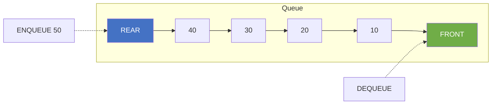

### 1.2 Analogi Queue di Kehidupan Nyata

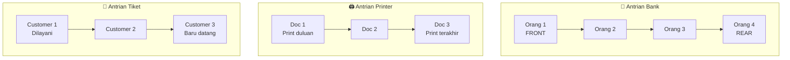

**Contoh Queue di dunia nyata:**
- 🏦 Antrian di bank/loket
- 🖨️ Print queue (antrian cetak)
- 🎫 Antrian tiket
- 📱 Message queue
- 🚗 Antrian mobil di tol
- 💻 CPU scheduling (proses menunggu)

### 1.3 Prinsip FIFO

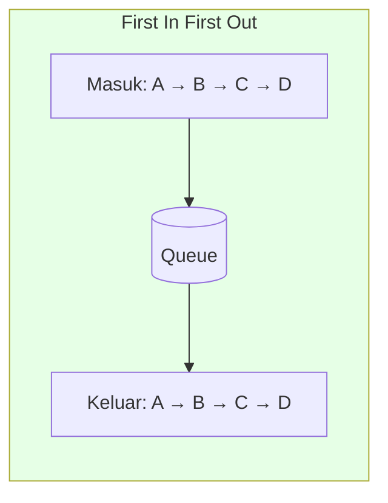

> 📝 **FIFO:** Yang **pertama masuk** (First In) akan **pertama keluar** (First Out)

### 1.4 Perbandingan Stack vs Queue

| Aspek | Stack | Queue |
|-------|-------|-------|
| **Prinsip** | LIFO | FIFO |
| **Insert** | Di TOP (push) | Di REAR (enqueue) |
| **Delete** | Di TOP (pop) | Di FRONT (dequeue) |
| **Analogi** | Tumpukan piring | Antrian orang |
| **Akses** | Satu ujung | Dua ujung |

---

## 2. Operasi Dasar Queue (25 menit)

### 2.1 ADT Queue

```
ADT Queue:
    Data:
        - Kumpulan elemen dengan aturan FIFO
        - front: penunjuk ke elemen terdepan
        - rear: penunjuk ke elemen terbelakang
    
    Operasi:
        - enqueue(item) : Menambah elemen di belakang (rear)
        - dequeue()     : Menghapus dan mengembalikan elemen depan (front)
        - peek/front()  : Melihat elemen depan tanpa menghapus
        - isEmpty()     : Mengecek apakah queue kosong
        - isFull()      : Mengecek apakah queue penuh
        - size()        : Mengembalikan jumlah elemen
```

### 2.2 Operasi ENQUEUE

#### Flowchart ENQUEUE

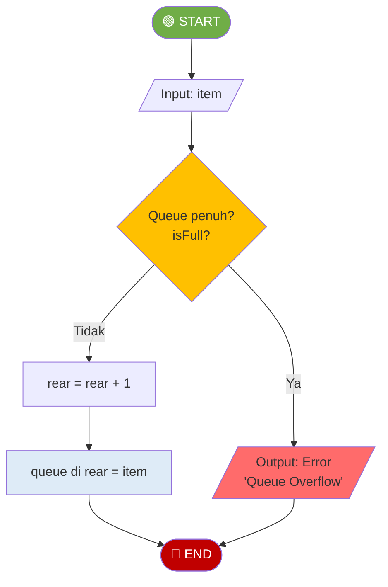

#### Visualisasi ENQUEUE

**Sebelum:** Enqueue 50
```
Index:    0    1    2    3    4
        ┌────┬────┬────┬────┬────┐
Queue:  │ 10 │ 20 │ 30 │ 40 │    │
        └────┴────┴────┴────┴────┘
          ↑                   ↑
        FRONT              REAR
```

**Sesudah:**
```
Index:    0    1    2    3    4
        ┌────┬────┬────┬────┬────┐
Queue:  │ 10 │ 20 │ 30 │ 40 │ 50 │
        └────┴────┴────┴────┴────┘
          ↑                   ↑
        FRONT              REAR (baru)
```

#### Kode Python

```python
def enqueue(self, item):
    """Menambah elemen di belakang queue - O(1)"""
    if self.is_full():
        raise OverflowError("Queue Overflow")
    self.rear += 1
    self.items[self.rear] = item
```

> 📝 **Kompleksitas: O(1)** - Langsung tambah di posisi rear

---

### 2.3 Operasi DEQUEUE

#### Flowchart DEQUEUE

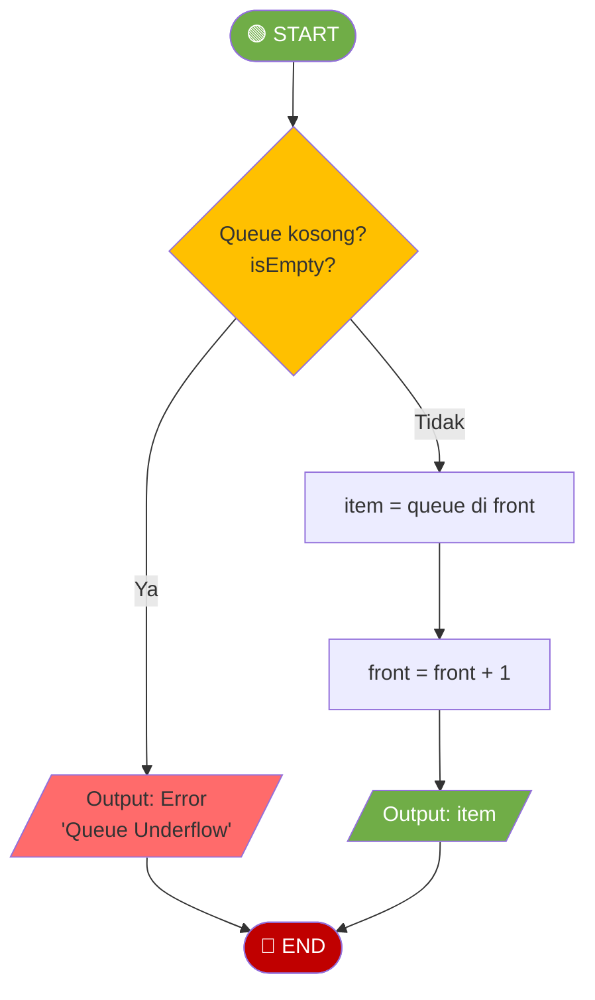

#### Visualisasi DEQUEUE

**Sebelum:** Dequeue
```
Index:    0    1    2    3    4
        ┌────┬────┬────┬────┬────┐
Queue:  │ 10 │ 20 │ 30 │ 40 │ 50 │
        └────┴────┴────┴────┴────┘
          ↑                   ↑
        FRONT              REAR
```

**Sesudah:** (Return 10)
```
Index:    0    1    2    3    4
        ┌────┬────┬────┬────┬────┐
Queue:  │    │ 20 │ 30 │ 40 │ 50 │
        └────┴────┴────┴────┴────┘
               ↑              ↑
            FRONT (baru)   REAR
```

#### Kode Python

```python
def dequeue(self):
    """Menghapus dan mengembalikan elemen depan - O(1)"""
    if self.is_empty():
        raise IndexError("Queue Underflow")
    item = self.items[self.front]
    self.front += 1
    return item
```

> 📝 **Kompleksitas: O(1)** - Langsung ambil dari posisi front

---

### 2.4 Masalah "False Overflow" pada Linear Queue

#### Visualisasi Masalah

**Setelah beberapa dequeue:**
```
Index:    0    1    2    3    4
        ┌────┬────┬────┬────┬────┐
Queue:  │    │    │    │ 40 │ 50 │
        └────┴────┴────┴────┴────┘
                         ↑    ↑
                      FRONT REAR

Ingin enqueue 60... tapi rear sudah di akhir!
Padahal index 0, 1, 2 kosong! 😱
```

Ini disebut **"False Overflow"** - queue terlihat penuh padahal masih ada ruang kosong.

**Solusi:** Gunakan **Circular Queue**!

---

## 3. Circular Queue (25 menit)

### 3.1 Konsep Circular Queue

**Circular Queue** mengatasi masalah false overflow dengan membuat array "melingkar" - setelah index terakhir, kembali ke index 0.

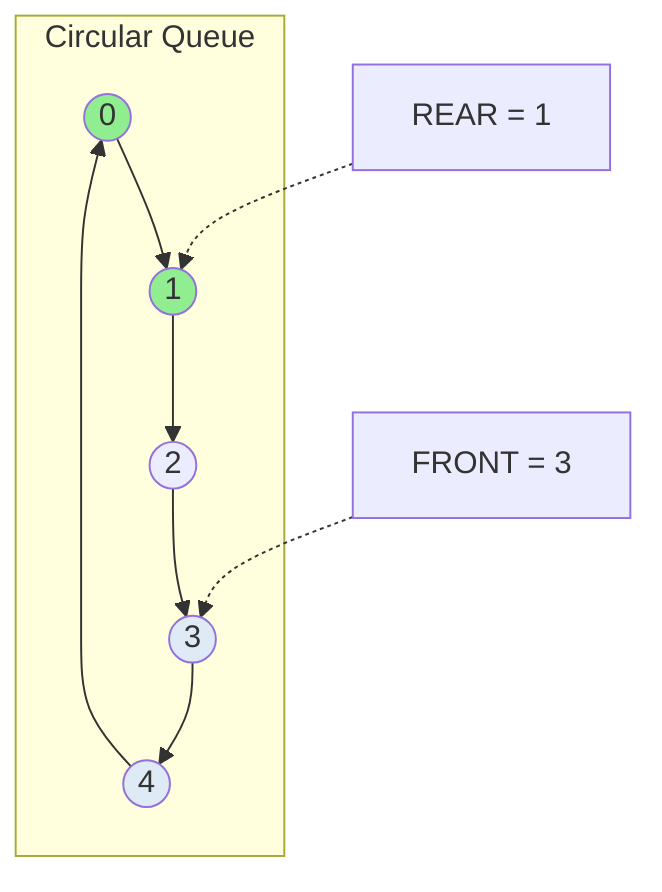

### 3.2 Formula Circular Queue

```
next_index = (current_index + 1) % capacity

Contoh dengan capacity = 5:
- (0 + 1) % 5 = 1
- (1 + 1) % 5 = 2
- (4 + 1) % 5 = 0  ← Kembali ke awal!
```

### 3.3 Flowchart ENQUEUE Circular Queue

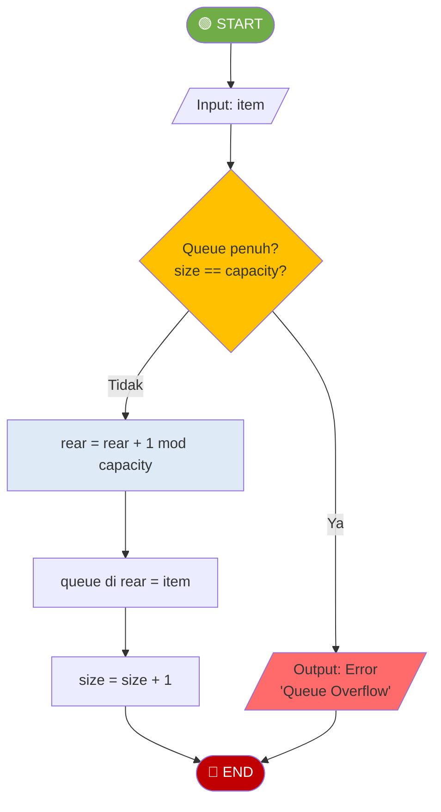

### 3.4 Flowchart DEQUEUE Circular Queue

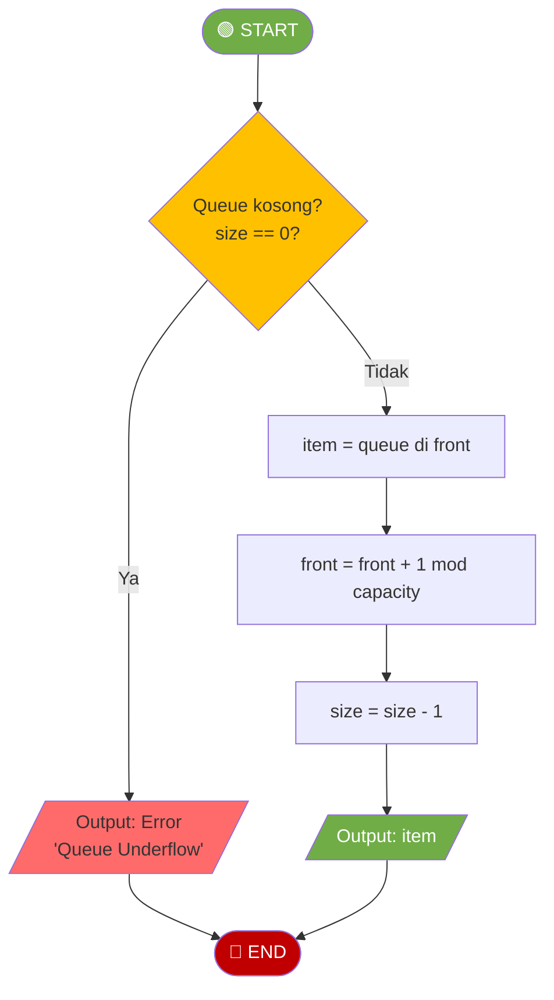

### 3.5 Visualisasi Circular Queue

**State awal:** (capacity = 5)
```
        ┌───┐
     4  │   │  0
       ╲│   │╱
    3 ──│   │── 1
       ╱│   │╲
     2  │   │
        └───┘
    FRONT = 0, REAR = -1, SIZE = 0
```

**Setelah enqueue(10, 20, 30):**
```
        ┌───┐
     4  │   │  0 ← 10 (FRONT)
       ╲│   │╱
    3 ──│   │── 1 ← 20
       ╱│   │╲
     2  │ 30│    ← (REAR)
        └───┘
    FRONT = 0, REAR = 2, SIZE = 3
```

**Setelah dequeue() 2 kali, lalu enqueue(40, 50, 60):**
```
        ┌───┐
     4  │ 50│  0 ← 60 (REAR, wrapped!)
       ╲│   │╱
    3 ──│ 40│── 1
       ╱│   │╲
     2  │ 30│    ← (FRONT)
        └───┘
    FRONT = 2, REAR = 0, SIZE = 4
```

### 3.6 Kode Circular Queue

```python
class CircularQueue:
    def __init__(self, capacity):
        self.capacity = capacity
        self.items = [None] * capacity
        self.front = 0
        self.rear = -1
        self._size = 0
    
    def is_empty(self):
        return self._size == 0
    
    def is_full(self):
        return self._size == self.capacity
    
    def enqueue(self, item):
        if self.is_full():
            raise OverflowError("Queue Overflow")
        self.rear = (self.rear + 1) % self.capacity
        self.items[self.rear] = item
        self._size += 1
    
    def dequeue(self):
        if self.is_empty():
            raise IndexError("Queue Underflow")
        item = self.items[self.front]
        self.front = (self.front + 1) % self.capacity
        self._size -= 1
        return item
```

---

## 4. Variasi Queue (20 menit)

### 4.1 Priority Queue

**Priority Queue** adalah queue dimana setiap elemen memiliki **prioritas**. Elemen dengan prioritas tertinggi dikeluarkan lebih dulu.

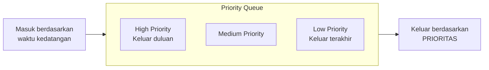

**Contoh:** Antrian di UGD Rumah Sakit
- Pasien kritis → prioritas tinggi → ditangani duluan
- Pasien ringan → prioritas rendah → menunggu

#### Implementasi Priority Queue

```python
class PriorityQueue:
    def __init__(self):
        self.items = []
    
    def enqueue(self, item, priority):
        """Insert berdasarkan prioritas (higher = lebih penting)"""
        entry = (priority, item)
        # Cari posisi yang tepat
        inserted = False
        for i in range(len(self.items)):
            if priority > self.items[i][0]:
                self.items.insert(i, entry)
                inserted = True
                break
        if not inserted:
            self.items.append(entry)
    
    def dequeue(self):
        """Ambil elemen dengan prioritas tertinggi"""
        if self.is_empty():
            raise IndexError("Queue Empty")
        return self.items.pop(0)[1]
```

### 4.2 Deque (Double-Ended Queue)

**Deque** adalah queue yang memungkinkan insert dan delete di **kedua ujung** (front dan rear).

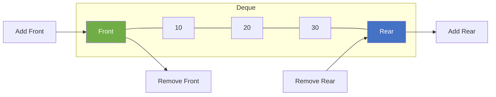

**Operasi Deque:**
- `add_front(item)` - Tambah di depan
- `add_rear(item)` - Tambah di belakang
- `remove_front()` - Hapus dari depan
- `remove_rear()` - Hapus dari belakang

> 💡 Deque bisa digunakan sebagai **Stack** (add_rear + remove_rear) atau **Queue** (add_rear + remove_front)

### 4.3 Perbandingan Jenis Queue

| Jenis | Insert | Delete | Penggunaan |
|-------|--------|--------|------------|
| **Queue** | Di rear | Di front | Antrian biasa |
| **Circular Queue** | Di rear (circular) | Di front (circular) | Efisiensi memori |
| **Priority Queue** | Berdasarkan prioritas | Prioritas tertinggi | Scheduling, A* algorithm |
| **Deque** | Front atau rear | Front atau rear | Fleksibel |

---

## 5. Aplikasi Queue (10 menit)

### 5.1 Aplikasi Umum Queue

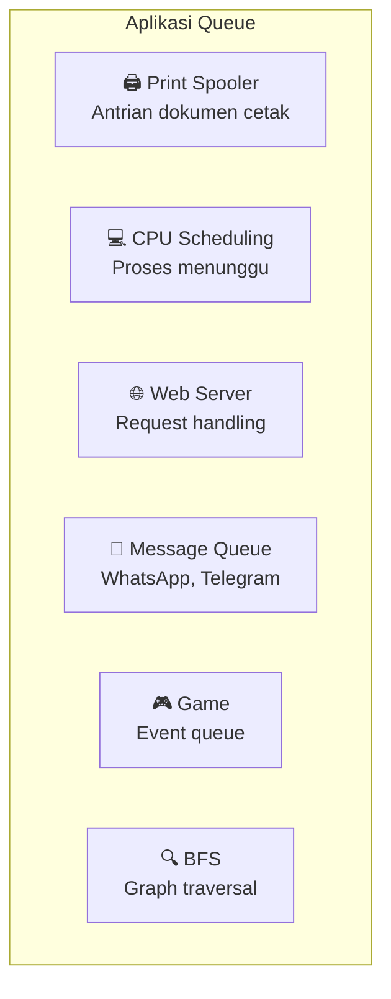

### 5.2 Contoh: BFS (Breadth-First Search)

Queue digunakan dalam algoritma BFS untuk menjelajahi graph level by level.

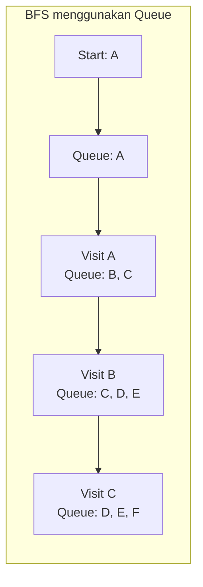

---

## 6. Rangkuman (5 menit)

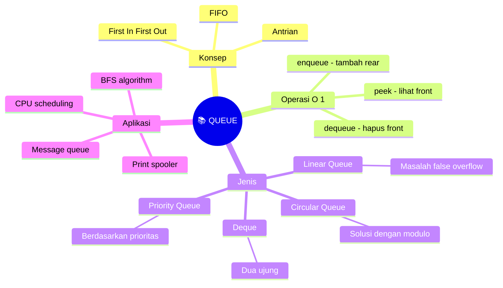

---

# BAGIAN B: PRAKTIKUM DI LAB (100 Menit)

## Tujuan Praktikum
Mengimplementasikan berbagai jenis Queue dan aplikasinya.

> ⚠️ **Catatan:** Kode yang dibuat di praktikum ini akan **dikembangkan lebih lanjut** di Tugas Terstruktur.

---

## Praktikum 6.1: Implementasi Linear Queue (30 menit)

### Kode Praktikum

```python
"""
============================================================
PRAKTIKUM 6.1: Implementasi Linear Queue dengan Array
============================================================
Nama  : ____________________
NIM   : ____________________
Kelas : ____________________

Instruksi: 
1. Implementasikan class LinearQueue
2. Jalankan test cases untuk memastikan implementasi benar
3. SIMPAN FILE INI - akan dikembangkan di Tugas Terstruktur
============================================================
"""

class LinearQueue:
    """Queue menggunakan Array (Linear)"""
    
    def __init__(self, capacity=10):
        """
        Inisialisasi queue dengan kapasitas tertentu
        Parameter:
            capacity: ukuran maksimum queue
        """
        # TODO: Implementasikan
        # self.capacity = ???
        # self.items = ???
        # self.front = ???  # Index elemen depan
        # self.rear = ???   # Index elemen belakang
        pass
    
    def is_empty(self):
        """
        Cek apakah queue kosong
        Return: True jika front > rear
        """
        # TODO: Implementasikan
        pass
    
    def is_full(self):
        """
        Cek apakah queue penuh
        Return: True jika rear == capacity - 1
        """
        # TODO: Implementasikan
        pass
    
    def enqueue(self, item):
        """
        Menambah elemen di belakang queue
        Kompleksitas: O(1)
        Raise: OverflowError jika penuh
        """
        # TODO: Implementasikan berdasarkan flowchart ENQUEUE
        pass
    
    def dequeue(self):
        """
        Menghapus dan mengembalikan elemen depan
        Kompleksitas: O(1)
        Raise: IndexError jika kosong
        """
        # TODO: Implementasikan berdasarkan flowchart DEQUEUE
        pass
    
    def peek(self):
        """
        Melihat elemen depan tanpa menghapus
        Kompleksitas: O(1)
        """
        # TODO: Implementasikan
        pass
    
    def size(self):
        """Mengembalikan jumlah elemen"""
        # TODO: Implementasikan
        pass
    
    def display(self):
        """
        Menampilkan isi queue
        Format: "Queue (front -> rear): [10, 20, 30]"
        """
        # TODO: Implementasikan
        pass


# === TEST CASES ===
if __name__ == "__main__":
    print("=" * 50)
    print("TEST LINEAR QUEUE")
    print("=" * 50)
    
    queue = LinearQueue(5)
    
    # Test 1: Initial state
    assert queue.is_empty() == True, "GAGAL: Queue baru harus kosong"
    assert queue.size() == 0, "GAGAL: Size harus 0"
    print("✓ Test 1 PASSED: Inisialisasi")
    
    # Test 2: Enqueue
    queue.enqueue(10)
    queue.enqueue(20)
    queue.enqueue(30)
    assert queue.size() == 3, "GAGAL: Size harus 3"
    queue.display()  # Queue (front -> rear): [10, 20, 30]
    print("✓ Test 2 PASSED: Enqueue")
    
    # Test 3: Peek
    assert queue.peek() == 10, "GAGAL: Peek harus 10 (FIFO)"
    assert queue.size() == 3, "GAGAL: Peek tidak boleh menghapus"
    print("✓ Test 3 PASSED: Peek")
    
    # Test 4: Dequeue
    assert queue.dequeue() == 10, "GAGAL: Dequeue harus 10"
    assert queue.dequeue() == 20, "GAGAL: Dequeue harus 20"
    assert queue.size() == 1, "GAGAL: Size harus 1"
    print("✓ Test 4 PASSED: Dequeue")
    
    # Test 5: Queue overflow
    queue.enqueue(40)
    queue.enqueue(50)
    queue.enqueue(60)
    queue.enqueue(70)  # Queue penuh (rear = capacity - 1)
    try:
        queue.enqueue(80)  # Harus error (false overflow!)
        print("⚠️ Test 5: False overflow terjadi!")
    except OverflowError:
        print("✓ Test 5 PASSED: Overflow handled")
    
    queue.display()
    
    print("=" * 50)
    print("🎉 SEMUA TEST PASSED!")
    print("=" * 50)
```

---

## Praktikum 6.2: Implementasi Circular Queue (40 menit)

### Kode Praktikum

```python
"""
============================================================
PRAKTIKUM 6.2: Implementasi Circular Queue
============================================================
Nama  : ____________________
NIM   : ____________________
Kelas : ____________________

Instruksi: 
Implementasikan Circular Queue untuk mengatasi false overflow
============================================================
"""

class CircularQueue:
    """Queue menggunakan Array (Circular)"""
    
    def __init__(self, capacity=10):
        """
        Inisialisasi circular queue
        """
        # TODO: Implementasikan
        # self.capacity = ???
        # self.items = ???
        # self.front = ???
        # self.rear = ???
        # self._size = ???  # Untuk tracking jumlah elemen
        pass
    
    def is_empty(self):
        """Cek apakah queue kosong"""
        # TODO: Implementasikan
        pass
    
    def is_full(self):
        """Cek apakah queue penuh"""
        # TODO: Implementasikan
        pass
    
    def enqueue(self, item):
        """
        Menambah elemen di belakang queue (circular)
        Kompleksitas: O(1)
        """
        # TODO: Implementasikan berdasarkan flowchart ENQUEUE Circular
        # Hint: rear = (rear + 1) % capacity
        pass
    
    def dequeue(self):
        """
        Menghapus dan mengembalikan elemen depan (circular)
        Kompleksitas: O(1)
        """
        # TODO: Implementasikan berdasarkan flowchart DEQUEUE Circular
        # Hint: front = (front + 1) % capacity
        pass
    
    def peek(self):
        """Melihat elemen depan"""
        # TODO: Implementasikan
        pass
    
    def size(self):
        """Mengembalikan jumlah elemen"""
        # TODO: Implementasikan
        pass
    
    def display(self):
        """
        Menampilkan isi queue
        Format: "CircularQueue: [10, 20, 30] (front=0, rear=2)"
        """
        # TODO: Implementasikan
        pass


# === TEST CASES ===
if __name__ == "__main__":
    print("=" * 50)
    print("TEST CIRCULAR QUEUE")
    print("=" * 50)
    
    cq = CircularQueue(5)
    
    # Test 1: Initial state
    assert cq.is_empty() == True, "GAGAL: Queue baru harus kosong"
    print("✓ Test 1 PASSED: Inisialisasi")
    
    # Test 2: Enqueue
    cq.enqueue(10)
    cq.enqueue(20)
    cq.enqueue(30)
    cq.display()
    assert cq.size() == 3, "GAGAL: Size harus 3"
    print("✓ Test 2 PASSED: Enqueue")
    
    # Test 3: Dequeue
    assert cq.dequeue() == 10, "GAGAL: Dequeue harus 10"
    assert cq.dequeue() == 20, "GAGAL: Dequeue harus 20"
    cq.display()
    print("✓ Test 3 PASSED: Dequeue")
    
    # Test 4: Circular property - enqueue setelah dequeue
    cq.enqueue(40)
    cq.enqueue(50)
    cq.enqueue(60)
    cq.enqueue(70)  # Ini harus BISA (wrap around ke index 0)
    cq.display()
    assert cq.size() == 5, "GAGAL: Size harus 5"
    print("✓ Test 4 PASSED: Circular wrap-around")
    
    # Test 5: Full after wrap
    assert cq.is_full() == True, "GAGAL: Queue harus penuh"
    try:
        cq.enqueue(80)
        assert False, "GAGAL: Harus overflow"
    except OverflowError:
        print("✓ Test 5 PASSED: Overflow setelah penuh")
    
    # Test 6: Dequeue all dan verify
    values = []
    while not cq.is_empty():
        values.append(cq.dequeue())
    assert values == [30, 40, 50, 60, 70], f"GAGAL: {values}"
    print("✓ Test 6 PASSED: Dequeue semua elemen dalam urutan FIFO")
    
    print("=" * 50)
    print("🎉 SEMUA TEST PASSED!")
    print("=" * 50)
```

---

## Praktikum 6.3: Implementasi Queue dengan Linked List (30 menit)

### Kode Praktikum

```python
"""
============================================================
PRAKTIKUM 6.3: Implementasi Queue dengan Linked List
============================================================
Nama  : ____________________
NIM   : ____________________
Kelas : ____________________

Instruksi: 
Implementasikan Queue menggunakan Linked List (dinamis)
============================================================
"""

class Node:
    """Node untuk Linked List"""
    def __init__(self, data):
        self.data = data
        self.next = None


class LinkedQueue:
    """Queue menggunakan Linked List"""
    
    def __init__(self):
        """
        Inisialisasi queue kosong
        front: pointer ke node depan
        rear: pointer ke node belakang
        """
        # TODO: Implementasikan
        # self.front = ???
        # self.rear = ???
        # self._size = ???
        pass
    
    def is_empty(self):
        """Cek apakah queue kosong"""
        # TODO: Implementasikan
        pass
    
    def enqueue(self, item):
        """
        Menambah elemen di belakang queue
        Kompleksitas: O(1) - karena ada pointer rear
        """
        # TODO: Implementasikan
        # Hint: 
        # 1. Buat node baru
        # 2. Jika kosong: front = rear = new_node
        # 3. Jika tidak: rear.next = new_node, rear = new_node
        pass
    
    def dequeue(self):
        """
        Menghapus dan mengembalikan elemen depan
        Kompleksitas: O(1)
        """
        # TODO: Implementasikan
        # Hint: Sama seperti delete_at_beginning di Linked List
        pass
    
    def peek(self):
        """Melihat elemen depan"""
        # TODO: Implementasikan
        pass
    
    def size(self):
        """Mengembalikan jumlah elemen"""
        # TODO: Implementasikan
        pass
    
    def display(self):
        """Menampilkan isi queue"""
        # TODO: Implementasikan
        pass


# === TEST CASES ===
if __name__ == "__main__":
    print("=" * 50)
    print("TEST LINKED QUEUE")
    print("=" * 50)
    
    queue = LinkedQueue()
    
    # Test 1: Initial state
    assert queue.is_empty() == True, "GAGAL: Queue baru harus kosong"
    print("✓ Test 1 PASSED: Inisialisasi")
    
    # Test 2: Enqueue
    queue.enqueue(10)
    queue.enqueue(20)
    queue.enqueue(30)
    queue.display()
    assert queue.size() == 3, "GAGAL: Size harus 3"
    print("✓ Test 2 PASSED: Enqueue")
    
    # Test 3: FIFO order
    assert queue.peek() == 10, "GAGAL: Front harus 10"
    assert queue.dequeue() == 10, "GAGAL: Dequeue harus 10"
    assert queue.dequeue() == 20, "GAGAL: Dequeue harus 20"
    print("✓ Test 3 PASSED: FIFO order")
    
    # Test 4: No overflow (dinamis)
    for i in range(100):
        queue.enqueue(i)
    assert queue.size() == 101, "GAGAL: Linked queue tidak ada overflow"
    print("✓ Test 4 PASSED: No overflow (dinamis)")
    
    print("=" * 50)
    print("🎉 SEMUA TEST PASSED!")
    print("=" * 50)
```

---

# BAGIAN C: TUGAS TERSTRUKTUR (120 Menit)

> 📝 **Pengembangan dari Praktikum**
> 
> Tugas ini mengembangkan kode yang sudah dibuat di praktikum.
> Kerjakan setelah praktikum selesai, kumpulkan pada pertemuan berikutnya.

---

## 📋 Informasi Pengumpulan

| Item | Keterangan |
|------|------------|
| **Deadline** | Pertemuan 7 (sebelum kuliah dimulai) |
| **Format** | File Python (.py) |
| **Nama File** | `Tugas6_NIM_Nama.py` |
| **Pengumpulan** | Upload ke github |

---

## Tugas 1: Implementasi Priority Queue (40 menit)

### Deskripsi
Implementasikan **Priority Queue** dimana elemen dengan prioritas lebih tinggi dikeluarkan lebih dulu.

### Flowchart ENQUEUE Priority Queue

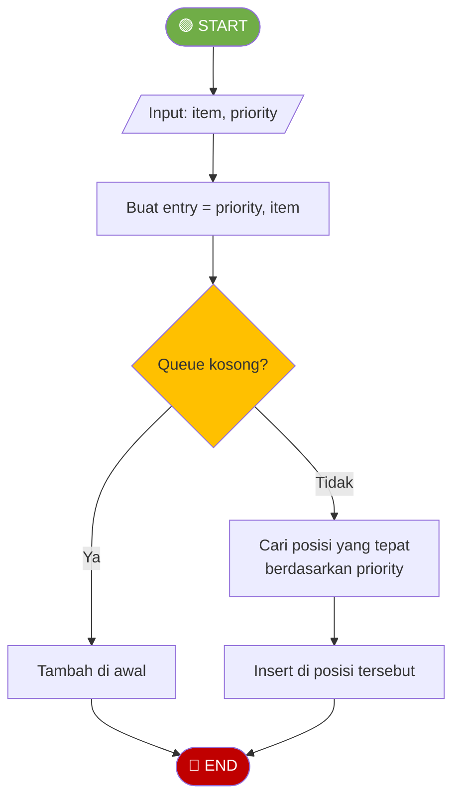

### Template Kode

```python
"""
============================================================
TUGAS TERSTRUKTUR 1: Implementasi Priority Queue
============================================================
Nama  : ____________________
NIM   : ____________________
Kelas : ____________________
============================================================
"""

class PriorityQueue:
    """
    Priority Queue - elemen dengan prioritas tinggi keluar duluan
    Prioritas lebih tinggi = angka lebih besar
    """
    
    def __init__(self):
        """Inisialisasi priority queue kosong"""
        # TODO: Implementasikan
        # Hint: Bisa menggunakan list of tuples (priority, item)
        pass
    
    def is_empty(self):
        """Cek apakah queue kosong"""
        # TODO: Implementasikan
        pass
    
    def enqueue(self, item, priority):
        """
        Menambah elemen dengan prioritas tertentu
        Elemen disimpan terurut berdasarkan prioritas (descending)
        
        Parameter:
            item: data yang disimpan
            priority: nilai prioritas (lebih tinggi = lebih penting)
        """
        # TODO: Implementasikan berdasarkan flowchart
        pass
    
    def dequeue(self):
        """
        Menghapus dan mengembalikan elemen dengan prioritas tertinggi
        Return: item (bukan tuple)
        """
        # TODO: Implementasikan
        pass
    
    def peek(self):
        """Melihat elemen dengan prioritas tertinggi"""
        # TODO: Implementasikan
        pass
    
    def size(self):
        """Mengembalikan jumlah elemen"""
        # TODO: Implementasikan
        pass
    
    def display(self):
        """
        Menampilkan isi queue
        Format: "PriorityQueue: [(priority, item), ...]"
        """
        # TODO: Implementasikan
        pass


# === TEST CASES ===
if __name__ == "__main__":
    print("=" * 50)
    print("TEST PRIORITY QUEUE")
    print("=" * 50)
    
    pq = PriorityQueue()
    
    # Test 1: Enqueue dengan berbagai prioritas
    pq.enqueue("Low priority task", 1)
    pq.enqueue("High priority task", 5)
    pq.enqueue("Medium priority task", 3)
    pq.enqueue("Urgent task", 10)
    pq.enqueue("Normal task", 3)
    
    pq.display()
    print("✓ Test 1 PASSED: Enqueue")
    
    # Test 2: Dequeue harus berdasarkan prioritas
    assert pq.dequeue() == "Urgent task", "GAGAL: Prioritas tertinggi duluan"
    assert pq.dequeue() == "High priority task", "GAGAL: Prioritas 5"
    print("✓ Test 2 PASSED: Dequeue berdasarkan prioritas")
    
    # Test 3: Peek
    assert pq.peek() == "Medium priority task" or pq.peek() == "Normal task", "GAGAL: Peek"
    print("✓ Test 3 PASSED: Peek")
    
    # Test 4: FIFO untuk prioritas sama
    # Dua task dengan prioritas 3, yang pertama masuk harus keluar duluan
    result1 = pq.dequeue()
    result2 = pq.dequeue()
    # Keduanya prioritas 3
    print(f"  Same priority results: {result1}, {result2}")
    print("✓ Test 4 PASSED: Same priority")
    
    print("=" * 50)
    print("🎉 SEMUA TEST PASSED!")
    print("=" * 50)
```

---

## Tugas 2: Implementasi Deque (40 menit)

### Deskripsi
Implementasikan **Deque (Double-Ended Queue)** yang bisa insert dan delete di kedua ujung.

### Template Kode

```python
"""
============================================================
TUGAS TERSTRUKTUR 2: Implementasi Deque
============================================================
Nama  : ____________________
NIM   : ____________________
Kelas : ____________________
============================================================
"""

class Deque:
    """
    Double-Ended Queue
    Bisa insert dan delete di front maupun rear
    """
    
    def __init__(self):
        """Inisialisasi deque kosong"""
        # TODO: Implementasikan
        pass
    
    def is_empty(self):
        """Cek apakah deque kosong"""
        # TODO: Implementasikan
        pass
    
    def add_front(self, item):
        """Menambah elemen di depan"""
        # TODO: Implementasikan
        pass
    
    def add_rear(self, item):
        """Menambah elemen di belakang"""
        # TODO: Implementasikan
        pass
    
    def remove_front(self):
        """Menghapus dan mengembalikan elemen depan"""
        # TODO: Implementasikan
        pass
    
    def remove_rear(self):
        """Menghapus dan mengembalikan elemen belakang"""
        # TODO: Implementasikan
        pass
    
    def peek_front(self):
        """Melihat elemen depan"""
        # TODO: Implementasikan
        pass
    
    def peek_rear(self):
        """Melihat elemen belakang"""
        # TODO: Implementasikan
        pass
    
    def size(self):
        """Mengembalikan jumlah elemen"""
        # TODO: Implementasikan
        pass
    
    def display(self):
        """Menampilkan isi deque"""
        # TODO: Implementasikan
        pass


def is_palindrome(text):
    """
    Mengecek apakah text adalah palindrome menggunakan Deque
    
    Algoritma:
    1. Masukkan semua karakter ke deque
    2. Bandingkan karakter dari front dan rear
    3. Jika semua sama, palindrome
    
    Parameter:
        text: string yang akan dicek
    
    Return:
        True jika palindrome, False jika tidak
    """
    # TODO: Implementasikan menggunakan Deque
    pass


# === TEST CASES ===
if __name__ == "__main__":
    print("=" * 50)
    print("TEST DEQUE")
    print("=" * 50)
    
    dq = Deque()
    
    # Test 1: Add operations
    dq.add_rear(10)
    dq.add_rear(20)
    dq.add_front(5)
    dq.add_front(1)
    dq.display()  # Expected: [1, 5, 10, 20]
    assert dq.size() == 4, "GAGAL: Size"
    print("✓ Test 1 PASSED: Add operations")
    
    # Test 2: Peek operations
    assert dq.peek_front() == 1, "GAGAL: Peek front"
    assert dq.peek_rear() == 20, "GAGAL: Peek rear"
    print("✓ Test 2 PASSED: Peek operations")
    
    # Test 3: Remove operations
    assert dq.remove_front() == 1, "GAGAL: Remove front"
    assert dq.remove_rear() == 20, "GAGAL: Remove rear"
    dq.display()  # Expected: [5, 10]
    print("✓ Test 3 PASSED: Remove operations")
    
    # Test 4: Use as Stack (add_rear + remove_rear)
    stack_dq = Deque()
    stack_dq.add_rear(1)
    stack_dq.add_rear(2)
    stack_dq.add_rear(3)
    assert stack_dq.remove_rear() == 3, "GAGAL: Stack behavior"
    print("✓ Test 4 PASSED: Deque as Stack")
    
    # Test 5: Use as Queue (add_rear + remove_front)
    queue_dq = Deque()
    queue_dq.add_rear(1)
    queue_dq.add_rear(2)
    queue_dq.add_rear(3)
    assert queue_dq.remove_front() == 1, "GAGAL: Queue behavior"
    print("✓ Test 5 PASSED: Deque as Queue")
    
    # Test 6: Palindrome checker
    print("\nTesting Palindrome:")
    test_cases = [
        ("radar", True),
        ("level", True),
        ("hello", False),
        ("a", True),
        ("", True),
        ("katak", True),
        ("python", False)
    ]
    for text, expected in test_cases:
        result = is_palindrome(text)
        status = "✓" if result == expected else "✗"
        print(f"  {status} is_palindrome('{text}') = {result}")
    
    print("=" * 50)
    print("🎉 SEMUA TEST PASSED!")
    print("=" * 50)
```

---

## Tugas 3: Aplikasi Queue - Simulasi Antrian Bank (40 menit)

### Deskripsi
Buat simulasi **Antrian Bank** dengan fitur:
- Multiple teller (counter)
- Customer dengan waktu layanan berbeda
- Statistik (average waiting time, dll)

### Template Kode

```python
"""
============================================================
TUGAS TERSTRUKTUR 3: Aplikasi Queue - Simulasi Antrian Bank
============================================================
Nama  : ____________________
NIM   : ____________________
Kelas : ____________________
============================================================
"""

import random

class Customer:
    """Class untuk merepresentasikan customer"""
    
    def __init__(self, customer_id, arrival_time, service_time):
        self.customer_id = customer_id
        self.arrival_time = arrival_time      # Waktu datang
        self.service_time = service_time      # Waktu layanan yang dibutuhkan
        self.start_service_time = None        # Waktu mulai dilayani
        self.end_service_time = None          # Waktu selesai dilayani
    
    def waiting_time(self):
        """Menghitung waktu tunggu"""
        if self.start_service_time is not None:
            return self.start_service_time - self.arrival_time
        return None
    
    def __str__(self):
        return f"Customer-{self.customer_id}"


class Teller:
    """Class untuk merepresentasikan teller/counter"""
    
    def __init__(self, teller_id):
        self.teller_id = teller_id
        self.current_customer = None
        self.busy_until = 0  # Waktu teller akan free
        self.customers_served = 0
    
    def is_available(self, current_time):
        """Cek apakah teller available"""
        return current_time >= self.busy_until
    
    def serve(self, customer, current_time):
        """Melayani customer"""
        self.current_customer = customer
        customer.start_service_time = current_time
        customer.end_service_time = current_time + customer.service_time
        self.busy_until = customer.end_service_time
        self.customers_served += 1
    
    def __str__(self):
        return f"Teller-{self.teller_id}"


class BankSimulation:
    """Simulasi Antrian Bank"""
    
    def __init__(self, num_tellers):
        """
        Inisialisasi simulasi
        Parameter:
            num_tellers: jumlah teller/counter
        """
        # TODO: Implementasikan
        # self.queue = ???  # Queue untuk antrian customer
        # self.tellers = ???  # List of Teller
        # self.all_customers = ???  # List semua customer
        # self.current_time = ???
        pass
    
    def add_customer(self, arrival_time, service_time):
        """
        Menambahkan customer baru ke antrian
        """
        # TODO: Implementasikan
        pass
    
    def simulate_step(self):
        """
        Simulasi satu unit waktu
        1. Cek teller yang sudah selesai
        2. Assign customer dari queue ke teller yang free
        """
        # TODO: Implementasikan
        pass
    
    def run_simulation(self, duration):
        """
        Menjalankan simulasi selama duration waktu
        """
        # TODO: Implementasikan
        pass
    
    def get_statistics(self):
        """
        Menghitung statistik simulasi
        Return: dict dengan:
            - total_customers
            - customers_served
            - customers_waiting
            - average_waiting_time
            - average_service_time
            - max_waiting_time
        """
        # TODO: Implementasikan
        pass
    
    def display_status(self):
        """Menampilkan status saat ini"""
        # TODO: Implementasikan
        pass


# === TEST / DEMO ===
if __name__ == "__main__":
    print("=" * 50)
    print("SIMULASI ANTRIAN BANK")
    print("=" * 50)
    
    # Buat simulasi dengan 3 teller
    bank = BankSimulation(num_tellers=3)
    
    # Generate random customers
    random.seed(42)  # Untuk hasil yang reproducible
    
    # 20 customers datang di waktu berbeda
    for i in range(20):
        arrival = random.randint(0, 50)  # Datang antara waktu 0-50
        service = random.randint(3, 10)  # Butuh layanan 3-10 menit
        bank.add_customer(arrival, service)
    
    print(f"\nTotal customers: 20")
    print(f"Number of tellers: 3")
    print("\nRunning simulation...")
    
    # Jalankan simulasi selama 100 unit waktu
    bank.run_simulation(100)
    
    # Tampilkan statistik
    stats = bank.get_statistics()
    print("\n" + "=" * 50)
    print("STATISTIK SIMULASI")
    print("=" * 50)
    print(f"Total customers       : {stats.get('total_customers', 'N/A')}")
    print(f"Customers served      : {stats.get('customers_served', 'N/A')}")
    print(f"Customers still waiting: {stats.get('customers_waiting', 'N/A')}")
    print(f"Average waiting time  : {stats.get('average_waiting_time', 'N/A'):.2f} minutes")
    print(f"Max waiting time      : {stats.get('max_waiting_time', 'N/A')} minutes")
    print(f"Average service time  : {stats.get('average_service_time', 'N/A'):.2f} minutes")
    
    print("=" * 50)
    print("🎉 SIMULASI SELESAI!")
    print("=" * 50)
```

---

# BAGIAN D: BELAJAR MANDIRI (190 Menit)

> 📚 **Bagian ini dikerjakan mahasiswa secara mandiri di luar kelas**
> **Tidak dikumpulkan**, tetapi penting untuk pemahaman materi.

---

## D1. Membaca Referensi (60 menit)

### Bacaan Wajib:
1. **Goodrich et al., Chapter 6.2-6.3** - Queues
2. **GeeksforGeeks** - [Queue Data Structure](https://www.geeksforgeeks.org/queue-data-structure/)

### Bacaan Tambahan:
- [Visualgo - Queue](https://visualgo.net/en/list)
- Circular Queue implementation
- Priority Queue and Heap

---

## D2. Video Tutorial (40 menit)

Tonton dan buat catatan:

1. **Queue Data Structure** (~15 menit)
   - https://www.youtube.com/watch?v=wjI1WNcIntg
   
2. **Circular Queue** (~15 menit)
   - https://www.youtube.com/watch?v=dn01XST9-bI

3. **Priority Queue** (~10 menit)
   - https://www.youtube.com/watch?v=wptevk0bshY

---

## D3. Latihan Mandiri (60 menit)

### Soal Pilihan Ganda

**1.** Queue menggunakan prinsip...
- [ ] a. LIFO (Last In First Out)
- [ ] b. FIFO (First In First Out)
- [ ] c. Random Access
- [ ] d. Priority Based

**2.** Operasi untuk menambah elemen ke queue disebut...
- [ ] a. push
- [ ] b. pop
- [ ] c. enqueue
- [ ] d. insert

**3.** Circular Queue mengatasi masalah apa?
- [ ] a. Stack overflow
- [ ] b. False overflow
- [ ] c. Memory leak
- [ ] d. Infinite loop

**4.** Dalam Priority Queue, elemen yang dikeluarkan adalah...
- [ ] a. Elemen pertama masuk
- [ ] b. Elemen terakhir masuk
- [ ] c. Elemen dengan prioritas tertinggi
- [ ] d. Elemen random

**5.** Deque berbeda dari Queue biasa karena...
- [ ] a. Hanya bisa delete di front
- [ ] b. Hanya bisa insert di rear
- [ ] c. Bisa insert dan delete di kedua ujung
- [ ] d. Tidak bisa resize

### Latihan Coding (Opsional)

Kerjakan di platform online:
- **LeetCode Easy #232** - Implement Queue using Stacks
- **LeetCode Easy #225** - Implement Stack using Queues
- **LeetCode Medium #622** - Design Circular Queue

---

## D4. Persiapan Pertemuan Berikutnya (30 menit)

Pertemuan 7 adalah **Review dan Studi Kasus** untuk persiapan UTS.

Pelajari kembali:
- Konsep dasar semua struktur data (Array, Linked List, Stack, Queue)
- Kompleksitas operasi masing-masing
- Kapan menggunakan struktur data yang mana
- Aplikasi nyata dari setiap struktur data

---

# KUNCI JAWABAN

## Pilihan Ganda
1. **b** - FIFO (First In First Out)
2. **c** - enqueue untuk menambah elemen
3. **b** - False overflow (ruang kosong tapi tidak bisa digunakan)
4. **c** - Elemen dengan prioritas tertinggi
5. **c** - Deque bisa insert dan delete di kedua ujung

## Praktikum 6.1: Linear Queue

```python
class LinearQueue:
    def __init__(self, capacity=10):
        self.capacity = capacity
        self.items = [None] * capacity
        self.front = 0
        self.rear = -1
    
    def is_empty(self):
        return self.front > self.rear
    
    def is_full(self):
        return self.rear == self.capacity - 1
    
    def enqueue(self, item):
        if self.is_full():
            raise OverflowError("Queue Overflow")
        self.rear += 1
        self.items[self.rear] = item
    
    def dequeue(self):
        if self.is_empty():
            raise IndexError("Queue Underflow")
        item = self.items[self.front]
        self.front += 1
        return item
    
    def peek(self):
        if self.is_empty():
            raise IndexError("Queue Empty")
        return self.items[self.front]
    
    def size(self):
        if self.is_empty():
            return 0
        return self.rear - self.front + 1
```

## Praktikum 6.2: Circular Queue

```python
class CircularQueue:
    def __init__(self, capacity=10):
        self.capacity = capacity
        self.items = [None] * capacity
        self.front = 0
        self.rear = -1
        self._size = 0
    
    def is_empty(self):
        return self._size == 0
    
    def is_full(self):
        return self._size == self.capacity
    
    def enqueue(self, item):
        if self.is_full():
            raise OverflowError("Queue Overflow")
        self.rear = (self.rear + 1) % self.capacity
        self.items[self.rear] = item
        self._size += 1
    
    def dequeue(self):
        if self.is_empty():
            raise IndexError("Queue Underflow")
        item = self.items[self.front]
        self.front = (self.front + 1) % self.capacity
        self._size -= 1
        return item
    
    def peek(self):
        if self.is_empty():
            raise IndexError("Queue Empty")
        return self.items[self.front]
    
    def size(self):
        return self._size
```

---

# RUBRIK PENILAIAN PRAKTIKUM & TUGAS

| Komponen | Bobot | Kriteria |
|----------|-------|----------|
| **Praktikum** | | |
| - Linear Queue | 15% | Operasi dasar benar |
| - Circular Queue | 20% | Wrap-around benar |
| - Linked Queue | 15% | Implementasi linked list benar |
| **Tugas Terstruktur** | | |
| - Priority Queue | 20% | Prioritas ordering benar |
| - Deque | 15% | Semua operasi benar |
| - Simulasi Bank | 15% | Simulasi dan statistik benar |

---

**Selamat Belajar! 🚀**

*Modul ini disusun oleh Aidil Saputra Kirsan (myst-tech.com), Institut Teknologi Kalimantan.*