# MODUL 7: REVIEW DAN STUDI KASUS

---

**Mata Kuliah:** Struktur Data  
**Program Studi:** Sistem Informasi - Institut Teknologi Kalimantan  
**SKS:** 3 (2 Teori + 1 Praktikum)  
**Pertemuan:** 7 dari 16

---

## Estimasi Waktu Pembelajaran

Berdasarkan **Permendikbud No. 3 Tahun 2020** tentang SN-Dikti:

| Komponen | Kegiatan | Durasi |
|----------|----------|--------|
| **TEORI (2 SKS)** | | |
| Tatap Muka | Kuliah di kelas | 100 menit |
| Tugas Terstruktur | Pengembangan dari praktikum (dikumpulkan) | 120 menit |
| Belajar Mandiri | Belajar sendiri | 120 menit |
| **PRAKTIKUM (1 SKS)** | | |
| Kegiatan Lab | Praktikum di lab | 100 menit |
| Belajar Mandiri | Belajar sendiri | 70 menit |
| **TOTAL** | | **510 menit (~8.5 jam)** |

---

## Tujuan Pertemuan

1. Merangkum dan mereview materi pertemuan 1-6
2. Memahami hubungan antar struktur data
3. Mengerjakan studi kasus yang mengintegrasikan berbagai struktur data
4. Mempersiapkan diri untuk UTS

---

# BAGIAN A: TATAP MUKA (100 Menit)

## 1. Ringkasan Materi Pertemuan 1-6 (30 menit)

### 1.1 Peta Konsep Struktur Data

```mermaid
flowchart TB
    SD[📊 STRUKTUR DATA] --> LINEAR[Linear]
    SD --> NONLINEAR[Non-Linear]
    
    LINEAR --> ARRAY[Array]
    LINEAR --> LL[Linked List]
    LINEAR --> STACK[Stack]
    LINEAR --> QUEUE[Queue]
    
    LL --> SLL[Single LL]
    LL --> DLL[Double LL]
    LL --> CLL[Circular LL]
    
    QUEUE --> LQ[Linear Queue]
    QUEUE --> CQ[Circular Queue]
    QUEUE --> PQ[Priority Queue]
    QUEUE --> DQ[Deque]
    
    NONLINEAR --> TREE[Tree<br/>Pertemuan 9-10]
    NONLINEAR --> GRAPH[Graph<br/>Pertemuan 11-12]
    
    style SD fill:#4472C4,color:#fff
    style LINEAR fill:#70AD47,color:#fff
    style NONLINEAR fill:#FFC000,color:#000
    style STACK fill:#DEEBF7
    style QUEUE fill:#DEEBF7
```



### 1.2 Tabel Ringkasan Struktur Data

| Struktur Data | Prinsip | Operasi Utama | Kompleksitas | Penggunaan |
|---------------|---------|---------------|--------------|------------|
| **Array** | Index-based, Kontinu | Access, Insert, Delete | Access: O(1), Insert/Delete: O(n) | Data tetap, akses random |
| **Single LL** | Sequential, Pointer | Insert, Delete, Search | Insert awal: O(1), Search: O(n) | Data dinamis |
| **Double LL** | Bidirectional | Insert, Delete, Traverse | Insert/Delete: O(1) dengan pointer | Navigasi 2 arah |
| **Circular LL** | Circular pointer | Insert, Delete, Rotate | Insert: O(n), Rotate: O(1) | Round-robin |
| **Stack** | LIFO | Push, Pop, Peek | Semua: O(1) | Undo, Parsing |
| **Queue** | FIFO | Enqueue, Dequeue, Peek | Semua: O(1) | Antrian, BFS |

### 1.3 Perbandingan Kompleksitas Waktu

```mermaid
flowchart LR
    subgraph Access [Akses Elemen]
        A1[Array: O 1 ✅]
        A2[Linked List: O n ❌]
        A3[Stack: O 1 top only]
        A4[Queue: O 1 front only]
    end
    
    subgraph Insert [Insert di Awal]
        I1[Array: O n ❌]
        I2[Linked List: O 1 ✅]
        I3[Stack: O 1 ✅]
        I4[Queue: N/A]
    end
    
    subgraph Delete [Delete di Akhir]
        D1[Array: O 1 ✅]
        D2[Single LL: O n ❌]
        D3[Double LL: O 1 ✅]
        D4[Stack: O 1 ✅]
    end
```



---

## 2. Kapan Menggunakan Struktur Data yang Mana? (20 menit)

### 2.1 Decision Tree Pemilihan Struktur Data

```mermaid
flowchart TD
    START([Mulai]) --> Q1{Butuh akses<br/>random/index?}
    Q1 -->|Ya| ARRAY[✅ Gunakan ARRAY]
    Q1 -->|Tidak| Q2{Ukuran data<br/>sangat dinamis?}
    Q2 -->|Ya| Q3{Butuh navigasi<br/>2 arah?}
    Q2 -->|Tidak| ARRAY
    Q3 -->|Ya| DLL[✅ Gunakan DOUBLE LL]
    Q3 -->|Tidak| Q4{Butuh rotasi/<br/>circular?}
    Q4 -->|Ya| CLL[✅ Gunakan CIRCULAR LL]
    Q4 -->|Tidak| SLL[✅ Gunakan SINGLE LL]
    
    START2([Butuh LIFO?]) --> STACK[✅ Gunakan STACK]
    START3([Butuh FIFO?]) --> QUEUE[✅ Gunakan QUEUE]
    START4([Butuh Prioritas?]) --> PQ[✅ Gunakan PRIORITY QUEUE]
    
    style ARRAY fill:#90EE90
    style DLL fill:#90EE90
    style CLL fill:#90EE90
    style SLL fill:#90EE90
    style STACK fill:#87CEEB
    style QUEUE fill:#87CEEB
    style PQ fill:#87CEEB
```



### 2.2 Tabel Rekomendasi Berdasarkan Kasus

| Kasus/Kebutuhan | Struktur Data | Alasan |
|-----------------|---------------|--------|
| Menyimpan data dengan ukuran tetap | Array | Akses O(1), memori efisien |
| Sering insert/delete di awal | Single Linked List | Insert awal O(1) |
| Perlu navigasi maju-mundur | Double Linked List | Pointer prev dan next |
| Round-robin scheduling | Circular Linked List | Rotasi terus-menerus |
| Undo/Redo operation | Stack | LIFO sesuai behavior undo |
| Browser history (back) | Stack | Halaman terakhir dikunjungi = pertama di-back |
| Antrian pelanggan | Queue | FIFO, yang datang duluan dilayani duluan |
| Print spooler | Queue | Dokumen dicetak sesuai urutan masuk |
| Task dengan prioritas | Priority Queue | Prioritas tinggi diproses duluan |
| Flexible insert/delete | Deque | Bisa di kedua ujung |

### 2.3 Anti-Pattern: Kesalahan Umum

| ❌ Kesalahan | ✅ Solusi |
|-------------|----------|
| Menggunakan Array untuk data sangat dinamis | Gunakan Linked List |
| Menggunakan Linear Queue (array) untuk antrian panjang | Gunakan Circular Queue |
| Menggunakan Single LL untuk navigasi 2 arah | Gunakan Double LL |
| Menggunakan Queue untuk Undo operation | Gunakan Stack |
| Implementasi ulang Stack/Queue dari scratch | Gunakan collections.deque di Python |

---

## 3. Review Operasi dan Flowchart (20 menit)

### 3.1 Operasi Kritis yang Sering Keluar di Ujian

#### A. Insert di Tengah Linked List


#### B. Delete di Tengah Linked List


#### C. Circular Queue Wrap-Around


### 3.2 Rumus Penting

| Konsep | Rumus |
|--------|-------|
| Circular Queue next index | `(current + 1) % capacity` |
| Array 2D to 1D (row-major) | `index = row * num_cols + col` |
| Stack size (array) | `top + 1` |
| Queue size (circular) | `(rear - front + capacity) % capacity + 1` atau gunakan counter |
| Big-O simplification | Ambil term dominan, abaikan konstanta |

---

## 4. Studi Kasus Terintegrasi (30 menit)

### 4.1 Studi Kasus 1: Sistem Manajemen Playlist Musik

**Skenario:** Buat sistem playlist yang mendukung:
- Tambah lagu di akhir
- Hapus lagu yang sedang diputar
- Next/Previous song
- Shuffle (acak)
- Repeat (loop)

**Analisis Struktur Data:**

| Fitur | Struktur Data | Alasan |
|-------|---------------|--------|
| Playlist dasar | Double Linked List | Navigasi prev/next |
| Repeat mode | Circular Double LL | Loop dari akhir ke awal |
| Recently played | Stack | Lagu terakhir di atas |
| Play queue | Queue | FIFO untuk antrian lagu |

```mermaid
flowchart LR
    subgraph Playlist [Double Linked List]
        S1[Song 1] <--> S2[Song 2] <--> S3[Song 3<br/>▶ Now Playing] <--> S4[Song 4]
    end
    
    subgraph RecentStack [Stack - Recently Played]
        R1[Song 2]
        R2[Song 1]
    end
    
    subgraph PlayQueue [Queue - Up Next]
        Q1[Song 5]
        Q2[Song 6]
    end
    
    style S3 fill:#70AD47,color:#fff
```



---

### 4.2 Studi Kasus 2: Sistem Antrian RS dengan Prioritas

**Skenario:** Rumah sakit dengan:
- Pasien biasa (prioritas rendah)
- Pasien lansia (prioritas sedang)
- Pasien darurat (prioritas tinggi)
- Multiple dokter/counter

**Analisis Struktur Data:**

| Komponen | Struktur Data | Alasan |
|----------|---------------|--------|
| Antrian pasien | Priority Queue | Prioritas darurat > lansia > biasa |
| Riwayat pasien | Linked List | Data dinamis |
| History tindakan | Stack | Undo jika salah input |
| Counter dokter | Array of Queue | Fixed number of counters |

```mermaid
flowchart TB
    subgraph PriorityQueue [Priority Queue - Antrian Pasien]
        P1[🚨 Darurat - Pri 3]
        P2[👴 Lansia - Pri 2]
        P3[👤 Biasa - Pri 1]
    end
    
    subgraph Counters [Array of Queues - Dokter]
        D1[Dokter 1<br/>Queue: P1]
        D2[Dokter 2<br/>Queue: P2]
        D3[Dokter 3<br/>Queue: Empty]
    end
    
    PriorityQueue --> D3
    
    style P1 fill:#FF6B6B,color:#fff
    style P2 fill:#FFC000,color:#000
    style P3 fill:#90EE90
```



---

### 4.3 Studi Kasus 3: Text Editor dengan Undo/Redo

**Skenario:** Text editor sederhana dengan:
- Typing text
- Delete text
- Undo (batalkan aksi terakhir)
- Redo (ulangi aksi yang di-undo)

**Analisis Struktur Data:**

| Komponen | Struktur Data | Alasan |
|----------|---------------|--------|
| Current text | Array/String | Akses karakter O(1) |
| Undo history | Stack | LIFO untuk aksi terakhir |
| Redo history | Stack | LIFO untuk redo |
| Cursor position | Integer | Index posisi |

```mermaid
flowchart LR
    subgraph TextEditor
        TEXT[Current Text:<br/>"Hello World"]
    end
    
    subgraph UndoStack [Undo Stack]
        U1[Delete 'd']
        U2[Type 'World']
        U3[Type 'Hello ']
    end
    
    subgraph RedoStack [Redo Stack]
        R1[Empty]
    end
    
    UNDO[Undo] --> UndoStack
    REDO[Redo] --> RedoStack
```

---

## 5. Tips Menghadapi UTS (10 menit)

### 5.1 Topik yang Sering Keluar


### 5.2 Checklist Persiapan UTS

| ✅ | Topik | Pastikan Bisa |
|----|-------|---------------|
| ☐ | Array | Akses, insert, delete, kompleksitas |
| ☐ | Single Linked List | Insert/delete di awal, tengah, akhir |
| ☐ | Double Linked List | Navigasi prev/next, delete dengan pointer |
| ☐ | Circular Linked List | Wrap-around, kapan digunakan |
| ☐ | Stack | Push, pop, aplikasi (balanced parentheses) |
| ☐ | Queue | Enqueue, dequeue, circular queue |
| ☐ | Big-O | Menentukan kompleksitas dari kode |
| ☐ | ADT | Perbedaan ADT vs implementasi |

### 5.3 Contoh Soal dan Pembahasan

**Soal 1:** Apa output dari kode berikut?
```python
stack = []
stack.append(1)
stack.append(2)
stack.append(3)
print(stack.pop())
print(stack.pop())
stack.append(4)
print(stack.pop())
```

**Jawaban:**
```
3  # Pop terakhir masuk (LIFO)
2  # Pop berikutnya
4  # Push 4, lalu pop
```

**Soal 2:** Berapa kompleksitas waktu untuk mencari elemen di Single Linked List dengan n elemen?

**Jawaban:** O(n) - harus traverse dari head sampai ketemu atau sampai akhir.

**Soal 3:** Mengapa Circular Queue lebih baik dari Linear Queue?

**Jawaban:** Circular Queue mengatasi masalah "false overflow" dimana Linear Queue tidak bisa memanfaatkan ruang kosong di depan setelah dequeue. Circular Queue menggunakan formula modulo untuk wrap-around ke index 0.

---

# BAGIAN B: PRAKTIKUM DI LAB (100 Menit)

## Tujuan Praktikum
Mengerjakan studi kasus yang mengintegrasikan berbagai struktur data.

---

## Praktikum 7.1: Studi Kasus - Browser dengan Tabs (50 menit)

### Deskripsi
Implementasikan simulasi browser dengan fitur:
- Multiple tabs (menggunakan Linked List)
- History per tab (menggunakan Stack)
- Tab switching

### Kode Praktikum

```python
"""
============================================================
PRAKTIKUM 7.1: Studi Kasus - Browser dengan Tabs
============================================================
Nama  : ____________________
NIM   : ____________________
Kelas : ____________________

Instruksi: 
Implementasikan simulasi browser dengan multiple tabs dan history
============================================================
"""

class HistoryStack:
    """Stack untuk menyimpan history per tab"""
    
    def __init__(self):
        self.items = []
    
    def push(self, url):
        self.items.append(url)
    
    def pop(self):
        if self.is_empty():
            return None
        return self.items.pop()
    
    def peek(self):
        if self.is_empty():
            return None
        return self.items[-1]
    
    def is_empty(self):
        return len(self.items) == 0
    
    def get_all(self):
        return self.items.copy()


class TabNode:
    """Node untuk menyimpan informasi tab"""
    
    def __init__(self, tab_id, title="New Tab"):
        self.tab_id = tab_id
        self.title = title
        self.current_url = "about:blank"
        self.history = HistoryStack()  # History untuk tab ini
        self.forward_stack = HistoryStack()  # Untuk forward
        self.next = None
        self.prev = None


class Browser:
    """Browser dengan multiple tabs menggunakan Double Linked List"""
    
    def __init__(self):
        """Inisialisasi browser dengan satu tab default"""
        # TODO: Implementasikan
        # self.head = ???  # Tab pertama
        # self.tail = ???  # Tab terakhir
        # self.current_tab = ???  # Tab yang aktif
        # self.tab_count = ???
        # self.next_tab_id = ???
        pass
    
    def new_tab(self, url="about:blank"):
        """
        Membuka tab baru di akhir
        Return: tab_id dari tab baru
        """
        # TODO: Implementasikan
        # 1. Buat TabNode baru
        # 2. Tambahkan ke akhir linked list
        # 3. Set sebagai current_tab
        pass
    
    def close_tab(self, tab_id=None):
        """
        Menutup tab (default: current tab)
        Return: True jika berhasil, False jika gagal
        """
        # TODO: Implementasikan
        # 1. Cari tab dengan tab_id (atau current_tab)
        # 2. Hapus dari linked list
        # 3. Pindah current_tab ke tab sebelah
        pass
    
    def switch_tab(self, tab_id):
        """
        Pindah ke tab tertentu
        Return: True jika berhasil
        """
        # TODO: Implementasikan
        pass
    
    def next_tab(self):
        """Pindah ke tab berikutnya (kanan)"""
        # TODO: Implementasikan
        pass
    
    def prev_tab(self):
        """Pindah ke tab sebelumnya (kiri)"""
        # TODO: Implementasikan
        pass
    
    def navigate(self, url):
        """
        Navigate ke URL di current tab
        - Push current URL ke history
        - Clear forward stack
        - Set new URL
        """
        # TODO: Implementasikan
        pass
    
    def back(self):
        """
        Go back di current tab
        Return: URL sebelumnya, atau None
        """
        # TODO: Implementasikan
        # 1. Push current URL ke forward stack
        # 2. Pop dari history
        # 3. Set sebagai current URL
        pass
    
    def forward(self):
        """
        Go forward di current tab
        Return: URL berikutnya, atau None
        """
        # TODO: Implementasikan
        pass
    
    def get_current_url(self):
        """Return URL di current tab"""
        # TODO: Implementasikan
        pass
    
    def display_tabs(self):
        """
        Menampilkan semua tabs
        Format:
        Tabs: [Tab 1: google.com] [Tab 2: youtube.com*] [Tab 3: github.com]
        (* = current tab)
        """
        # TODO: Implementasikan
        pass
    
    def display_history(self):
        """Menampilkan history di current tab"""
        # TODO: Implementasikan
        pass


# === TEST CASES ===
if __name__ == "__main__":
    print("=" * 60)
    print("TEST BROWSER DENGAN TABS")
    print("=" * 60)
    
    browser = Browser()
    
    # Test 1: New tab
    print("\n--- Test 1: New Tab ---")
    browser.new_tab()
    browser.new_tab()
    browser.display_tabs()
    print("✓ Test 1 PASSED")
    
    # Test 2: Navigate
    print("\n--- Test 2: Navigate ---")
    browser.switch_tab(1)
    browser.navigate("google.com")
    browser.navigate("youtube.com")
    browser.navigate("github.com")
    print(f"Current URL: {browser.get_current_url()}")
    browser.display_history()
    print("✓ Test 2 PASSED")
    
    # Test 3: Back
    print("\n--- Test 3: Back ---")
    browser.back()
    print(f"After back: {browser.get_current_url()}")
    browser.back()
    print(f"After back again: {browser.get_current_url()}")
    print("✓ Test 3 PASSED")
    
    # Test 4: Forward
    print("\n--- Test 4: Forward ---")
    browser.forward()
    print(f"After forward: {browser.get_current_url()}")
    print("✓ Test 4 PASSED")
    
    # Test 5: Switch tabs
    print("\n--- Test 5: Switch Tabs ---")
    browser.switch_tab(2)
    browser.navigate("twitter.com")
    browser.display_tabs()
    print("✓ Test 5 PASSED")
    
    # Test 6: Close tab
    print("\n--- Test 6: Close Tab ---")
    browser.close_tab()
    browser.display_tabs()
    print("✓ Test 6 PASSED")
    
    print("\n" + "=" * 60)
    print("🎉 SEMUA TEST PASSED!")
    print("=" * 60)
```

---

## Praktikum 7.2: Studi Kasus - Task Scheduler (50 menit)

### Deskripsi
Implementasikan task scheduler yang menggunakan:
- Priority Queue untuk task berdasarkan prioritas
- Queue untuk task dalam kategori yang sama
- Stack untuk undo completed tasks

### Kode Praktikum

```python
"""
============================================================
PRAKTIKUM 7.2: Studi Kasus - Task Scheduler
============================================================
Nama  : ____________________
NIM   : ____________________
Kelas : ____________________

Instruksi: 
Implementasikan task scheduler dengan berbagai struktur data
============================================================
"""

from datetime import datetime

class Task:
    """Class untuk merepresentasikan task"""
    
    def __init__(self, task_id, title, priority, category):
        self.task_id = task_id
        self.title = title
        self.priority = priority  # 1=Low, 2=Medium, 3=High, 4=Urgent
        self.category = category  # "work", "personal", "study"
        self.created_at = datetime.now()
        self.completed = False
        self.completed_at = None
    
    def __str__(self):
        status = "✓" if self.completed else "○"
        pri_labels = {1: "Low", 2: "Med", 3: "High", 4: "Urgent"}
        return f"[{status}] #{self.task_id} [{pri_labels[self.priority]}] {self.title}"


class TaskScheduler:
    """Task Scheduler menggunakan berbagai struktur data"""
    
    def __init__(self):
        """
        Inisialisasi scheduler
        - priority_queue: untuk task berdasarkan prioritas
        - category_queues: dict of queues untuk setiap kategori
        - completed_stack: untuk undo completed tasks
        """
        # TODO: Implementasikan
        # self.all_tasks = {}  # task_id -> Task
        # self.pending_tasks = []  # Priority queue (list of tasks sorted by priority)
        # self.category_queues = {"work": [], "personal": [], "study": []}
        # self.completed_stack = []
        # self.next_id = 1
        pass
    
    def add_task(self, title, priority, category):
        """
        Menambahkan task baru
        - Masukkan ke priority queue
        - Masukkan ke category queue
        Return: task_id
        """
        # TODO: Implementasikan
        pass
    
    def get_next_task(self):
        """
        Mengambil task dengan prioritas tertinggi
        Return: Task atau None
        """
        # TODO: Implementasikan
        pass
    
    def get_next_by_category(self, category):
        """
        Mengambil task berikutnya dari kategori tertentu
        Return: Task atau None
        """
        # TODO: Implementasikan
        pass
    
    def complete_task(self, task_id):
        """
        Menandai task sebagai completed
        - Push ke completed_stack untuk undo
        Return: True jika berhasil
        """
        # TODO: Implementasikan
        pass
    
    def undo_complete(self):
        """
        Undo task yang baru di-complete
        Return: Task yang di-undo, atau None
        """
        # TODO: Implementasikan
        pass
    
    def display_pending(self):
        """Menampilkan semua pending tasks berdasarkan prioritas"""
        # TODO: Implementasikan
        pass
    
    def display_by_category(self, category):
        """Menampilkan tasks berdasarkan kategori"""
        # TODO: Implementasikan
        pass
    
    def display_completed(self):
        """Menampilkan completed tasks (recent first)"""
        # TODO: Implementasikan
        pass
    
    def get_statistics(self):
        """
        Mengembalikan statistik
        Return: dict dengan total, pending, completed, by_category, by_priority
        """
        # TODO: Implementasikan
        pass


# === TEST CASES ===
if __name__ == "__main__":
    print("=" * 60)
    print("TEST TASK SCHEDULER")
    print("=" * 60)
    
    scheduler = TaskScheduler()
    
    # Test 1: Add tasks
    print("\n--- Test 1: Add Tasks ---")
    scheduler.add_task("Finish homework", 3, "study")
    scheduler.add_task("Buy groceries", 2, "personal")
    scheduler.add_task("Urgent meeting", 4, "work")
    scheduler.add_task("Read book", 1, "personal")
    scheduler.add_task("Submit report", 3, "work")
    scheduler.add_task("Exercise", 2, "personal")
    print("Added 6 tasks")
    print("✓ Test 1 PASSED")
    
    # Test 2: Display by priority
    print("\n--- Test 2: Display by Priority ---")
    scheduler.display_pending()
    print("✓ Test 2 PASSED")
    
    # Test 3: Get next task (highest priority)
    print("\n--- Test 3: Get Next Task ---")
    next_task = scheduler.get_next_task()
    print(f"Next task: {next_task}")
    print("✓ Test 3 PASSED")
    
    # Test 4: Display by category
    print("\n--- Test 4: Display by Category ---")
    scheduler.display_by_category("work")
    scheduler.display_by_category("personal")
    print("✓ Test 4 PASSED")
    
    # Test 5: Complete task
    print("\n--- Test 5: Complete Task ---")
    scheduler.complete_task(3)  # Urgent meeting
    scheduler.complete_task(1)  # Finish homework
    scheduler.display_completed()
    print("✓ Test 5 PASSED")
    
    # Test 6: Undo complete
    print("\n--- Test 6: Undo Complete ---")
    undone = scheduler.undo_complete()
    print(f"Undone task: {undone}")
    print("✓ Test 6 PASSED")
    
    # Test 7: Statistics
    print("\n--- Test 7: Statistics ---")
    stats = scheduler.get_statistics()
    print(f"Total tasks: {stats.get('total', 'N/A')}")
    print(f"Pending: {stats.get('pending', 'N/A')}")
    print(f"Completed: {stats.get('completed', 'N/A')}")
    print("✓ Test 7 PASSED")
    
    print("\n" + "=" * 60)
    print("🎉 SEMUA TEST PASSED!")
    print("=" * 60)
```

---

# BAGIAN C: TUGAS TERSTRUKTUR (120 Menit)

> 📝 **Tugas Persiapan UTS**
> 
> Kerjakan soal-soal latihan berikut sebagai persiapan UTS.

---

## 📋 Informasi Pengumpulan

| Item | Keterangan |
|------|------------|
| **Deadline** | Sebelum UTS |
| **Format** | File Python (.py) + PDF jawaban teori |
| **Nama File** | `Tugas7_NIM_Nama.py` dan `Tugas7_NIM_Nama.pdf` |
| **Pengumpulan** | Upload ke LMS |

---

## Tugas 1: Soal Teori (40 menit)

Jawab pertanyaan berikut di file PDF:

### Bagian A: Pilihan Ganda (10 soal)

**1.** Manakah yang BUKAN karakteristik Array?
- a. Elemen disimpan secara kontinu di memori
- b. Ukuran bisa berubah-ubah dengan mudah
- c. Akses elemen menggunakan index
- d. Semua elemen bertipe data sama

**2.** Kompleksitas waktu untuk menghapus elemen di awal Single Linked List adalah...
- a. O(1)
- b. O(n)
- c. O(log n)
- d. O(n²)

**3.** Double Linked List memiliki keunggulan dibanding Single Linked List dalam hal...
- a. Penggunaan memori yang lebih sedikit
- b. Kemampuan traverse dua arah
- c. Kecepatan akses random
- d. Kompleksitas insert yang lebih rendah

**4.** Stack dengan operasi push(1), push(2), pop(), push(3), pop(), pop() akan menghasilkan output...
- a. 1, 2, 3
- b. 2, 3, 1
- c. 3, 2, 1
- d. 2, 1, 3

**5.** Circular Queue mengatasi masalah apa pada Linear Queue?
- a. Stack overflow
- b. False overflow
- c. Memory leak
- d. Deadlock

**6.** Untuk mengecek balanced parentheses seperti "([{}])", struktur data yang tepat adalah...
- a. Queue
- b. Array
- c. Stack
- d. Linked List

**7.** Dalam Priority Queue, jika ada elemen dengan prioritas [3, 1, 4, 1, 5], urutan dequeue adalah...
- a. 3, 1, 4, 1, 5
- b. 5, 4, 3, 1, 1
- c. 1, 1, 3, 4, 5
- d. 5, 1, 4, 1, 3

**8.** Deque berbeda dari Queue biasa karena...
- a. Lebih cepat
- b. Menggunakan lebih sedikit memori
- c. Bisa insert/delete di kedua ujung
- d. Tidak bisa overflow

**9.** Konversi ekspresi infix "A + B * C" ke postfix menghasilkan...
- a. A B + C *
- b. A B C * +
- c. + A * B C
- d. A B C + *

**10.** Untuk implementasi BFS (Breadth-First Search), struktur data yang digunakan adalah...
- a. Stack
- b. Queue
- c. Priority Queue
- d. Array

### Bagian B: Essay (5 soal)

**1.** Jelaskan perbedaan antara ADT (Abstract Data Type) dan Struktur Data konkret! Berikan contoh! (10 poin)

**2.** Gambarkan step-by-step operasi berikut pada Single Linked List yang awalnya: HEAD → 10 → 20 → 30 → NULL
   - Insert 15 di posisi 1
   - Delete di posisi 2
   (15 poin)

**3.** Jelaskan mengapa kompleksitas insert di awal Array adalah O(n), sedangkan di Linked List adalah O(1)! (10 poin)

**4.** Sebutkan 3 aplikasi nyata Stack dan 3 aplikasi nyata Queue! Jelaskan mengapa struktur data tersebut cocok untuk aplikasi itu! (15 poin)

**5.** Diberikan ekspresi postfix: "5 3 + 2 * 4 -". Trace step-by-step evaluasi menggunakan Stack! (10 poin)

---

## Tugas 2: Soal Coding - Integrasi Struktur Data (80 menit)

### Deskripsi
Implementasikan **Sistem Manajemen Perpustakaan** yang menggunakan berbagai struktur data.

### Template Kode

```python
"""
============================================================
TUGAS 7.2: Sistem Manajemen Perpustakaan
============================================================
Nama  : ____________________
NIM   : ____________________
Kelas : ____________________

Sistem ini menggunakan:
- Linked List: untuk menyimpan daftar buku
- Stack: untuk history peminjaman user
- Queue: untuk antrian peminjaman buku populer
- Priority Queue: untuk antrian pengembalian (berdasarkan denda)
============================================================
"""

from datetime import datetime, timedelta


class Book:
    """Class untuk merepresentasikan buku"""
    
    def __init__(self, book_id, title, author):
        self.book_id = book_id
        self.title = title
        self.author = author
        self.is_available = True
        self.borrowed_by = None
        self.due_date = None
        self.borrow_count = 0  # Untuk tracking popularitas


class BookNode:
    """Node untuk Linked List buku"""
    
    def __init__(self, book):
        self.book = book
        self.next = None


class User:
    """Class untuk merepresentasikan user"""
    
    def __init__(self, user_id, name):
        self.user_id = user_id
        self.name = name
        self.borrow_history = []  # Stack: history peminjaman
        self.current_borrows = []  # Buku yang sedang dipinjam


class Library:
    """Sistem Perpustakaan"""
    
    def __init__(self):
        """
        Inisialisasi perpustakaan dengan:
        - book_list: Linked List untuk daftar buku
        - users: dict untuk menyimpan user
        - borrow_queue: Queue untuk antrian peminjaman buku populer
        - return_queue: Priority Queue untuk antrian pengembalian
        """
        # TODO: Implementasikan
        self.book_head = None  # Head of book linked list
        self.users = {}  # user_id -> User
        self.borrow_queue = []  # Queue: [(user_id, book_id), ...]
        self.return_queue = []  # Priority Queue: [(fine_amount, user_id, book_id), ...]
        self.next_book_id = 1
        self.next_user_id = 1
    
    # ============ BOOK MANAGEMENT (Linked List) ============
    
    def add_book(self, title, author):
        """
        Menambahkan buku baru ke perpustakaan (di akhir linked list)
        Return: book_id
        """
        # TODO: Implementasikan
        pass
    
    def remove_book(self, book_id):
        """
        Menghapus buku dari perpustakaan
        Return: True jika berhasil
        """
        # TODO: Implementasikan
        pass
    
    def find_book(self, book_id):
        """
        Mencari buku berdasarkan ID
        Return: Book atau None
        """
        # TODO: Implementasikan
        pass
    
    def search_books(self, keyword):
        """
        Mencari buku berdasarkan keyword (title atau author)
        Return: list of Book
        """
        # TODO: Implementasikan
        pass
    
    def display_all_books(self):
        """Menampilkan semua buku"""
        # TODO: Implementasikan
        pass
    
    # ============ USER MANAGEMENT ============
    
    def register_user(self, name):
        """
        Mendaftarkan user baru
        Return: user_id
        """
        # TODO: Implementasikan
        pass
    
    def get_user(self, user_id):
        """Return User atau None"""
        return self.users.get(user_id)
    
    # ============ BORROW OPERATIONS ============
    
    def borrow_book(self, user_id, book_id):
        """
        Meminjam buku
        - Jika tersedia: langsung pinjam, catat di history (Stack)
        - Jika tidak tersedia: masuk antrian (Queue)
        Return: "borrowed", "queued", atau "error"
        """
        # TODO: Implementasikan
        pass
    
    def return_book(self, user_id, book_id):
        """
        Mengembalikan buku
        - Hitung denda jika terlambat
        - Masukkan ke return_queue (Priority Queue) jika ada denda
        - Cek antrian peminjaman, notify user berikutnya
        Return: (success, fine_amount)
        """
        # TODO: Implementasikan
        pass
    
    def process_return_queue(self):
        """
        Memproses antrian pengembalian berdasarkan prioritas denda
        Return: list of processed returns
        """
        # TODO: Implementasikan
        pass
    
    # ============ HISTORY OPERATIONS (Stack) ============
    
    def get_user_history(self, user_id):
        """
        Mengambil history peminjaman user (recent first - Stack)
        Return: list of (book_id, borrow_date, return_date)
        """
        # TODO: Implementasikan
        pass
    
    def undo_last_borrow(self, user_id):
        """
        Membatalkan peminjaman terakhir (jika belum melewati batas waktu)
        Return: True jika berhasil
        """
        # TODO: Implementasikan
        pass
    
    # ============ QUEUE OPERATIONS ============
    
    def display_borrow_queue(self, book_id):
        """Menampilkan antrian peminjaman untuk buku tertentu"""
        # TODO: Implementasikan
        pass
    
    def get_next_in_queue(self, book_id):
        """
        Mendapatkan user berikutnya dalam antrian
        Return: user_id atau None
        """
        # TODO: Implementasikan
        pass
    
    # ============ STATISTICS ============
    
    def get_popular_books(self, top_n=5):
        """
        Mendapatkan buku paling populer (paling sering dipinjam)
        Return: list of (book, borrow_count)
        """
        # TODO: Implementasikan
        pass
    
    def get_statistics(self):
        """
        Return: dict dengan statistik perpustakaan
        """
        # TODO: Implementasikan
        pass


# === TEST CASES ===
if __name__ == "__main__":
    print("=" * 60)
    print("TEST SISTEM PERPUSTAKAAN")
    print("=" * 60)
    
    lib = Library()
    
    # Test 1: Add books
    print("\n--- Test 1: Add Books ---")
    lib.add_book("Python Programming", "John Smith")
    lib.add_book("Data Structures", "Jane Doe")
    lib.add_book("Algorithms", "Bob Johnson")
    lib.add_book("Database Systems", "Alice Brown")
    lib.add_book("Web Development", "Charlie Wilson")
    lib.display_all_books()
    print("✓ Test 1 PASSED")
    
    # Test 2: Register users
    print("\n--- Test 2: Register Users ---")
    lib.register_user("Andi")
    lib.register_user("Budi")
    lib.register_user("Citra")
    print("Registered 3 users")
    print("✓ Test 2 PASSED")
    
    # Test 3: Borrow books
    print("\n--- Test 3: Borrow Books ---")
    result = lib.borrow_book(1, 1)  # Andi borrows Python Programming
    print(f"Andi borrows book 1: {result}")
    result = lib.borrow_book(2, 1)  # Budi tries to borrow same book
    print(f"Budi tries book 1: {result}")  # Should be queued
    result = lib.borrow_book(2, 2)  # Budi borrows Data Structures
    print(f"Budi borrows book 2: {result}")
    print("✓ Test 3 PASSED")
    
    # Test 4: Display queue
    print("\n--- Test 4: Borrow Queue ---")
    lib.display_borrow_queue(1)
    print("✓ Test 4 PASSED")
    
    # Test 5: Return book
    print("\n--- Test 5: Return Book ---")
    success, fine = lib.return_book(1, 1)  # Andi returns
    print(f"Andi returns book 1: success={success}, fine={fine}")
    print("✓ Test 5 PASSED")
    
    # Test 6: User history
    print("\n--- Test 6: User History ---")
    history = lib.get_user_history(1)
    print(f"Andi's history: {history}")
    print("✓ Test 6 PASSED")
    
    # Test 7: Search books
    print("\n--- Test 7: Search Books ---")
    results = lib.search_books("Python")
    print(f"Search 'Python': {len(results)} results")
    print("✓ Test 7 PASSED")
    
    # Test 8: Statistics
    print("\n--- Test 8: Statistics ---")
    stats = lib.get_statistics()
    print(f"Statistics: {stats}")
    print("✓ Test 8 PASSED")
    
    print("\n" + "=" * 60)
    print("🎉 SEMUA TEST PASSED!")
    print("=" * 60)
```

---

# BAGIAN D: BELAJAR MANDIRI (190 Menit)

## D1. Review Materi (90 menit)

Baca ulang modul 1-6 dan buat ringkasan:
1. Definisi dan karakteristik setiap struktur data
2. Operasi dan kompleksitasnya
3. Kelebihan dan kekurangan
4. Aplikasi nyata

## D2. Latihan Soal (70 menit)

### Latihan Tracing

**1.** Trace operasi berikut pada Stack:
```
push(5), push(10), pop(), push(15), push(20), pop(), pop(), push(25)
```
Gambarkan isi stack setelah setiap operasi!

**2.** Trace operasi berikut pada Circular Queue (capacity=4):
```
enqueue(1), enqueue(2), enqueue(3), dequeue(), dequeue(), enqueue(4), enqueue(5), enqueue(6)
```
Gambarkan posisi front dan rear setelah setiap operasi!

**3.** Trace insert dan delete pada Double Linked List:
```
Initial: HEAD ↔ 10 ↔ 20 ↔ 30 ↔ TAIL
Operations:
- Insert 15 at position 1
- Insert 35 at end
- Delete at position 2
- Delete at beginning
```

### Latihan Coding

Kerjakan di platform online:
- LeetCode #20 - Valid Parentheses
- LeetCode #232 - Implement Queue using Stacks
- LeetCode #206 - Reverse Linked List
- LeetCode #155 - Min Stack

## D3. Persiapan Mental (30 menit)

1. Istirahat cukup sebelum UTS
2. Siapkan alat tulis
3. Baca ulang catatan penting
4. Jangan panik, percaya pada persiapan yang sudah dilakukan

---

# KUNCI JAWABAN SOAL TEORI

## Pilihan Ganda
1. **b** - Array memiliki ukuran tetap
2. **a** - O(1), hanya perlu ubah pointer HEAD
3. **b** - Double LL bisa traverse maju dan mundur
4. **b** - 2, 3, 1 (trace: push 1, push 2, pop→2, push 3, pop→3, pop→1)
5. **b** - False overflow
6. **c** - Stack untuk mencocokkan pasangan kurung
7. **b** - 5, 4, 3, 1, 1 (prioritas tertinggi keluar duluan)
8. **c** - Deque bisa insert/delete di front dan rear
9. **b** - A B C * + (karena * prioritas lebih tinggi)
10. **b** - Queue untuk BFS (level by level)

## Essay (Ringkasan Jawaban)

**1.** ADT adalah model abstrak yang mendefinisikan OPERASI tanpa implementasi. Struktur Data adalah implementasi konkret. Contoh: ADT List bisa diimplementasikan sebagai Array atau Linked List.

**2.** Step-by-step:
- Insert 15 di posisi 1: HEAD → 10 → 15 → 20 → 30 → NULL
- Delete di posisi 2 (hapus 20): HEAD → 10 → 15 → 30 → NULL

**3.** Array: Insert di awal harus geser semua elemen ke kanan → O(n). Linked List: Cukup ubah pointer HEAD → O(1).

**4.** 
- Stack: Undo (aksi terakhir dibatalkan), Browser back (halaman terakhir), Expression evaluation
- Queue: Print queue (dokumen dicetak sesuai urutan), Antrian bank (FIFO), BFS traversal

**5.** Trace evaluasi "5 3 + 2 * 4 -":
- 5: push → [5]
- 3: push → [5, 3]
- +: pop 3, pop 5, push 5+3=8 → [8]
- 2: push → [8, 2]
- *: pop 2, pop 8, push 8*2=16 → [16]
- 4: push → [16, 4]
- -: pop 4, pop 16, push 16-4=12 → [12]
- Hasil: **12**

---

**Selamat Belajar dan Sukses UTS! 🎯**

*Modul ini disusun oleh Aidil Saputra Kirsan (myst-tech.com), Institut Teknologi Kalimantan.*