# MODUL 9: TREE DAN BINARY TREE

---

**Mata Kuliah:** Struktur Data  
**Program Studi:** Sistem Informasi - Institut Teknologi Kalimantan  
**SKS:** 3 (2 Teori + 1 Praktikum)  
**Pertemuan:** 9 dari 16

---

## Tujuan Praktikum
Mengimplementasikan Binary Tree dan keempat jenis traversal menggunakan Python.

> ⚠️ **Catatan:** Kode yang dibuat di praktikum ini akan **dikembangkan lebih lanjut** di Tugas Terstruktur.

---

## Praktikum 9.1: Implementasi Binary Tree Dasar (30 menit)

### Spesifikasi

```
ADT BinaryTree (Dasar):
    Data:
        - Node berisi data, left child, right child
        - Root node sebagai entry point
    
    Operasi Dasar:
        - insert_left(parent, data)   : Menambah left child
        - insert_right(parent, data)  : Menambah right child
        - get_root()                  : Mengembalikan root node
        - is_empty()                  : Mengecek apakah tree kosong
        - size()                      : Mengembalikan jumlah node
        - height()                    : Mengembalikan tinggi tree
```

### Flowchart Insert Left

```mermaid
flowchart TD
    START([🟢 START]) --> INPUT[/Input: parent_node, data/]
    INPUT --> CHECK{parent_node.left<br/>== None?}
    CHECK -->|Ya| CREATE[Buat node baru<br/>parent_node.left = Node data]
    CHECK -->|Tidak| ERROR[/Output: Error<br/>'Left child already exists'/]
    CREATE --> OUTPUT[/Output: node baru/]
    ERROR --> END([🔴 END])
    OUTPUT --> END
    
    style START fill:#70AD47,color:#fff
    style END fill:#C00000,color:#fff
    style CHECK fill:#FFC000
    style ERROR fill:#FF6B6B
    style OUTPUT fill:#70AD47,color:#fff
```



### Flowchart Height (Rekursif)

```mermaid
flowchart TD
    START([🟢 START]) --> CHECK{node == None?}
    CHECK -->|Ya| RETURN0[/Return -1/]
    CHECK -->|Tidak| LEFT[left_h = height node.left]
    LEFT --> RIGHT[right_h = height node.right]
    RIGHT --> CALC[h = 1 + max left_h, right_h]
    CALC --> RETURN[/Return h/]
    RETURN0 --> END([🔴 END])
    RETURN --> END
    
    style START fill:#70AD47,color:#fff
    style END fill:#C00000,color:#fff
    style CHECK fill:#FFC000
```



### Kode Praktikum

```python
"""
============================================================
PRAKTIKUM 9.1: Implementasi Binary Tree (Dasar)
============================================================
Nama  : ____________________
NIM   : ____________________
Kelas : ____________________

Instruksi: 
1. Implementasikan setiap method berdasarkan flowchart
2. Jalankan test cases untuk memastikan implementasi benar
3. SIMPAN FILE INI - akan dikembangkan di Tugas Terstruktur
============================================================
"""

class Node:
    """Node untuk Binary Tree"""
    def __init__(self, data):
        self.data = data
        self.left = None
        self.right = None


class BinaryTree:
    def __init__(self, root_data=None):
        """Inisialisasi binary tree"""
        # TODO: Implementasikan
        # Jika root_data diberikan, buat root node
        # Jika tidak, tree kosong (root = None)
        pass
    
    def get_root(self):
        """Mengembalikan root node"""
        # TODO: Implementasikan
        pass
    
    def is_empty(self):
        """Mengecek apakah tree kosong"""
        # TODO: Implementasikan
        pass
    
    def insert_left(self, parent_node, data):
        """
        Menambah left child pada parent_node
        Raise ValueError jika left child sudah ada
        Return: node baru
        """
        # TODO: Implementasikan berdasarkan flowchart INSERT LEFT
        pass
    
    def insert_right(self, parent_node, data):
        """
        Menambah right child pada parent_node
        Raise ValueError jika right child sudah ada
        Return: node baru
        """
        # TODO: Implementasikan (mirip insert_left)
        pass
    
    def size(self):
        """Mengembalikan jumlah node dalam tree"""
        # TODO: Implementasikan (gunakan helper rekursif)
        pass
    
    def _size_recursive(self, node):
        """Helper rekursif untuk menghitung size"""
        # TODO: Implementasikan
        # Base case: node is None -> return 0
        # Recursive: 1 + size(left) + size(right)
        pass
    
    def height(self):
        """Mengembalikan tinggi tree"""
        # TODO: Implementasikan berdasarkan flowchart HEIGHT
        pass
    
    def _height_recursive(self, node):
        """Helper rekursif untuk menghitung height"""
        # TODO: Implementasikan
        # Base case: node is None -> return -1
        # Recursive: 1 + max(height(left), height(right))
        pass


# === TEST CASES ===
if __name__ == "__main__":
    print("=" * 50)
    print("TEST BINARY TREE (DASAR)")
    print("=" * 50)
    
    # Test 1: Buat tree kosong
    bt = BinaryTree()
    assert bt.is_empty() == True, "GAGAL: Tree harus kosong"
    print("✓ Test 1 PASSED: Tree kosong")
    
    # Test 2: Buat tree dengan root
    bt = BinaryTree(1)
    assert bt.is_empty() == False, "GAGAL"
    assert bt.get_root().data == 1, "GAGAL"
    print("✓ Test 2 PASSED: Root = 1")
    
    # Test 3: Insert left dan right
    #        1
    #       / \
    #      2   3
    root = bt.get_root()
    bt.insert_left(root, 2)
    bt.insert_right(root, 3)
    assert root.left.data == 2, "GAGAL"
    assert root.right.data == 3, "GAGAL"
    print("✓ Test 3 PASSED: Insert left=2, right=3")
    
    # Test 4: Insert lebih dalam
    #        1
    #       / \
    #      2   3
    #     / \   \
    #    4   5   6
    bt.insert_left(root.left, 4)
    bt.insert_right(root.left, 5)
    bt.insert_right(root.right, 6)
    assert root.left.left.data == 4, "GAGAL"
    assert root.left.right.data == 5, "GAGAL"
    assert root.right.right.data == 6, "GAGAL"
    print("✓ Test 4 PASSED: Tree depth 2")
    
    # Test 5: Size
    assert bt.size() == 6, f"GAGAL: size harus 6, dapat {bt.size()}"
    print("✓ Test 5 PASSED: Size = 6")
    
    # Test 6: Height
    assert bt.height() == 2, f"GAGAL: height harus 2, dapat {bt.height()}"
    print("✓ Test 6 PASSED: Height = 2")
    
    # Test 7: Insert duplicate left (harus error)
    try:
        bt.insert_left(root, 99)
        print("✗ Test 7 GAGAL: Harusnya ValueError")
    except ValueError:
        print("✓ Test 7 PASSED: ValueError saat insert ke posisi terisi")
    
    print("=" * 50)
    print("🎉 SEMUA TEST PASSED!")
    print("=" * 50)
```

---

## Praktikum 9.2: Implementasi Traversal (40 menit)

### Spesifikasi

```
Operasi Traversal:
    - preorder()      : Traversal Root -> Left -> Right
    - inorder()       : Traversal Left -> Root -> Right
    - postorder()     : Traversal Left -> Right -> Root
    - level_order()   : Traversal level by level (BFS)
```

### Kode Praktikum

```python
"""
============================================================
PRAKTIKUM 9.2: Implementasi Traversal Binary Tree
============================================================
Nama  : ____________________
NIM   : ____________________
Kelas : ____________________

Instruksi: 
1. Implementasikan keempat jenis traversal
2. Gunakan tree dari Praktikum 9.1 untuk testing
3. SIMPAN FILE INI - akan dikembangkan di Tugas Terstruktur
============================================================
"""

from collections import deque


class Node:
    def __init__(self, data):
        self.data = data
        self.left = None
        self.right = None


def build_sample_tree():
    """
    Membangun tree contoh:
            1
           / \
          2   3
         / \ / \
        4  5 6  7
    """
    root = Node(1)
    root.left = Node(2)
    root.right = Node(3)
    root.left.left = Node(4)
    root.left.right = Node(5)
    root.right.left = Node(6)
    root.right.right = Node(7)
    return root


# ============ TRAVERSAL FUNCTIONS ============

def preorder(node):
    """
    Preorder traversal: Root -> Left -> Right
    Return: list of values
    """
    result = []
    # TODO: Implementasikan berdasarkan flowchart Preorder
    # Gunakan helper rekursif
    # Base case: node is None -> return
    # 1. Append node.data ke result
    # 2. Rekursi ke node.left
    # 3. Rekursi ke node.right
    return result


def inorder(node):
    """
    Inorder traversal: Left -> Root -> Right
    Return: list of values
    """
    result = []
    # TODO: Implementasikan berdasarkan flowchart Inorder
    # 1. Rekursi ke node.left
    # 2. Append node.data ke result
    # 3. Rekursi ke node.right
    return result


def postorder(node):
    """
    Postorder traversal: Left -> Right -> Root
    Return: list of values
    """
    result = []
    # TODO: Implementasikan berdasarkan flowchart Postorder
    # 1. Rekursi ke node.left
    # 2. Rekursi ke node.right
    # 3. Append node.data ke result
    return result


def level_order(root):
    """
    Level-order traversal: Level by Level (BFS)
    Return: list of values
    """
    result = []
    # TODO: Implementasikan berdasarkan flowchart Level-order
    # 1. Jika root None, return []
    # 2. Buat queue, enqueue root
    # 3. Selama queue tidak kosong:
    #    a. Dequeue node
    #    b. Append node.data ke result
    #    c. Enqueue left child jika ada
    #    d. Enqueue right child jika ada
    return result


# === TEST CASES ===
if __name__ == "__main__":
    print("=" * 50)
    print("TEST TRAVERSAL BINARY TREE")
    print("=" * 50)
    
    root = build_sample_tree()
    
    # Test 1: Preorder
    result = preorder(root)
    assert result == [1, 2, 4, 5, 3, 6, 7], f"GAGAL Preorder: {result}"
    print(f"✓ Test 1 PASSED: Preorder  = {result}")
    
    # Test 2: Inorder
    result = inorder(root)
    assert result == [4, 2, 5, 1, 6, 3, 7], f"GAGAL Inorder: {result}"
    print(f"✓ Test 2 PASSED: Inorder   = {result}")
    
    # Test 3: Postorder
    result = postorder(root)
    assert result == [4, 5, 2, 6, 7, 3, 1], f"GAGAL Postorder: {result}"
    print(f"✓ Test 3 PASSED: Postorder = {result}")
    
    # Test 4: Level-order
    result = level_order(root)
    assert result == [1, 2, 3, 4, 5, 6, 7], f"GAGAL Level-order: {result}"
    print(f"✓ Test 4 PASSED: Level-order = {result}")
    
    # Test 5: Traversal pada tree kosong
    assert preorder(None) == [], "GAGAL"
    assert inorder(None) == [], "GAGAL"
    assert postorder(None) == [], "GAGAL"
    assert level_order(None) == [], "GAGAL"
    print("✓ Test 5 PASSED: Traversal tree kosong = []")
    
    # Test 6: Traversal pada single node
    single = Node(42)
    assert preorder(single) == [42], "GAGAL"
    assert inorder(single) == [42], "GAGAL"
    assert postorder(single) == [42], "GAGAL"
    assert level_order(single) == [42], "GAGAL"
    print("✓ Test 6 PASSED: Traversal single node = [42]")
    
    print("=" * 50)
    print("🎉 SEMUA TEST PASSED!")
    print("=" * 50)
```

---

## Praktikum 9.3: Operasi Tambahan Binary Tree (30 menit)

### Kode Praktikum

```python
"""
============================================================
PRAKTIKUM 9.3: Operasi Tambahan Binary Tree
============================================================
Nama  : ____________________
NIM   : ____________________
Kelas : ____________________

Instruksi: 
Implementasikan fungsi-fungsi utilitas untuk Binary Tree
============================================================
"""

from collections import deque


class Node:
    def __init__(self, data):
        self.data = data
        self.left = None
        self.right = None


def build_sample_tree():
    """
            1
           / \
          2   3
         / \ / \
        4  5 6  7
    """
    root = Node(1)
    root.left = Node(2)
    root.right = Node(3)
    root.left.left = Node(4)
    root.left.right = Node(5)
    root.right.left = Node(6)
    root.right.right = Node(7)
    return root


def count_leaves(node):
    """
    Menghitung jumlah leaf nodes
    Return: integer
    """
    # TODO: Implementasikan
    # Base case: node is None -> return 0
    # Jika node.left dan node.right keduanya None -> return 1 (ini leaf)
    # Recursive: count_leaves(left) + count_leaves(right)
    pass


def find_node(node, target):
    """
    Mencari node dengan data tertentu
    Return: Node jika ditemukan, None jika tidak
    """
    # TODO: Implementasikan
    # Base case: node is None -> return None
    # Jika node.data == target -> return node
    # Cari di subtree kiri, jika ketemu return
    # Cari di subtree kanan
    pass


def get_level(root, target, level=0):
    """
    Mendapatkan level (depth) dari node tertentu
    Return: integer level, atau -1 jika tidak ditemukan
    """
    # TODO: Implementasikan
    # Base case: root is None -> return -1
    # Jika root.data == target -> return level
    # Cari di left subtree dengan level + 1
    # Jika tidak ketemu, cari di right subtree
    pass


def print_tree(node, level=0, prefix="Root: "):
    """
    Menampilkan tree secara visual di console
    """
    if node is not None:
        print(" " * (level * 4) + prefix + str(node.data))
        if node.left is not None or node.right is not None:
            if node.left:
                print_tree(node.left, level + 1, "L--- ")
            else:
                print(" " * ((level + 1) * 4) + "L--- ∅")
            if node.right:
                print_tree(node.right, level + 1, "R--- ")
            else:
                print(" " * ((level + 1) * 4) + "R--- ∅")


# === TEST CASES ===
if __name__ == "__main__":
    print("=" * 50)
    print("TEST OPERASI TAMBAHAN BINARY TREE")
    print("=" * 50)
    
    root = build_sample_tree()
    
    print("\nStruktur Tree:")
    print_tree(root)
    
    # Test 1: Count leaves
    leaves = count_leaves(root)
    assert leaves == 4, f"GAGAL: leaves harus 4, dapat {leaves}"
    print(f"\n✓ Test 1 PASSED: Jumlah leaf = {leaves}")
    
    # Test 2: Find node
    found = find_node(root, 5)
    assert found is not None and found.data == 5, "GAGAL"
    not_found = find_node(root, 99)
    assert not_found is None, "GAGAL"
    print("✓ Test 2 PASSED: Find node benar")
    
    # Test 3: Get level
    assert get_level(root, 1) == 0, "GAGAL"
    assert get_level(root, 2) == 1, "GAGAL"
    assert get_level(root, 4) == 2, "GAGAL"
    assert get_level(root, 99) == -1, "GAGAL"
    print("✓ Test 3 PASSED: Get level benar")
    
    # Test 4: Edge cases
    assert count_leaves(None) == 0, "GAGAL"
    single = Node(42)
    assert count_leaves(single) == 1, "GAGAL"
    print("✓ Test 4 PASSED: Edge cases benar")
    
    print("=" * 50)
    print("🎉 SEMUA TEST PASSED!")
    print("=" * 50)
```

---

# BAGIAN C: TUGAS TERSTRUKTUR (120 Menit)

> 📝 **Pengembangan dari Praktikum**
> 
> Tugas ini mengembangkan kode yang sudah dibuat di praktikum.
> Kerjakan setelah praktikum selesai, kumpulkan pada pertemuan berikutnya.

---

## 📋 Informasi Pengumpulan

| Item | Keterangan |
|------|------------|
| **Deadline** | Pertemuan 10 (sebelum kuliah dimulai) |
| **Format** | File Python (.py) |
| **Nama File** | `Tugas9_NIM_Nama.py` |
| **Pengumpulan** | Upload ke github |

---

## Tugas 1: Pengembangan BinaryTree Class (40 menit)

### Deskripsi
Kembangkan class `BinaryTree` dari praktikum dengan menambahkan **method baru**:

| Method Baru | Deskripsi |
|-------------|-----------|
| `count_leaves()` | Menghitung jumlah leaf node |
| `count_internal()` | Menghitung jumlah internal node |
| `is_full()` | Mengecek apakah tree adalah full binary tree |
| `mirror()` | Membuat mirror/cermin dari tree (tukar left dan right) |
| `__str__()` | Menampilkan tree secara visual |

### Flowchart Mirror

```mermaid
flowchart TD
    START([🟢 START]) --> CHECK{node == None?}
    CHECK -->|Ya| END1([🔴 END])
    CHECK -->|Tidak| SWAP[Tukar node.left<br/>dan node.right]
    SWAP --> LEFT[Mirror node.left]
    LEFT --> RIGHT[Mirror node.right]
    RIGHT --> END2([🔴 END])
    
    style START fill:#70AD47,color:#fff
    style END1 fill:#C00000,color:#fff
    style END2 fill:#C00000,color:#fff
    style CHECK fill:#FFC000
    style SWAP fill:#4472C4,color:#fff
```



### Flowchart is_full

```mermaid
flowchart TD
    START([🟢 START]) --> CHECK1{node == None?}
    CHECK1 -->|Ya| RETTRUE1[/Return True/]
    CHECK1 -->|Tidak| CHECK2{node.left == None<br/>AND<br/>node.right == None?}
    CHECK2 -->|Ya| RETTRUE2[/Return True<br/>ini leaf node/]
    CHECK2 -->|Tidak| CHECK3{node.left != None<br/>AND<br/>node.right != None?}
    CHECK3 -->|Tidak| RETFALSE[/Return False<br/>hanya punya 1 child/]
    CHECK3 -->|Ya| RECURSE[Return is_full left<br/>AND is_full right]
    RETTRUE1 --> END([🔴 END])
    RETTRUE2 --> END
    RETFALSE --> END
    RECURSE --> END
    
    style START fill:#70AD47,color:#fff
    style END fill:#C00000,color:#fff
    style CHECK1 fill:#FFC000
    style CHECK2 fill:#FFC000
    style CHECK3 fill:#FFC000
```



### Template Kode

```python
"""
============================================================
TUGAS TERSTRUKTUR 9.1: Pengembangan BinaryTree Class
============================================================
Nama  : ____________________
NIM   : ____________________
Kelas : ____________________
============================================================
"""

class Node:
    def __init__(self, data):
        self.data = data
        self.left = None
        self.right = None


class BinaryTree:
    # ========== METHOD DARI PRAKTIKUM (COPY DARI PRAKTIKUM 9.1) ==========
    def __init__(self, root_data=None):
        # COPY dari praktikum
        pass
    
    def get_root(self):
        # COPY dari praktikum
        pass
    
    def is_empty(self):
        # COPY dari praktikum
        pass
    
    def insert_left(self, parent_node, data):
        # COPY dari praktikum
        pass
    
    def insert_right(self, parent_node, data):
        # COPY dari praktikum
        pass
    
    def size(self):
        # COPY dari praktikum
        pass
    
    def height(self):
        # COPY dari praktikum
        pass
    
    # ========== METHOD BARU (TUGAS) ==========
    
    def count_leaves(self):
        """Menghitung jumlah leaf node"""
        # TODO: Implementasikan
        pass
    
    def _count_leaves_recursive(self, node):
        """Helper rekursif untuk count_leaves"""
        # TODO: Implementasikan
        # Base case: node is None -> return 0
        # Jika leaf (left==None dan right==None) -> return 1
        # Recursive: count(left) + count(right)
        pass
    
    def count_internal(self):
        """Menghitung jumlah internal node (non-leaf)"""
        # TODO: Implementasikan
        # Hint: internal = size - leaves
        # Atau implementasikan secara rekursif
        pass
    
    def is_full(self):
        """
        Mengecek apakah tree adalah Full Binary Tree
        (setiap node punya 0 atau 2 child)
        """
        # TODO: Implementasikan berdasarkan flowchart IS_FULL
        pass
    
    def _is_full_recursive(self, node):
        """Helper rekursif untuk is_full"""
        # TODO: Implementasikan
        pass
    
    def mirror(self):
        """Membuat mirror dari tree (tukar left dan right di semua node)"""
        # TODO: Implementasikan berdasarkan flowchart MIRROR
        pass
    
    def _mirror_recursive(self, node):
        """Helper rekursif untuk mirror"""
        # TODO: Implementasikan
        pass
    
    def __str__(self):
        """Menampilkan tree secara visual"""
        lines = []
        self._build_string(self.root, 0, "Root: ", lines)
        return "\n".join(lines)
    
    def _build_string(self, node, level, prefix, lines):
        if node is not None:
            lines.append(" " * (level * 4) + prefix + str(node.data))
            if node.left is not None or node.right is not None:
                if node.left:
                    self._build_string(node.left, level + 1, "L--- ", lines)
                else:
                    lines.append(" " * ((level + 1) * 4) + "L--- ∅")
                if node.right:
                    self._build_string(node.right, level + 1, "R--- ", lines)
                else:
                    lines.append(" " * ((level + 1) * 4) + "R--- ∅")


# === TEST CASES ===
if __name__ == "__main__":
    print("=" * 50)
    print("TEST PENGEMBANGAN BINARY TREE")
    print("=" * 50)
    
    # Bangun tree:
    #        1
    #       / \
    #      2   3
    #     / \   \
    #    4   5   6
    bt = BinaryTree(1)
    root = bt.get_root()
    bt.insert_left(root, 2)
    bt.insert_right(root, 3)
    bt.insert_left(root.left, 4)
    bt.insert_right(root.left, 5)
    bt.insert_right(root.right, 6)
    
    print("\nTree awal:")
    print(bt)
    
    # Test 1: Count leaves
    assert bt.count_leaves() == 3, f"GAGAL: leaves harus 3, dapat {bt.count_leaves()}"
    print("\n✓ Test 1 PASSED: count_leaves = 3")
    
    # Test 2: Count internal
    assert bt.count_internal() == 3, f"GAGAL: internal harus 3, dapat {bt.count_internal()}"
    print("✓ Test 2 PASSED: count_internal = 3")
    
    # Test 3: is_full (tree di atas BUKAN full karena node 3 hanya punya 1 child)
    assert bt.is_full() == False, "GAGAL: tree bukan full"
    print("✓ Test 3 PASSED: is_full = False")
    
    # Test 3b: Buat full binary tree
    ft = BinaryTree(1)
    fr = ft.get_root()
    ft.insert_left(fr, 2)
    ft.insert_right(fr, 3)
    ft.insert_left(fr.left, 4)
    ft.insert_right(fr.left, 5)
    assert ft.is_full() == True, "GAGAL: harusnya full"
    print("✓ Test 3b PASSED: Full tree is_full = True")
    
    # Test 4: Mirror
    bt.mirror()
    print("\nTree setelah mirror:")
    print(bt)
    
    # Setelah mirror, right child dari root harusnya 2
    assert root.right.data == 2, "GAGAL: mirror"
    assert root.left.data == 3, "GAGAL: mirror"
    print("\n✓ Test 4 PASSED: Mirror benar")
    
    # Test 5: Edge case - tree kosong
    empty_bt = BinaryTree()
    assert empty_bt.count_leaves() == 0, "GAGAL"
    assert empty_bt.count_internal() == 0, "GAGAL"
    assert empty_bt.is_full() == True, "GAGAL: empty tree dianggap full"
    print("✓ Test 5 PASSED: Edge case tree kosong")
    
    print("=" * 50)
    print("🎉 SEMUA TEST PASSED!")
    print("=" * 50)
```

---

## Tugas 2: Expression Tree (40 menit)

### Deskripsi
Implementasikan **Expression Tree** untuk merepresentasikan dan mengevaluasi ekspresi matematika.

Expression Tree adalah binary tree di mana:
- **Leaf node** berisi operand (angka)
- **Internal node** berisi operator (+, -, *, /)

```mermaid
flowchart TB
    subgraph ExprTree ["Ekspresi: (4 + 5) * (6 - 2)"]
        MUL((*)) --> PLUS((+))
        MUL --> MINUS((-))
        PLUS --> N4((4))
        PLUS --> N5((5))
        MINUS --> N6((6))
        MINUS --> N2((2))
    end
    
    style MUL fill:#4472C4,color:#fff
    style PLUS fill:#FFC000,color:#000
    style MINUS fill:#FFC000,color:#000
    style N4 fill:#70AD47,color:#fff
    style N5 fill:#70AD47,color:#fff
    style N6 fill:#70AD47,color:#fff
    style N2 fill:#70AD47,color:#fff
```

> 💡 **Hubungan dengan Traversal:**
> - **Inorder** menghasilkan notasi **infix**: `4 + 5 * 6 - 2` (perlu tanda kurung)
> - **Preorder** menghasilkan notasi **prefix**: `* + 4 5 - 6 2`
> - **Postorder** menghasilkan notasi **postfix**: `4 5 + 6 2 - *`

### Flowchart Evaluate Expression Tree

```mermaid
flowchart TD
    START([🟢 START]) --> CHECK{node adalah leaf?<br/>left==None AND right==None}
    CHECK -->|Ya| RETURN_NUM[/Return int node.data/]
    CHECK -->|Tidak| LEFT[left_val = evaluate node.left]
    LEFT --> RIGHT[right_val = evaluate node.right]
    RIGHT --> OP{node.data?}
    OP -->|+| ADD[result = left_val + right_val]
    OP -->|-| SUB[result = left_val - right_val]
    OP -->|*| MUL[result = left_val * right_val]
    OP -->|/| DIV[result = left_val / right_val]
    ADD --> RETURN[/Return result/]
    SUB --> RETURN
    MUL --> RETURN
    DIV --> RETURN
    RETURN_NUM --> END([🔴 END])
    RETURN --> END
    
    style START fill:#70AD47,color:#fff
    style END fill:#C00000,color:#fff
    style CHECK fill:#FFC000
    style OP fill:#FFC000
```



### Template Kode

```python
"""
============================================================
TUGAS TERSTRUKTUR 9.2: Expression Tree
============================================================
Nama  : ____________________
NIM   : ____________________
Kelas : ____________________
============================================================
"""

class Node:
    def __init__(self, data):
        self.data = data
        self.left = None
        self.right = None


def build_expression_tree(postfix_tokens):
    """
    Membangun Expression Tree dari ekspresi postfix
    Input: list of tokens, contoh: ['4', '5', '+', '6', '2', '-', '*']
    Return: root node dari expression tree
    
    Algoritma:
    1. Buat stack kosong
    2. Untuk setiap token:
       - Jika operand (angka): buat node, push ke stack
       - Jika operator: 
         a. Pop 2 node dari stack (right dulu, lalu left)
         b. Buat node operator
         c. Set left dan right child
         d. Push node operator ke stack
    3. Return top of stack (root)
    """
    # TODO: Implementasikan
    pass


def evaluate(node):
    """
    Mengevaluasi Expression Tree
    Return: hasil perhitungan (float)
    """
    # TODO: Implementasikan berdasarkan flowchart EVALUATE
    pass


def inorder_expression(node):
    """
    Menghasilkan ekspresi infix dengan tanda kurung
    Return: string, contoh: "((4+5)*(6-2))"
    """
    # TODO: Implementasikan
    # Base case: leaf node -> return str(node.data)
    # Recursive: "(" + inorder(left) + operator + inorder(right) + ")"
    pass


def preorder_expression(node):
    """
    Menghasilkan ekspresi prefix
    Return: string, contoh: "* + 4 5 - 6 2"
    """
    # TODO: Implementasikan
    pass


def postorder_expression(node):
    """
    Menghasilkan ekspresi postfix
    Return: string, contoh: "4 5 + 6 2 - *"
    """
    # TODO: Implementasikan
    pass


# === TEST CASES ===
if __name__ == "__main__":
    print("=" * 50)
    print("TEST EXPRESSION TREE")
    print("=" * 50)
    
    # Expression: (4 + 5) * (6 - 2) = 9 * 4 = 36
    tokens = ['4', '5', '+', '6', '2', '-', '*']
    root = build_expression_tree(tokens)
    
    # Test 1: Evaluate
    result = evaluate(root)
    assert result == 36, f"GAGAL: hasil harus 36, dapat {result}"
    print(f"✓ Test 1 PASSED: (4+5)*(6-2) = {result}")
    
    # Test 2: Inorder (infix)
    infix = inorder_expression(root)
    assert infix == "((4+5)*(6-2))", f"GAGAL: {infix}"
    print(f"✓ Test 2 PASSED: Infix  = {infix}")
    
    # Test 3: Preorder (prefix)
    prefix = preorder_expression(root)
    assert prefix == "* + 4 5 - 6 2", f"GAGAL: {prefix}"
    print(f"✓ Test 3 PASSED: Prefix = {prefix}")
    
    # Test 4: Postorder (postfix)
    postfix = postorder_expression(root)
    assert postfix == "4 5 + 6 2 - *", f"GAGAL: {postfix}"
    print(f"✓ Test 4 PASSED: Postfix = {postfix}")
    
    # Test 5: Ekspresi sederhana
    tokens2 = ['3', '4', '+']
    root2 = build_expression_tree(tokens2)
    assert evaluate(root2) == 7, "GAGAL"
    print(f"✓ Test 5 PASSED: 3+4 = {evaluate(root2)}")
    
    # Test 6: Ekspresi kompleks: (10 + 2) / (4 - 1) = 4.0
    tokens3 = ['10', '2', '+', '4', '1', '-', '/']
    root3 = build_expression_tree(tokens3)
    assert evaluate(root3) == 4.0, f"GAGAL: {evaluate(root3)}"
    print(f"✓ Test 6 PASSED: (10+2)/(4-1) = {evaluate(root3)}")
    
    print("=" * 50)
    print("🎉 SEMUA TEST PASSED!")
    print("=" * 50)
```

---

## Tugas 3: Analisis Kompleksitas Tree (40 menit)

### Template Kode

```python
"""
============================================================
TUGAS TERSTRUKTUR 9.3: Analisis Kompleksitas Operasi Tree
============================================================
Nama  : ____________________
NIM   : ____________________
Kelas : ____________________
============================================================
"""

import time
import random


class Node:
    def __init__(self, data):
        self.data = data
        self.left = None
        self.right = None


def build_balanced_tree(values, start, end):
    """Membangun balanced binary tree dari sorted list"""
    if start > end:
        return None
    mid = (start + end) // 2
    node = Node(values[mid])
    node.left = build_balanced_tree(values, start, mid - 1)
    node.right = build_balanced_tree(values, mid + 1, end)
    return node


def build_skewed_tree(values):
    """Membangun skewed (degenerate) tree - mirip linked list"""
    if not values:
        return None
    root = Node(values[0])
    current = root
    for v in values[1:]:
        current.right = Node(v)
        current = current.right
    return root


def search_tree(node, target):
    """Mencari node di tree (brute force)"""
    if node is None:
        return False
    if node.data == target:
        return True
    return search_tree(node.left, target) or search_tree(node.right, target)


def height(node):
    """Menghitung height tree"""
    if node is None:
        return -1
    return 1 + max(height(node.left), height(node.right))


def measure_time(func, *args):
    start = time.perf_counter()
    result = func(*args)
    end = time.perf_counter()
    return end - start, result


if __name__ == "__main__":
    print("=" * 60)
    print("ANALISIS KOMPLEKSITAS OPERASI TREE")
    print("=" * 60)
    
    sizes = [100, 500, 1000, 5000, 10000]
    
    print("\n--- Perbandingan Height ---")
    print(f"{'n':>7} | {'Balanced':>10} | {'Skewed':>10}")
    print("-" * 35)
    for n in sizes:
        values = list(range(n))
        balanced = build_balanced_tree(values, 0, n - 1)
        skewed = build_skewed_tree(values)
        h_balanced = height(balanced)
        h_skewed = height(skewed)
        print(f"{n:>7} | {h_balanced:>10} | {h_skewed:>10}")
    
    print("\n--- Waktu Search (worst case) ---")
    print(f"{'n':>7} | {'Balanced':>12} | {'Skewed':>12}")
    print("-" * 40)
    for n in sizes:
        values = list(range(n))
        balanced = build_balanced_tree(values, 0, n - 1)
        skewed = build_skewed_tree(values)
        
        target = n + 1  # Tidak ada di tree (worst case)
        
        t_balanced, _ = measure_time(search_tree, balanced, target)
        t_skewed, _ = measure_time(search_tree, skewed, target)
        print(f"{n:>7} | {t_balanced:>10.6f}s | {t_skewed:>10.6f}s")
    
    print("=" * 60)


# ============================================================
# JAWABAN TUGAS (ISI DI BAWAH INI)
# ============================================================
"""
BAGIAN A: TABEL ANALISIS

| Operasi pada Binary Tree | Balanced | Skewed | Alasan |
|--------------------------|----------|--------|--------|
| Height                   |          |        |        |
| Search (brute force)     |          |        |        |
| Traversal (semua jenis)  |          |        |        |
| Insert (leaf)            |          |        |        |
| Count leaves             |          |        |        |


BAGIAN B: PERTANYAAN

1. Mengapa height balanced tree jauh lebih kecil dari skewed tree?
   Jawab:


2. Apa hubungan antara height balanced tree dengan n (jumlah node)?
   Jawab:


3. Mengapa traversal (pre/in/post/level) selalu O(n) terlepas dari bentuk tree?
   Jawab:


4. Berikan contoh kasus nyata di mana balanced tree lebih baik dari skewed tree!
   Jawab:


5. Jika tree memiliki 1 juta node dan balanced, berapa kira-kira height-nya?
   Jawab:

"""
```

---

# BAGIAN D: BELAJAR MANDIRI (190 Menit)

> 📚 **Bagian ini dikerjakan mahasiswa secara mandiri di luar kelas**
> **Tidak dikumpulkan**, tetapi penting untuk pemahaman materi.

---

## D1. Membaca Referensi (60 menit)

### Bacaan Wajib:
1. **Goodrich et al., Chapter 8.1-8.3** - General Trees and Binary Trees
2. **Cormen et al. (CLRS), Chapter 12.1** - Binary Search Trees (pengantar)

### Bacaan Tambahan:
- [Visualgo - Binary Tree](https://visualgo.net/en/bst)
- [GeeksforGeeks - Binary Tree](https://www.geeksforgeeks.org/binary-tree-data-structure/)
- [GeeksforGeeks - Tree Traversals](https://www.geeksforgeeks.org/tree-traversals-inorder-preorder-and-postorder/)

---

## D2. Video Tutorial (40 menit)

Tonton dan buat catatan:

1. **Binary Tree Introduction - mycodeschool** (~15 menit)
   - https://www.youtube.com/watch?v=H5JubkIy_p8

2. **Binary Tree Traversals - CS Dojo** (~15 menit)
   - https://www.youtube.com/watch?v=BHB0B1jFKQc

3. **Expression Tree - GeeksforGeeks** (~10 menit)
   - https://www.youtube.com/watch?v=7tCNu4CnjVc

---

## D3. Latihan Mandiri (60 menit)

### Soal Pilihan Ganda

**1.** Manakah yang merupakan sifat Binary Tree?
- [ ] a. Setiap node memiliki tepat 2 child
- [ ] b. Setiap node memiliki maksimal 2 child
- [ ] c. Setiap node memiliki minimal 2 child
- [ ] d. Hanya leaf yang memiliki child

**2.** Hasil inorder traversal pada tree berikut:
```
        A
       / \
      B   C
     /   / \
    D   E   F
```
- [ ] a. A B D C E F
- [ ] b. D B A E C F
- [ ] c. D B E F C A
- [ ] d. A B C D E F

**3.** Traversal yang menghasilkan data terurut pada BST adalah...
- [ ] a. Preorder
- [ ] b. Inorder
- [ ] c. Postorder
- [ ] d. Level-order

**4.** Pada Perfect Binary Tree dengan height 4, jumlah node adalah...
- [ ] a. 15
- [ ] b. 16
- [ ] c. 31
- [ ] d. 32

**5.** Level-order traversal menggunakan struktur data...
- [ ] a. Stack
- [ ] b. Queue
- [ ] c. Array
- [ ] d. Linked List

### Latihan Coding (Opsional)

Kerjakan di platform online:
- **LeetCode Easy #104** - Maximum Depth of Binary Tree
- **LeetCode Easy #144** - Binary Tree Preorder Traversal
- **LeetCode Easy #94** - Binary Tree Inorder Traversal
- **LeetCode Easy #226** - Invert Binary Tree

---

## D4. Persiapan Pertemuan Berikutnya (30 menit)

Baca materi tentang **Binary Search Tree (BST)**:
- Apa properti khusus BST? (left < root < right)
- Bagaimana operasi insert, search, dan delete di BST?
- Apa itu balanced BST dan mengapa penting?

---

**Selamat Belajar! 🚀**

*Modul ini disusun oleh Aidil Saputra Kirsan (myst-tech.com), Institut Teknologi Kalimantan.*