# MODUL 10: BINARY SEARCH TREE (BST)

---

**Mata Kuliah:** Struktur Data  
**Program Studi:** Sistem Informasi - Institut Teknologi Kalimantan  
**SKS:** 3 (2 Teori + 1 Praktikum)  
**Pertemuan:** 10 dari 16

---

## Tujuan Praktikum
Mengimplementasikan Binary Search Tree dengan operasi insert, search, delete, dan traversal menggunakan Python.

> ⚠️ **Catatan:** Kode yang dibuat di praktikum ini akan **dikembangkan lebih lanjut** di Tugas Terstruktur.

---

## Praktikum 10.1: Implementasi BST Dasar (40 menit)

### Spesifikasi

```
ADT BinarySearchTree (Dasar):
    Data:
        - Node berisi data, left child, right child
        - Root node sebagai entry point
    
    Operasi Dasar:
        - insert(data)       : Menyisipkan data ke BST
        - search(target)     : Mencari data di BST
        - find_min()         : Mencari nilai terkecil
        - find_max()         : Mencari nilai terbesar
        - inorder()          : Traversal inorder (data terurut)
        - is_empty()         : Mengecek apakah BST kosong
        - size()             : Mengembalikan jumlah node
```

### Kode Praktikum

```python
"""
============================================================
PRAKTIKUM 10.1: Implementasi BST (Dasar)
============================================================
Nama  : ____________________
NIM   : ____________________
Kelas : ____________________

Instruksi: 
1. Implementasikan setiap method berdasarkan flowchart di teori
2. Jalankan test cases untuk memastikan implementasi benar
3. SIMPAN FILE INI - akan dikembangkan di Tugas Terstruktur
============================================================
"""

class Node:
    """Node untuk Binary Search Tree"""
    def __init__(self, data):
        self.data = data
        self.left = None
        self.right = None


class BST:
    def __init__(self):
        """Inisialisasi BST kosong"""
        # TODO: Implementasikan
        pass
    
    def is_empty(self):
        """Mengecek apakah BST kosong"""
        # TODO: Implementasikan
        pass
    
    def insert(self, data):
        """
        Menyisipkan data ke BST
        Data duplikat diabaikan
        """
        # TODO: Implementasikan
        # Gunakan helper _insert_recursive
        pass
    
    def _insert_recursive(self, node, data):
        """
        Helper rekursif untuk insert
        Berdasarkan flowchart INSERT
        """
        # TODO: Implementasikan
        # Base case: node is None -> buat Node baru
        # Jika data < node.data -> insert ke kiri
        # Jika data > node.data -> insert ke kanan
        # Return node
        pass
    
    def search(self, target):
        """
        Mencari data di BST
        Return: Node jika ditemukan, None jika tidak
        """
        # TODO: Implementasikan berdasarkan flowchart SEARCH
        pass
    
    def _search_recursive(self, node, target):
        """Helper rekursif untuk search"""
        # TODO: Implementasikan
        pass
    
    def find_min(self):
        """
        Mencari nilai terkecil di BST (node paling kiri)
        Return: data terkecil, atau None jika tree kosong
        """
        # TODO: Implementasikan
        pass
    
    def find_max(self):
        """
        Mencari nilai terbesar di BST (node paling kanan)
        Return: data terbesar, atau None jika tree kosong
        """
        # TODO: Implementasikan
        pass
    
    def inorder(self):
        """
        Inorder traversal (menghasilkan data terurut)
        Return: list of values
        """
        # TODO: Implementasikan
        pass
    
    def _inorder_recursive(self, node, result):
        """Helper rekursif untuk inorder"""
        # TODO: Implementasikan
        pass
    
    def size(self):
        """Mengembalikan jumlah node"""
        # TODO: Implementasikan
        pass
    
    def _size_recursive(self, node):
        """Helper rekursif untuk size"""
        # TODO: Implementasikan
        pass


# === TEST CASES ===
if __name__ == "__main__":
    print("=" * 50)
    print("TEST BST (DASAR)")
    print("=" * 50)
    
    bst = BST()
    
    # Test 1: BST kosong
    assert bst.is_empty() == True, "GAGAL"
    assert bst.size() == 0, "GAGAL"
    print("✓ Test 1 PASSED: BST kosong")
    
    # Test 2: Insert
    # Urutan insert: 50, 30, 70, 20, 40, 60, 80
    for val in [50, 30, 70, 20, 40, 60, 80]:
        bst.insert(val)
    assert bst.size() == 7, f"GAGAL: size harus 7, dapat {bst.size()}"
    assert bst.is_empty() == False, "GAGAL"
    print("✓ Test 2 PASSED: Insert 7 elemen")
    
    # Test 3: Search
    assert bst.search(40) is not None, "GAGAL: 40 harus ditemukan"
    assert bst.search(40).data == 40, "GAGAL"
    assert bst.search(99) is None, "GAGAL: 99 tidak ada"
    assert bst.search(50) is not None, "GAGAL: 50 (root) harus ditemukan"
    print("✓ Test 3 PASSED: Search benar")
    
    # Test 4: Find min dan max
    assert bst.find_min() == 20, f"GAGAL: min harus 20, dapat {bst.find_min()}"
    assert bst.find_max() == 80, f"GAGAL: max harus 80, dapat {bst.find_max()}"
    print("✓ Test 4 PASSED: Min=20, Max=80")
    
    # Test 5: Inorder (harus terurut!)
    result = bst.inorder()
    assert result == [20, 30, 40, 50, 60, 70, 80], f"GAGAL Inorder: {result}"
    print(f"✓ Test 5 PASSED: Inorder = {result}")
    
    # Test 6: Insert duplikat (harus diabaikan)
    bst.insert(50)
    assert bst.size() == 7, "GAGAL: duplikat harus diabaikan"
    print("✓ Test 6 PASSED: Duplikat diabaikan")
    
    # Test 7: Find min/max pada tree kosong
    empty_bst = BST()
    assert empty_bst.find_min() is None, "GAGAL"
    assert empty_bst.find_max() is None, "GAGAL"
    print("✓ Test 7 PASSED: Min/Max tree kosong = None")
    
    print("=" * 50)
    print("🎉 SEMUA TEST PASSED!")
    print("=" * 50)
```

---

## Praktikum 10.2: Operasi Delete pada BST (35 menit)

### Kode Praktikum

```python
"""
============================================================
PRAKTIKUM 10.2: Operasi Delete pada BST
============================================================
Nama  : ____________________
NIM   : ____________________
Kelas : ____________________

Instruksi: 
1. Gunakan class BST dari Praktikum 10.1
2. Tambahkan method delete
3. Jalankan test cases
============================================================
"""

class Node:
    def __init__(self, data):
        self.data = data
        self.left = None
        self.right = None


class BST:
    def __init__(self):
        self.root = None
    
    def insert(self, data):
        self.root = self._insert_recursive(self.root, data)
    
    def _insert_recursive(self, node, data):
        if node is None:
            return Node(data)
        if data < node.data:
            node.left = self._insert_recursive(node.left, data)
        elif data > node.data:
            node.right = self._insert_recursive(node.right, data)
        return node
    
    def inorder(self):
        result = []
        self._inorder_recursive(self.root, result)
        return result
    
    def _inorder_recursive(self, node, result):
        if node:
            self._inorder_recursive(node.left, result)
            result.append(node.data)
            self._inorder_recursive(node.right, result)
    
    def search(self, target):
        return self._search_recursive(self.root, target)
    
    def _search_recursive(self, node, target):
        if node is None:
            return None
        if target == node.data:
            return node
        elif target < node.data:
            return self._search_recursive(node.left, target)
        else:
            return self._search_recursive(node.right, target)
    
    # ============ DELETE METHODS ============
    
    def delete(self, target):
        """
        Menghapus node dengan nilai target dari BST
        Berdasarkan flowchart DELETE (3 kasus)
        """
        # TODO: Implementasikan
        pass
    
    def _delete_recursive(self, node, target):
        """
        Helper rekursif untuk delete
        
        Kasus 1 (Leaf): Return None
        Kasus 2 (1 child): Return child yang ada
        Kasus 3 (2 child): 
            - Cari inorder successor (min di subtree kanan)
            - Copy data successor ke node
            - Hapus successor dari subtree kanan
        """
        # TODO: Implementasikan berdasarkan flowchart DELETE
        pass
    
    def _find_min_node(self, node):
        """Mencari node dengan nilai terkecil (paling kiri)"""
        # TODO: Implementasikan
        pass
    
    def display(self):
        """Menampilkan BST secara visual"""
        self._display_recursive(self.root, 0, "Root: ")
    
    def _display_recursive(self, node, level, prefix):
        if node is not None:
            print(" " * (level * 4) + prefix + str(node.data))
            if node.left is not None or node.right is not None:
                if node.left:
                    self._display_recursive(node.left, level + 1, "L--- ")
                else:
                    print(" " * ((level + 1) * 4) + "L--- ∅")
                if node.right:
                    self._display_recursive(node.right, level + 1, "R--- ")
                else:
                    print(" " * ((level + 1) * 4) + "R--- ∅")


# === TEST CASES ===
if __name__ == "__main__":
    print("=" * 50)
    print("TEST DELETE BST")
    print("=" * 50)
    
    bst = BST()
    for val in [50, 30, 70, 20, 40, 60, 80]:
        bst.insert(val)
    
    print("\nTree awal:")
    bst.display()
    print(f"Inorder: {bst.inorder()}")
    
    # Test 1: Delete leaf node (20)
    print("\n--- Delete 20 (leaf) ---")
    bst.delete(20)
    result = bst.inorder()
    assert result == [30, 40, 50, 60, 70, 80], f"GAGAL: {result}"
    assert bst.search(20) is None, "GAGAL: 20 masih ada"
    print(f"✓ Test 1 PASSED: Inorder = {result}")
    
    # Test 2: Delete node dengan 1 child (30, sekarang hanya punya right child 40)
    print("\n--- Delete 30 (1 child) ---")
    bst.delete(30)
    result = bst.inorder()
    assert result == [40, 50, 60, 70, 80], f"GAGAL: {result}"
    print(f"✓ Test 2 PASSED: Inorder = {result}")
    
    # Test 3: Delete node dengan 2 children (70, punya 60 dan 80)
    print("\n--- Delete 70 (2 children) ---")
    bst.delete(70)
    result = bst.inorder()
    assert result == [40, 50, 60, 80], f"GAGAL: {result}"
    print(f"✓ Test 3 PASSED: Inorder = {result}")
    
    # Test 4: Delete root (50)
    print("\n--- Delete 50 (root) ---")
    bst.delete(50)
    result = bst.inorder()
    assert result == [40, 60, 80], f"GAGAL: {result}"
    print(f"✓ Test 4 PASSED: Inorder = {result}")
    
    # Test 5: Delete node yang tidak ada
    print("\n--- Delete 99 (tidak ada) ---")
    bst.delete(99)
    result = bst.inorder()
    assert result == [40, 60, 80], f"GAGAL: {result}"
    print("✓ Test 5 PASSED: Delete node tidak ada → tidak berubah")
    
    print("\nTree akhir:")
    bst.display()
    
    print("=" * 50)
    print("🎉 SEMUA TEST PASSED!")
    print("=" * 50)
```

---

## Praktikum 10.3: Visualisasi dan Validasi BST (25 menit)

### Kode Praktikum

```python
"""
============================================================
PRAKTIKUM 10.3: Visualisasi dan Validasi BST
============================================================
Nama  : ____________________
NIM   : ____________________
Kelas : ____________________

Instruksi: 
Implementasikan fungsi validasi dan visualisasi BST
============================================================
"""

class Node:
    def __init__(self, data):
        self.data = data
        self.left = None
        self.right = None


def build_bst(values):
    """Membangun BST dari list of values"""
    root = None
    for v in values:
        root = insert(root, v)
    return root


def insert(node, data):
    if node is None:
        return Node(data)
    if data < node.data:
        node.left = insert(node.left, data)
    elif data > node.data:
        node.right = insert(node.right, data)
    return node


def inorder(node):
    result = []
    def _helper(n):
        if n:
            _helper(n.left)
            result.append(n.data)
            _helper(n.right)
    _helper(node)
    return result


def is_valid_bst(node, min_val=float('-inf'), max_val=float('inf')):
    """
    Mengecek apakah binary tree adalah BST yang valid
    Setiap node harus berada dalam range (min_val, max_val)
    Return: True/False
    """
    # TODO: Implementasikan
    # Base case: node is None -> return True
    # Jika node.data <= min_val atau node.data >= max_val -> return False
    # Rekursif: cek subtree kiri (max_val = node.data) 
    #           AND cek subtree kanan (min_val = node.data)
    pass


def height(node):
    if node is None:
        return -1
    return 1 + max(height(node.left), height(node.right))


def is_balanced(node):
    """
    Mengecek apakah BST balanced
    (selisih height subtree kiri dan kanan setiap node <= 1)
    Return: True/False
    """
    # TODO: Implementasikan
    # Base case: node is None -> return True
    # Hitung height kiri dan kanan
    # Jika selisih > 1 -> return False
    # Rekursif: cek kiri AND kanan juga balanced
    pass


def count_in_range(node, low, high):
    """
    Menghitung jumlah node dengan nilai antara low dan high (inklusif)
    Return: integer
    """
    # TODO: Implementasikan
    # Manfaatkan properti BST untuk optimasi
    # Jika node.data < low -> hanya perlu cek subtree kanan
    # Jika node.data > high -> hanya perlu cek subtree kiri
    pass


# === TEST CASES ===
if __name__ == "__main__":
    print("=" * 50)
    print("TEST VALIDASI DAN VISUALISASI BST")
    print("=" * 50)
    
    # Bangun BST
    bst = build_bst([50, 30, 70, 20, 40, 60, 80])
    
    # Test 1: is_valid_bst
    assert is_valid_bst(bst) == True, "GAGAL: BST harus valid"
    print("✓ Test 1 PASSED: BST valid")
    
    # Test 2: Buat tree BUKAN BST secara manual
    fake = Node(50)
    fake.left = Node(30)
    fake.right = Node(70)
    fake.left.left = Node(60)  # SALAH! 60 > 50 tapi di subtree kiri
    assert is_valid_bst(fake) == False, "GAGAL: Harus invalid"
    print("✓ Test 2 PASSED: Non-BST terdeteksi invalid")
    
    # Test 3: is_balanced
    assert is_balanced(bst) == True, "GAGAL: BST [50,30,70,20,40,60,80] balanced"
    print("✓ Test 3 PASSED: Balanced BST terdeteksi")
    
    # Test 4: Skewed tree is not balanced
    skewed = build_bst([10, 20, 30, 40, 50])
    assert is_balanced(skewed) == False, "GAGAL: Skewed tree tidak balanced"
    print("✓ Test 4 PASSED: Skewed tree tidak balanced")
    
    # Test 5: Count in range
    count = count_in_range(bst, 25, 65)
    assert count == 4, f"GAGAL: harus 4 (30,40,50,60), dapat {count}"
    print(f"✓ Test 5 PASSED: Nodes dalam range [25,65] = {count}")
    
    count2 = count_in_range(bst, 50, 80)
    assert count2 == 4, f"GAGAL: harus 4 (50,60,70,80), dapat {count2}"
    print(f"✓ Test 6 PASSED: Nodes dalam range [50,80] = {count2}")
    
    # Test 7: Edge cases
    assert is_valid_bst(None) == True, "GAGAL"
    assert is_balanced(None) == True, "GAGAL"
    assert count_in_range(None, 0, 100) == 0, "GAGAL"
    print("✓ Test 7 PASSED: Edge cases (None)")
    
    print("=" * 50)
    print("🎉 SEMUA TEST PASSED!")
    print("=" * 50)
```

---

# BAGIAN C: TUGAS TERSTRUKTUR (120 Menit)

> 📝 **Pengembangan dari Praktikum**
> 
> Tugas ini mengembangkan kode yang sudah dibuat di praktikum.
> Kerjakan setelah praktikum selesai, kumpulkan pada pertemuan berikutnya.

---

## 📋 Informasi Pengumpulan

| Item | Keterangan |
|------|------------|
| **Deadline** | Pertemuan 11 (sebelum kuliah dimulai) |
| **Format** | File Python (.py) |
| **Nama File** | `Tugas10_NIM_Nama.py` |
| **Pengumpulan** | Upload ke github |

---

## Tugas 1: Pengembangan BST Class (40 menit)

### Deskripsi
Kembangkan class `BST` dari praktikum dengan menambahkan **method baru**:

| Method Baru | Deskripsi |
|-------------|-----------|
| `preorder()` | Traversal preorder |
| `postorder()` | Traversal postorder |
| `level_order()` | Traversal level-order |
| `height()` | Menghitung tinggi BST |
| `count_leaves()` | Menghitung jumlah leaf node |
| `successor(target)` | Mencari inorder successor dari target |
| `predecessor(target)` | Mencari inorder predecessor dari target |

### Flowchart Inorder Successor (dari tree, bukan subtree)

```mermaid
flowchart TD
    START([🟢 START]) --> INPUT[/Input: root, target/]
    INPUT --> FIND[Cari node dengan data = target]
    FIND --> CHECKRIGHT{node.right<br/>!= None?}
    CHECKRIGHT -->|Ya| MINRIGHT[Successor = find_min<br/>di subtree kanan]
    CHECKRIGHT -->|Tidak| ANCESTOR[Traverse dari root<br/>cari ancestor terdekat<br/>yang target ada di<br/>subtree kiri-nya]
    MINRIGHT --> RETURN[/Return successor/]
    ANCESTOR --> RETURN2[/Return ancestor atau None/]
    RETURN --> END([🔴 END])
    RETURN2 --> END
    
    style START fill:#70AD47,color:#fff
    style END fill:#C00000,color:#fff
    style CHECKRIGHT fill:#FFC000
```



### Template Kode

```python
"""
============================================================
TUGAS TERSTRUKTUR 10.1: Pengembangan BST Class
============================================================
Nama  : ____________________
NIM   : ____________________
Kelas : ____________________
============================================================
"""

from collections import deque


class Node:
    def __init__(self, data):
        self.data = data
        self.left = None
        self.right = None


class BST:
    # ========== METHOD DARI PRAKTIKUM (COPY) ==========
    def __init__(self):
        self.root = None
    
    def insert(self, data):
        # COPY dari praktikum
        pass
    
    def search(self, target):
        # COPY dari praktikum
        pass
    
    def delete(self, target):
        # COPY dari praktikum
        pass
    
    def inorder(self):
        # COPY dari praktikum
        pass
    
    def find_min(self):
        # COPY dari praktikum
        pass
    
    def find_max(self):
        # COPY dari praktikum
        pass
    
    # ========== METHOD BARU (TUGAS) ==========
    
    def preorder(self):
        """Traversal preorder (Root -> Left -> Right)"""
        # TODO: Implementasikan
        pass
    
    def postorder(self):
        """Traversal postorder (Left -> Right -> Root)"""
        # TODO: Implementasikan
        pass
    
    def level_order(self):
        """Traversal level-order (BFS menggunakan Queue)"""
        # TODO: Implementasikan
        pass
    
    def height(self):
        """Mengembalikan tinggi BST"""
        # TODO: Implementasikan
        pass
    
    def count_leaves(self):
        """Menghitung jumlah leaf node"""
        # TODO: Implementasikan
        pass
    
    def successor(self, target):
        """
        Mencari inorder successor dari node dengan data = target
        Return: data successor, atau None jika tidak ada
        
        Dua kasus:
        1. Jika node punya right subtree → min di subtree kanan
        2. Jika tidak → ancestor terdekat di mana target berada di subtree kiri
        """
        # TODO: Implementasikan berdasarkan flowchart
        pass
    
    def predecessor(self, target):
        """
        Mencari inorder predecessor dari node dengan data = target
        Return: data predecessor, atau None jika tidak ada
        
        Dua kasus:
        1. Jika node punya left subtree → max di subtree kiri
        2. Jika tidak → ancestor terdekat di mana target berada di subtree kanan
        """
        # TODO: Implementasikan (kebalikan dari successor)
        pass


# === TEST CASES ===
if __name__ == "__main__":
    print("=" * 50)
    print("TEST PENGEMBANGAN BST")
    print("=" * 50)
    
    bst = BST()
    for val in [50, 30, 70, 20, 40, 60, 80]:
        bst.insert(val)
    
    # Test 1: Traversal
    assert bst.preorder() == [50, 30, 20, 40, 70, 60, 80], "GAGAL Preorder"
    print(f"✓ Test 1a PASSED: Preorder   = {bst.preorder()}")
    
    assert bst.postorder() == [20, 40, 30, 60, 80, 70, 50], "GAGAL Postorder"
    print(f"✓ Test 1b PASSED: Postorder  = {bst.postorder()}")
    
    assert bst.level_order() == [50, 30, 70, 20, 40, 60, 80], "GAGAL Level-order"
    print(f"✓ Test 1c PASSED: Level-order = {bst.level_order()}")
    
    # Test 2: Height
    assert bst.height() == 2, f"GAGAL: height harus 2, dapat {bst.height()}"
    print(f"✓ Test 2 PASSED: Height = {bst.height()}")
    
    # Test 3: Count leaves
    assert bst.count_leaves() == 4, f"GAGAL: leaves harus 4"
    print(f"✓ Test 3 PASSED: Leaves = {bst.count_leaves()}")
    
    # Test 4: Successor
    # Inorder: 20, 30, 40, 50, 60, 70, 80
    assert bst.successor(20) == 30, f"GAGAL: successor(20) harus 30"
    assert bst.successor(40) == 50, f"GAGAL: successor(40) harus 50"
    assert bst.successor(50) == 60, f"GAGAL: successor(50) harus 60"
    assert bst.successor(80) is None, f"GAGAL: successor(80) harus None"
    print("✓ Test 4 PASSED: Successor benar")
    
    # Test 5: Predecessor
    assert bst.predecessor(30) == 20, f"GAGAL: predecessor(30) harus 20"
    assert bst.predecessor(50) == 40, f"GAGAL: predecessor(50) harus 40"
    assert bst.predecessor(60) == 50, f"GAGAL: predecessor(60) harus 50"
    assert bst.predecessor(20) is None, f"GAGAL: predecessor(20) harus None"
    print("✓ Test 5 PASSED: Predecessor benar")
    
    print("=" * 50)
    print("🎉 SEMUA TEST PASSED!")
    print("=" * 50)
```

---

## Tugas 2: Studi Kasus — Sistem Phonebook (40 menit)

### Deskripsi
Implementasikan sistem **phonebook** (buku telepon) menggunakan BST. Kontak disimpan terurut berdasarkan nama.


### Template Kode

```python
"""
============================================================
TUGAS TERSTRUKTUR 10.2: Sistem Phonebook dengan BST
============================================================
Nama  : ____________________
NIM   : ____________________
Kelas : ____________________
============================================================
"""

class Contact:
    """Menyimpan informasi kontak"""
    def __init__(self, name, phone):
        self.name = name
        self.phone = phone
    
    def __str__(self):
        return f"{self.name}: {self.phone}"


class ContactNode:
    """Node BST untuk menyimpan kontak (diurutkan berdasarkan nama)"""
    def __init__(self, contact):
        self.contact = contact
        self.left = None
        self.right = None


class Phonebook:
    def __init__(self):
        self.root = None
        self._size = 0
    
    def add_contact(self, name, phone):
        """
        Menambah kontak baru
        Jika nama sudah ada, update nomor telepon
        """
        # TODO: Implementasikan
        pass
    
    def search_contact(self, name):
        """
        Mencari kontak berdasarkan nama (exact match)
        Return: Contact atau None
        """
        # TODO: Implementasikan
        pass
    
    def delete_contact(self, name):
        """
        Menghapus kontak berdasarkan nama
        Return: True jika berhasil, False jika tidak ditemukan
        """
        # TODO: Implementasikan
        pass
    
    def list_all(self):
        """
        Menampilkan semua kontak terurut berdasarkan nama (A-Z)
        Return: list of Contact
        """
        # TODO: Implementasikan (gunakan inorder traversal)
        pass
    
    def search_prefix(self, prefix):
        """
        Mencari semua kontak yang namanya dimulai dengan prefix
        Return: list of Contact
        Contoh: search_prefix("A") -> [Ana: 082111]
        """
        # TODO: Implementasikan
        # Hint: Lakukan inorder traversal, filter yang startswith(prefix)
        pass
    
    def get_size(self):
        """Return jumlah kontak"""
        return self._size
    
    def display(self):
        """Menampilkan semua kontak terurut"""
        contacts = self.list_all()
        print(f"\n📞 Phonebook ({self._size} kontak):")
        print("-" * 30)
        for c in contacts:
            print(f"  {c}")
        print("-" * 30)


# === TEST CASES ===
if __name__ == "__main__":
    print("=" * 50)
    print("TEST SISTEM PHONEBOOK")
    print("=" * 50)
    
    pb = Phonebook()
    
    # Test 1: Add contacts
    pb.add_contact("Dina", "081234567890")
    pb.add_contact("Budi", "089876543210")
    pb.add_contact("Fitri", "085555555555")
    pb.add_contact("Ana", "082111111111")
    pb.add_contact("Citra", "087654321098")
    pb.add_contact("Eko", "083333333333")
    pb.add_contact("Gita", "086666666666")
    assert pb.get_size() == 7, f"GAGAL: size harus 7"
    print("✓ Test 1 PASSED: 7 kontak ditambahkan")
    
    # Test 2: Display (harus terurut A-Z)
    pb.display()
    contacts = pb.list_all()
    names = [c.name for c in contacts]
    assert names == ["Ana", "Budi", "Citra", "Dina", "Eko", "Fitri", "Gita"], f"GAGAL: {names}"
    print("✓ Test 2 PASSED: Kontak terurut A-Z")
    
    # Test 3: Search
    result = pb.search_contact("Citra")
    assert result is not None and result.phone == "087654321098", "GAGAL"
    assert pb.search_contact("Zara") is None, "GAGAL"
    print("✓ Test 3 PASSED: Search benar")
    
    # Test 4: Update (add dengan nama sama)
    pb.add_contact("Budi", "081111111111")
    result = pb.search_contact("Budi")
    assert result.phone == "081111111111", "GAGAL: nomor harus terupdate"
    assert pb.get_size() == 7, "GAGAL: size tidak boleh bertambah"
    print("✓ Test 4 PASSED: Update kontak benar")
    
    # Test 5: Delete
    assert pb.delete_contact("Citra") == True, "GAGAL"
    assert pb.search_contact("Citra") is None, "GAGAL: Citra harus terhapus"
    assert pb.get_size() == 6, "GAGAL: size harus 6"
    print("✓ Test 5 PASSED: Delete benar")
    
    # Test 6: Search prefix
    result = pb.search_prefix("D")
    assert len(result) == 1 and result[0].name == "Dina", f"GAGAL: {result}"
    print("✓ Test 6 PASSED: Search prefix benar")
    
    # Test 7: Delete kontak tidak ada
    assert pb.delete_contact("Zara") == False, "GAGAL"
    print("✓ Test 7 PASSED: Delete nonexistent = False")
    
    print("=" * 50)
    print("🎉 SEMUA TEST PASSED!")
    print("=" * 50)
```

---

## Tugas 3: Analisis Performa BST (40 menit)

### Template Kode

```python
"""
============================================================
TUGAS TERSTRUKTUR 10.3: Analisis Performa BST
============================================================
Nama  : ____________________
NIM   : ____________________
Kelas : ____________________
============================================================
"""

import time
import random


class Node:
    def __init__(self, data):
        self.data = data
        self.left = None
        self.right = None


def insert(node, data):
    if node is None:
        return Node(data)
    if data < node.data:
        node.left = insert(node.left, data)
    elif data > node.data:
        node.right = insert(node.right, data)
    return node


def search(node, target):
    if node is None:
        return False
    if target == node.data:
        return True
    elif target < node.data:
        return search(node.left, target)
    else:
        return search(node.right, target)


def height(node):
    if node is None:
        return -1
    return 1 + max(height(node.left), height(node.right))


def build_bst_from_list(values):
    root = None
    for v in values:
        root = insert(root, v)
    return root


def measure_search_time(root, targets):
    start = time.perf_counter()
    for t in targets:
        search(root, t)
    end = time.perf_counter()
    return end - start


if __name__ == "__main__":
    print("=" * 70)
    print("ANALISIS PERFORMA BST: RANDOM vs SORTED vs BALANCED")
    print("=" * 70)
    
    sizes = [100, 500, 1000, 5000, 10000]
    
    # ============ Perbandingan Height ============
    print("\n--- Perbandingan Height ---")
    print(f"{'n':>7} | {'Random':>10} | {'Sorted':>10} | {'Balanced':>10} | {'Ideal log2(n)':>14}")
    print("-" * 60)
    
    for n in sizes:
        # Random order
        random_vals = random.sample(range(n * 10), n)
        random_bst = build_bst_from_list(random_vals)
        h_random = height(random_bst)
        
        # Sorted order (worst case)
        sorted_vals = list(range(n))
        # Catatan: untuk n besar, sorted BST akan melebihi recursion limit
        # Gunakan sys.setrecursionlimit jika perlu, atau batasi n
        try:
            import sys
            sys.setrecursionlimit(max(n + 100, 1000))
            sorted_bst = build_bst_from_list(sorted_vals)
            h_sorted = height(sorted_bst)
        except RecursionError:
            h_sorted = "RecErr"
        
        # Balanced (insert dari tengah)
        def build_balanced(vals, start, end):
            if start > end:
                return None
            mid = (start + end) // 2
            node = Node(vals[mid])
            node.left = build_balanced(vals, start, mid - 1)
            node.right = build_balanced(vals, mid + 1, end)
            return node
        
        sorted_for_balanced = sorted(random_vals)
        balanced_bst = build_balanced(sorted_for_balanced, 0, n - 1)
        h_balanced = height(balanced_bst)
        
        import math
        ideal = int(math.log2(n))
        
        print(f"{n:>7} | {h_random:>10} | {str(h_sorted):>10} | {h_balanced:>10} | {ideal:>14}")
    
    # ============ Perbandingan Waktu Search ============
    print("\n--- Perbandingan Waktu Search (1000 searches) ---")
    print(f"{'n':>7} | {'Random BST':>12} | {'Balanced BST':>14}")
    print("-" * 40)
    
    for n in [1000, 5000, 10000, 50000]:
        random_vals = random.sample(range(n * 10), n)
        
        # Random BST
        random_bst = build_bst_from_list(random_vals)
        
        # Balanced BST
        sorted_vals = sorted(random_vals)
        balanced_bst = build_balanced(sorted_vals, 0, n - 1)
        
        # Search 1000 random targets
        targets = [random.randint(0, n * 10) for _ in range(1000)]
        
        t_random = measure_search_time(random_bst, targets)
        t_balanced = measure_search_time(balanced_bst, targets)
        
        print(f"{n:>7} | {t_random:>10.6f}s | {t_balanced:>12.6f}s")
    
    print("=" * 70)


# ============================================================
# JAWABAN TUGAS (ISI DI BAWAH INI)
# ============================================================
"""
BAGIAN A: TABEL ANALISIS

| Aspek | Random BST | Sorted BST | Balanced BST |
|-------|------------|------------|--------------|
| Height (n=10000) | | | |
| Search time | | | |
| Kemiripan dengan | | | |


BAGIAN B: PERTANYAAN

1. Mengapa sorted BST memiliki height yang sangat besar?
   Jawab:


2. Apa perbedaan height antara random BST dan balanced BST? 
   Mengapa random BST tidak seburuk sorted BST?
   Jawab:


3. Bagaimana cara mencegah BST menjadi skewed dalam aplikasi nyata?
   Jawab:


4. Jika Anda membuat database index untuk 1 juta data, 
   apakah Anda akan menggunakan BST biasa? Jelaskan alasannya!
   Jawab:


5. Sebutkan 3 aplikasi nyata BST dan jelaskan mengapa BST tepat digunakan!
   Jawab:

"""
```

---

# BAGIAN D: BELAJAR MANDIRI (190 Menit)

> 📚 **Bagian ini dikerjakan mahasiswa secara mandiri di luar kelas**
> **Tidak dikumpulkan**, tetapi penting untuk pemahaman materi.

---

## D1. Membaca Referensi (60 menit)

### Bacaan Wajib:
1. **Goodrich et al., Chapter 11.1-11.3** - Search Trees
2. **Cormen et al. (CLRS), Chapter 12** - Binary Search Trees

### Bacaan Tambahan:
- [Visualgo - BST](https://visualgo.net/en/bst)
- [GeeksforGeeks - Binary Search Tree](https://www.geeksforgeeks.org/binary-search-tree-data-structure/)
- [GeeksforGeeks - BST Delete](https://www.geeksforgeeks.org/deletion-in-binary-search-tree/)

---

## D2. Video Tutorial (40 menit)

Tonton dan buat catatan:

1. **BST Introduction - mycodeschool** (~15 menit)
   - https://www.youtube.com/watch?v=pYT9F8_LFTM

2. **BST Insert and Search - CS Dojo** (~12 menit)
   - https://www.youtube.com/watch?v=76dhtgZt38A

3. **BST Delete - mycodeschool** (~13 menit)
   - https://www.youtube.com/watch?v=gcULXE7ViZw

---

## D3. Latihan Mandiri (60 menit)

### Soal Pilihan Ganda

**1.** Properti utama Binary Search Tree adalah...
- [ ] a. Setiap node memiliki tepat 2 child
- [ ] b. Semua node di subtree kiri < root < semua node di subtree kanan
- [ ] c. Tree selalu balanced
- [ ] d. Tidak boleh ada leaf node

**2.** Diberikan urutan insert: 40, 20, 60, 10, 30. Node yang menjadi left child dari 20 adalah...
- [ ] a. 10
- [ ] b. 30
- [ ] c. 40
- [ ] d. 60

**3.** Inorder traversal pada BST menghasilkan...
- [ ] a. Data terurut descending
- [ ] b. Data terurut ascending
- [ ] c. Data sesuai urutan insert
- [ ] d. Data secara level-order

**4.** Saat menghapus node BST yang memiliki 2 child, kita bisa menggantinya dengan...
- [ ] a. Left child langsung
- [ ] b. Right child langsung
- [ ] c. Inorder successor atau inorder predecessor
- [ ] d. Root node

**5.** Worst case kompleksitas search pada BST terjadi ketika...
- [ ] a. Tree berbentuk balanced
- [ ] b. Tree berbentuk skewed (degenerate)
- [ ] c. Data diinsert secara random
- [ ] d. Tree memiliki banyak leaf

### Latihan Coding (Opsional)

Kerjakan di platform online:
- **LeetCode Easy #700** - Search in a BST
- **LeetCode Easy #701** - Insert into a BST
- **LeetCode Medium #450** - Delete Node in a BST
- **LeetCode Easy #98** - Validate Binary Search Tree
- **LeetCode Easy #230** - Kth Smallest Element in a BST

---

## D4. Persiapan Pertemuan Berikutnya (30 menit)

Baca materi tentang **Graph**:
- Apa itu graph? (vertex dan edge)
- Perbedaan directed dan undirected graph
- Representasi graph: adjacency matrix vs adjacency list
- Apa itu BFS dan DFS?

---

**Selamat Belajar! 🚀**

*Modul ini disusun oleh Aidil Saputra Kirsan (myst-tech.com), Institut Teknologi Kalimantan.*