# MODUL 11: GRAPH

---

**Mata Kuliah:** Struktur Data  
**Program Studi:** Sistem Informasi - Institut Teknologi Kalimantan  
**SKS:** 3 (2 Teori + 1 Praktikum)  
**Pertemuan:** 11 dari 16

---

## Tujuan Praktikum
Mengimplementasikan graph dengan adjacency matrix dan adjacency list, serta algoritma BFS dan DFS menggunakan Python.

> ⚠️ **Catatan:** Kode yang dibuat di praktikum ini akan **dikembangkan lebih lanjut** di Tugas Terstruktur.

---

## Praktikum 11.1: Representasi Graph (30 menit)

### Spesifikasi

```
ADT Graph (Dasar):
    Data:
        - Kumpulan vertex
        - Kumpulan edge (adjacency matrix atau adjacency list)
    
    Operasi Dasar:
        - add_vertex(v)          : Menambah vertex
        - add_edge(u, v)         : Menambah edge antara u dan v
        - remove_edge(u, v)      : Menghapus edge antara u dan v
        - has_edge(u, v)         : Mengecek apakah ada edge antara u dan v
        - get_neighbors(v)       : Mengembalikan daftar neighbor dari v
        - get_vertices()         : Mengembalikan daftar semua vertex
        - display()              : Menampilkan graph
```

### Flowchart Add Edge (Undirected)

```mermaid
flowchart TD
    START([🟢 START]) --> INPUT[/Input: u, v/]
    INPUT --> CHECK1{u dan v ada<br/>di graph?}
    CHECK1 -->|Tidak| ERROR[/Output: Error<br/>'Vertex not found'/]
    CHECK1 -->|Ya| CHECK2{Edge u,v<br/>sudah ada?}
    CHECK2 -->|Ya| SKIP[Abaikan duplikat]
    CHECK2 -->|Tidak| ADD1[Tambah v ke adj_list dari u]
    ADD1 --> ADD2[Tambah u ke adj_list dari v]
    ADD2 --> END1([🔴 END])
    ERROR --> END1
    SKIP --> END1
    
    style START fill:#70AD47,color:#fff
    style END1 fill:#C00000,color:#fff
    style CHECK1 fill:#FFC000
    style CHECK2 fill:#FFC000
    style ERROR fill:#FF6B6B
```



### Kode Praktikum

```python
"""
============================================================
PRAKTIKUM 11.1: Representasi Graph
============================================================
Nama  : ____________________
NIM   : ____________________
Kelas : ____________________

Instruksi: 
1. Implementasikan graph menggunakan adjacency list
2. Implementasikan juga versi adjacency matrix
3. SIMPAN FILE INI - akan dikembangkan di Tugas Terstruktur
============================================================
"""

class GraphAdjList:
    """Graph menggunakan Adjacency List (dictionary)"""
    
    def __init__(self, directed=False):
        """
        Inisialisasi graph kosong
        directed: True untuk directed graph, False untuk undirected
        """
        # TODO: Implementasikan
        # self.adj_list = ???   # dictionary {vertex: [neighbors]}
        # self.directed = ???
        pass
    
    def add_vertex(self, v):
        """Menambah vertex baru ke graph"""
        # TODO: Implementasikan
        # Jika vertex belum ada, tambahkan ke adj_list dengan list kosong
        pass
    
    def add_edge(self, u, v, weight=None):
        """
        Menambah edge antara u dan v
        Berdasarkan flowchart ADD EDGE
        """
        # TODO: Implementasikan
        # 1. Pastikan u dan v ada (tambahkan jika belum)
        # 2. Tambah v ke neighbor dari u
        # 3. Jika undirected, tambah u ke neighbor dari v juga
        pass
    
    def remove_edge(self, u, v):
        """Menghapus edge antara u dan v"""
        # TODO: Implementasikan
        pass
    
    def has_edge(self, u, v):
        """Mengecek apakah ada edge dari u ke v"""
        # TODO: Implementasikan
        pass
    
    def get_neighbors(self, v):
        """Mengembalikan list neighbor dari vertex v"""
        # TODO: Implementasikan
        pass
    
    def get_vertices(self):
        """Mengembalikan list semua vertex"""
        # TODO: Implementasikan
        pass
    
    def get_edge_count(self):
        """Mengembalikan jumlah edge"""
        # TODO: Implementasikan
        # Hitung total edge di semua adjacency list
        # Untuk undirected, bagi 2 (karena double counted)
        pass
    
    def degree(self, v):
        """Mengembalikan degree dari vertex v"""
        # TODO: Implementasikan
        pass
    
    def display(self):
        """Menampilkan graph dalam format adjacency list"""
        print("\nAdjacency List:")
        for vertex in sorted(self.adj_list.keys()):
            neighbors = self.adj_list[vertex]
            print(f"  {vertex} → {neighbors}")


class GraphAdjMatrix:
    """Graph menggunakan Adjacency Matrix"""
    
    def __init__(self, vertices, directed=False):
        """
        Inisialisasi graph dengan adjacency matrix
        vertices: list nama vertex, contoh: ['A', 'B', 'C', 'D']
        """
        # TODO: Implementasikan
        # self.vertices = ???            # list vertex
        # self.vertex_index = ???        # dict {vertex: index}
        # self.matrix = ???              # 2D list V x V, isi 0
        # self.directed = ???
        pass
    
    def add_edge(self, u, v, weight=1):
        """Menambah edge antara u dan v"""
        # TODO: Implementasikan
        # matrix[index_u][index_v] = weight
        # Jika undirected, matrix[index_v][index_u] = weight juga
        pass
    
    def has_edge(self, u, v):
        """Mengecek apakah ada edge dari u ke v"""
        # TODO: Implementasikan
        pass
    
    def get_neighbors(self, v):
        """Mengembalikan list neighbor dari vertex v"""
        # TODO: Implementasikan
        # Cek baris matrix untuk vertex v, kumpulkan yang != 0
        pass
    
    def display(self):
        """Menampilkan adjacency matrix"""
        print("\nAdjacency Matrix:")
        header = "    " + "  ".join(f"{v:>3}" for v in self.vertices)
        print(header)
        for i, v in enumerate(self.vertices):
            row = "  ".join(f"{self.matrix[i][j]:>3}" for j in range(len(self.vertices)))
            print(f"  {v:>3} {row}")


# === TEST CASES ===
if __name__ == "__main__":
    print("=" * 50)
    print("TEST REPRESENTASI GRAPH")
    print("=" * 50)
    
    # ============ Test Adjacency List ============
    print("\n--- Adjacency List (Undirected) ---")
    g = GraphAdjList(directed=False)
    g.add_edge('A', 'B')
    g.add_edge('A', 'C')
    g.add_edge('B', 'C')
    g.add_edge('B', 'D')
    g.add_edge('C', 'D')
    g.add_edge('D', 'E')
    
    # Test vertices
    vertices = sorted(g.get_vertices())
    assert vertices == ['A', 'B', 'C', 'D', 'E'], f"GAGAL: {vertices}"
    print(f"✓ Test 1 PASSED: Vertices = {vertices}")
    
    # Test edges
    assert g.has_edge('A', 'B') == True, "GAGAL"
    assert g.has_edge('A', 'D') == False, "GAGAL"
    assert g.has_edge('B', 'A') == True, "GAGAL: undirected"
    print("✓ Test 2 PASSED: has_edge benar")
    
    # Test neighbors
    neighbors_b = sorted(g.get_neighbors('B'))
    assert neighbors_b == ['A', 'C', 'D'], f"GAGAL: {neighbors_b}"
    print(f"✓ Test 3 PASSED: Neighbors(B) = {neighbors_b}")
    
    # Test degree
    assert g.degree('B') == 3, f"GAGAL: degree(B) harus 3"
    assert g.degree('A') == 2, f"GAGAL: degree(A) harus 2"
    print("✓ Test 4 PASSED: Degree benar")
    
    # Test edge count
    assert g.get_edge_count() == 6, f"GAGAL: edge count harus 6"
    print("✓ Test 5 PASSED: Edge count = 6")
    
    g.display()
    
    # ============ Test Adjacency Matrix ============
    print("\n--- Adjacency Matrix (Undirected) ---")
    gm = GraphAdjMatrix(['A', 'B', 'C', 'D', 'E'], directed=False)
    gm.add_edge('A', 'B')
    gm.add_edge('A', 'C')
    gm.add_edge('B', 'C')
    gm.add_edge('B', 'D')
    gm.add_edge('C', 'D')
    gm.add_edge('D', 'E')
    
    assert gm.has_edge('A', 'B') == True, "GAGAL"
    assert gm.has_edge('A', 'E') == False, "GAGAL"
    print("✓ Test 6 PASSED: Matrix has_edge benar")
    
    neighbors = sorted(gm.get_neighbors('B'))
    assert neighbors == ['A', 'C', 'D'], f"GAGAL: {neighbors}"
    print(f"✓ Test 7 PASSED: Matrix neighbors(B) = {neighbors}")
    
    gm.display()
    
    # ============ Test Directed Graph ============
    print("\n--- Directed Graph ---")
    dg = GraphAdjList(directed=True)
    dg.add_edge('A', 'B')
    dg.add_edge('A', 'C')
    dg.add_edge('B', 'D')
    dg.add_edge('C', 'D')
    dg.add_edge('D', 'A')
    
    assert dg.has_edge('A', 'B') == True, "GAGAL"
    assert dg.has_edge('B', 'A') == False, "GAGAL: directed, B→A tidak ada"
    print("✓ Test 8 PASSED: Directed graph benar")
    
    dg.display()
    
    print("\n" + "=" * 50)
    print("🎉 SEMUA TEST PASSED!")
    print("=" * 50)
```

---

## Praktikum 11.2: Implementasi BFS dan DFS (40 menit)

### Kode Praktikum

```python
"""
============================================================
PRAKTIKUM 11.2: Implementasi BFS dan DFS
============================================================
Nama  : ____________________
NIM   : ____________________
Kelas : ____________________

Instruksi: 
1. Implementasikan BFS dan DFS pada graph adjacency list
2. Jalankan test cases dan verifikasi hasilnya
3. SIMPAN FILE INI - akan dikembangkan di Tugas Terstruktur
============================================================
"""

from collections import deque


def build_sample_graph():
    """
    Membangun graph contoh (undirected):
    A --- B
    |   / | \
    C /   D - E
     \       |
      F      |
      (D dan E terhubung)
    
    Edges: A-B, A-C, B-C, B-D, B-E, C-F, D-E
    """
    graph = {
        'A': ['B', 'C'],
        'B': ['A', 'C', 'D', 'E'],
        'C': ['A', 'B', 'F'],
        'D': ['B', 'E'],
        'E': ['B', 'D'],
        'F': ['C'],
    }
    return graph


def bfs(graph, start):
    """
    BFS traversal menggunakan Queue
    Return: list of visited vertices in BFS order
    """
    # TODO: Implementasikan berdasarkan flowchart BFS
    # 1. Buat set visited dan queue
    # 2. Tandai start sebagai visited, enqueue start
    # 3. Selama queue tidak kosong:
    #    a. Dequeue vertex
    #    b. Tambah ke result
    #    c. Untuk setiap neighbor yang belum visited:
    #       - Tandai visited
    #       - Enqueue
    result = []
    return result


def dfs_recursive(graph, vertex, visited=None):
    """
    DFS traversal menggunakan rekursi
    Return: list of visited vertices in DFS order
    """
    # TODO: Implementasikan berdasarkan flowchart DFS
    # 1. Jika visited belum ada, buat set baru
    # 2. Tandai vertex sebagai visited
    # 3. Tambah vertex ke result
    # 4. Untuk setiap neighbor yang belum visited:
    #    - Rekursi DFS ke neighbor
    result = []
    return result


def dfs_iterative(graph, start):
    """
    DFS traversal menggunakan Stack (iteratif)
    Return: list of visited vertices in DFS order
    """
    # TODO: Implementasikan
    # 1. Buat set visited dan stack
    # 2. Push start ke stack
    # 3. Selama stack tidak kosong:
    #    a. Pop vertex
    #    b. Jika belum visited:
    #       - Tandai visited, tambah ke result
    #       - Push semua neighbor yang belum visited (reversed)
    result = []
    return result


def bfs_shortest_path(graph, start, end):
    """
    Mencari shortest path menggunakan BFS (unweighted graph)
    Return: list of vertices dari start ke end, atau [] jika tidak ada path
    """
    # TODO: Implementasikan
    # 1. BFS biasa, tapi simpan parent setiap vertex
    # 2. Setelah BFS selesai, reconstruct path dari end ke start via parent
    pass


# === TEST CASES ===
if __name__ == "__main__":
    print("=" * 50)
    print("TEST BFS DAN DFS")
    print("=" * 50)
    
    graph = build_sample_graph()
    
    print("\nGraph:")
    for v in sorted(graph.keys()):
        print(f"  {v} → {graph[v]}")
    
    # Test 1: BFS
    result = bfs(graph, 'A')
    assert len(result) == 6, f"GAGAL: BFS harus mengunjungi 6 vertex, dapat {len(result)}"
    assert result[0] == 'A', "GAGAL: BFS harus mulai dari A"
    # Verifikasi semua vertex dikunjungi
    assert set(result) == {'A', 'B', 'C', 'D', 'E', 'F'}, f"GAGAL: {result}"
    print(f"\n✓ Test 1 PASSED: BFS dari A = {result}")
    
    # Test 2: DFS (Rekursif)
    result = dfs_recursive(graph, 'A')
    assert len(result) == 6, f"GAGAL: DFS harus mengunjungi 6 vertex"
    assert result[0] == 'A', "GAGAL: DFS harus mulai dari A"
    assert set(result) == {'A', 'B', 'C', 'D', 'E', 'F'}, f"GAGAL: {result}"
    print(f"✓ Test 2 PASSED: DFS Recursive dari A = {result}")
    
    # Test 3: DFS (Iteratif)
    result = dfs_iterative(graph, 'A')
    assert len(result) == 6, f"GAGAL: DFS iterative harus mengunjungi 6 vertex"
    assert result[0] == 'A', "GAGAL"
    assert set(result) == {'A', 'B', 'C', 'D', 'E', 'F'}, f"GAGAL: {result}"
    print(f"✓ Test 3 PASSED: DFS Iterative dari A = {result}")
    
    # Test 4: BFS Shortest Path
    path = bfs_shortest_path(graph, 'A', 'E')
    assert path is not None and len(path) > 0, "GAGAL: harus ada path A→E"
    assert path[0] == 'A' and path[-1] == 'E', f"GAGAL: path harus dari A ke E"
    assert len(path) == 3, f"GAGAL: shortest path A→E harus 3 vertex (A→B→E), dapat {path}"
    print(f"✓ Test 4 PASSED: Shortest path A→E = {path}")
    
    # Test 5: BFS Shortest Path (tidak ada path)
    # Tambah vertex terisolasi
    graph['Z'] = []
    path = bfs_shortest_path(graph, 'A', 'Z')
    assert path == [], f"GAGAL: tidak ada path A→Z, dapat {path}"
    print("✓ Test 5 PASSED: Tidak ada path A→Z = []")
    
    # Test 6: BFS dan DFS pada single vertex
    single_graph = {'X': []}
    assert bfs(single_graph, 'X') == ['X'], "GAGAL"
    assert dfs_recursive(single_graph, 'X') == ['X'], "GAGAL"
    print("✓ Test 6 PASSED: Single vertex graph")
    
    print("\n" + "=" * 50)
    print("🎉 SEMUA TEST PASSED!")
    print("=" * 50)
```

---

## Praktikum 11.3: BFS/DFS pada Adjacency Matrix (30 menit)

### Kode Praktikum

```python
"""
============================================================
PRAKTIKUM 11.3: BFS/DFS pada Adjacency Matrix
============================================================
Nama  : ____________________
NIM   : ____________________
Kelas : ____________________

Instruksi: 
Implementasikan BFS dan DFS menggunakan adjacency matrix
============================================================
"""

from collections import deque


class GraphMatrix:
    """Graph menggunakan adjacency matrix dengan BFS dan DFS"""
    
    def __init__(self, vertices):
        """
        vertices: list nama vertex, contoh ['A','B','C','D','E','F']
        """
        self.vertices = vertices
        self.n = len(vertices)
        self.vertex_index = {v: i for i, v in enumerate(vertices)}
        self.matrix = [[0] * self.n for _ in range(self.n)]
    
    def add_edge(self, u, v):
        """Menambah edge undirected"""
        i, j = self.vertex_index[u], self.vertex_index[v]
        self.matrix[i][j] = 1
        self.matrix[j][i] = 1
    
    def get_neighbors(self, v):
        """Mengembalikan list neighbor berdasarkan matrix"""
        idx = self.vertex_index[v]
        neighbors = []
        for j in range(self.n):
            if self.matrix[idx][j] == 1:
                neighbors.append(self.vertices[j])
        return neighbors
    
    def bfs(self, start):
        """
        BFS traversal pada adjacency matrix
        Return: list of visited vertices
        """
        # TODO: Implementasikan
        # Sama seperti BFS biasa, tapi gunakan self.get_neighbors()
        pass
    
    def dfs(self, start):
        """
        DFS traversal pada adjacency matrix (rekursif)
        Return: list of visited vertices
        """
        # TODO: Implementasikan
        pass
    
    def _dfs_helper(self, vertex, visited, result):
        """Helper rekursif untuk DFS"""
        # TODO: Implementasikan
        pass
    
    def has_path(self, start, end):
        """
        Mengecek apakah ada path dari start ke end
        Menggunakan BFS atau DFS
        Return: True/False
        """
        # TODO: Implementasikan
        pass
    
    def connected_components(self):
        """
        Mencari semua connected component dalam graph
        Return: list of lists, contoh [['A','B','C'], ['D','E']]
        """
        # TODO: Implementasikan
        # 1. Untuk setiap vertex yang belum dikunjungi:
        #    a. Lakukan BFS/DFS dari vertex tersebut
        #    b. Semua vertex yang dikunjungi = 1 connected component
        pass
    
    def display(self):
        """Menampilkan adjacency matrix"""
        print("\nAdjacency Matrix:")
        header = "    " + "  ".join(f"{v}" for v in self.vertices)
        print(header)
        for i, v in enumerate(self.vertices):
            row = "  ".join(str(self.matrix[i][j]) for j in range(self.n))
            print(f"  {v}  {row}")


# === TEST CASES ===
if __name__ == "__main__":
    print("=" * 50)
    print("TEST BFS/DFS PADA ADJACENCY MATRIX")
    print("=" * 50)
    
    g = GraphMatrix(['A', 'B', 'C', 'D', 'E', 'F'])
    g.add_edge('A', 'B')
    g.add_edge('A', 'C')
    g.add_edge('B', 'C')
    g.add_edge('B', 'D')
    g.add_edge('B', 'E')
    g.add_edge('C', 'F')
    g.add_edge('D', 'E')
    
    g.display()
    
    # Test 1: BFS
    result = g.bfs('A')
    assert len(result) == 6, f"GAGAL: {result}"
    assert set(result) == {'A', 'B', 'C', 'D', 'E', 'F'}, f"GAGAL: {result}"
    print(f"\n✓ Test 1 PASSED: BFS = {result}")
    
    # Test 2: DFS
    result = g.dfs('A')
    assert len(result) == 6, f"GAGAL: {result}"
    assert set(result) == {'A', 'B', 'C', 'D', 'E', 'F'}, f"GAGAL: {result}"
    print(f"✓ Test 2 PASSED: DFS = {result}")
    
    # Test 3: Has path
    assert g.has_path('A', 'F') == True, "GAGAL"
    assert g.has_path('A', 'E') == True, "GAGAL"
    print("✓ Test 3 PASSED: has_path benar")
    
    # Test 4: Connected components (1 component)
    components = g.connected_components()
    assert len(components) == 1, f"GAGAL: harus 1 component, dapat {len(components)}"
    print(f"✓ Test 4 PASSED: 1 connected component")
    
    # Test 5: Graph dengan 2 connected components
    g2 = GraphMatrix(['A', 'B', 'C', 'X', 'Y'])
    g2.add_edge('A', 'B')
    g2.add_edge('B', 'C')
    g2.add_edge('X', 'Y')
    # Component 1: A-B-C, Component 2: X-Y
    components = g2.connected_components()
    assert len(components) == 2, f"GAGAL: harus 2 components, dapat {len(components)}"
    print(f"✓ Test 5 PASSED: 2 connected components: {components}")
    
    print("\n" + "=" * 50)
    print("🎉 SEMUA TEST PASSED!")
    print("=" * 50)
```

---

# BAGIAN C: TUGAS TERSTRUKTUR (120 Menit)

> 📝 **Pengembangan dari Praktikum**
> 
> Tugas ini mengembangkan kode yang sudah dibuat di praktikum.
> Kerjakan setelah praktikum selesai, kumpulkan pada pertemuan berikutnya.

---

## 📋 Informasi Pengumpulan

| Item | Keterangan |
|------|------------|
| **Deadline** | Pertemuan 12 (sebelum kuliah dimulai) |
| **Format** | File Python (.py) |
| **Nama File** | `Tugas11_NIM_Nama.py` |
| **Pengumpulan** | Upload ke github |

---

## Tugas 1: Pengembangan Graph Class (40 menit)

### Deskripsi
Kembangkan class `GraphAdjList` dari praktikum dengan menambahkan **method baru**:

| Method Baru | Deskripsi |
|-------------|-----------|
| `remove_vertex(v)` | Menghapus vertex beserta semua edge-nya |
| `is_connected()` | Mengecek apakah graph terhubung (connected) |
| `has_cycle()` | Mengecek apakah graph memiliki cycle |
| `count_paths(start, end)` | Menghitung jumlah path dari start ke end |
| `to_adjacency_matrix()` | Mengkonversi adjacency list ke adjacency matrix |

### Flowchart Has Cycle (Undirected)

```mermaid
flowchart TD
    START([🟢 START]) --> INIT[Buat set visited kosong]
    INIT --> LOOP[Untuk setiap vertex v yang belum visited:]
    LOOP --> DFS[Jalankan DFS dari v<br/>dengan parent tracking]
    DFS --> CHECK{Menemukan neighbor<br/>yang sudah visited<br/>dan bukan parent?}
    CHECK -->|Ya| CYCLE[/Return True<br/>Ada cycle!/]
    CHECK -->|Tidak| CHECKMORE{Masih ada<br/>vertex belum visited?}
    CHECKMORE -->|Ya| LOOP
    CHECKMORE -->|Tidak| NOCYCLE[/Return False<br/>Tidak ada cycle/]
    CYCLE --> END([🔴 END])
    NOCYCLE --> END
    
    style START fill:#70AD47,color:#fff
    style END fill:#C00000,color:#fff
    style CHECK fill:#FFC000
    style CHECKMORE fill:#FFC000
    style CYCLE fill:#FF6B6B,color:#fff
    style NOCYCLE fill:#70AD47,color:#fff
```



### Template Kode

```python
"""
============================================================
TUGAS TERSTRUKTUR 11.1: Pengembangan Graph Class
============================================================
Nama  : ____________________
NIM   : ____________________
Kelas : ____________________
============================================================
"""

from collections import deque


class Graph:
    # ========== METHOD DARI PRAKTIKUM (COPY) ==========
    def __init__(self, directed=False):
        self.adj_list = {}
        self.directed = directed
    
    def add_vertex(self, v):
        # COPY dari praktikum
        pass
    
    def add_edge(self, u, v):
        # COPY dari praktikum
        pass
    
    def get_neighbors(self, v):
        # COPY dari praktikum
        pass
    
    def get_vertices(self):
        # COPY dari praktikum
        pass
    
    def bfs(self, start):
        # COPY dari praktikum 11.2
        pass
    
    def dfs(self, start):
        # COPY dari praktikum 11.2
        pass
    
    # ========== METHOD BARU (TUGAS) ==========
    
    def remove_vertex(self, v):
        """
        Menghapus vertex v beserta semua edge yang terhubung dengannya
        Return: True jika berhasil, False jika vertex tidak ada
        """
        # TODO: Implementasikan
        # 1. Hapus v dari adj_list
        # 2. Hapus v dari semua list neighbor vertex lain
        pass
    
    def is_connected(self):
        """
        Mengecek apakah graph terhubung (connected)
        Gunakan BFS/DFS dari vertex manapun → jika semua vertex terkunjungi = connected
        Return: True/False
        """
        # TODO: Implementasikan
        pass
    
    def has_cycle(self):
        """
        Mengecek apakah graph memiliki cycle
        Berdasarkan flowchart HAS CYCLE
        Return: True/False
        """
        # TODO: Implementasikan
        pass
    
    def _has_cycle_dfs(self, vertex, visited, parent):
        """Helper DFS untuk deteksi cycle"""
        # TODO: Implementasikan
        # 1. Tandai vertex sebagai visited
        # 2. Untuk setiap neighbor:
        #    - Jika belum visited → rekursi dengan parent = vertex
        #    - Jika sudah visited DAN bukan parent → ADA CYCLE
        pass
    
    def count_paths(self, start, end):
        """
        Menghitung jumlah path berbeda dari start ke end
        (tanpa mengulang vertex dalam satu path)
        Return: integer jumlah path
        """
        # TODO: Implementasikan dengan DFS + backtracking
        pass
    
    def _count_paths_dfs(self, current, end, visited):
        """Helper DFS untuk menghitung path"""
        # TODO: Implementasikan
        # Base case: current == end → return 1
        # Mark visited, rekursi ke semua unvisited neighbor, unmark
        pass
    
    def to_adjacency_matrix(self):
        """
        Mengkonversi adjacency list ke adjacency matrix
        Return: (vertices_list, matrix_2d)
        """
        # TODO: Implementasikan
        pass


# === TEST CASES ===
if __name__ == "__main__":
    print("=" * 50)
    print("TEST PENGEMBANGAN GRAPH")
    print("=" * 50)
    
    # Bangun graph
    g = Graph(directed=False)
    for u, v in [('A','B'), ('A','C'), ('B','C'), ('B','D'), ('C','D'), ('D','E')]:
        g.add_edge(u, v)
    
    # Test 1: is_connected
    assert g.is_connected() == True, "GAGAL"
    print("✓ Test 1 PASSED: Graph is connected")
    
    # Test 2: has_cycle
    assert g.has_cycle() == True, "GAGAL: graph punya cycle A-B-C-A"
    print("✓ Test 2 PASSED: Cycle detected")
    
    # Test 3: Graph tanpa cycle (tree)
    tree = Graph(directed=False)
    tree.add_edge('A', 'B')
    tree.add_edge('A', 'C')
    tree.add_edge('B', 'D')
    assert tree.has_cycle() == False, "GAGAL: tree tidak punya cycle"
    print("✓ Test 3 PASSED: Tree has no cycle")
    
    # Test 4: count_paths
    paths = g.count_paths('A', 'E')
    assert paths == 4, f"GAGAL: harus 4 path A→E, dapat {paths}"
    # Paths: A→B→D→E, A→B→C→D→E, A→C→B→D→E, A→C→D→E
    print(f"✓ Test 4 PASSED: Jumlah path A→E = {paths}")
    
    # Test 5: remove_vertex
    g.remove_vertex('C')
    assert 'C' not in g.get_vertices(), "GAGAL"
    assert 'C' not in g.get_neighbors('A'), "GAGAL"
    assert 'C' not in g.get_neighbors('B'), "GAGAL"
    print("✓ Test 5 PASSED: Remove vertex C benar")
    
    # Test 6: to_adjacency_matrix
    g2 = Graph(directed=False)
    g2.add_edge('A', 'B')
    g2.add_edge('B', 'C')
    vertices, matrix = g2.to_adjacency_matrix()
    assert len(vertices) == 3, "GAGAL"
    print(f"✓ Test 6 PASSED: Adjacency matrix: {vertices}")
    
    # Test 7: Disconnected graph
    g3 = Graph(directed=False)
    g3.add_edge('A', 'B')
    g3.add_vertex('C')  # Vertex terisolasi
    assert g3.is_connected() == False, "GAGAL"
    print("✓ Test 7 PASSED: Disconnected graph detected")
    
    print("=" * 50)
    print("🎉 SEMUA TEST PASSED!")
    print("=" * 50)
```

---

## Tugas 2: Studi Kasus — Sistem Navigasi Kampus (40 menit)

### Deskripsi
Implementasikan sistem navigasi sederhana untuk kampus ITK menggunakan weighted graph. Sistem dapat mencari rute terpendek antar gedung.


### Template Kode

```python
"""
============================================================
TUGAS TERSTRUKTUR 11.2: Sistem Navigasi Kampus
============================================================
Nama  : ____________________
NIM   : ____________________
Kelas : ____________________
============================================================
"""

from collections import deque
import heapq


class CampusMap:
    def __init__(self):
        """Inisialisasi peta kampus sebagai weighted undirected graph"""
        self.buildings = {}  # {name: description}
        self.adj_list = {}   # {name: [(neighbor, distance), ...]}
    
    def add_building(self, name, description=""):
        """Menambah gedung ke peta"""
        # TODO: Implementasikan
        pass
    
    def add_path(self, building1, building2, distance):
        """
        Menambah jalan/path antara dua gedung dengan jarak tertentu (meter)
        Undirected (bisa dilalui dua arah)
        """
        # TODO: Implementasikan
        pass
    
    def get_neighbors(self, building):
        """Return list of (neighbor, distance)"""
        return self.adj_list.get(building, [])
    
    def bfs_route(self, start, end):
        """
        Mencari rute dengan jumlah gedung paling sedikit (BFS)
        Return: (path_list, total_buildings)
        """
        # TODO: Implementasikan
        pass
    
    def shortest_route(self, start, end):
        """
        Mencari rute terpendek berdasarkan jarak (Dijkstra-like / modified BFS)
        
        Algoritma sederhana:
        1. Gunakan priority queue (heapq)
        2. Mulai dari start dengan jarak 0
        3. Untuk setiap vertex, explore neighbor dengan jarak terkecil dulu
        4. Update jarak jika ditemukan jarak lebih pendek
        
        Return: (path_list, total_distance) atau ([], -1) jika tidak ada path
        """
        # TODO: Implementasikan
        pass
    
    def all_reachable(self, start, max_distance):
        """
        Mencari semua gedung yang bisa dijangkau dari start 
        dalam max_distance meter
        Return: list of (building, distance)
        """
        # TODO: Implementasikan (modified BFS/Dijkstra)
        pass
    
    def display_map(self):
        """Menampilkan peta kampus"""
        print("\n🏫 PETA KAMPUS ITK")
        print("=" * 40)
        for building in sorted(self.buildings.keys()):
            desc = self.buildings[building]
            neighbors = self.adj_list.get(building, [])
            print(f"\n📍 {building} ({desc})")
            for neighbor, dist in neighbors:
                print(f"   → {neighbor}: {dist}m")
        print("=" * 40)


# === TEST CASES ===
if __name__ == "__main__":
    print("=" * 50)
    print("TEST SISTEM NAVIGASI KAMPUS")
    print("=" * 50)
    
    campus = CampusMap()
    
    # Tambah gedung
    campus.add_building("Gedung A", "Rektorat")
    campus.add_building("Gedung B", "Lab Komputer")
    campus.add_building("Gedung C", "Perpustakaan")
    campus.add_building("Gedung D", "Kantin")
    campus.add_building("Gedung E", "Aula")
    
    # Tambah jalan
    campus.add_path("Gedung A", "Gedung B", 100)
    campus.add_path("Gedung A", "Gedung C", 150)
    campus.add_path("Gedung B", "Gedung D", 80)
    campus.add_path("Gedung C", "Gedung D", 120)
    campus.add_path("Gedung B", "Gedung E", 200)
    campus.add_path("Gedung D", "Gedung E", 90)
    campus.add_path("Gedung C", "Gedung E", 180)
    
    campus.display_map()
    
    # Test 1: BFS Route (jumlah gedung paling sedikit)
    path, count = campus.bfs_route("Gedung A", "Gedung E")
    assert path[0] == "Gedung A" and path[-1] == "Gedung E", f"GAGAL: {path}"
    print(f"\n✓ Test 1 PASSED: BFS Route A→E = {path} ({count} gedung)")
    
    # Test 2: Shortest Route (jarak terpendek)
    path, dist = campus.shortest_route("Gedung A", "Gedung E")
    assert path[0] == "Gedung A" and path[-1] == "Gedung E", f"GAGAL: {path}"
    # Shortest: A→B→D→E = 100+80+90 = 270m
    assert dist == 270, f"GAGAL: jarak harus 270m, dapat {dist}m"
    print(f"✓ Test 2 PASSED: Shortest A→E = {path}, jarak = {dist}m")
    
    # Test 3: All reachable within 200m from A
    reachable = campus.all_reachable("Gedung A", 200)
    reachable_names = [b for b, d in reachable]
    assert "Gedung B" in reachable_names, "GAGAL: B harus reachable"
    assert "Gedung C" in reachable_names, "GAGAL: C harus reachable"
    assert "Gedung D" in reachable_names, "GAGAL: D harus reachable (100+80=180m)"
    print(f"✓ Test 3 PASSED: Reachable dari A (<=200m) = {reachable}")
    
    # Test 4: Tidak ada path
    campus.add_building("Gedung Z", "Gedung Terisolasi")
    path, dist = campus.shortest_route("Gedung A", "Gedung Z")
    assert path == [] and dist == -1, "GAGAL"
    print("✓ Test 4 PASSED: Tidak ada path ke Gedung Z")
    
    print("\n" + "=" * 50)
    print("🎉 SEMUA TEST PASSED!")
    print("=" * 50)
```

---

## Tugas 3: Analisis Kompleksitas dan Perbandingan (40 menit)

### Template Kode

```python
"""
============================================================
TUGAS TERSTRUKTUR 11.3: Analisis Kompleksitas Graph
============================================================
Nama  : ____________________
NIM   : ____________________
Kelas : ____________________
============================================================
"""

import time
import random
from collections import deque


def generate_random_graph_list(n_vertices, n_edges):
    """Generate random graph sebagai adjacency list"""
    graph = {i: [] for i in range(n_vertices)}
    edges_added = set()
    
    for _ in range(n_edges):
        while True:
            u = random.randint(0, n_vertices - 1)
            v = random.randint(0, n_vertices - 1)
            if u != v and (u, v) not in edges_added:
                break
        edges_added.add((u, v))
        edges_added.add((v, u))
        graph[u].append(v)
        graph[v].append(u)
    
    return graph


def generate_random_graph_matrix(n_vertices, n_edges):
    """Generate random graph sebagai adjacency matrix"""
    matrix = [[0] * n_vertices for _ in range(n_vertices)]
    edges_added = set()
    
    for _ in range(n_edges):
        while True:
            u = random.randint(0, n_vertices - 1)
            v = random.randint(0, n_vertices - 1)
            if u != v and (u, v) not in edges_added:
                break
        edges_added.add((u, v))
        edges_added.add((v, u))
        matrix[u][v] = 1
        matrix[v][u] = 1
    
    return matrix


def bfs_list(graph, start):
    visited = set()
    queue = deque([start])
    visited.add(start)
    result = []
    while queue:
        v = queue.popleft()
        result.append(v)
        for n in graph[v]:
            if n not in visited:
                visited.add(n)
                queue.append(n)
    return result


def bfs_matrix(matrix, start, n):
    visited = set()
    queue = deque([start])
    visited.add(start)
    result = []
    while queue:
        v = queue.popleft()
        result.append(v)
        for j in range(n):
            if matrix[v][j] == 1 and j not in visited:
                visited.add(j)
                queue.append(j)
    return result


def measure_time(func, *args):
    start = time.perf_counter()
    result = func(*args)
    end = time.perf_counter()
    return end - start, result


if __name__ == "__main__":
    print("=" * 70)
    print("ANALISIS KOMPLEKSITAS GRAPH: ADJ LIST vs ADJ MATRIX")
    print("=" * 70)
    
    # ============ Perbandingan BFS: List vs Matrix ============
    print("\n--- BFS: Adjacency List vs Adjacency Matrix ---")
    print(f"{'V':>6} {'E':>8} | {'List (s)':>10} | {'Matrix (s)':>10} | {'Ratio':>8}")
    print("-" * 55)
    
    configs = [
        (100, 200),      # Sparse
        (500, 1000),     # Sparse
        (1000, 2000),    # Sparse
        (1000, 50000),   # Dense
        (2000, 100000),  # Dense
    ]
    
    for v, e in configs:
        graph_list = generate_random_graph_list(v, e)
        graph_matrix = generate_random_graph_matrix(v, e)
        
        t_list, _ = measure_time(bfs_list, graph_list, 0)
        t_matrix, _ = measure_time(bfs_matrix, graph_matrix, 0, v)
        
        ratio = t_matrix / t_list if t_list > 0 else float('inf')
        print(f"{v:>6} {e:>8} | {t_list:>10.6f} | {t_matrix:>10.6f} | {ratio:>7.2f}x")
    
    # ============ Perbandingan Memory ============
    print("\n--- Perkiraan Memory Usage ---")
    print(f"{'V':>6} {'E':>8} | {'List (entries)':>15} | {'Matrix (cells)':>15}")
    print("-" * 50)
    
    for v, e in configs:
        list_entries = v + 2 * e  # V keys + 2E neighbor entries
        matrix_cells = v * v      # V² cells
        print(f"{v:>6} {e:>8} | {list_entries:>15,} | {matrix_cells:>15,}")
    
    print("=" * 70)


# ============================================================
# JAWABAN TUGAS (ISI DI BAWAH INI)
# ============================================================
"""
BAGIAN A: TABEL ANALISIS

| Aspek | Adjacency List | Adjacency Matrix |
|-------|----------------|------------------|
| Space | | |
| BFS time (sparse) | | |
| BFS time (dense) | | |
| Cek edge | | |
| Kapan digunakan | | |


BAGIAN B: PERTANYAAN

1. Mengapa BFS pada adjacency list lebih cepat pada sparse graph?
   Jawab:


2. Pada kasus apa adjacency matrix lebih efisien dari adjacency list?
   Jawab:


3. Social media seperti Instagram memiliki miliaran user dan koneksi.
   Representasi graph mana yang lebih cocok? Jelaskan!
   Jawab:


4. Apa perbedaan hasil BFS dan DFS? Apakah keduanya selalu mengunjungi
   vertex yang sama? Jelaskan!
   Jawab:


5. Sebutkan 3 aplikasi nyata BFS dan 3 aplikasi nyata DFS!
   Jawab:

"""
```

---

# BAGIAN D: BELAJAR MANDIRI (190 Menit)

> 📚 **Bagian ini dikerjakan mahasiswa secara mandiri di luar kelas**
> **Tidak dikumpulkan**, tetapi penting untuk pemahaman materi.

---

## D1. Membaca Referensi (60 menit)

### Bacaan Wajib:
1. **Goodrich et al., Chapter 14.1-14.3** - Graph Algorithms
2. **Cormen et al. (CLRS), Chapter 22** - Elementary Graph Algorithms

### Bacaan Tambahan:
- [Visualgo - Graph Traversal](https://visualgo.net/en/dfsbfs)
- [GeeksforGeeks - Graph and its representations](https://www.geeksforgeeks.org/graph-and-its-representations/)
- [GeeksforGeeks - BFS](https://www.geeksforgeeks.org/breadth-first-search-or-bfs-for-a-graph/)
- [GeeksforGeeks - DFS](https://www.geeksforgeeks.org/depth-first-search-or-dfs-for-a-graph/)

---

## D2. Video Tutorial (40 menit)

Tonton dan buat catatan:

1. **Graph Introduction - William Fiset** (~15 menit)
   - https://www.youtube.com/watch?v=DgXR2OWQnLc

2. **BFS Algorithm - William Fiset** (~12 menit)
   - https://www.youtube.com/watch?v=oDqjPvD54Ss

3. **DFS Algorithm - William Fiset** (~13 menit)
   - https://www.youtube.com/watch?v=7fujbpJ0LB4

---

## D3. Latihan Mandiri (60 menit)

### Soal Pilihan Ganda

**1.** Graph berbeda dari Tree karena...
- [ ] a. Graph tidak bisa memiliki edge
- [ ] b. Graph bisa memiliki cycle dan tidak ada hierarki root
- [ ] c. Graph selalu directed
- [ ] d. Graph hanya bisa menyimpan angka

**2.** Adjacency Matrix untuk undirected graph selalu bersifat...
- [ ] a. Diagonal
- [ ] b. Simetris
- [ ] c. Semua bernilai 1
- [ ] d. Upper triangular

**3.** BFS menggunakan struktur data...
- [ ] a. Stack
- [ ] b. Queue
- [ ] c. Array
- [ ] d. Tree

**4.** Untuk graph sparse (sedikit edge), representasi yang lebih hemat memori adalah...
- [ ] a. Adjacency Matrix
- [ ] b. Adjacency List
- [ ] c. Keduanya sama
- [ ] d. Tidak bisa ditentukan

**5.** Jika graph memiliki 5 vertex, jumlah edge maksimal pada undirected graph adalah...
- [ ] a. 5
- [ ] b. 10
- [ ] c. 20
- [ ] d. 25

### Latihan Coding (Opsional)

Kerjakan di platform online:
- **LeetCode Easy #733** - Flood Fill (BFS/DFS)
- **LeetCode Easy #200** - Number of Islands (DFS)
- **LeetCode Easy #997** - Find the Town Judge (Directed Graph)
- **LeetCode Medium #207** - Course Schedule (Cycle Detection)

---

## D4. Persiapan Pertemuan Berikutnya (30 menit)

Baca materi tentang **Searching**:
- Apa itu Linear Search dan Binary Search?
- Apa itu Hash Table dan bagaimana cara kerjanya?
- Konsep Symbol Table dan implementasinya

---

**Selamat Belajar! 🚀**

*Modul ini disusun oleh Aidil Saputra Kirsan (myst-tech.com), Institut Teknologi Kalimantan.*