# MODUL 12: ALGORITMA SEARCHING

---

**Mata Kuliah:** Struktur Data  
**Program Studi:** Sistem Informasi - Institut Teknologi Kalimantan  
**SKS:** 3 (2 Teori + 1 Praktikum)  
**Pertemuan:** 12 dari 16

---

# BAGIAN B: PRAKTIKUM DI LAB (100 Menit)

## Tujuan Praktikum
Mengimplementasikan algoritma pencarian (Linear Search, Binary Search, Hash Table) menggunakan Python.

> ⚠️ **Catatan:** Kode yang dibuat di praktikum ini akan **dikembangkan lebih lanjut** di Tugas Terstruktur.

---

## Praktikum 12.1: Linear Search dan Binary Search (30 menit)

### Kode Praktikum

```python
"""
============================================================
PRAKTIKUM 12.1: Linear Search dan Binary Search
============================================================
Nama  : ____________________
NIM   : ____________________
Kelas : ____________________

Instruksi: 
1. Implementasikan setiap fungsi berdasarkan flowchart
2. Jalankan test cases untuk memastikan implementasi benar
3. SIMPAN FILE INI - akan dikembangkan di Tugas Terstruktur
============================================================
"""

# ============ LINEAR SEARCH ============

def linear_search(arr, target):
    """
    Linear Search iteratif
    Return: index jika ditemukan, -1 jika tidak
    """
    # TODO: Implementasikan berdasarkan flowchart
    pass


def linear_search_recursive(arr, target, index=0):
    """
    Linear Search rekursif
    Return: index jika ditemukan, -1 jika tidak
    """
    # TODO: Implementasikan
    # Base case 1: index >= len(arr) → return -1
    # Base case 2: arr[index] == target → return index
    # Recursive: panggil dengan index + 1
    pass


# ============ BINARY SEARCH ============

def binary_search_iterative(arr, target):
    """
    Binary Search iteratif (arr harus sudah terurut)
    Return: index jika ditemukan, -1 jika tidak
    """
    # TODO: Implementasikan berdasarkan flowchart
    pass


def binary_search_recursive(arr, target, left=0, right=None):
    """
    Binary Search rekursif (arr harus sudah terurut)
    Return: index jika ditemukan, -1 jika tidak
    """
    # TODO: Implementasikan
    # Base case: left > right → return -1
    # Hitung mid
    # Jika arr[mid] == target → return mid
    # Jika target < arr[mid] → rekursi ke kiri
    # Jika target > arr[mid] → rekursi ke kanan
    pass


# === TEST CASES ===
if __name__ == "__main__":
    print("=" * 50)
    print("TEST LINEAR SEARCH & BINARY SEARCH")
    print("=" * 50)
    
    unsorted = [64, 34, 25, 12, 22, 11, 90, 78, 55]
    sorted_arr = [11, 12, 22, 25, 34, 55, 64, 78, 90]
    
    # Test 1: Linear Search - ditemukan
    assert linear_search(unsorted, 22) == 4, "GAGAL"
    assert linear_search(unsorted, 64) == 0, "GAGAL"
    assert linear_search(unsorted, 90) == 6, "GAGAL"
    print("✓ Test 1 PASSED: Linear Search (ditemukan)")
    
    # Test 2: Linear Search - tidak ditemukan
    assert linear_search(unsorted, 99) == -1, "GAGAL"
    assert linear_search([], 5) == -1, "GAGAL"
    print("✓ Test 2 PASSED: Linear Search (tidak ditemukan)")
    
    # Test 3: Linear Search Recursive
    assert linear_search_recursive(unsorted, 22) == 4, "GAGAL"
    assert linear_search_recursive(unsorted, 99) == -1, "GAGAL"
    print("✓ Test 3 PASSED: Linear Search Recursive")
    
    # Test 4: Binary Search Iterative - ditemukan
    assert binary_search_iterative(sorted_arr, 22) == 2, "GAGAL"
    assert binary_search_iterative(sorted_arr, 11) == 0, "GAGAL"
    assert binary_search_iterative(sorted_arr, 90) == 8, "GAGAL"
    assert binary_search_iterative(sorted_arr, 55) == 5, "GAGAL"
    print("✓ Test 4 PASSED: Binary Search Iterative (ditemukan)")
    
    # Test 5: Binary Search Iterative - tidak ditemukan
    assert binary_search_iterative(sorted_arr, 99) == -1, "GAGAL"
    assert binary_search_iterative(sorted_arr, 1) == -1, "GAGAL"
    assert binary_search_iterative([], 5) == -1, "GAGAL"
    print("✓ Test 5 PASSED: Binary Search Iterative (tidak ditemukan)")
    
    # Test 6: Binary Search Recursive
    assert binary_search_recursive(sorted_arr, 22) == 2, "GAGAL"
    assert binary_search_recursive(sorted_arr, 99) == -1, "GAGAL"
    assert binary_search_recursive(sorted_arr, 11) == 0, "GAGAL"
    print("✓ Test 6 PASSED: Binary Search Recursive")
    
    # Test 7: Single element array
    assert linear_search([42], 42) == 0, "GAGAL"
    assert binary_search_iterative([42], 42) == 0, "GAGAL"
    assert binary_search_iterative([42], 99) == -1, "GAGAL"
    print("✓ Test 7 PASSED: Single element array")
    
    print("=" * 50)
    print("🎉 SEMUA TEST PASSED!")
    print("=" * 50)
```

---

## Praktikum 12.2: Hash Table dengan Chaining (40 menit)

### Spesifikasi

```
ADT HashTable (Chaining):
    Data:
        - Array of lists (buckets)
        - Size (kapasitas table)
        - Count (jumlah elemen)

    Operasi:
        - put(key, value)     : Insert/update key-value pair
        - get(key)            : Ambil value berdasarkan key
        - remove(key)         : Hapus key-value pair
        - contains(key)       : Cek apakah key ada
        - size()              : Jumlah elemen
        - keys()              : Semua keys
```

### Flowchart Put (Insert/Update)

```mermaid
flowchart TD
    START([🟢 START]) --> INPUT[/Input: key, value/]
    INPUT --> CALC[index = hash key mod size]
    CALC --> SEARCH[Cari key di bucket index]
    SEARCH --> FOUND{Key sudah ada?}
    FOUND -->|Ya| UPDATE[Update value]
    FOUND -->|Tidak| INSERT[Append key,value ke bucket]
    INSERT --> INCCOUNT[count = count + 1]
    INCCOUNT --> CHECKLOAD{Load factor > 0.7?}
    CHECKLOAD -->|Ya| RESIZE[Resize dan rehash]
    CHECKLOAD -->|Tidak| END1([🔴 END])
    UPDATE --> END1
    RESIZE --> END1
    
    style START fill:#70AD47,color:#fff
    style END1 fill:#C00000,color:#fff
    style FOUND fill:#FFC000
    style CHECKLOAD fill:#FFC000
```



### Kode Praktikum

```python
"""
============================================================
PRAKTIKUM 12.2: Hash Table dengan Chaining
============================================================
Nama  : ____________________
NIM   : ____________________
Kelas : ____________________

Instruksi: 
1. Implementasikan Hash Table menggunakan Separate Chaining
2. Jalankan test cases
3. SIMPAN FILE INI - akan dikembangkan di Tugas Terstruktur
============================================================
"""

class HashTable:
    """Hash Table menggunakan Separate Chaining"""
    
    def __init__(self, initial_size=7):
        """
        Inisialisasi hash table
        initial_size: ukuran awal table (gunakan bilangan prima)
        """
        # TODO: Implementasikan
        # self._size = ???        # Kapasitas table
        # self._buckets = ???     # Array of lists: [[], [], ..., []]
        # self._count = ???       # Jumlah elemen
        pass
    
    def _hash(self, key):
        """
        Hash function: mengubah key menjadi index
        Gunakan built-in hash() Python lalu mod size
        """
        # TODO: Implementasikan
        pass
    
    def put(self, key, value):
        """
        Insert/update key-value pair
        Berdasarkan flowchart PUT
        """
        # TODO: Implementasikan
        # 1. Hitung index dari hash function
        # 2. Cek apakah key sudah ada di bucket → update
        # 3. Jika belum → append (key, value) ke bucket
        # 4. Increment count
        pass
    
    def get(self, key):
        """
        Mengambil value berdasarkan key
        Return: value jika ditemukan, None jika tidak
        """
        # TODO: Implementasikan
        # 1. Hitung index
        # 2. Cari key di bucket
        # 3. Return value jika ditemukan
        pass
    
    def remove(self, key):
        """
        Menghapus key-value pair
        Return: True jika berhasil, False jika key tidak ada
        """
        # TODO: Implementasikan
        pass
    
    def contains(self, key):
        """Mengecek apakah key ada di hash table"""
        # TODO: Implementasikan
        pass
    
    def size(self):
        """Mengembalikan jumlah elemen"""
        return self._count
    
    def is_empty(self):
        """Mengecek apakah hash table kosong"""
        return self._count == 0
    
    def keys(self):
        """Mengembalikan semua keys"""
        # TODO: Implementasikan
        pass
    
    def values(self):
        """Mengembalikan semua values"""
        # TODO: Implementasikan
        pass
    
    def load_factor(self):
        """Mengembalikan load factor (count / size)"""
        return self._count / self._size
    
    def display(self):
        """Menampilkan isi hash table"""
        print(f"\nHash Table (size={self._size}, count={self._count}, "
              f"load_factor={self.load_factor():.2f}):")
        for i, bucket in enumerate(self._buckets):
            if bucket:
                entries = " → ".join(f"({k}: {v})" for k, v in bucket)
                print(f"  [{i}] {entries}")
            else:
                print(f"  [{i}] ∅")


# === TEST CASES ===
if __name__ == "__main__":
    print("=" * 50)
    print("TEST HASH TABLE (CHAINING)")
    print("=" * 50)
    
    ht = HashTable(7)
    
    # Test 1: Put
    ht.put("Andi", "085111111111")
    ht.put("Budi", "089222222222")
    ht.put("Citra", "087333333333")
    ht.put("Dina", "081444444444")
    ht.put("Eko", "083555555555")
    assert ht.size() == 5, f"GAGAL: size harus 5, dapat {ht.size()}"
    print("✓ Test 1 PASSED: Put 5 elemen")
    
    # Test 2: Get
    assert ht.get("Andi") == "085111111111", "GAGAL"
    assert ht.get("Citra") == "087333333333", "GAGAL"
    assert ht.get("Zara") is None, "GAGAL: key tidak ada harus return None"
    print("✓ Test 2 PASSED: Get benar")
    
    # Test 3: Contains
    assert ht.contains("Budi") == True, "GAGAL"
    assert ht.contains("Zara") == False, "GAGAL"
    print("✓ Test 3 PASSED: Contains benar")
    
    # Test 4: Update (put dengan key yang sama)
    ht.put("Andi", "080999999999")
    assert ht.get("Andi") == "080999999999", "GAGAL: value harus terupdate"
    assert ht.size() == 5, "GAGAL: size tidak boleh bertambah"
    print("✓ Test 4 PASSED: Update benar")
    
    # Test 5: Remove
    assert ht.remove("Citra") == True, "GAGAL"
    assert ht.contains("Citra") == False, "GAGAL"
    assert ht.size() == 4, "GAGAL"
    print("✓ Test 5 PASSED: Remove benar")
    
    # Test 6: Remove key yang tidak ada
    assert ht.remove("Zara") == False, "GAGAL"
    print("✓ Test 6 PASSED: Remove nonexistent = False")
    
    # Test 7: Keys
    all_keys = ht.keys()
    assert len(all_keys) == 4, f"GAGAL: harus 4 keys, dapat {len(all_keys)}"
    assert "Andi" in all_keys, "GAGAL"
    assert "Citra" not in all_keys, "GAGAL: Citra sudah dihapus"
    print("✓ Test 7 PASSED: Keys benar")
    
    ht.display()
    
    print("\n" + "=" * 50)
    print("🎉 SEMUA TEST PASSED!")
    print("=" * 50)
```

---

## Praktikum 12.3: Perbandingan Performa Searching (30 menit)

### Kode Praktikum

```python
"""
============================================================
PRAKTIKUM 12.3: Perbandingan Performa Searching
============================================================
Nama  : ____________________
NIM   : ____________________
Kelas : ____________________

Instruksi: 
Jalankan kode, amati hasil, dan isi analisis di bagian bawah
============================================================
"""

import time
import random


def linear_search(arr, target):
    for i in range(len(arr)):
        if arr[i] == target:
            return i
    return -1


def binary_search(arr, target):
    left, right = 0, len(arr) - 1
    while left <= right:
        mid = (left + right) // 2
        if arr[mid] == target:
            return mid
        elif target < arr[mid]:
            right = mid - 1
        else:
            left = mid + 1
    return -1


def measure_search(search_func, data, targets):
    """Mengukur waktu rata-rata pencarian"""
    start = time.perf_counter()
    for t in targets:
        search_func(data, t)
    end = time.perf_counter()
    return end - start


if __name__ == "__main__":
    print("=" * 70)
    print("PERBANDINGAN PERFORMA: LINEAR vs BINARY vs HASH (dict)")
    print("=" * 70)
    
    sizes = [1000, 5000, 10000, 50000, 100000]
    num_searches = 1000
    
    print(f"\n--- Waktu {num_searches} pencarian (detik) ---")
    print(f"{'n':>8} | {'Linear':>10} | {'Binary':>10} | {'Dict':>10} | {'L/B Ratio':>10}")
    print("-" * 60)
    
    for n in sizes:
        # Persiapan data
        data = sorted(random.sample(range(n * 10), n))
        data_dict = {v: i for i, v in enumerate(data)}
        
        # Target: campuran yang ada dan tidak ada
        existing = random.sample(data, min(num_searches // 2, len(data)))
        non_existing = [random.randint(n * 10, n * 20) for _ in range(num_searches // 2)]
        targets = existing + non_existing
        random.shuffle(targets)
        
        # Ukur Linear Search
        t_linear = measure_search(linear_search, data, targets)
        
        # Ukur Binary Search
        t_binary = measure_search(binary_search, data, targets)
        
        # Ukur Dict (Hash Table)
        start = time.perf_counter()
        for t in targets:
            _ = data_dict.get(t)
        t_dict = time.perf_counter() - start
        
        ratio = t_linear / t_binary if t_binary > 0 else float('inf')
        
        print(f"{n:>8} | {t_linear:>10.6f} | {t_binary:>10.6f} | "
              f"{t_dict:>10.6f} | {ratio:>9.1f}x")
    
    # ============ Penghitung Langkah ============
    print(f"\n--- Jumlah Perbandingan (worst case) ---")
    print(f"{'n':>8} | {'Linear':>10} | {'Binary':>10}")
    print("-" * 35)
    
    import math
    for n in sizes:
        print(f"{n:>8} | {n:>10,} | {int(math.log2(n)) + 1:>10}")
    
    print("=" * 70)


# ============================================================
# JAWABAN ANALISIS (ISI DI BAWAH INI)
# ============================================================
"""
ANALISIS HASIL:

1. Apa yang terjadi pada waktu Linear Search ketika n bertambah?
   Jawab:


2. Mengapa waktu Binary Search hampir tidak berubah meskipun n membesar?
   Jawab:


3. Mengapa Dict (Hash Table) paling cepat? Apakah selalu lebih cepat?
   Jawab:


4. Kapan Linear Search masih bisa dibenarkan penggunaannya?
   Jawab:


5. Jika Anda membuat fitur search untuk e-commerce dengan 1 juta produk,
   algoritma mana yang Anda pilih? Jelaskan!
   Jawab:

"""
```

---

# BAGIAN C: TUGAS TERSTRUKTUR (120 Menit)

> 📝 **Pengembangan dari Praktikum**
> 
> Tugas ini mengembangkan kode yang sudah dibuat di praktikum.
> Kerjakan setelah praktikum selesai, kumpulkan pada pertemuan berikutnya.

---

## 📋 Informasi Pengumpulan

| Item | Keterangan |
|------|------------|
| **Deadline** | Pertemuan 13 (sebelum kuliah dimulai) |
| **Format** | File Python (.py) |
| **Nama File** | `Tugas12_NIM_Nama.py` |
| **Pengumpulan** | Upload ke github |

---

## Tugas 1: Binary Search Lanjutan (40 menit)

### Deskripsi
Implementasikan variasi Binary Search untuk kasus-kasus yang lebih kompleks.

| Fungsi | Deskripsi |
|--------|-----------|
| `lower_bound(arr, target)` | Mencari index pertama elemen ≥ target |
| `upper_bound(arr, target)` | Mencari index pertama elemen > target |
| `count_occurrences(arr, target)` | Menghitung jumlah kemunculan target |
| `find_closest(arr, target)` | Mencari elemen terdekat dengan target |
| `search_rotated(arr, target)` | Binary Search pada sorted-rotated array |

### Flowchart Lower Bound


### Template Kode

```python
"""
============================================================
TUGAS TERSTRUKTUR 12.1: Binary Search Lanjutan
============================================================
Nama  : ____________________
NIM   : ____________________
Kelas : ____________________
============================================================
"""

def lower_bound(arr, target):
    """
    Mencari index pertama elemen >= target
    Berdasarkan flowchart LOWER BOUND
    Return: index (bisa = len(arr) jika semua elemen < target)
    """
    # TODO: Implementasikan
    pass


def upper_bound(arr, target):
    """
    Mencari index pertama elemen > target
    Return: index (bisa = len(arr) jika semua elemen <= target)
    """
    # TODO: Implementasikan (mirip lower_bound, tapi > bukan >=)
    pass


def count_occurrences(arr, target):
    """
    Menghitung jumlah kemunculan target di sorted array
    Gunakan lower_bound dan upper_bound
    Return: integer count
    """
    # TODO: Implementasikan
    # Hint: count = upper_bound(target) - lower_bound(target)
    pass


def find_closest(arr, target):
    """
    Mencari elemen yang nilainya paling dekat dengan target
    Return: elemen terdekat
    """
    # TODO: Implementasikan
    # Gunakan binary search untuk menemukan posisi insert
    # Bandingkan elemen di kiri dan kanan posisi tersebut
    pass


def search_rotated(arr, target):
    """
    Binary Search pada sorted array yang sudah di-rotate
    Contoh: [4, 5, 6, 7, 0, 1, 2] (rotasi dari [0,1,2,4,5,6,7])
    Return: index jika ditemukan, -1 jika tidak
    """
    # TODO: Implementasikan
    # Hint: Salah satu setengah selalu terurut
    # 1. Tentukan mana yang terurut (kiri atau kanan)
    # 2. Cek apakah target ada di bagian yang terurut
    # 3. Eliminasi setengah yang tidak mungkin
    pass


# === TEST CASES ===
if __name__ == "__main__":
    print("=" * 50)
    print("TEST BINARY SEARCH LANJUTAN")
    print("=" * 50)
    
    # Test 1: Lower bound
    arr1 = [1, 3, 3, 5, 7, 7, 7, 9]
    assert lower_bound(arr1, 7) == 4, f"GAGAL: {lower_bound(arr1, 7)}"
    assert lower_bound(arr1, 4) == 3, f"GAGAL: lower_bound(4)"
    assert lower_bound(arr1, 0) == 0, f"GAGAL: lower_bound(0)"
    assert lower_bound(arr1, 10) == 8, f"GAGAL: lower_bound(10)"
    print("✓ Test 1 PASSED: Lower bound benar")
    
    # Test 2: Upper bound
    assert upper_bound(arr1, 7) == 7, f"GAGAL: {upper_bound(arr1, 7)}"
    assert upper_bound(arr1, 3) == 3, f"GAGAL: upper_bound(3)"
    print("✓ Test 2 PASSED: Upper bound benar")
    
    # Test 3: Count occurrences
    assert count_occurrences(arr1, 7) == 3, f"GAGAL"
    assert count_occurrences(arr1, 3) == 2, f"GAGAL"
    assert count_occurrences(arr1, 4) == 0, f"GAGAL"
    print("✓ Test 3 PASSED: Count occurrences benar")
    
    # Test 4: Find closest
    arr2 = [1, 4, 7, 10, 15, 20]
    assert find_closest(arr2, 8) == 7, f"GAGAL: closest to 8"
    assert find_closest(arr2, 12) in [10, 15], f"GAGAL: closest to 12"
    assert find_closest(arr2, 4) == 4, f"GAGAL: closest to 4"
    print("✓ Test 4 PASSED: Find closest benar")
    
    # Test 5: Search rotated
    rotated = [4, 5, 6, 7, 0, 1, 2]
    assert search_rotated(rotated, 0) == 4, f"GAGAL"
    assert search_rotated(rotated, 4) == 0, f"GAGAL"
    assert search_rotated(rotated, 7) == 3, f"GAGAL"
    assert search_rotated(rotated, 3) == -1, f"GAGAL"
    print("✓ Test 5 PASSED: Search rotated benar")
    
    print("=" * 50)
    print("🎉 SEMUA TEST PASSED!")
    print("=" * 50)
```

---

## Tugas 2: Hash Table dengan Open Addressing (40 menit)

### Deskripsi
Implementasikan Hash Table menggunakan **Linear Probing** (Open Addressing) sebagai alternatif dari Chaining.

### Template Kode

```python
"""
============================================================
TUGAS TERSTRUKTUR 12.2: Hash Table - Open Addressing
============================================================
Nama  : ____________________
NIM   : ____________________
Kelas : ____________________
============================================================
"""

class HashTableOpenAddressing:
    """Hash Table menggunakan Linear Probing"""
    
    EMPTY = None        # Slot kosong
    DELETED = "__DELETED__"  # Tombstone (slot yang pernah dihapus)
    
    def __init__(self, initial_size=7):
        """Inisialisasi hash table"""
        # TODO: Implementasikan
        # self._size = ???
        # self._keys = [EMPTY] * size
        # self._values = [EMPTY] * size
        # self._count = ???
        pass
    
    def _hash(self, key):
        """Hash function"""
        return hash(key) % self._size
    
    def _probe(self, key):
        """
        Linear probing: cari slot yang sesuai
        Return: index dari slot yang cocok (kosong, deleted, atau key match)
        """
        # TODO: Implementasikan
        # 1. Hitung index awal dari hash
        # 2. Probe linear (index + 1, +2, ...) sampai:
        #    a. Slot kosong (EMPTY) → key tidak ada
        #    b. Key match → ditemukan
        #    c. Kembali ke awal → table penuh
        pass
    
    def put(self, key, value):
        """
        Insert/update key-value pair
        Resize jika load factor > 0.7
        """
        # TODO: Implementasikan
        pass
    
    def get(self, key):
        """
        Mengambil value berdasarkan key
        Return: value atau None
        """
        # TODO: Implementasikan
        pass
    
    def remove(self, key):
        """
        Menghapus key-value pair
        PENTING: Gunakan tombstone (DELETED), jangan set ke EMPTY
        Return: True/False
        """
        # TODO: Implementasikan
        # Tombstone diperlukan agar probe chain tidak terputus
        pass
    
    def contains(self, key):
        """Cek apakah key ada"""
        return self.get(key) is not None
    
    def size(self):
        return self._count
    
    def _resize(self, new_size):
        """
        Resize hash table dan rehash semua elemen
        """
        # TODO: Implementasikan
        # 1. Simpan keys dan values lama
        # 2. Buat table baru dengan new_size
        # 3. Re-insert semua elemen (skip EMPTY dan DELETED)
        pass
    
    def display(self):
        """Menampilkan hash table"""
        print(f"\nHash Table - Open Addressing "
              f"(size={self._size}, count={self._count}, "
              f"load={self._count/self._size:.2f}):")
        for i in range(self._size):
            if self._keys[i] == self.EMPTY:
                print(f"  [{i}] ∅")
            elif self._keys[i] == self.DELETED:
                print(f"  [{i}] [DELETED]")
            else:
                print(f"  [{i}] {self._keys[i]}: {self._values[i]}")


# === TEST CASES ===
if __name__ == "__main__":
    print("=" * 50)
    print("TEST HASH TABLE (OPEN ADDRESSING)")
    print("=" * 50)
    
    ht = HashTableOpenAddressing(7)
    
    # Test 1: Put
    ht.put("Andi", "085111")
    ht.put("Budi", "089222")
    ht.put("Citra", "087333")
    assert ht.size() == 3, f"GAGAL: {ht.size()}"
    print("✓ Test 1 PASSED: Put 3 elemen")
    
    # Test 2: Get
    assert ht.get("Andi") == "085111", "GAGAL"
    assert ht.get("Budi") == "089222", "GAGAL"
    assert ht.get("Zara") is None, "GAGAL"
    print("✓ Test 2 PASSED: Get benar")
    
    # Test 3: Update
    ht.put("Andi", "080999")
    assert ht.get("Andi") == "080999", "GAGAL"
    assert ht.size() == 3, "GAGAL: size tidak boleh bertambah"
    print("✓ Test 3 PASSED: Update benar")
    
    # Test 4: Remove (menggunakan tombstone)
    assert ht.remove("Budi") == True, "GAGAL"
    assert ht.get("Budi") is None, "GAGAL"
    assert ht.size() == 2, "GAGAL"
    print("✓ Test 4 PASSED: Remove benar")
    
    # Test 5: Insert setelah remove (tombstone harus berfungsi)
    ht.put("Diana", "081444")
    assert ht.get("Diana") == "081444", "GAGAL"
    print("✓ Test 5 PASSED: Insert setelah remove benar")
    
    # Test 6: Banyak elemen (trigger resize)
    ht2 = HashTableOpenAddressing(5)
    for i in range(10):
        ht2.put(f"key{i}", f"val{i}")
    assert ht2.size() == 10, f"GAGAL: {ht2.size()}"
    for i in range(10):
        assert ht2.get(f"key{i}") == f"val{i}", f"GAGAL: key{i}"
    print("✓ Test 6 PASSED: Resize dan rehash benar")
    
    ht.display()
    
    print("\n" + "=" * 50)
    print("🎉 SEMUA TEST PASSED!")
    print("=" * 50)
```

---

## Tugas 3: Studi Kasus — Sistem Kamus Digital (40 menit)

### Deskripsi
Implementasikan **kamus digital** (Bahasa Indonesia ↔ Bahasa Inggris) menggunakan Hash Table sebagai Symbol Table. Mendukung pencarian cepat, prefix search, dan dua arah pencarian.

### Template Kode

```python
"""
============================================================
TUGAS TERSTRUKTUR 12.3: Sistem Kamus Digital
============================================================
Nama  : ____________________
NIM   : ____________________
Kelas : ____________________
============================================================
"""

class Dictionary:
    """Kamus Digital Dua Arah menggunakan Hash Table"""
    
    def __init__(self):
        """
        Inisialisasi kamus dengan dua hash table:
        - indo_to_eng: Bahasa Indonesia → English
        - eng_to_indo: English → Bahasa Indonesia
        """
        # TODO: Implementasikan
        # Gunakan Python dict sebagai hash table
        pass
    
    def add_word(self, indo, english):
        """
        Menambah pasangan kata
        Mendukung satu kata Indonesia memiliki beberapa terjemahan Inggris
        Contoh: "bisa" → ["can", "poison"]
        """
        # TODO: Implementasikan
        # Simpan sebagai list untuk mendukung multiple translations
        pass
    
    def translate_to_english(self, indo_word):
        """
        Menerjemahkan kata Indonesia ke Inggris
        Return: list of translations, atau [] jika tidak ditemukan
        """
        # TODO: Implementasikan
        pass
    
    def translate_to_indo(self, eng_word):
        """
        Menerjemahkan kata Inggris ke Indonesia
        Return: list of translations, atau [] jika tidak ditemukan
        """
        # TODO: Implementasikan
        pass
    
    def remove_word(self, indo_word):
        """Menghapus kata dari kamus (kedua arah)"""
        # TODO: Implementasikan
        pass
    
    def search_prefix(self, prefix, language="indo"):
        """
        Mencari semua kata yang dimulai dengan prefix
        language: "indo" atau "eng"
        Return: list of words
        """
        # TODO: Implementasikan
        pass
    
    def get_word_count(self):
        """Return jumlah kata unik (bahasa Indonesia)"""
        # TODO: Implementasikan
        pass
    
    def display_all(self):
        """Menampilkan semua kata terurut"""
        print(f"\n📖 Kamus Digital ({self.get_word_count()} kata)")
        print("=" * 50)
        for word in sorted(self.indo_to_eng.keys()):
            translations = self.indo_to_eng[word]
            print(f"  {word} → {', '.join(translations)}")
        print("=" * 50)


# === TEST CASES ===
if __name__ == "__main__":
    print("=" * 50)
    print("TEST KAMUS DIGITAL")
    print("=" * 50)
    
    kamus = Dictionary()
    
    # Test 1: Add words
    kamus.add_word("rumah", "house")
    kamus.add_word("kucing", "cat")
    kamus.add_word("anjing", "dog")
    kamus.add_word("buku", "book")
    kamus.add_word("air", "water")
    kamus.add_word("bisa", "can")
    kamus.add_word("bisa", "poison")  # Multiple translations
    kamus.add_word("besar", "big")
    kamus.add_word("baru", "new")
    assert kamus.get_word_count() == 8, f"GAGAL: {kamus.get_word_count()}"
    print("✓ Test 1 PASSED: Add 8 kata")
    
    # Test 2: Translate Indo → English
    result = kamus.translate_to_english("kucing")
    assert "cat" in result, f"GAGAL: {result}"
    print(f"✓ Test 2 PASSED: kucing → {result}")
    
    # Test 3: Multiple translations
    result = kamus.translate_to_english("bisa")
    assert "can" in result and "poison" in result, f"GAGAL: {result}"
    print(f"✓ Test 3 PASSED: bisa → {result}")
    
    # Test 4: Translate English → Indo
    result = kamus.translate_to_indo("cat")
    assert "kucing" in result, f"GAGAL: {result}"
    print(f"✓ Test 4 PASSED: cat → {result}")
    
    # Test 5: Word not found
    assert kamus.translate_to_english("mobil") == [], "GAGAL"
    print("✓ Test 5 PASSED: Kata tidak ditemukan = []")
    
    # Test 6: Search prefix
    result = kamus.search_prefix("b", "indo")
    assert "buku" in result and "bisa" in result and "besar" in result, f"GAGAL: {result}"
    print(f"✓ Test 6 PASSED: Prefix 'b' → {result}")
    
    # Test 7: Remove word
    kamus.remove_word("anjing")
    assert kamus.translate_to_english("anjing") == [], "GAGAL"
    assert kamus.translate_to_indo("dog") == [], "GAGAL"
    assert kamus.get_word_count() == 7, "GAGAL"
    print("✓ Test 7 PASSED: Remove benar (kedua arah)")
    
    kamus.display_all()
    
    print("\n" + "=" * 50)
    print("🎉 SEMUA TEST PASSED!")
    print("=" * 50)
```

---

# BAGIAN D: BELAJAR MANDIRI (190 Menit)

> 📚 **Bagian ini dikerjakan mahasiswa secara mandiri di luar kelas**
> **Tidak dikumpulkan**, tetapi penting untuk pemahaman materi.

---

## D1. Membaca Referensi (60 menit)

### Bacaan Wajib:
1. **Goodrich et al., Chapter 10.1-10.2** - Maps, Hash Tables, and Skip Lists
2. **Cormen et al. (CLRS), Chapter 11** - Hash Tables

### Bacaan Tambahan:
- [Visualgo - Hashing](https://visualgo.net/en/hashtable)
- [GeeksforGeeks - Hashing](https://www.geeksforgeeks.org/hashing-data-structure/)
- [GeeksforGeeks - Binary Search](https://www.geeksforgeeks.org/binary-search/)

---

## D2. Video Tutorial (40 menit)

Tonton dan buat catatan:

1. **Binary Search - CS50** (~12 menit)
   - https://www.youtube.com/watch?v=YzT8zDPihmc

2. **Hash Tables - CS50** (~15 menit)
   - https://www.youtube.com/watch?v=nvzVHwrrub0

3. **Hash Table Collision Handling - mycodeschool** (~13 menit)
   - https://www.youtube.com/watch?v=KW0UvOW0XIo

---

## D3. Latihan Mandiri (60 menit)

### Soal Pilihan Ganda

**1.** Binary Search hanya bisa digunakan pada data yang...
- [ ] a. Tidak terurut
- [ ] b. Berupa angka positif
- [ ] c. Sudah terurut
- [ ] d. Disimpan dalam linked list

**2.** Jika array memiliki 1024 elemen, Binary Search membutuhkan maksimal berapa perbandingan?
- [ ] a. 10
- [ ] b. 11
- [ ] c. 512
- [ ] d. 1024

**3.** Collision pada Hash Table terjadi ketika...
- [ ] a. Hash table penuh
- [ ] b. Dua key berbeda menghasilkan hash index yang sama
- [ ] c. Key bernilai None
- [ ] d. Value bernilai 0

**4.** Metode Chaining menangani collision dengan cara...
- [ ] a. Menghapus data lama
- [ ] b. Menyimpan multiple elemen di satu slot menggunakan list/linked list
- [ ] c. Mengubah hash function
- [ ] d. Memindahkan data ke slot terakhir

**5.** Average case kompleksitas search pada Hash Table yang baik adalah...
- [ ] a. O(n)
- [ ] b. O(log n)
- [ ] c. O(1)
- [ ] d. O(n²)

### Latihan Coding (Opsional)

Kerjakan di platform online:
- **LeetCode Easy #704** - Binary Search
- **LeetCode Easy #35** - Search Insert Position
- **LeetCode Easy #1** - Two Sum (menggunakan Hash Map)
- **LeetCode Easy #217** - Contains Duplicate (menggunakan Hash Set)
- **LeetCode Medium #33** - Search in Rotated Sorted Array

---

## D4. Persiapan Pertemuan Berikutnya (30 menit)

Baca materi tentang **Sorting Dasar**:
- Apa itu Bubble Sort, Selection Sort, dan Insertion Sort?
- Bagaimana cara kerja masing-masing algoritma?
- Apa itu stabilitas pada algoritma sorting?

---

**Selamat Belajar! 🚀**

*Modul ini disusun oleh Aidil Saputra Kirsan (myst-tech.com), Institut Teknologi Kalimantan.*