# MODUL 15: STRUKTUR DATA DALAM BIG DATA DAN AI

---

**Mata Kuliah:** Struktur Data  
**Program Studi:** Sistem Informasi - Institut Teknologi Kalimantan  
**SKS:** 3 (2 Teori + 1 Praktikum)  
**Pertemuan:** 15 dari 16

---

## Tujuan Sesi Presentasi
Mahasiswa mempresentasikan proyek kelompok yang mengimplementasikan struktur data untuk menyelesaikan permasalahan nyata.

> ⚠️ **Catatan:** Sesi ini menggantikan sesi praktikum reguler. Setiap kelompok (3-4 mahasiswa) mempresentasikan proyek yang telah dikerjakan selama semester.

---

## Format Presentasi

| Item | Keterangan |
|------|------------|
| **Jumlah Kelompok** | Disesuaikan dengan jumlah mahasiswa (3-4 per kelompok) |
| **Durasi per Kelompok** | 10 menit presentasi + 5 menit tanya jawab |
| **Total Waktu** | ~100 menit (6-7 kelompok) |
| **Format** | Slide presentasi + Demo program |

---

## Komponen Presentasi

Setiap kelompok wajib menyampaikan:

### 1. Latar Belakang Masalah (2 menit)
- Permasalahan apa yang dipecahkan?
- Mengapa permasalahan ini relevan?

### 2. Pemilihan Struktur Data (3 menit)
- Struktur data apa yang digunakan dan **mengapa** dipilih?
- Apa alternatif lain dan mengapa tidak dipilih?
- Analisis kompleksitas waktu dan ruang

### 3. Demo Program (3 menit)
- Jalankan program dan tunjukkan hasilnya
- Tunjukkan kode bagian yang paling krusial
- Jelaskan bagaimana struktur data diimplementasikan

### 4. Kesimpulan (2 menit)
- Apa yang dipelajari dari proyek ini?
- Apa limitasi dan potensi pengembangan?

---

## Rubrik Penilaian Presentasi

| Komponen | Bobot | Sangat Baik (A) | Baik (B) | Cukup (C) | Kurang (D) |
|----------|-------|-----------------|----------|-----------|------------|
| **Pemahaman Konsep** | 25% | Menjelaskan pemilihan struktur data dengan analisis Big-O yang tepat | Menjelaskan pemilihan dengan benar tanpa analisis mendalam | Pemilihan benar tapi penjelasan kurang | Pemilihan struktur data tidak tepat |
| **Implementasi** | 30% | Kode berjalan sempurna, bersih, dan efisien | Kode berjalan dengan minor issues | Kode berjalan tapi tidak efisien | Kode tidak berjalan |
| **Presentasi** | 20% | Jelas, terstruktur, semua anggota berkontribusi | Cukup jelas, sebagian besar anggota aktif | Kurang terstruktur | Tidak terstruktur, hanya 1 orang presentasi |
| **Tanya Jawab** | 15% | Menjawab semua pertanyaan dengan tepat dan percaya diri | Menjawab sebagian besar dengan benar | Menjawab tapi kurang tepat | Tidak bisa menjawab |
| **Kreativitas** | 10% | Permasalahan unik dan solusi kreatif | Permasalahan cukup menarik | Permasalahan standar | Tidak ada kreativitas |

---

## Contoh Topik Proyek

| No | Topik | Struktur Data Utama |
|----|-------|---------------------|
| 1 | Sistem Autocomplete untuk Search Engine | Trie |
| 2 | Penjadwalan Task dengan Prioritas | Priority Queue, Heap |
| 3 | Social Network Analysis (rekomendasi teman) | Graph, BFS/DFS |
| 4 | Sistem Navigasi Rute Terpendek | Graph, Dijkstra |
| 5 | File System Browser | Tree |
| 6 | Undo/Redo pada Text Editor | Stack |
| 7 | Kompresi Data Sederhana (Huffman Coding) | Binary Tree, Priority Queue |
| 8 | Sistem Leaderboard Game | BST, Hash Table |

---

## Panduan Peer Review

Setiap mahasiswa mengisi form penilaian untuk **kelompok lain** (bukan kelompok sendiri):

```
FORM PEER REVIEW PRESENTASI PROYEK
============================================================
Nama Penilai    : ____________________
NIM Penilai     : ____________________

Kelompok Dinilai: ____________________
Anggota         : ____________________

Penilaian (skala 1-5):
1. Kejelasan presentasi        : ___
2. Pemahaman struktur data     : ___
3. Kualitas demo program       : ___
4. Kerjasama tim               : ___
5. Kreativitas solusi           : ___

Komentar/Masukan:
_________________________________________________________
_________________________________________________________
============================================================
```

---

# BAGIAN C: TUGAS TERSTRUKTUR (120 Menit)

> 📝 **Tugas Individu**
> 
> Tugas ini dikerjakan secara individu sebagai pendalaman materi Big Data & AI.
> Kumpulkan sebelum UAS.

---

## 📋 Informasi Pengumpulan

| Item | Keterangan |
|------|------------|
| **Deadline** | Sebelum UAS (Pertemuan 16) |
| **Format** | File Python (.py) |
| **Nama File** | `Tugas15_NIM_Nama.py` |
| **Pengumpulan** | Upload ke github |

---

## Tugas 1: Implementasi Trie dengan Fitur Autocomplete (40 menit)

### Deskripsi
Implementasikan Trie lengkap dengan fitur autocomplete dan delete.

### Flowchart DELETE

```mermaid
flowchart TD
    START([🟢 START]) --> INPUT[/Input: word/]
    INPUT --> CHECK1{Kata ada<br/>di Trie?}
    CHECK1 -->|Tidak| DONE[Tidak ada yang dihapus]
    CHECK1 -->|Ya| MARK[Set is_end_of_word = False<br/>pada node terakhir]
    MARK --> CHECK2{Node punya<br/>children?}
    CHECK2 -->|Ya| DONE2[Selesai - node masih diperlukan<br/>oleh kata lain]
    CHECK2 -->|Tidak| CLEANUP[Hapus node yang tidak<br/>diperlukan ke atas]
    CLEANUP --> DONE
    DONE --> END([🔴 END])
    DONE2 --> END
    
    style START fill:#70AD47,color:#fff
    style END fill:#C00000,color:#fff
    style CHECK1 fill:#FFC000
    style CHECK2 fill:#FFC000
    style MARK fill:#4472C4,color:#fff
    style CLEANUP fill:#FF6B6B
```



### Template Kode

```python
"""
============================================================
TUGAS TERSTRUKTUR 1: Trie dengan Autocomplete
============================================================
Nama  : ____________________
NIM   : ____________________
Kelas : ____________________
============================================================
"""

class TrieNode:
    def __init__(self):
        self.children = {}
        self.is_end_of_word = False


class Trie:
    def __init__(self):
        self.root = TrieNode()
    
    # ========== METHOD DARI TEORI ==========
    def insert(self, word):
        """Menambahkan kata ke Trie — O(L)"""
        # COPY dari contoh di teori
        pass
    
    def search(self, word):
        """Mencari kata exact — O(L)"""
        # COPY dari contoh di teori
        pass
    
    def starts_with(self, prefix):
        """Cek apakah ada kata dengan prefix tertentu — O(L)"""
        # COPY dari contoh di teori
        pass
    
    # ========== METHOD BARU (TUGAS) ==========
    def delete(self, word):
        """
        Menghapus kata dari Trie
        Return True jika berhasil, False jika kata tidak ada
        
        Aturan:
        - Jika kata tidak ada → return False
        - Jika node masih diperlukan kata lain → hanya ubah is_end_of_word
        - Jika node tidak diperlukan → hapus node
        """
        # TODO: Implementasikan berdasarkan flowchart DELETE
        pass
    
    def autocomplete(self, prefix, max_results=5):
        """
        Mengembalikan daftar kata yang dimulai dengan prefix
        Batasi jumlah hasil dengan max_results
        
        Contoh:
            autocomplete("ca") → ["car", "card", "care", "cat"]
            autocomplete("ca", 2) → ["car", "card"]
        """
        # TODO: Implementasikan
        # Hint: Navigasi ke node prefix, lalu DFS untuk kumpulkan kata
        pass
    
    def count_words(self):
        """
        Menghitung total kata yang tersimpan di Trie
        """
        # TODO: Implementasikan (gunakan DFS)
        pass
    
    def count_prefixes(self, prefix):
        """
        Menghitung berapa kata yang memiliki prefix tertentu
        
        Contoh:
            Trie berisi: ["car", "card", "care", "cat", "dog"]
            count_prefixes("car") → 3 (car, card, care)
            count_prefixes("d") → 1 (dog)
        """
        # TODO: Implementasikan
        pass


# === TEST CASES ===
if __name__ == "__main__":
    print("=" * 50)
    print("TEST TRIE DENGAN AUTOCOMPLETE")
    print("=" * 50)
    
    trie = Trie()
    words = ["apple", "app", "application", "apply", "banana", "band", "bandung"]
    for w in words:
        trie.insert(w)
    
    # Test search
    assert trie.search("apple") == True, "GAGAL: search apple"
    assert trie.search("app") == True, "GAGAL: search app"
    assert trie.search("ap") == False, "GAGAL: ap bukan kata"
    print("✓ Test search PASSED")
    
    # Test autocomplete
    results = trie.autocomplete("app")
    assert "apple" in results, "GAGAL: autocomplete app"
    assert "application" in results, "GAGAL: autocomplete app"
    assert "apply" in results, "GAGAL: autocomplete app"
    print(f"✓ Test autocomplete('app') = {results}")
    
    # Test autocomplete dengan limit
    results_limited = trie.autocomplete("app", 2)
    assert len(results_limited) <= 2, "GAGAL: max_results"
    print(f"✓ Test autocomplete('app', 2) = {results_limited}")
    
    # Test count_words
    assert trie.count_words() == 7, "GAGAL: count_words"
    print("✓ Test count_words PASSED")
    
    # Test count_prefixes
    assert trie.count_prefixes("app") == 4, "GAGAL: count_prefixes app"
    assert trie.count_prefixes("ban") == 2, "GAGAL: count_prefixes ban"
    print("✓ Test count_prefixes PASSED")
    
    # Test delete
    assert trie.delete("app") == True, "GAGAL: delete app"
    assert trie.search("app") == False, "GAGAL: app harus terhapus"
    assert trie.search("apple") == True, "GAGAL: apple harus tetap ada"
    print("✓ Test delete PASSED")
    
    # Test delete kata yang tidak ada
    assert trie.delete("xyz") == False, "GAGAL: delete kata tidak ada"
    print("✓ Test delete kata tidak ada PASSED")
    
    print("=" * 50)
    print("🎉 SEMUA TEST PASSED!")
    print("=" * 50)
```

---

## Tugas 2: Operasi Tensor Sederhana dengan Python Murni (40 menit)

### Deskripsi
Implementasikan operasi tensor dasar **tanpa NumPy** untuk memahami cara kerja tensor di level fundamental.

### Template Kode

```python
"""
============================================================
TUGAS TERSTRUKTUR 2: Operasi Tensor Sederhana (Tanpa NumPy)
============================================================
Nama  : ____________________
NIM   : ____________________
Kelas : ____________________
============================================================
"""

def get_shape(tensor):
    """
    Mengembalikan shape (dimensi) dari tensor
    
    Contoh:
        get_shape(5) → ()
        get_shape([1, 2, 3]) → (3,)
        get_shape([[1, 2], [3, 4]]) → (2, 2)
        get_shape([[[1,2],[3,4]],[[5,6],[7,8]]]) → (2, 2, 2)
    """
    # TODO: Implementasikan (gunakan rekursi)
    pass


def get_ndim(tensor):
    """
    Mengembalikan jumlah dimensi tensor
    
    Contoh:
        get_ndim(5) → 0
        get_ndim([1, 2, 3]) → 1
        get_ndim([[1, 2], [3, 4]]) → 2
    """
    # TODO: Implementasikan
    pass


def tensor_add(a, b):
    """
    Menjumlahkan dua tensor dengan shape yang sama (element-wise)
    
    Contoh:
        tensor_add([1, 2, 3], [4, 5, 6]) → [5, 7, 9]
        tensor_add([[1, 2], [3, 4]], [[5, 6], [7, 8]]) → [[6, 8], [10, 12]]
    """
    # TODO: Implementasikan (gunakan rekursi)
    pass


def tensor_scalar_multiply(tensor, scalar):
    """
    Mengalikan setiap elemen tensor dengan scalar
    
    Contoh:
        tensor_scalar_multiply([1, 2, 3], 2) → [2, 4, 6]
        tensor_scalar_multiply([[1, 2], [3, 4]], 3) → [[3, 6], [9, 12]]
    """
    # TODO: Implementasikan (gunakan rekursi)
    pass


def dot_product(a, b):
    """
    Menghitung dot product dua vektor (1-D tensor)
    
    Contoh:
        dot_product([1, 2, 3], [4, 5, 6]) → 32  (1*4 + 2*5 + 3*6)
    """
    # TODO: Implementasikan
    pass


def matrix_multiply(a, b):
    """
    Perkalian dua matrix (2-D tensor)
    
    Contoh:
        A = [[1, 2], [3, 4]]       (2×2)
        B = [[5, 6], [7, 8]]       (2×2)
        Result = [[19, 22], [43, 50]]
    """
    # TODO: Implementasikan
    # Hint: result[i][j] = sum(a[i][k] * b[k][j] for k in range(cols_a))
    pass


def flatten(tensor):
    """
    Mengubah tensor multidimensi menjadi 1-D
    
    Contoh:
        flatten([[1, 2], [3, 4]]) → [1, 2, 3, 4]
        flatten([[[1, 2], [3, 4]], [[5, 6], [7, 8]]]) → [1, 2, 3, 4, 5, 6, 7, 8]
    """
    # TODO: Implementasikan (gunakan rekursi)
    pass


def reshape(flat_list, shape):
    """
    Mengubah list 1-D menjadi tensor dengan shape tertentu
    
    Contoh:
        reshape([1, 2, 3, 4, 5, 6], (2, 3)) → [[1, 2, 3], [4, 5, 6]]
        reshape([1, 2, 3, 4], (2, 2)) → [[1, 2], [3, 4]]
    """
    # TODO: Implementasikan
    pass


# === TEST CASES ===
if __name__ == "__main__":
    print("=" * 50)
    print("TEST OPERASI TENSOR SEDERHANA")
    print("=" * 50)
    
    # Test get_shape
    assert get_shape(5) == (), "GAGAL: scalar shape"
    assert get_shape([1, 2, 3]) == (3,), "GAGAL: vector shape"
    assert get_shape([[1, 2], [3, 4]]) == (2, 2), "GAGAL: matrix shape"
    assert get_shape([[[1,2],[3,4]],[[5,6],[7,8]]]) == (2, 2, 2), "GAGAL: 3D shape"
    print("✓ Test get_shape PASSED")
    
    # Test get_ndim
    assert get_ndim(5) == 0, "GAGAL: scalar ndim"
    assert get_ndim([1, 2, 3]) == 1, "GAGAL: vector ndim"
    assert get_ndim([[1, 2], [3, 4]]) == 2, "GAGAL: matrix ndim"
    print("✓ Test get_ndim PASSED")
    
    # Test tensor_add
    assert tensor_add([1, 2, 3], [4, 5, 6]) == [5, 7, 9], "GAGAL: vector add"
    assert tensor_add([[1, 2], [3, 4]], [[5, 6], [7, 8]]) == [[6, 8], [10, 12]], "GAGAL: matrix add"
    print("✓ Test tensor_add PASSED")
    
    # Test tensor_scalar_multiply
    assert tensor_scalar_multiply([1, 2, 3], 2) == [2, 4, 6], "GAGAL: scalar multiply"
    assert tensor_scalar_multiply([[1, 2], [3, 4]], 3) == [[3, 6], [9, 12]], "GAGAL: matrix scalar multiply"
    print("✓ Test tensor_scalar_multiply PASSED")
    
    # Test dot_product
    assert dot_product([1, 2, 3], [4, 5, 6]) == 32, "GAGAL: dot product"
    print("✓ Test dot_product PASSED")
    
    # Test matrix_multiply
    result = matrix_multiply([[1, 2], [3, 4]], [[5, 6], [7, 8]])
    assert result == [[19, 22], [43, 50]], "GAGAL: matrix multiply"
    print("✓ Test matrix_multiply PASSED")
    
    # Test flatten
    assert flatten([[1, 2], [3, 4]]) == [1, 2, 3, 4], "GAGAL: flatten 2D"
    assert flatten([[[1, 2], [3, 4]], [[5, 6], [7, 8]]]) == [1, 2, 3, 4, 5, 6, 7, 8], "GAGAL: flatten 3D"
    print("✓ Test flatten PASSED")
    
    # Test reshape
    assert reshape([1, 2, 3, 4, 5, 6], (2, 3)) == [[1, 2, 3], [4, 5, 6]], "GAGAL: reshape"
    assert reshape([1, 2, 3, 4], (2, 2)) == [[1, 2], [3, 4]], "GAGAL: reshape"
    print("✓ Test reshape PASSED")
    
    print("=" * 50)
    print("🎉 SEMUA TEST PASSED!")
    print("=" * 50)
```

---

## Tugas 3: Analisis Penerapan Struktur Data — Studi Kasus (40 menit)

### Deskripsi
Jawab pertanyaan analisis berikut berdasarkan pemahaman materi seluruh semester.

### Template Kode

```python
"""
============================================================
TUGAS TERSTRUKTUR 3: Analisis Penerapan Struktur Data
============================================================
Nama  : ____________________
NIM   : ____________________
Kelas : ____________________
============================================================
"""

# ============================================================
# JAWABAN TUGAS (ISI DI BAWAH INI)
# ============================================================
"""
BAGIAN A: PILIH STRUKTUR DATA YANG TEPAT

Untuk setiap skenario di bawah, tentukan struktur data yang paling tepat
dan jelaskan alasannya beserta kompleksitas waktu operasi utamanya.

1. Sistem autocomplete pada search bar e-commerce dengan 1 juta produk.
   User mengetik prefix dan muncul saran produk.
   
   Struktur Data: 
   Alasan:
   Kompleksitas:


2. Sistem GPS yang mencari rute terpendek dari titik A ke titik B
   melalui jaringan jalan yang saling terhubung.
   
   Struktur Data:
   Alasan:
   Kompleksitas:


3. Browser history yang memungkinkan user kembali ke halaman
   sebelumnya (back button) dan maju kembali (forward button).
   
   Struktur Data:
   Alasan:
   Kompleksitas:


4. Sistem antrian pasien rumah sakit di mana pasien gawat darurat
   harus dilayani lebih dulu dari pasien biasa.
   
   Struktur Data:
   Alasan:
   Kompleksitas:


5. Cache server yang menyimpan 10.000 pasangan key-value dan
   membutuhkan waktu lookup secepat mungkin.
   
   Struktur Data:
   Alasan:
   Kompleksitas:


BAGIAN B: ANALISIS SKENARIO BIG DATA

1. Sebuah platform media sosial memiliki 500 juta user.
   Mengapa adjacency matrix TIDAK cocok untuk menyimpan relasi pertemanan?
   Apa alternatifnya?
   
   Jawab:


2. Sebuah e-commerce memproses 100.000 transaksi per detik.
   Mengapa message queue (seperti Kafka) diperlukan?
   Bagaimana konsep Queue (FIFO) diterapkan di sini?
   
   Jawab:


3. Sebuah search engine perlu mengecek apakah URL sudah pernah
   di-crawl dari miliaran URL yang sudah ada.
   Mengapa Bloom Filter lebih cocok daripada Hash Set biasa?
   
   Jawab:


BAGIAN C: REFLEKSI

1. Dari semua struktur data yang dipelajari semester ini,
   mana yang menurut Anda paling penting untuk bidang Sistem Informasi?
   Jelaskan alasannya!
   
   Jawab:


2. Berikan 1 contoh penerapan struktur data dalam pekerjaan
   sehari-hari seorang Sistem Informasi professional!
   
   Jawab:


"""
```

---

# BAGIAN D: BELAJAR MANDIRI (190 Menit)

> 📚 **Bagian ini dikerjakan mahasiswa secara mandiri di luar kelas**
> **Tidak dikumpulkan**, tetapi penting untuk pemahaman materi dan persiapan UAS.

---

## D1. Membaca Referensi (60 menit)

### Bacaan Wajib:
1. **Goodrich et al., Chapter 12.3** - Pattern Matching (Trie)
2. **Sedgewick & Wayne, Chapter 5.2** - Tries

### Bacaan Tambahan:
- [GeeksforGeeks - Trie Data Structure](https://www.geeksforgeeks.org/trie-insert-and-search/)
- [Visualgo - Trie](https://visualgo.net/en/dfsbfs) (lihat bagian Suffix Trie)
- [NumPy Documentation - Array Basics](https://numpy.org/doc/stable/user/absolute_beginners.html)
- [Towards Data Science - Tensors Explained](https://towardsdatascience.com/what-is-a-tensor-in-machine-learning/)

---

## D2. Video Tutorial (40 menit)

Tonton dan buat catatan:

1. **Trie Data Structure — NeetCode** (~12 menit)
   - https://www.youtube.com/watch?v=oobqoCJlHA0
   
2. **Tensors Explained — 3Blue1Brown** (~15 menit)
   - https://www.youtube.com/watch?v=f5liqUk0ZTw

3. **Data Structures Used in Big Data — Fireship** (~10 menit)
   - https://www.youtube.com/watch?v=W_aFdkuBGCM

---

## D3. Latihan Mandiri (60 menit)

### Soal Pilihan Ganda

**1.** Trie sangat efisien untuk operasi berikut KECUALI...
- [ ] a. Autocomplete berdasarkan prefix
- [ ] b. Pencarian kata exact
- [ ] c. Mencari substring di tengah kata
- [ ] d. Spell checking

**2.** Tensor 3-D memiliki berapa sumbu (axis)?
- [ ] a. 1
- [ ] b. 2
- [ ] c. 3
- [ ] d. 4

**3.** Gambar RGB berukuran 1920×1080 piksel direpresentasikan sebagai tensor dengan shape...
- [ ] a. (1920, 1080)
- [ ] b. (1080, 1920, 3)
- [ ] c. (3, 1920, 1080)
- [ ] d. (1920, 1080, 1)

**4.** Mengapa B-Tree lebih cocok untuk database indexing daripada BST biasa?
- [ ] a. B-Tree lebih mudah diimplementasikan
- [ ] b. B-Tree memiliki tinggi lebih rendah sehingga mengurangi disk access
- [ ] c. B-Tree menggunakan lebih sedikit memori
- [ ] d. B-Tree selalu lebih cepat dari BST

**5.** Bloom Filter memiliki karakteristik unik yaitu...
- [ ] a. Tidak pernah menghasilkan false positive
- [ ] b. Tidak pernah menghasilkan false negative
- [ ] c. Tidak pernah menghasilkan error
- [ ] d. Selalu memberikan jawaban pasti

### Latihan Coding (Opsional)

Kerjakan di platform online:
- **LeetCode Easy #208** - Implement Trie (Prefix Tree)
- **LeetCode Easy #14** - Longest Common Prefix
- **LeetCode Medium #211** - Design Add and Search Words Data Structure
- **HackerRank** - Contacts (Trie)

---

## D4. Persiapan UAS (30 menit)

### Materi UAS (Pertemuan 9-15)

| Pertemuan | Materi | Topik Penting |
|-----------|--------|---------------|
| 9 | Tree & Binary Tree | Traversal (Pre/In/Post/Level order) |
| 10 | Binary Search Tree | Insert, Search, Delete, Balancing |
| 11 | Graph | Adjacency Matrix/List, BFS, DFS |
| 12 | Searching | Linear Search, Binary Search, Hash Table |
| 13 | Sorting Dasar | Bubble, Selection, Insertion Sort |
| 14 | Sorting Lanjutan | Merge Sort, Quick Sort, Heap Sort |
| 15 | Big Data & AI | Trie, Tensor, Penerapan |

### Tips Persiapan UAS

1. **Kuasai Trace Algoritma** — UAS sering meminta trace langkah-langkah sorting, traversal tree, BFS/DFS secara manual
2. **Hafalkan Kompleksitas** — Tabel Big-O untuk semua struktur data dan algoritma
3. **Latihan Coding** — Pastikan bisa implementasi BST, Graph traversal, dan sorting tanpa melihat catatan
4. **Pahami Trade-off** — Kapan pakai array vs linked list, BST vs hash table, merge sort vs quick sort
5. **Review Contoh Soal UAS di RPS** — Kerjakan tanpa melihat jawaban terlebih dahulu

### Checklist Persiapan UAS

```
CHECKLIST PERSIAPAN UAS STRUKTUR DATA
============================================================
[ ] Bisa menggambar BST dari urutan insert tertentu
[ ] Bisa melakukan traversal Inorder/Preorder/Postorder
[ ] Bisa menghapus node dari BST (3 kasus)
[ ] Bisa menggambar adjacency matrix & list dari graph
[ ] Bisa melakukan BFS dan DFS secara manual
[ ] Bisa implementasi Binary Search (iteratif & rekursif)
[ ] Bisa menjelaskan Hash Table dan collision handling
[ ] Bisa men-trace Bubble, Selection, Insertion Sort
[ ] Bisa men-trace Merge Sort dan Quick Sort
[ ] Bisa membandingkan kompleksitas semua sorting
[ ] Bisa menjelaskan konsep Trie dan operasinya
[ ] Bisa menjelaskan konsep Tensor dan dimensinya
[ ] Bisa memilih struktur data yang tepat untuk skenario tertentu
============================================================
```

---

**Selamat Belajar! 🚀**

*Modul ini disusun oleh Aidil Saputra Kirsan (myst-tech.com), Institut Teknologi Kalimantan.*