# MODUL 1: PENGANTAR STRUKTUR DATA

---

**Mata Kuliah:** Struktur Data  
**Program Studi:** Sistem Informasi - Institut Teknologi Kalimantan  
**SKS:** 3 (2 Teori + 1 Praktikum)  
**Pertemuan:** 1 dari 16

---

---

## Tujuan Praktikum

Mengimplementasikan ADT **dasar** berdasarkan flowchart yang sudah dipelajari di sesi teori.

> ⚠️ **Catatan:** Kode yang dibuat di praktikum ini akan **dikembangkan lebih lanjut** di Tugas Terstruktur.

---

## Praktikum 1.1: Implementasi ADT Counter Dasar (30 menit)

### Spesifikasi ADT Counter (Dasar)

```
ADT Counter (Dasar):
    Data:
        - value (integer, dimulai dari 0)

    Operasi Dasar:
        - increment()   : Menambah nilai 1
        - decrement()   : Mengurangi nilai 1 (minimal 0)
        - reset()       : Mengatur nilai ke 0
        - get_value()   : Mengembalikan nilai saat ini
```

### Flowchart Operasi

#### INCREMENT

```mermaid
flowchart TD
    START([🟢 START]) --> ADD[value = value + 1]
    ADD --> END([🔴 END])

    style START fill:#70AD47,color:#fff
    style END fill:#C00000,color:#fff
```



#### DECREMENT

```mermaid
flowchart TD
    START([🟢 START]) --> CHECK{value > 0 ?}
    CHECK -->|Ya| SUB[value = value - 1]
    CHECK -->|Tidak| SKIP[value tetap 0]
    SUB --> END([🔴 END])
    SKIP --> END

    style START fill:#70AD47,color:#fff
    style END fill:#C00000,color:#fff
    style CHECK fill:#FFC000
```



### Kode Praktikum

```python
"""
============================================================
PRAKTIKUM 1.1: Implementasi ADT Counter (Dasar)
============================================================
Nama  : ____________________
NIM   : ____________________
Kelas : ____________________

Instruksi:
1. Implementasikan setiap method berdasarkan flowchart
2. Jalankan test cases untuk memastikan implementasi benar
3. SIMPAN FILE INI - akan dikembangkan di Tugas Terstruktur
============================================================
"""

class Counter:
    def __init__(self):
        """Inisialisasi counter dengan nilai 0"""
        # TODO: Implementasikan
        pass

    def increment(self):
        """Menambah nilai counter sebesar 1"""
        # TODO: Implementasikan berdasarkan flowchart INCREMENT
        pass

    def decrement(self):
        """Mengurangi nilai counter sebesar 1 (minimal 0)"""
        # TODO: Implementasikan berdasarkan flowchart DECREMENT
        pass

    def reset(self):
        """Mengatur nilai counter kembali ke 0"""
        # TODO: Implementasikan
        pass

    def get_value(self):
        """Mengembalikan nilai counter saat ini"""
        # TODO: Implementasikan
        pass


# === TEST CASES ===
if __name__ == "__main__":
    print("=" * 50)
    print("TEST ADT COUNTER (DASAR)")
    print("=" * 50)

    counter = Counter()

    # Test 1: Initial value
    assert counter.get_value() == 0, "GAGAL: Nilai awal harus 0"
    print("✓ Test 1 PASSED: Nilai awal = 0")

    # Test 2: Increment
    counter.increment()
    counter.increment()
    counter.increment()
    assert counter.get_value() == 3, "GAGAL: Setelah 3x increment harus 3"
    print("✓ Test 2 PASSED: Setelah 3x increment = 3")

    # Test 3: Decrement
    counter.decrement()
    assert counter.get_value() == 2, "GAGAL: Setelah decrement harus 2"
    print("✓ Test 3 PASSED: Setelah decrement = 2")

    # Test 4: Reset
    counter.reset()
    assert counter.get_value() == 0, "GAGAL: Setelah reset harus 0"
    print("✓ Test 4 PASSED: Setelah reset = 0")

    # Test 5: Decrement tidak boleh negatif
    counter.decrement()
    assert counter.get_value() == 0, "GAGAL: Nilai tidak boleh negatif"
    print("✓ Test 5 PASSED: Nilai tidak negatif")

    print("=" * 50)
    print("🎉 SEMUA TEST PASSED!")
    print("=" * 50)
```

---

## Praktikum 1.2: Implementasi ADT Stack Dasar (40 menit)

### Spesifikasi ADT Stack (Dasar)

```
ADT Stack (Dasar):
    Data:
        - Kumpulan elemen dengan aturan LIFO

    Operasi Dasar:
        - push(item)    : Menambah elemen ke atas stack
        - pop()         : Menghapus dan mengembalikan elemen teratas
        - peek()        : Melihat elemen teratas tanpa menghapus
        - is_empty()    : Mengecek apakah stack kosong
        - size()        : Mengembalikan jumlah elemen
```

### Flowchart (Lihat Bagian Teori 3.4)

### Kode Praktikum

```python
"""
============================================================
PRAKTIKUM 1.2: Implementasi ADT Stack (Dasar)
============================================================
Nama  : ____________________
NIM   : ____________________
Kelas : ____________________

Instruksi:
1. Implementasikan setiap method berdasarkan flowchart di teori
2. Jalankan test cases untuk memastikan implementasi benar
3. SIMPAN FILE INI - akan dikembangkan di Tugas Terstruktur
============================================================
"""

class Stack:
    def __init__(self):
        """Inisialisasi stack kosong"""
        # TODO: Implementasikan
        pass

    def push(self, item):
        """Menambah elemen ke atas stack"""
        # TODO: Implementasikan berdasarkan flowchart PUSH
        pass

    def pop(self):
        """Menghapus dan mengembalikan elemen teratas"""
        # TODO: Implementasikan berdasarkan flowchart POP
        # Raise IndexError jika stack kosong
        pass

    def peek(self):
        """Melihat elemen teratas tanpa menghapus"""
        # TODO: Implementasikan berdasarkan flowchart PEEK
        # Raise IndexError jika stack kosong
        pass

    def is_empty(self):
        """Mengecek apakah stack kosong"""
        # TODO: Implementasikan berdasarkan flowchart isEmpty
        pass

    def size(self):
        """Mengembalikan jumlah elemen"""
        # TODO: Implementasikan
        pass


# === TEST CASES ===
if __name__ == "__main__":
    print("=" * 50)
    print("TEST ADT STACK (DASAR)")
    print("=" * 50)

    stack = Stack()

    # Test 1: Empty stack
    assert stack.is_empty() == True, "GAGAL"
    assert stack.size() == 0, "GAGAL"
    print("✓ Test 1 PASSED: Stack kosong")

    # Test 2: Push
    stack.push(10)
    stack.push(20)
    stack.push(30)
    assert stack.size() == 3, "GAGAL"
    assert stack.is_empty() == False, "GAGAL"
    print("✓ Test 2 PASSED: Push 3 elemen")

    # Test 3: Peek
    assert stack.peek() == 30, "GAGAL"
    assert stack.size() == 3, "GAGAL: Peek tidak boleh menghapus"
    print("✓ Test 3 PASSED: Peek = 30")

    # Test 4: Pop
    assert stack.pop() == 30, "GAGAL"
    assert stack.pop() == 20, "GAGAL"
    assert stack.size() == 1, "GAGAL"
    print("✓ Test 4 PASSED: Pop benar")

    # Test 5: Pop sampai kosong
    stack.pop()
    assert stack.is_empty() == True, "GAGAL"
    print("✓ Test 5 PASSED: Stack kosong setelah pop semua")

    print("=" * 50)
    print("🎉 SEMUA TEST PASSED!")
    print("=" * 50)
```

---

## Praktikum 1.3: Analisis Kompleksitas Dasar (30 menit)

### Kode Praktikum

```python
"""
============================================================
PRAKTIKUM 1.3: Analisis Kompleksitas (Dasar)
============================================================
Nama  : ____________________
NIM   : ____________________
Kelas : ____________________

Instruksi:
1. Jalankan kode untuk melihat hasil pengukuran waktu
2. Isi tabel analisis di bagian bawah
3. SIMPAN FILE INI - akan dikembangkan di Tugas Terstruktur
============================================================
"""

import time

def fungsi_a(n):
    """Single loop - O(?)"""
    total = 0
    for i in range(n):
        total += i
    return total

def fungsi_b(n):
    """Nested loop - O(?)"""
    total = 0
    for i in range(n):
        for j in range(n):
            total += 1
    return total

def fungsi_c(arr):
    """Direct access - O(?)"""
    return arr[0] + arr[-1]


def measure_time(func, arg):
    """Mengukur waktu eksekusi fungsi"""
    start = time.perf_counter()
    result = func(arg)
    end = time.perf_counter()
    return end - start


if __name__ == "__main__":
    print("=" * 50)
    print("PENGUKURAN WAKTU EKSEKUSI")
    print("=" * 50)

    sizes = [100, 1000, 10000]

    print("\nFungsi A (single loop):")
    for n in sizes:
        t = measure_time(fungsi_a, n)
        print(f"  n = {n:>5} -> {t:.6f} detik")

    print("\nFungsi B (nested loop):")
    for n in [100, 500, 1000]:
        t = measure_time(fungsi_b, n)
        print(f"  n = {n:>5} -> {t:.6f} detik")

    print("\nFungsi C (direct access):")
    for n in sizes:
        arr = list(range(n))
        t = measure_time(fungsi_c, arr)
        print(f"  n = {n:>5} -> {t:.6f} detik")

    print("=" * 50)


# === ISI ANALISIS DI SINI ===
"""
ANALISIS KOMPLEKSITAS:

| Fungsi | Kompleksitas | Alasan |
|--------|--------------|--------|
| A      |              |        |
| B      |              |        |
| C      |              |        |

"""
```

---

# BAGIAN C: TUGAS TERSTRUKTUR (120 Menit)

> 📝 **Pengembangan dari Praktikum**
>
> Tugas ini mengembangkan kode yang sudah dibuat di praktikum.
> Kerjakan setelah praktikum selesai, kumpulkan pada pertemuan berikutnya.

---

## 📋 Informasi Pengumpulan

| Item            | Keterangan                           |
| --------------- | ------------------------------------ |
| **Deadline**    | Pertemuan 2 (sebelum kuliah dimulai) |
| **Format**      | File Python (.py)                    |
| **Nama File**   | `Tugas1_NIM_Nama.py`                 |
| **Pengumpulan** | Upload ke github                     |

---

## Tugas 1: Pengembangan ADT Counter (40 menit)

### Deskripsi

Kembangkan class `Counter` dari praktikum dengan menambahkan **method baru**:

| Method Baru   | Deskripsi                                      |
| ------------- | ---------------------------------------------- |
| `add(n)`      | Menambah nilai counter sebesar n               |
| `subtract(n)` | Mengurangi nilai counter sebesar n (minimal 0) |
| `multiply(n)` | Mengalikan nilai counter dengan n              |
| `__str__()`   | Mengembalikan string representasi counter      |

### Flowchart Method Baru

#### ADD(n)

```mermaid
flowchart TD
    START([🟢 START]) --> CHECK{n > 0 ?}
    CHECK -->|Ya| ADD[value = value + n]
    CHECK -->|Tidak| SKIP[Tidak ada perubahan]
    ADD --> END([🔴 END])
    SKIP --> END

    style START fill:#70AD47,color:#fff
    style END fill:#C00000,color:#fff
    style CHECK fill:#FFC000
```



#### SUBTRACT(n)


#### MULTIPLY(n)

```mermaid
flowchart TD
    START([🟢 START]) --> CHECK{n >= 0 ?}
    CHECK -->|Ya| MUL[value = value * n]
    CHECK -->|Tidak| SKIP[Tidak ada perubahan]
    MUL --> END([🔴 END])
    SKIP --> END

    style START fill:#70AD47,color:#fff
    style END fill:#C00000,color:#fff
    style CHECK fill:#FFC000
```



### Template Kode

```python
"""
============================================================
TUGAS TERSTRUKTUR 1: Pengembangan ADT Counter
============================================================
Nama  : ____________________
NIM   : ____________________
Kelas : ____________________
============================================================
"""

class Counter:
    # ========== METHOD DARI PRAKTIKUM (COPY DARI PRAKTIKUM 1.1) ==========
    def __init__(self):
        """Inisialisasi counter dengan nilai 0"""
        self._value = 0  # Ganti dengan implementasi Anda dari praktikum

    def increment(self):
        """Menambah nilai counter sebesar 1"""
        # COPY dari praktikum
        pass

    def decrement(self):
        """Mengurangi nilai counter sebesar 1 (minimal 0)"""
        # COPY dari praktikum
        pass

    def reset(self):
        """Mengatur nilai counter kembali ke 0"""
        # COPY dari praktikum
        pass

    def get_value(self):
        """Mengembalikan nilai counter saat ini"""
        # COPY dari praktikum
        pass

    # ========== METHOD BARU (TUGAS) ==========
    def add(self, n):
        """
        Menambah nilai counter sebesar n
        Syarat: n harus positif
        """
        # TODO: Implementasikan berdasarkan flowchart ADD
        pass

    def subtract(self, n):
        """
        Mengurangi nilai counter sebesar n
        Syarat: n harus positif, hasil minimal 0
        """
        # TODO: Implementasikan berdasarkan flowchart SUBTRACT
        pass

    def multiply(self, n):
        """
        Mengalikan nilai counter dengan n
        Syarat: n harus >= 0
        """
        # TODO: Implementasikan berdasarkan flowchart MULTIPLY
        pass

    def __str__(self):
        """Mengembalikan string representasi counter"""
        # TODO: Return string format "Counter: <value>"
        pass


# === TEST CASES ===
if __name__ == "__main__":
    print("=" * 50)
    print("TEST PENGEMBANGAN ADT COUNTER")
    print("=" * 50)

    counter = Counter()

    # Test method dasar (dari praktikum)
    counter.increment()
    counter.increment()
    assert counter.get_value() == 2, "GAGAL: increment"
    print("✓ Test increment PASSED")

    # Test add
    counter.add(5)
    assert counter.get_value() == 7, "GAGAL: add"
    print("✓ Test add PASSED")

    # Test add dengan nilai negatif (tidak boleh berubah)
    counter.add(-3)
    assert counter.get_value() == 7, "GAGAL: add negatif harus diabaikan"
    print("✓ Test add negatif PASSED")

    # Test subtract
    counter.subtract(3)
    assert counter.get_value() == 4, "GAGAL: subtract"
    print("✓ Test subtract PASSED")

    # Test subtract lebih dari value (harus jadi 0)
    counter.subtract(100)
    assert counter.get_value() == 0, "GAGAL: subtract harus minimal 0"
    print("✓ Test subtract minimal 0 PASSED")

    # Test multiply
    counter.add(5)
    counter.multiply(3)
    assert counter.get_value() == 15, "GAGAL: multiply"
    print("✓ Test multiply PASSED")

    # Test multiply dengan 0
    counter.multiply(0)
    assert counter.get_value() == 0, "GAGAL: multiply 0"
    print("✓ Test multiply 0 PASSED")

    # Test __str__
    counter.add(10)
    assert str(counter) == "Counter: 10", "GAGAL: __str__"
    print("✓ Test __str__ PASSED")

    print("=" * 50)
    print("🎉 SEMUA TEST PASSED!")
    print("=" * 50)
```

---

## Tugas 2: Pengembangan ADT Stack - Aplikasi Reverse String (40 menit)

### Deskripsi

Kembangkan class `Stack` dari praktikum dengan menambahkan **method baru** dan buat **aplikasi untuk membalik string**.

| Method Baru     | Deskripsi                     |
| --------------- | ----------------------------- |
| `print_stack()` | Menampilkan seluruh isi stack |
| `clear()`       | Menghapus semua elemen stack  |

### Flowchart Reverse String

```mermaid
flowchart TD
    START([🟢 START]) --> INPUT[/Input: string s/]
    INPUT --> INIT[Buat stack kosong<br/>result = empty string]
    INIT --> LOOP1{Masih ada<br/>karakter di s?}
    LOOP1 -->|Ya| PUSH[Push karakter ke stack]
    PUSH --> NEXT1[Ambil karakter berikutnya]
    NEXT1 --> LOOP1
    LOOP1 -->|Tidak| LOOP2{Stack tidak kosong?}
    LOOP2 -->|Ya| POP[Pop dari stack<br/>Tambahkan ke result]
    POP --> LOOP2
    LOOP2 -->|Tidak| OUTPUT[/Output: result/]
    OUTPUT --> END([🔴 END])

    style START fill:#70AD47,color:#fff
    style END fill:#C00000,color:#fff
    style LOOP1 fill:#FFC000
    style LOOP2 fill:#FFC000
    style INPUT fill:#FFC000
    style OUTPUT fill:#70AD47,color:#fff
```



### Template Kode

```python
"""
============================================================
TUGAS TERSTRUKTUR 2: Pengembangan ADT Stack + Reverse String
============================================================
Nama  : ____________________
NIM   : ____________________
Kelas : ____________________
============================================================
"""

class Stack:
    # ========== METHOD DARI PRAKTIKUM (COPY DARI PRAKTIKUM 1.2) ==========
    def __init__(self):
        self._items = []  # Ganti dengan implementasi Anda

    def push(self, item):
        # COPY dari praktikum
        pass

    def pop(self):
        # COPY dari praktikum
        pass

    def peek(self):
        # COPY dari praktikum
        pass

    def is_empty(self):
        # COPY dari praktikum
        pass

    def size(self):
        # COPY dari praktikum
        pass

    # ========== METHOD BARU (TUGAS) ==========
    def print_stack(self):
        """Menampilkan seluruh isi stack dari bawah ke atas"""
        # TODO: Implementasikan
        # Format output: "Stack (bottom -> top): [item1, item2, item3]"
        pass

    def clear(self):
        """Menghapus semua elemen stack"""
        # TODO: Implementasikan
        pass


def reverse_string(s):
    """
    Membalik string menggunakan Stack

    Algoritma (berdasarkan flowchart):
    1. Buat stack kosong
    2. Push setiap karakter string ke stack
    3. Pop semua karakter dan gabungkan menjadi string baru

    Parameter:
        s (str): String yang akan dibalik

    Returns:
        str: String yang sudah dibalik
    """
    # TODO: Implementasikan berdasarkan flowchart REVERSE STRING
    pass


# === TEST CASES ===
if __name__ == "__main__":
    print("=" * 50)
    print("TEST PENGEMBANGAN ADT STACK")
    print("=" * 50)

    # Test method baru Stack
    stack = Stack()
    stack.push(1)
    stack.push(2)
    stack.push(3)

    # Test print_stack
    stack.print_stack()  # Expected: Stack (bottom -> top): [1, 2, 3]

    # Test clear
    stack.clear()
    assert stack.is_empty() == True, "GAGAL: clear"
    assert stack.size() == 0, "GAGAL: clear"
    print("✓ Test clear PASSED")

    print("\n" + "=" * 50)
    print("TEST REVERSE STRING")
    print("=" * 50)

    # Test reverse_string
    test_cases = [
        ("hello", "olleh"),
        ("Python", "nohtyP"),
        ("12345", "54321"),
        ("a", "a"),
        ("", ""),
        ("Struktur Data", "ataD rutkurtS")
    ]

    for original, expected in test_cases:
        result = reverse_string(original)
        status = "✓" if result == expected else "✗"
        print(f'{status} reverse_string("{original}") = "{result}" (expected: "{expected}")')
        assert result == expected, f"GAGAL untuk input: {original}"

    print("=" * 50)
    print("🎉 SEMUA TEST PASSED!")
    print("=" * 50)
```

---

## Tugas 3: Analisis Kompleksitas Lanjutan (40 menit)

### Deskripsi

Lanjutkan analisis kompleksitas dari praktikum dengan menganalisis fungsi tambahan dan menjawab pertanyaan.

### Kode Tugas

```python
"""
============================================================
TUGAS TERSTRUKTUR 3: Analisis Kompleksitas Lanjutan
============================================================
Nama  : ____________________
NIM   : ____________________
Kelas : ____________________
============================================================
"""

import time

# ========== FUNGSI DARI PRAKTIKUM ==========
def fungsi_a(n):
    """Single loop"""
    total = 0
    for i in range(n):
        total += i
    return total

def fungsi_b(n):
    """Nested loop"""
    total = 0
    for i in range(n):
        for j in range(n):
            total += 1
    return total

def fungsi_c(arr):
    """Direct access"""
    return arr[0] + arr[-1]

# ========== FUNGSI TAMBAHAN (TUGAS) ==========
def fungsi_d(n):
    """Triple nested loop"""
    total = 0
    for i in range(n):
        for j in range(n):
            for k in range(n):
                total += 1
    return total

def fungsi_e(n):
    """Recursive halving"""
    if n <= 1:
        return 1
    return fungsi_e(n // 2) + 1

def fungsi_f(arr):
    """Find maximum"""
    max_val = arr[0]
    for num in arr:
        if num > max_val:
            max_val = num
    return max_val


def measure_time(func, arg):
    start = time.perf_counter()
    result = func(arg)
    end = time.perf_counter()
    return end - start


if __name__ == "__main__":
    print("=" * 50)
    print("PENGUKURAN WAKTU EKSEKUSI")
    print("=" * 50)

    # Fungsi D (triple nested) - gunakan n kecil karena O(n³) sangat lambat
    print("\nFungsi D (triple nested loop):")
    for n in [10, 50, 100]:
        t = measure_time(fungsi_d, n)
        print(f"  n = {n:>5} -> {t:.6f} detik")

    # Fungsi E (recursive halving)
    print("\nFungsi E (recursive halving):")
    for n in [100, 1000, 10000, 100000]:
        t = measure_time(fungsi_e, n)
        print(f"  n = {n:>6} -> {t:.6f} detik")

    # Fungsi F (find maximum)
    print("\nFungsi F (find maximum):")
    for n in [1000, 10000, 100000]:
        arr = list(range(n))
        t = measure_time(fungsi_f, arr)
        print(f"  n = {n:>6} -> {t:.6f} detik")

    print("=" * 50)


# ============================================================
# JAWABAN TUGAS (ISI DI BAWAH INI)
# ============================================================
"""
BAGIAN A: TABEL ANALISIS KOMPLEKSITAS

| Fungsi | Kompleksitas | Alasan |
|--------|--------------|--------|
| A      |              |        |
| B      |              |        |
| C      |              |        |
| D      |              |        |
| E      |              |        |
| F      |              |        |


BAGIAN B: PERTANYAAN

1. Urutkan fungsi A-F dari yang tercepat ke terlambat!
   Jawab:


2. Jika fungsi_d dijalankan dengan n=200, kira-kira berapa operasi yang dilakukan?
   Jawab:


3. Mengapa fungsi_e sangat cepat meskipun input n sangat besar (100000)?
   Jawab:


4. Jika Anda harus mencari nilai maksimum dari 1 juta data,
   apakah fungsi_f cukup efisien? Jelaskan!
   Jawab:


5. Berikan contoh kasus nyata di mana kompleksitas O(n²) tidak bisa diterima!
   Jawab:


"""
```

---

# BAGIAN D: BELAJAR MANDIRI (190 Menit)

> 📚 **Bagian ini dikerjakan mahasiswa secara mandiri di luar kelas**
> **Tidak dikumpulkan**, tetapi penting untuk pemahaman materi.

---

## D1. Membaca Referensi (60 menit)

### Bacaan Wajib:

1. **Goodrich et al., Chapter 1** - Python Primer (review)
2. **Goodrich et al., Chapter 4.1-4.2** - Introduction to Algorithm Analysis

### Bacaan Tambahan:

- [Big-O Cheat Sheet](https://www.bigocheatsheet.com/)
- [Python Time Complexity](https://wiki.python.org/moin/TimeComplexity)
- [Visualgo - Visualisasi Struktur Data](https://visualgo.net/)

---

## D2. Video Tutorial (40 menit)

Tonton dan buat catatan:

1. **CS50 - Data Structures** (~15 menit)
   - https://www.youtube.com/watch?v=X8h4dq9Hzq8
2. **Big O Notation - freeCodeCamp** (~15 menit)
   - https://www.youtube.com/watch?v=Mo4vesaut8g

3. **Stack Data Structure - Programiz** (~10 menit)
   - https://www.youtube.com/watch?v=I37kGX-nZEI

---

## D3. Latihan Mandiri (60 menit)

### Soal Pilihan Ganda

**1.** Manakah yang BUKAN merupakan struktur data linear?

- [ ] a. Array
- [ ] b. Stack
- [ ] c. Tree
- [ ] d. Queue

**2.** Kompleksitas waktu O(1) berarti...

- [ ] a. Waktu bertambah linear dengan input
- [ ] b. Waktu konstan, tidak tergantung ukuran input
- [ ] c. Waktu bertambah kuadratik
- [ ] d. Waktu bertambah logaritmik

**3.** ADT berbeda dengan struktur data konkret karena...

- [ ] a. ADT lebih cepat
- [ ] b. ADT tidak bisa diimplementasikan
- [ ] c. ADT hanya mendefinisikan operasi, bukan implementasi
- [ ] d. ADT hanya untuk bahasa Python

**4.** Jika algoritma O(n²), berapa operasi untuk n=100?

- [ ] a. 100
- [ ] b. 200
- [ ] c. 1,000
- [ ] d. 10,000

**5.** Urutan kompleksitas tercepat ke terlambat?

- [ ] a. O(n) < O(1) < O(n²) < O(log n)
- [ ] b. O(1) < O(log n) < O(n) < O(n²)
- [ ] c. O(log n) < O(1) < O(n) < O(n²)
- [ ] d. O(n²) < O(n) < O(log n) < O(1)

### Latihan Coding (Opsional)

Kerjakan di platform online untuk latihan tambahan:

- **HackerRank** - 30 Days of Code: Day 1 (Arrays)
- **LeetCode Easy #20** - Valid Parentheses (gunakan Stack!)

---

## D4. Persiapan Pertemuan Berikutnya (30 menit)

Baca materi tentang **Array**:

- Apa itu array?
- Operasi dasar array (insert, delete, search, update)
- Perbedaan array statis dan dinamis
- Array di Python (List)

---

**Selamat Belajar! 🚀**

_Modul ini disusun oleh Aidil Saputra Kirsan (myst-tech.com), Institut Teknologi Kalimantan._
