# MODUL 2: ARRAY

---

**Mata Kuliah:** Struktur Data  
**Program Studi:** Sistem Informasi - Institut Teknologi Kalimantan  
**SKS:** 3 (2 Teori + 1 Praktikum)  
**Pertemuan:** 2 dari 16

---

# BAGIAN B: PRAKTIKUM DI LAB (100 Menit)

## Tujuan Praktikum

Mengimplementasikan operasi dasar array dalam bentuk class `MyArray` berdasarkan flowchart.

> ⚠️ **Catatan:** Kode yang dibuat di praktikum ini akan **dikembangkan lebih lanjut** di Tugas Terstruktur.

---

## Praktikum 2.1: Implementasi Class MyArray Dasar (50 menit)

### Spesifikasi ADT MyArray (Dasar)

```
ADT MyArray (Dasar):
    Data:
        - elements (Python list untuk menyimpan elemen)

    Operasi Dasar:
        - insert_end(element)    : Menambah elemen di akhir
        - delete_end()           : Menghapus elemen terakhir
        - get(index)             : Mengakses elemen di index
        - update(index, value)   : Mengubah nilai di index
        - search(target)         : Mencari elemen, return index
        - size()                 : Mengembalikan jumlah elemen
        - is_empty()             : Cek apakah array kosong
        - display()              : Menampilkan seluruh elemen
```

### Kode Praktikum

```python
"""
============================================================
PRAKTIKUM 2.1: Implementasi ADT MyArray (Dasar)
============================================================
Nama  : ____________________
NIM   : ____________________
Kelas : ____________________

Instruksi:
1. Implementasikan setiap method berdasarkan flowchart
2. Jalankan test cases untuk memastikan implementasi benar
3. SIMPAN FILE INI - akan dikembangkan di Tugas Terstruktur
============================================================
"""

class MyArray:
    def __init__(self):
        """Inisialisasi array kosong"""
        # TODO: Implementasikan
        pass

    def insert_end(self, element):
        """
        Menambah elemen di akhir array
        Kompleksitas: O(1)
        """
        # TODO: Implementasikan berdasarkan flowchart INSERT END
        pass

    def delete_end(self):
        """
        Menghapus dan mengembalikan elemen terakhir
        Kompleksitas: O(1)
        Raise IndexError jika array kosong
        """
        # TODO: Implementasikan berdasarkan flowchart DELETE END
        pass

    def get(self, index):
        """
        Mengakses elemen di index tertentu
        Kompleksitas: O(1)
        Raise IndexError jika index tidak valid
        """
        # TODO: Implementasikan berdasarkan flowchart ACCESS
        pass

    def update(self, index, value):
        """
        Mengubah nilai elemen di index tertentu
        Kompleksitas: O(1)
        Raise IndexError jika index tidak valid
        """
        # TODO: Implementasikan berdasarkan flowchart UPDATE
        pass

    def search(self, target):
        """
        Mencari elemen dalam array
        Kompleksitas: O(n)
        Return: index jika ditemukan, -1 jika tidak
        """
        # TODO: Implementasikan berdasarkan flowchart LINEAR SEARCH
        pass

    def size(self):
        """Mengembalikan jumlah elemen"""
        # TODO: Implementasikan
        pass

    def is_empty(self):
        """Mengecek apakah array kosong"""
        # TODO: Implementasikan
        pass

    def display(self):
        """Menampilkan seluruh elemen array"""
        # TODO: Implementasikan
        # Format: "MyArray: [elem1, elem2, elem3]"
        pass


# === TEST CASES ===
if __name__ == "__main__":
    print("=" * 50)
    print("TEST ADT MYARRAY (DASAR)")
    print("=" * 50)

    arr = MyArray()

    # Test 1: Initial state
    assert arr.is_empty() == True, "GAGAL: Array baru harus kosong"
    assert arr.size() == 0, "GAGAL: Size harus 0"
    print("✓ Test 1 PASSED: Inisialisasi array kosong")

    # Test 2: Insert end
    arr.insert_end(10)
    arr.insert_end(20)
    arr.insert_end(30)
    assert arr.size() == 3, "GAGAL: Size harus 3"
    assert arr.is_empty() == False, "GAGAL: Array tidak kosong"
    print("✓ Test 2 PASSED: Insert 3 elemen")

    # Test 3: Get (access)
    assert arr.get(0) == 10, "GAGAL: Index 0 harus 10"
    assert arr.get(1) == 20, "GAGAL: Index 1 harus 20"
    assert arr.get(2) == 30, "GAGAL: Index 2 harus 30"
    print("✓ Test 3 PASSED: Get elemen")

    # Test 4: Update
    arr.update(1, 99)
    assert arr.get(1) == 99, "GAGAL: Index 1 harus 99 setelah update"
    print("✓ Test 4 PASSED: Update elemen")

    # Test 5: Search
    assert arr.search(99) == 1, "GAGAL: Search 99 harus return 1"
    assert arr.search(10) == 0, "GAGAL: Search 10 harus return 0"
    assert arr.search(999) == -1, "GAGAL: Search 999 harus return -1"
    print("✓ Test 5 PASSED: Search elemen")

    # Test 6: Delete end
    deleted = arr.delete_end()
    assert deleted == 30, "GAGAL: Delete harus return 30"
    assert arr.size() == 2, "GAGAL: Size harus 2 setelah delete"
    print("✓ Test 6 PASSED: Delete end")

    # Test 7: Display
    arr.display()  # Expected: MyArray: [10, 99]

    print("=" * 50)
    print("🎉 SEMUA TEST PASSED!")
    print("=" * 50)
```

---

## Praktikum 2.2: Operasi Insert dan Delete di Index (30 menit)

### Kode Praktikum

```python
"""
============================================================
PRAKTIKUM 2.2: Operasi Insert dan Delete di Index
============================================================
Nama  : ____________________
NIM   : ____________________
Kelas : ____________________

Instruksi:
1. Lanjutkan dari Praktikum 2.1
2. Tambahkan method insert_at dan delete_at
============================================================
"""

# COPY class MyArray dari Praktikum 2.1, lalu tambahkan method berikut:

class MyArray:
    # ... (copy semua method dari Praktikum 2.1) ...

    def insert_at(self, index, element):
        """
        Menambah elemen di index tertentu
        Kompleksitas: O(n) - karena perlu geser elemen
        Raise IndexError jika index tidak valid
        """
        # TODO: Implementasikan berdasarkan flowchart INSERT AT INDEX
        # Hint: Validasi index (0 <= index <= size)
        # Hint: Geser elemen dari index ke kanan
        pass

    def delete_at(self, index):
        """
        Menghapus elemen di index tertentu
        Kompleksitas: O(n) - karena perlu geser elemen
        Return: elemen yang dihapus
        Raise IndexError jika index tidak valid
        """
        # TODO: Implementasikan berdasarkan flowchart DELETE AT INDEX
        # Hint: Validasi index (0 <= index < size)
        # Hint: Simpan elemen, geser ke kiri, return elemen
        pass


# === TEST CASES ===
if __name__ == "__main__":
    print("=" * 50)
    print("TEST INSERT DAN DELETE DI INDEX")
    print("=" * 50)

    arr = MyArray()
    arr.insert_end(10)
    arr.insert_end(20)
    arr.insert_end(30)
    arr.insert_end(40)
    arr.display()  # MyArray: [10, 20, 30, 40]

    # Test insert_at
    arr.insert_at(2, 25)
    arr.display()  # Expected: MyArray: [10, 20, 25, 30, 40]
    assert arr.get(2) == 25, "GAGAL: Index 2 harus 25"
    assert arr.size() == 5, "GAGAL: Size harus 5"
    print("✓ Test insert_at PASSED")

    # Test insert_at di awal
    arr.insert_at(0, 5)
    arr.display()  # Expected: MyArray: [5, 10, 20, 25, 30, 40]
    assert arr.get(0) == 5, "GAGAL: Index 0 harus 5"
    print("✓ Test insert_at di awal PASSED")

    # Test delete_at
    deleted = arr.delete_at(2)
    arr.display()  # Expected: MyArray: [5, 10, 25, 30, 40]
    assert deleted == 20, "GAGAL: Deleted harus 20"
    assert arr.size() == 5, "GAGAL: Size harus 5"
    print("✓ Test delete_at PASSED")

    # Test delete_at di awal
    deleted = arr.delete_at(0)
    arr.display()  # Expected: MyArray: [10, 25, 30, 40]
    assert deleted == 5, "GAGAL: Deleted harus 5"
    print("✓ Test delete_at di awal PASSED")

    print("=" * 50)
    print("🎉 SEMUA TEST PASSED!")
    print("=" * 50)
```

---

## Praktikum 2.3: Operasi pada Array 2D (20 menit)

### Kode Praktikum

```python
"""
============================================================
PRAKTIKUM 2.3: Operasi pada Array 2D (Matrix)
============================================================
Nama  : ____________________
NIM   : ____________________
Kelas : ____________________

Instruksi:
Implementasikan fungsi-fungsi untuk operasi matrix
============================================================
"""

def create_matrix(rows, cols, default_value=0):
    """
    Membuat matrix dengan ukuran rows x cols
    Semua elemen diisi dengan default_value
    """
    # TODO: Implementasikan
    # Hint: Gunakan nested list comprehension atau nested loop
    pass


def print_matrix(matrix):
    """
    Mencetak matrix dengan format rapi
    """
    # TODO: Implementasikan
    pass


def get_element(matrix, row, col):
    """
    Mengambil elemen di posisi (row, col)
    """
    # TODO: Implementasikan dengan validasi
    pass


def set_element(matrix, row, col, value):
    """
    Mengubah elemen di posisi (row, col)
    """
    # TODO: Implementasikan dengan validasi
    pass


def sum_matrix(matrix):
    """
    Menghitung total semua elemen dalam matrix
    """
    # TODO: Implementasikan
    pass


# === TEST CASES ===
if __name__ == "__main__":
    print("=" * 50)
    print("TEST OPERASI MATRIX")
    print("=" * 50)

    # Test create_matrix
    m = create_matrix(3, 4, 0)
    assert len(m) == 3, "GAGAL: Harus 3 baris"
    assert len(m[0]) == 4, "GAGAL: Harus 4 kolom"
    print("✓ Test create_matrix PASSED")

    # Test set dan get element
    set_element(m, 1, 2, 99)
    assert get_element(m, 1, 2) == 99, "GAGAL: Element harus 99"
    print("✓ Test set/get element PASSED")

    # Test dengan matrix yang sudah ada nilai
    matrix = [
        [1, 2, 3],
        [4, 5, 6],
        [7, 8, 9]
    ]

    # Test sum_matrix
    total = sum_matrix(matrix)
    assert total == 45, "GAGAL: Sum harus 45"
    print("✓ Test sum_matrix PASSED")

    # Print matrix
    print("\nMatrix:")
    print_matrix(matrix)

    print("=" * 50)
    print("🎉 SEMUA TEST PASSED!")
    print("=" * 50)
```

---

# BAGIAN C: TUGAS TERSTRUKTUR (120 Menit)

> 📝 **Pengembangan dari Praktikum**
>
> Tugas ini mengembangkan kode yang sudah dibuat di praktikum.
> Kerjakan setelah praktikum selesai, kumpulkan pada pertemuan berikutnya.

---

## 📋 Informasi Pengumpulan

| Item            | Keterangan                           |
| --------------- | ------------------------------------ |
| **Deadline**    | Pertemuan 3 (sebelum kuliah dimulai) |
| **Format**      | File Python (.py)                    |
| **Nama File**   | `Tugas2_NIM_Nama.py`                 |
| **Pengumpulan** | Upload ke github                     |

---

## Tugas 1: Pengembangan MyArray dengan Method Baru (40 menit)

### Deskripsi

Kembangkan class `MyArray` dari praktikum dengan menambahkan **method baru**:

| Method Baru             | Deskripsi                   | Kompleksitas |
| ----------------------- | --------------------------- | ------------ |
| `insert_front(element)` | Menambah elemen di awal     | O(n)         |
| `delete_front()`        | Menghapus elemen di awal    | O(n)         |
| `find_min()`            | Mencari nilai minimum       | O(n)         |
| `find_max()`            | Mencari nilai maksimum      | O(n)         |
| `reverse()`             | Membalik urutan array       | O(n)         |
| `count(value)`          | Menghitung kemunculan value | O(n)         |

### Flowchart Method Baru

#### FIND_MIN

```mermaid
flowchart TD
    START([🟢 START]) --> CHECK{Array kosong?}
    CHECK -->|Ya| ERROR[/Output: Error/]
    CHECK -->|Tidak| INIT[min_val = elemen pertama]
    INIT --> LOOP{Masih ada elemen?}
    LOOP -->|Tidak| OUTPUT[/Output: min_val/]
    LOOP -->|Ya| COMPARE{elemen < min_val?}
    COMPARE -->|Ya| UPDATE[min_val = elemen]
    COMPARE -->|Tidak| NEXT[Lanjut ke elemen berikutnya]
    UPDATE --> NEXT
    NEXT --> LOOP
    ERROR --> END([🔴 END])
    OUTPUT --> END

    style START fill:#70AD47,color:#fff
    style END fill:#C00000,color:#fff
    style CHECK fill:#FFC000
    style COMPARE fill:#FFC000
    style ERROR fill:#FF6B6B
    style OUTPUT fill:#70AD47,color:#fff
```



#### REVERSE

```mermaid
flowchart TD
    START([🟢 START]) --> INIT[left = 0<br/>right = length - 1]
    INIT --> CHECK{left < right?}
    CHECK -->|Tidak| END([🔴 END])
    CHECK -->|Ya| SWAP[Tukar elemen di left dan right]
    SWAP --> UPDATE[left = left + 1<br/>right = right - 1]
    UPDATE --> CHECK

    style START fill:#70AD47,color:#fff
    style END fill:#C00000,color:#fff
    style CHECK fill:#FFC000
    style SWAP fill:#DEEBF7
```



### Template Kode

```python
"""
============================================================
TUGAS TERSTRUKTUR 1: Pengembangan MyArray
============================================================
Nama  : ____________________
NIM   : ____________________
Kelas : ____________________
============================================================
"""

class MyArray:
    # ========== METHOD DARI PRAKTIKUM (COPY DARI PRAKTIKUM 2.1 & 2.2) ==========
    def __init__(self):
        self._elements = []  # Ganti dengan implementasi Anda

    # ... (copy semua method dari praktikum) ...

    # ========== METHOD BARU (TUGAS) ==========
    def insert_front(self, element):
        """
        Menambah elemen di awal array
        Kompleksitas: O(n)
        """
        # TODO: Implementasikan
        # Hint: Sama seperti insert_at(0, element)
        pass

    def delete_front(self):
        """
        Menghapus dan mengembalikan elemen pertama
        Kompleksitas: O(n)
        """
        # TODO: Implementasikan
        # Hint: Sama seperti delete_at(0)
        pass

    def find_min(self):
        """
        Mencari nilai minimum dalam array
        Kompleksitas: O(n)
        Raise ValueError jika array kosong
        """
        # TODO: Implementasikan berdasarkan flowchart FIND_MIN
        pass

    def find_max(self):
        """
        Mencari nilai maksimum dalam array
        Kompleksitas: O(n)
        Raise ValueError jika array kosong
        """
        # TODO: Implementasikan (mirip find_min)
        pass

    def reverse(self):
        """
        Membalik urutan elemen array (in-place)
        Kompleksitas: O(n)
        """
        # TODO: Implementasikan berdasarkan flowchart REVERSE
        pass

    def count(self, value):
        """
        Menghitung berapa kali value muncul dalam array
        Kompleksitas: O(n)
        """
        # TODO: Implementasikan
        pass


# === TEST CASES ===
if __name__ == "__main__":
    print("=" * 50)
    print("TEST PENGEMBANGAN MYARRAY")
    print("=" * 50)

    arr = MyArray()
    arr.insert_end(30)
    arr.insert_end(10)
    arr.insert_end(50)
    arr.insert_end(20)
    arr.insert_end(10)
    arr.display()  # MyArray: [30, 10, 50, 20, 10]

    # Test insert_front
    arr.insert_front(5)
    arr.display()  # Expected: MyArray: [5, 30, 10, 50, 20, 10]
    assert arr.get(0) == 5, "GAGAL: insert_front"
    print("✓ Test insert_front PASSED")

    # Test delete_front
    deleted = arr.delete_front()
    assert deleted == 5, "GAGAL: delete_front"
    arr.display()  # Expected: MyArray: [30, 10, 50, 20, 10]
    print("✓ Test delete_front PASSED")

    # Test find_min
    assert arr.find_min() == 10, "GAGAL: find_min"
    print("✓ Test find_min PASSED")

    # Test find_max
    assert arr.find_max() == 50, "GAGAL: find_max"
    print("✓ Test find_max PASSED")

    # Test count
    assert arr.count(10) == 2, "GAGAL: count"
    assert arr.count(99) == 0, "GAGAL: count tidak ada"
    print("✓ Test count PASSED")

    # Test reverse
    arr.reverse()
    arr.display()  # Expected: MyArray: [10, 20, 50, 10, 30]
    assert arr.get(0) == 10, "GAGAL: reverse"
    assert arr.get(4) == 30, "GAGAL: reverse"
    print("✓ Test reverse PASSED")

    print("=" * 50)
    print("🎉 SEMUA TEST PASSED!")
    print("=" * 50)
```

---

## Tugas 2: Aplikasi Array - Statistik Data (40 menit)

### Deskripsi

Buat program untuk menghitung **statistik data** menggunakan class MyArray.

### Flowchart Hitung Rata-rata

```mermaid
flowchart TD
    START([🟢 START]) --> CHECK{Array kosong?}
    CHECK -->|Ya| ERROR[/Output: Error/]
    CHECK -->|Tidak| INIT[total = 0<br/>i = 0]
    INIT --> LOOP{i < length?}
    LOOP -->|Tidak| CALC[rata_rata = total / length]
    LOOP -->|Ya| ADD[total = total + elemen i]
    ADD --> INC[i = i + 1]
    INC --> LOOP
    CALC --> OUTPUT[/Output: rata_rata/]
    ERROR --> END([🔴 END])
    OUTPUT --> END

    style START fill:#70AD47,color:#fff
    style END fill:#C00000,color:#fff
    style CHECK fill:#FFC000
    style LOOP fill:#FFC000
    style ERROR fill:#FF6B6B
    style OUTPUT fill:#70AD47,color:#fff
```



### Template Kode

```python
"""
============================================================
TUGAS TERSTRUKTUR 2: Aplikasi Array - Statistik Data
============================================================
Nama  : ____________________
NIM   : ____________________
Kelas : ____________________
============================================================
"""

# Import atau copy class MyArray dari Tugas 1

def calculate_sum(arr):
    """
    Menghitung total semua elemen
    Kompleksitas: O(n)
    """
    # TODO: Implementasikan
    pass


def calculate_average(arr):
    """
    Menghitung rata-rata elemen
    Kompleksitas: O(n)
    """
    # TODO: Implementasikan berdasarkan flowchart
    pass


def calculate_range(arr):
    """
    Menghitung range (max - min)
    Kompleksitas: O(n)
    """
    # TODO: Implementasikan
    pass


def find_second_largest(arr):
    """
    Mencari nilai terbesar kedua
    Kompleksitas: O(n)
    Return: nilai terbesar kedua, atau None jika tidak ada
    """
    # TODO: Implementasikan
    # Hint: Track largest dan second_largest
    pass


def remove_duplicates(arr):
    """
    Menghapus elemen duplikat (hanya menyisakan satu)
    Kompleksitas: O(n²)
    Return: MyArray baru tanpa duplikat
    """
    # TODO: Implementasikan
    pass


def print_statistics(arr):
    """
    Menampilkan semua statistik dari array
    """
    print("\n📊 STATISTIK DATA")
    print("=" * 30)
    arr.display()
    print(f"Jumlah data  : {arr.size()}")
    print(f"Total        : {calculate_sum(arr)}")
    print(f"Rata-rata    : {calculate_average(arr):.2f}")
    print(f"Minimum      : {arr.find_min()}")
    print(f"Maximum      : {arr.find_max()}")
    print(f"Range        : {calculate_range(arr)}")
    print(f"Terbesar ke-2: {find_second_largest(arr)}")
    print("=" * 30)


# === TEST CASES ===
if __name__ == "__main__":
    print("=" * 50)
    print("TEST APLIKASI STATISTIK DATA")
    print("=" * 50)

    arr = MyArray()
    data = [85, 90, 78, 92, 88, 76, 95, 89, 90, 82]
    for d in data:
        arr.insert_end(d)

    # Test sum
    assert calculate_sum(arr) == 865, "GAGAL: sum"
    print("✓ Test sum PASSED")

    # Test average
    avg = calculate_average(arr)
    assert abs(avg - 86.5) < 0.01, "GAGAL: average"
    print("✓ Test average PASSED")

    # Test range
    assert calculate_range(arr) == 19, "GAGAL: range (95-76=19)"
    print("✓ Test range PASSED")

    # Test second largest
    assert find_second_largest(arr) == 92, "GAGAL: second largest"
    print("✓ Test second_largest PASSED")

    # Test remove duplicates
    arr2 = MyArray()
    for d in [1, 2, 2, 3, 3, 3, 4]:
        arr2.insert_end(d)
    unique = remove_duplicates(arr2)
    assert unique.size() == 4, "GAGAL: remove_duplicates"
    print("✓ Test remove_duplicates PASSED")

    # Print all statistics
    print_statistics(arr)

    print("=" * 50)
    print("🎉 SEMUA TEST PASSED!")
    print("=" * 50)
```

---

## Tugas 3: Aplikasi Matrix - Operasi Dasar (40 menit)

### Deskripsi

Implementasikan operasi dasar pada matrix.

### Template Kode

```python
"""
============================================================
TUGAS TERSTRUKTUR 3: Aplikasi Matrix
============================================================
Nama  : ____________________
NIM   : ____________________
Kelas : ____________________
============================================================
"""

def add_matrices(matrix1, matrix2):
    """
    Menjumlahkan dua matrix dengan dimensi sama
    Return: matrix hasil penjumlahan
    """
    # TODO: Implementasikan
    # Validasi: dimensi harus sama
    pass


def transpose_matrix(matrix):
    """
    Transpose matrix (baris jadi kolom, kolom jadi baris)
    Return: matrix hasil transpose
    """
    # TODO: Implementasikan
    pass


def multiply_matrix_scalar(matrix, scalar):
    """
    Mengalikan setiap elemen matrix dengan scalar
    Return: matrix hasil perkalian
    """
    # TODO: Implementasikan
    pass


def is_symmetric(matrix):
    """
    Mengecek apakah matrix simetris (matrix == transpose)
    Return: True/False
    """
    # TODO: Implementasikan
    pass


def get_diagonal(matrix):
    """
    Mengambil elemen diagonal utama
    Return: list berisi elemen diagonal
    """
    # TODO: Implementasikan
    pass


# === TEST CASES ===
if __name__ == "__main__":
    print("=" * 50)
    print("TEST OPERASI MATRIX")
    print("=" * 50)

    # Matrix untuk testing
    m1 = [
        [1, 2, 3],
        [4, 5, 6]
    ]

    m2 = [
        [7, 8, 9],
        [10, 11, 12]
    ]

    # Test add matrices
    result = add_matrices(m1, m2)
    assert result[0][0] == 8, "GAGAL: add"
    assert result[1][2] == 18, "GAGAL: add"
    print("✓ Test add_matrices PASSED")

    # Test transpose
    t = transpose_matrix(m1)
    assert len(t) == 3, "GAGAL: transpose rows"
    assert len(t[0]) == 2, "GAGAL: transpose cols"
    assert t[0][1] == 4, "GAGAL: transpose value"
    print("✓ Test transpose PASSED")

    # Test scalar multiplication
    scaled = multiply_matrix_scalar(m1, 2)
    assert scaled[0][0] == 2, "GAGAL: scalar"
    assert scaled[1][2] == 12, "GAGAL: scalar"
    print("✓ Test scalar multiplication PASSED")

    # Test symmetric
    sym = [
        [1, 2, 3],
        [2, 4, 5],
        [3, 5, 6]
    ]
    assert is_symmetric(sym) == True, "GAGAL: symmetric true"
    assert is_symmetric(m1) == False, "GAGAL: symmetric false"
    print("✓ Test is_symmetric PASSED")

    # Test diagonal
    m3 = [
        [1, 2, 3],
        [4, 5, 6],
        [7, 8, 9]
    ]
    diag = get_diagonal(m3)
    assert diag == [1, 5, 9], "GAGAL: diagonal"
    print("✓ Test get_diagonal PASSED")

    print("=" * 50)
    print("🎉 SEMUA TEST PASSED!")
    print("=" * 50)
```

---

# BAGIAN D: BELAJAR MANDIRI (190 Menit)

> 📚 **Bagian ini dikerjakan mahasiswa secara mandiri di luar kelas**
> **Tidak dikumpulkan**, tetapi penting untuk pemahaman materi.

---

## D1. Membaca Referensi (60 menit)

### Bacaan Wajib:

1. **Goodrich et al., Chapter 5.1-5.4** - Array-Based Sequences
2. **Python Documentation** - [List](https://docs.python.org/3/tutorial/datastructures.html)

### Bacaan Tambahan:

- [Visualgo - Array](https://visualgo.net/en/array)
- [GeeksforGeeks - Array Data Structure](https://www.geeksforgeeks.org/array-data-structure/)

---

## D2. Video Tutorial (40 menit)

Tonton dan buat catatan:

1. **CS50 - Arrays** (~15 menit)
   - https://www.youtube.com/watch?v=K1yC1xshF40
2. **Array vs Linked List** (~10 menit)
   - https://www.youtube.com/watch?v=lC-yYCOnN8Q

3. **2D Arrays / Matrix** (~15 menit)
   - https://www.youtube.com/watch?v=B31LgI4Y4DQ

---

## D3. Latihan Mandiri (60 menit)

### Soal Pilihan Ganda

**1.** Kompleksitas waktu untuk mengakses elemen array di index tertentu adalah...

- [ ] a. O(1)
- [ ] b. O(n)
- [ ] c. O(log n)
- [ ] d. O(n²)

**2.** Operasi manakah yang memiliki kompleksitas O(n) pada array?

- [ ] a. Akses elemen di tengah
- [ ] b. Update elemen di akhir
- [ ] c. Insert elemen di awal
- [ ] d. Akses elemen pertama

**3.** Array 2D dengan 3 baris dan 4 kolom memiliki total ... elemen.

- [ ] a. 7
- [ ] b. 12
- [ ] c. 34
- [ ] d. 43

**4.** Untuk mengakses elemen di baris ke-2, kolom ke-3 dari matrix m, sintaks yang benar adalah...

- [ ] a. m[3][2]
- [ ] b. m[2][3]
- [ ] c. m[1][2]
- [ ] d. m[2,3]

**5.** Kapan sebaiknya TIDAK menggunakan array?

- [ ] a. Ketika perlu akses random yang cepat
- [ ] b. Ketika sering melakukan insert di tengah
- [ ] c. Ketika ukuran data sudah diketahui
- [ ] d. Ketika perlu iterasi seluruh elemen

### Latihan Coding (Opsional)

Kerjakan di platform online:

- **LeetCode Easy #1** - Two Sum
- **LeetCode Easy #26** - Remove Duplicates from Sorted Array
- **LeetCode Easy #66** - Plus One

---

## D4. Persiapan Pertemuan Berikutnya (30 menit)

Baca materi tentang **Linked List**:

- Apa perbedaan array dan linked list?
- Konsep node dan pointer
- Jenis-jenis linked list

---

**Selamat Belajar! 🚀**

_Modul ini disusun oleh Aidil Saputra Kirsan (myst-tech.com), Institut Teknologi Kalimantan._
