# MODUL 3: SINGLE LINKED LIST

---

**Mata Kuliah:** Struktur Data  
**Program Studi:** Sistem Informasi - Institut Teknologi Kalimantan  
**SKS:** 3 (2 Teori + 1 Praktikum)  
**Pertemuan:** 3 dari 16

---

# BAGIAN B: PRAKTIKUM DI LAB (100 Menit)

## Tujuan Praktikum

Mengimplementasikan Single Linked List dengan operasi dasar berdasarkan flowchart.

> ⚠️ **Catatan:** Kode yang dibuat di praktikum ini akan **dikembangkan lebih lanjut** di Tugas Terstruktur.

---

## Praktikum 3.1: Implementasi Class Node dan LinkedList Dasar (50 menit)

### Spesifikasi ADT Single Linked List (Dasar)

```
ADT SingleLinkedList (Dasar):
    Data:
        - head (pointer ke node pertama)

    Operasi Dasar:
        - insert_at_beginning(data)  : Insert di awal
        - insert_at_end(data)        : Insert di akhir
        - delete_at_beginning()      : Delete di awal
        - delete_at_end()            : Delete di akhir
        - search(target)             : Cari node
        - display()                  : Tampilkan semua node
        - size()                     : Hitung jumlah node
        - is_empty()                 : Cek list kosong
```

### Kode Praktikum

```python
"""
============================================================
PRAKTIKUM 3.1: Implementasi Single Linked List (Dasar)
============================================================
Nama  : ____________________
NIM   : ____________________
Kelas : ____________________

Instruksi:
1. Implementasikan class Node dan LinkedList
2. Implementasikan setiap method berdasarkan flowchart
3. Jalankan test cases untuk memastikan implementasi benar
4. SIMPAN FILE INI - akan dikembangkan di Tugas Terstruktur
============================================================
"""

class Node:
    """Class untuk merepresentasikan node dalam linked list"""

    def __init__(self, data):
        """
        Inisialisasi node dengan data
        Parameter:
            data: nilai yang disimpan dalam node
        """
        # TODO: Implementasikan
        # self.data = ???
        # self.next = ???
        pass


class LinkedList:
    """Class untuk merepresentasikan Single Linked List"""

    def __init__(self):
        """Inisialisasi linked list kosong"""
        # TODO: Implementasikan
        # self.head = ???
        pass

    def is_empty(self):
        """
        Mengecek apakah linked list kosong
        Return: True jika kosong, False jika tidak
        """
        # TODO: Implementasikan
        pass

    def insert_at_beginning(self, data):
        """
        Insert node baru di awal linked list
        Kompleksitas: O(1)
        Parameter:
            data: nilai untuk node baru
        """
        # TODO: Implementasikan berdasarkan flowchart INSERT DI AWAL
        pass

    def insert_at_end(self, data):
        """
        Insert node baru di akhir linked list
        Kompleksitas: O(n)
        Parameter:
            data: nilai untuk node baru
        """
        # TODO: Implementasikan berdasarkan flowchart INSERT DI AKHIR
        pass

    def delete_at_beginning(self):
        """
        Delete node di awal linked list
        Kompleksitas: O(1)
        Return: data dari node yang dihapus
        Raise: IndexError jika list kosong
        """
        # TODO: Implementasikan berdasarkan flowchart DELETE DI AWAL
        pass

    def delete_at_end(self):
        """
        Delete node di akhir linked list
        Kompleksitas: O(n)
        Return: data dari node yang dihapus
        Raise: IndexError jika list kosong
        """
        # TODO: Implementasikan berdasarkan flowchart DELETE DI AKHIR
        pass

    def search(self, target):
        """
        Mencari node dengan nilai tertentu
        Kompleksitas: O(n)
        Parameter:
            target: nilai yang dicari
        Return: posisi (index) jika ditemukan, -1 jika tidak
        """
        # TODO: Implementasikan berdasarkan flowchart SEARCH
        pass

    def display(self):
        """
        Menampilkan seluruh elemen linked list
        Kompleksitas: O(n)
        Format: "LinkedList: 10 -> 20 -> 30 -> NULL"
        """
        # TODO: Implementasikan berdasarkan flowchart TRAVERSE
        pass

    def size(self):
        """
        Menghitung jumlah node dalam linked list
        Kompleksitas: O(n)
        Return: jumlah node
        """
        # TODO: Implementasikan
        # Hint: Traverse dan hitung
        pass


# === TEST CASES ===
if __name__ == "__main__":
    print("=" * 50)
    print("TEST SINGLE LINKED LIST (DASAR)")
    print("=" * 50)

    ll = LinkedList()

    # Test 1: Initial state
    assert ll.is_empty() == True, "GAGAL: List baru harus kosong"
    assert ll.size() == 0, "GAGAL: Size harus 0"
    print("✓ Test 1 PASSED: Inisialisasi list kosong")

    # Test 2: Insert at beginning
    ll.insert_at_beginning(30)
    ll.insert_at_beginning(20)
    ll.insert_at_beginning(10)
    ll.display()  # Expected: LinkedList: 10 -> 20 -> 30 -> NULL
    assert ll.size() == 3, "GAGAL: Size harus 3"
    print("✓ Test 2 PASSED: Insert at beginning")

    # Test 3: Insert at end
    ll.insert_at_end(40)
    ll.insert_at_end(50)
    ll.display()  # Expected: LinkedList: 10 -> 20 -> 30 -> 40 -> 50 -> NULL
    assert ll.size() == 5, "GAGAL: Size harus 5"
    print("✓ Test 3 PASSED: Insert at end")

    # Test 4: Search
    assert ll.search(30) == 2, "GAGAL: 30 harus di posisi 2"
    assert ll.search(10) == 0, "GAGAL: 10 harus di posisi 0"
    assert ll.search(99) == -1, "GAGAL: 99 tidak ada, harus -1"
    print("✓ Test 4 PASSED: Search")

    # Test 5: Delete at beginning
    deleted = ll.delete_at_beginning()
    assert deleted == 10, "GAGAL: Yang dihapus harus 10"
    ll.display()  # Expected: LinkedList: 20 -> 30 -> 40 -> 50 -> NULL
    assert ll.size() == 4, "GAGAL: Size harus 4"
    print("✓ Test 5 PASSED: Delete at beginning")

    # Test 6: Delete at end
    deleted = ll.delete_at_end()
    assert deleted == 50, "GAGAL: Yang dihapus harus 50"
    ll.display()  # Expected: LinkedList: 20 -> 30 -> 40 -> NULL
    assert ll.size() == 3, "GAGAL: Size harus 3"
    print("✓ Test 6 PASSED: Delete at end")

    print("=" * 50)
    print("🎉 SEMUA TEST PASSED!")
    print("=" * 50)
```

---

## Praktikum 3.2: Operasi Insert dan Delete di Posisi Tertentu (30 menit)

### Kode Praktikum

```python
"""
============================================================
PRAKTIKUM 3.2: Insert dan Delete di Posisi Tertentu
============================================================
Nama  : ____________________
NIM   : ____________________
Kelas : ____________________

Instruksi:
1. Lanjutkan dari Praktikum 3.1
2. Tambahkan method insert_at_position dan delete_at_position
============================================================
"""

# COPY class Node dan LinkedList dari Praktikum 3.1, lalu tambahkan method berikut:

class LinkedList:
    # ... (copy semua dari Praktikum 3.1) ...

    def insert_at_position(self, data, position):
        """
        Insert node di posisi tertentu
        Kompleksitas: O(n)
        Parameter:
            data: nilai untuk node baru
            position: posisi untuk insert (0-indexed)
        Raise: IndexError jika posisi tidak valid
        """
        # TODO: Implementasikan berdasarkan flowchart INSERT DI POSISI
        pass

    def delete_at_position(self, position):
        """
        Delete node di posisi tertentu
        Kompleksitas: O(n)
        Parameter:
            position: posisi node yang akan dihapus (0-indexed)
        Return: data dari node yang dihapus
        Raise: IndexError jika posisi tidak valid
        """
        # TODO: Implementasikan
        # Hint: Mirip dengan insert_at_position
        # Traverse sampai posisi sebelumnya, lalu skip node yang dihapus
        pass

    def get(self, position):
        """
        Mengambil data di posisi tertentu
        Kompleksitas: O(n)
        Parameter:
            position: posisi node (0-indexed)
        Return: data di posisi tersebut
        Raise: IndexError jika posisi tidak valid
        """
        # TODO: Implementasikan
        pass


# === TEST CASES ===
if __name__ == "__main__":
    print("=" * 50)
    print("TEST INSERT DAN DELETE DI POSISI")
    print("=" * 50)

    ll = LinkedList()
    ll.insert_at_end(10)
    ll.insert_at_end(20)
    ll.insert_at_end(30)
    ll.insert_at_end(40)
    ll.display()  # LinkedList: 10 -> 20 -> 30 -> 40 -> NULL

    # Test insert_at_position
    ll.insert_at_position(25, 2)
    ll.display()  # Expected: LinkedList: 10 -> 20 -> 25 -> 30 -> 40 -> NULL
    assert ll.get(2) == 25, "GAGAL: Posisi 2 harus 25"
    print("✓ Test insert_at_position di tengah PASSED")

    ll.insert_at_position(5, 0)
    ll.display()  # Expected: LinkedList: 5 -> 10 -> 20 -> 25 -> 30 -> 40 -> NULL
    assert ll.get(0) == 5, "GAGAL: Posisi 0 harus 5"
    print("✓ Test insert_at_position di awal PASSED")

    # Test delete_at_position
    deleted = ll.delete_at_position(3)
    ll.display()  # Expected: LinkedList: 5 -> 10 -> 20 -> 30 -> 40 -> NULL
    assert deleted == 25, "GAGAL: Yang dihapus harus 25"
    print("✓ Test delete_at_position di tengah PASSED")

    deleted = ll.delete_at_position(0)
    ll.display()  # Expected: LinkedList: 10 -> 20 -> 30 -> 40 -> NULL
    assert deleted == 5, "GAGAL: Yang dihapus harus 5"
    print("✓ Test delete_at_position di awal PASSED")

    # Test get
    assert ll.get(0) == 10, "GAGAL: get(0)"
    assert ll.get(2) == 30, "GAGAL: get(2)"
    print("✓ Test get PASSED")

    print("=" * 50)
    print("🎉 SEMUA TEST PASSED!")
    print("=" * 50)
```

---

## Praktikum 3.3: Operasi Tambahan (20 menit)

### Kode Praktikum

```python
"""
============================================================
PRAKTIKUM 3.3: Operasi Tambahan pada Linked List
============================================================
Nama  : ____________________
NIM   : ____________________
Kelas : ____________________

Instruksi:
Tambahkan method untuk operasi tambahan
============================================================
"""

# COPY class dari praktikum sebelumnya, lalu tambahkan:

class LinkedList:
    # ... (copy semua dari praktikum sebelumnya) ...

    def count(self, value):
        """
        Menghitung berapa kali value muncul dalam list
        Kompleksitas: O(n)
        """
        # TODO: Implementasikan
        pass

    def clear(self):
        """
        Menghapus semua node dalam list
        Kompleksitas: O(1)
        """
        # TODO: Implementasikan
        pass

    def get_head(self):
        """
        Mengambil data di node pertama
        Return: data di head, atau None jika kosong
        """
        # TODO: Implementasikan
        pass

    def get_tail(self):
        """
        Mengambil data di node terakhir
        Kompleksitas: O(n)
        Return: data di tail, atau None jika kosong
        """
        # TODO: Implementasikan
        pass


# === TEST CASES ===
if __name__ == "__main__":
    print("=" * 50)
    print("TEST OPERASI TAMBAHAN")
    print("=" * 50)

    ll = LinkedList()
    ll.insert_at_end(10)
    ll.insert_at_end(20)
    ll.insert_at_end(10)
    ll.insert_at_end(30)
    ll.insert_at_end(10)
    ll.display()  # LinkedList: 10 -> 20 -> 10 -> 30 -> 10 -> NULL

    # Test count
    assert ll.count(10) == 3, "GAGAL: count(10) harus 3"
    assert ll.count(20) == 1, "GAGAL: count(20) harus 1"
    assert ll.count(99) == 0, "GAGAL: count(99) harus 0"
    print("✓ Test count PASSED")

    # Test get_head dan get_tail
    assert ll.get_head() == 10, "GAGAL: head harus 10"
    assert ll.get_tail() == 10, "GAGAL: tail harus 10"
    print("✓ Test get_head dan get_tail PASSED")

    # Test clear
    ll.clear()
    assert ll.is_empty() == True, "GAGAL: Setelah clear harus kosong"
    assert ll.size() == 0, "GAGAL: Size harus 0"
    print("✓ Test clear PASSED")

    print("=" * 50)
    print("🎉 SEMUA TEST PASSED!")
    print("=" * 50)
```

---

# BAGIAN C: TUGAS TERSTRUKTUR (120 Menit)

> 📝 **Pengembangan dari Praktikum**
>
> Tugas ini mengembangkan kode yang sudah dibuat di praktikum.
> Kerjakan setelah praktikum selesai, kumpulkan pada pertemuan berikutnya.

---

## 📋 Informasi Pengumpulan

| Item            | Keterangan                           |
| --------------- | ------------------------------------ |
| **Deadline**    | Pertemuan 4 (sebelum kuliah dimulai) |
| **Format**      | File Python (.py)                    |
| **Nama File**   | `Tugas3_NIM_Nama.py`                 |
| **Pengumpulan** | Upload ke github                     |

---

## Tugas 1: Pengembangan LinkedList dengan Method Baru (40 menit)

### Deskripsi

Kembangkan class `LinkedList` dari praktikum dengan menambahkan **method baru**:

| Method Baru           | Deskripsi                                    | Kompleksitas |
| --------------------- | -------------------------------------------- | ------------ |
| `reverse()`           | Membalik urutan linked list                  | O(n)         |
| `find_min()`          | Mencari nilai minimum                        | O(n)         |
| `find_max()`          | Mencari nilai maksimum                       | O(n)         |
| `remove_value(value)` | Menghapus node pertama dengan nilai tertentu | O(n)         |
| `to_list()`           | Konversi ke Python list                      | O(n)         |

### Flowchart REVERSE

```mermaid
flowchart TD
    START([🟢 START]) --> CHECK{HEAD == NULL?}
    CHECK -->|Ya| END([🔴 END])
    CHECK -->|Tidak| INIT[prev = NULL<br/>current = HEAD]
    INIT --> LOOP{current != NULL?}
    LOOP -->|Tidak| UPDATE[HEAD = prev]
    LOOP -->|Ya| SAVE[next_node = current.next]
    SAVE --> REVERSE[current.next = prev]
    REVERSE --> MOVE[prev = current<br/>current = next_node]
    MOVE --> LOOP
    UPDATE --> END

    style START fill:#70AD47,color:#fff
    style END fill:#C00000,color:#fff
    style CHECK fill:#FFC000
    style LOOP fill:#FFC000
```



#### Visualisasi Reverse

**Sebelum:**

```
HEAD → [10|•] → [20|•] → [30|∅]
```

**Proses:** (balik arah setiap pointer)

```
NULL ← [10|•] ← [20|•] ← [30|•]
                          ↑
                         HEAD
```

**Sesudah:**

```
HEAD → [30|•] → [20|•] → [10|∅]
```

### Template Kode

```python
"""
============================================================
TUGAS TERSTRUKTUR 1: Pengembangan LinkedList
============================================================
Nama  : ____________________
NIM   : ____________________
Kelas : ____________________
============================================================
"""

class Node:
    def __init__(self, data):
        self.data = data
        self.next = None


class LinkedList:
    # ========== METHOD DARI PRAKTIKUM (COPY DARI PRAKTIKUM 3.1, 3.2, 3.3) ==========
    def __init__(self):
        self.head = None

    # ... (copy semua method dari praktikum) ...

    # ========== METHOD BARU (TUGAS) ==========
    def reverse(self):
        """
        Membalik urutan linked list (in-place)
        Kompleksitas: O(n)
        """
        # TODO: Implementasikan berdasarkan flowchart REVERSE
        pass

    def find_min(self):
        """
        Mencari nilai minimum dalam linked list
        Kompleksitas: O(n)
        Return: nilai minimum
        Raise: ValueError jika list kosong
        """
        # TODO: Implementasikan
        pass

    def find_max(self):
        """
        Mencari nilai maksimum dalam linked list
        Kompleksitas: O(n)
        Return: nilai maksimum
        Raise: ValueError jika list kosong
        """
        # TODO: Implementasikan
        pass

    def remove_value(self, value):
        """
        Menghapus node PERTAMA yang memiliki nilai tertentu
        Kompleksitas: O(n)
        Return: True jika berhasil, False jika tidak ditemukan
        """
        # TODO: Implementasikan
        # Hint: Cari node, lalu skip dengan mengubah pointer
        pass

    def to_list(self):
        """
        Mengkonversi linked list ke Python list
        Kompleksitas: O(n)
        Return: Python list berisi semua data
        """
        # TODO: Implementasikan
        pass


# === TEST CASES ===
if __name__ == "__main__":
    print("=" * 50)
    print("TEST PENGEMBANGAN LINKEDLIST")
    print("=" * 50)

    ll = LinkedList()
    ll.insert_at_end(30)
    ll.insert_at_end(10)
    ll.insert_at_end(50)
    ll.insert_at_end(20)
    ll.insert_at_end(40)
    ll.display()  # LinkedList: 30 -> 10 -> 50 -> 20 -> 40 -> NULL

    # Test to_list
    assert ll.to_list() == [30, 10, 50, 20, 40], "GAGAL: to_list"
    print("✓ Test to_list PASSED")

    # Test find_min dan find_max
    assert ll.find_min() == 10, "GAGAL: find_min"
    assert ll.find_max() == 50, "GAGAL: find_max"
    print("✓ Test find_min dan find_max PASSED")

    # Test remove_value
    result = ll.remove_value(50)
    assert result == True, "GAGAL: remove_value harus True"
    assert ll.to_list() == [30, 10, 20, 40], "GAGAL: remove_value"
    ll.display()  # LinkedList: 30 -> 10 -> 20 -> 40 -> NULL
    print("✓ Test remove_value PASSED")

    result = ll.remove_value(99)
    assert result == False, "GAGAL: remove_value tidak ada harus False"
    print("✓ Test remove_value tidak ada PASSED")

    # Test reverse
    ll.reverse()
    ll.display()  # Expected: LinkedList: 40 -> 20 -> 10 -> 30 -> NULL
    assert ll.to_list() == [40, 20, 10, 30], "GAGAL: reverse"
    print("✓ Test reverse PASSED")

    print("=" * 50)
    print("🎉 SEMUA TEST PASSED!")
    print("=" * 50)
```

---

## Tugas 2: Aplikasi Linked List - Polynomial (40 menit)

### Deskripsi

Buat program untuk merepresentasikan dan menghitung **Polynomial** menggunakan Linked List.

Contoh: `3x² + 2x + 5` direpresentasikan sebagai:

```
[3,2] -> [2,1] -> [5,0] -> NULL
 ↑        ↑        ↑
coef,exp coef,exp coef,exp
```

### Template Kode

```python
"""
============================================================
TUGAS TERSTRUKTUR 2: Aplikasi Linked List - Polynomial
============================================================
Nama  : ____________________
NIM   : ____________________
Kelas : ____________________
============================================================
"""

class TermNode:
    """Node untuk menyimpan satu term polynomial (coefficient, exponent)"""

    def __init__(self, coefficient, exponent):
        self.coefficient = coefficient  # Koefisien
        self.exponent = exponent        # Pangkat
        self.next = None


class Polynomial:
    """Class untuk merepresentasikan polynomial menggunakan linked list"""

    def __init__(self):
        self.head = None

    def add_term(self, coefficient, exponent):
        """
        Menambahkan term baru ke polynomial
        Term disimpan terurut dari pangkat tertinggi ke terendah
        Jika pangkat sudah ada, koefisien ditambahkan
        """
        # TODO: Implementasikan
        pass

    def display(self):
        """
        Menampilkan polynomial dalam format matematika
        Contoh: "3x^2 + 2x^1 + 5x^0" atau "3x² + 2x + 5"
        """
        # TODO: Implementasikan
        pass

    def evaluate(self, x):
        """
        Menghitung nilai polynomial untuk x tertentu
        Contoh: 3x² + 2x + 5 dengan x=2 → 3(4) + 2(2) + 5 = 21
        """
        # TODO: Implementasikan
        pass

    def degree(self):
        """
        Mengembalikan derajat polynomial (pangkat tertinggi)
        Return: pangkat tertinggi, atau -1 jika kosong
        """
        # TODO: Implementasikan
        pass


def add_polynomials(p1, p2):
    """
    Menjumlahkan dua polynomial
    Return: Polynomial baru hasil penjumlahan
    """
    # TODO: Implementasikan
    pass


# === TEST CASES ===
if __name__ == "__main__":
    print("=" * 50)
    print("TEST POLYNOMIAL")
    print("=" * 50)

    # Buat polynomial: 3x² + 2x + 5
    p1 = Polynomial()
    p1.add_term(3, 2)
    p1.add_term(2, 1)
    p1.add_term(5, 0)
    print("P1:", end=" ")
    p1.display()  # Expected: 3x^2 + 2x^1 + 5x^0

    # Test degree
    assert p1.degree() == 2, "GAGAL: degree"
    print("✓ Test degree PASSED")

    # Test evaluate
    result = p1.evaluate(2)  # 3(4) + 2(2) + 5 = 12 + 4 + 5 = 21
    assert result == 21, f"GAGAL: evaluate, got {result}"
    print("✓ Test evaluate PASSED")

    # Buat polynomial kedua: 2x² + 4x + 3
    p2 = Polynomial()
    p2.add_term(2, 2)
    p2.add_term(4, 1)
    p2.add_term(3, 0)
    print("P2:", end=" ")
    p2.display()  # Expected: 2x^2 + 4x^1 + 3x^0

    # Test add polynomials
    p3 = add_polynomials(p1, p2)
    print("P1 + P2:", end=" ")
    p3.display()  # Expected: 5x^2 + 6x^1 + 8x^0

    result = p3.evaluate(1)  # 5 + 6 + 8 = 19
    assert result == 19, f"GAGAL: add polynomials, got {result}"
    print("✓ Test add polynomials PASSED")

    print("=" * 50)
    print("🎉 SEMUA TEST PASSED!")
    print("=" * 50)
```

---

## Tugas 3: Aplikasi Linked List - Music Playlist (40 menit)

### Deskripsi

Buat program **Music Playlist** menggunakan Linked List dengan fitur:

- Tambah lagu
- Hapus lagu
- Next/Previous song
- Display playlist

### Template Kode

```python
"""
============================================================
TUGAS TERSTRUKTUR 3: Aplikasi Linked List - Music Playlist
============================================================
Nama  : ____________________
NIM   : ____________________
Kelas : ____________________
============================================================
"""

class SongNode:
    """Node untuk menyimpan informasi lagu"""

    def __init__(self, title, artist, duration):
        self.title = title          # Judul lagu
        self.artist = artist        # Nama artis
        self.duration = duration    # Durasi dalam detik
        self.next = None


class Playlist:
    """Class untuk merepresentasikan playlist musik"""

    def __init__(self, name):
        self.name = name            # Nama playlist
        self.head = None            # Lagu pertama
        self.current = None         # Lagu yang sedang diputar

    def add_song(self, title, artist, duration):
        """
        Menambahkan lagu di akhir playlist
        """
        # TODO: Implementasikan
        pass

    def remove_song(self, title):
        """
        Menghapus lagu berdasarkan judul
        Return: True jika berhasil, False jika tidak ditemukan
        """
        # TODO: Implementasikan
        pass

    def play(self):
        """
        Mulai memutar dari lagu pertama
        Set current ke head
        """
        # TODO: Implementasikan
        pass

    def next_song(self):
        """
        Pindah ke lagu berikutnya
        Return: judul lagu berikutnya, atau None jika sudah di akhir
        """
        # TODO: Implementasikan
        pass

    def current_song(self):
        """
        Return: info lagu yang sedang diputar (title, artist, duration)
                atau None jika tidak ada
        """
        # TODO: Implementasikan
        pass

    def total_duration(self):
        """
        Menghitung total durasi seluruh lagu dalam playlist
        Return: total durasi dalam detik
        """
        # TODO: Implementasikan
        pass

    def song_count(self):
        """
        Menghitung jumlah lagu dalam playlist
        """
        # TODO: Implementasikan
        pass

    def display(self):
        """
        Menampilkan seluruh lagu dalam playlist
        Format:
        === Playlist: [nama] ===
        1. [title] - [artist] ([duration])
        2. ...
        ========================
        Total: [n] songs, [total_duration]
        """
        # TODO: Implementasikan
        pass

    def search_by_artist(self, artist):
        """
        Mencari semua lagu dari artis tertentu
        Return: list of song titles
        """
        # TODO: Implementasikan
        pass


def format_duration(seconds):
    """Helper: Convert detik ke format mm:ss"""
    minutes = seconds // 60
    secs = seconds % 60
    return f"{minutes}:{secs:02d}"


# === TEST CASES ===
if __name__ == "__main__":
    print("=" * 50)
    print("TEST MUSIC PLAYLIST")
    print("=" * 50)

    # Buat playlist
    playlist = Playlist("My Favorites")

    # Tambah lagu
    playlist.add_song("Bohemian Rhapsody", "Queen", 354)
    playlist.add_song("Hotel California", "Eagles", 391)
    playlist.add_song("Stairway to Heaven", "Led Zeppelin", 482)
    playlist.add_song("We Will Rock You", "Queen", 122)

    # Display playlist
    playlist.display()

    # Test song_count
    assert playlist.song_count() == 4, "GAGAL: song_count"
    print("✓ Test song_count PASSED")

    # Test total_duration
    total = playlist.total_duration()
    assert total == 354 + 391 + 482 + 122, "GAGAL: total_duration"
    print("✓ Test total_duration PASSED")

    # Test play dan navigation
    playlist.play()
    current = playlist.current_song()
    assert current[0] == "Bohemian Rhapsody", "GAGAL: current_song"
    print("✓ Test play PASSED")

    next_title = playlist.next_song()
    assert next_title == "Hotel California", "GAGAL: next_song"
    print("✓ Test next_song PASSED")

    # Test search_by_artist
    queen_songs = playlist.search_by_artist("Queen")
    assert len(queen_songs) == 2, "GAGAL: search_by_artist"
    assert "Bohemian Rhapsody" in queen_songs, "GAGAL: search_by_artist"
    print("✓ Test search_by_artist PASSED")

    # Test remove_song
    result = playlist.remove_song("Hotel California")
    assert result == True, "GAGAL: remove_song"
    assert playlist.song_count() == 3, "GAGAL: remove_song count"
    print("✓ Test remove_song PASSED")

    playlist.display()

    print("=" * 50)
    print("🎉 SEMUA TEST PASSED!")
    print("=" * 50)
```

---

# BAGIAN D: BELAJAR MANDIRI (190 Menit)

> 📚 **Bagian ini dikerjakan mahasiswa secara mandiri di luar kelas**
> **Tidak dikumpulkan**, tetapi penting untuk pemahaman materi.

---

## D1. Membaca Referensi (60 menit)

### Bacaan Wajib:

1. **Goodrich et al., Chapter 7.1-7.3** - Linked Lists
2. **GeeksforGeeks** - [Linked List Data Structure](https://www.geeksforgeeks.org/data-structures/linked-list/)

### Bacaan Tambahan:

- [Visualgo - Linked List](https://visualgo.net/en/list)
- [Python Linked List Implementation](https://realpython.com/linked-lists-python/)

---

## D2. Video Tutorial (40 menit)

Tonton dan buat catatan:

1. **CS50 - Linked Lists** (~15 menit)
   - https://www.youtube.com/watch?v=zQI3FyWm144
2. **Linked List Animation** (~10 menit)
   - https://www.youtube.com/watch?v=WwfhLC16bis

3. **Array vs Linked List** (~15 menit)
   - https://www.youtube.com/watch?v=lC-yYCOnN8Q

---

## D3. Latihan Mandiri (60 menit)

### Soal Pilihan Ganda

**1.** Kompleksitas waktu untuk insert di awal linked list adalah...

- [ ] a. O(1)
- [ ] b. O(n)
- [ ] c. O(log n)
- [ ] d. O(n²)

**2.** Apa keuntungan utama linked list dibanding array?

- [ ] a. Akses random lebih cepat
- [ ] b. Insert/delete di awal lebih efisien
- [ ] c. Menggunakan memori lebih sedikit
- [ ] d. Pencarian lebih cepat

**3.** Dalam Single Linked List, setiap node memiliki...

- [ ] a. Pointer ke node sebelumnya saja
- [ ] b. Pointer ke node berikutnya saja
- [ ] c. Pointer ke node sebelumnya dan berikutnya
- [ ] d. Tidak ada pointer

**4.** Untuk menghapus node terakhir di Single Linked List, kompleksitasnya adalah...

- [ ] a. O(1)
- [ ] b. O(n)
- [ ] c. O(log n)
- [ ] d. O(n²)

**5.** Kapan sebaiknya menggunakan array daripada linked list?

- [ ] a. Ketika sering insert di awal
- [ ] b. Ketika perlu akses random yang cepat
- [ ] c. Ketika ukuran data sangat dinamis
- [ ] d. Ketika memori sangat terbatas

### Latihan Coding (Opsional)

Kerjakan di platform online:

- **LeetCode Easy #21** - Merge Two Sorted Lists
- **LeetCode Easy #206** - Reverse Linked List
- **LeetCode Easy #141** - Linked List Cycle

---

## D4. Persiapan Pertemuan Berikutnya (30 menit)

Baca materi tentang **Double Linked List dan Circular Linked List**:

- Apa perbedaan dengan Single Linked List?
- Kapan menggunakan Double Linked List?
- Apa itu Circular Linked List?

---

**Selamat Belajar! 🚀**

_Modul ini disusun oleh Aidil Saputra Kirsan (myst-tech.com), Institut Teknologi Kalimantan._
